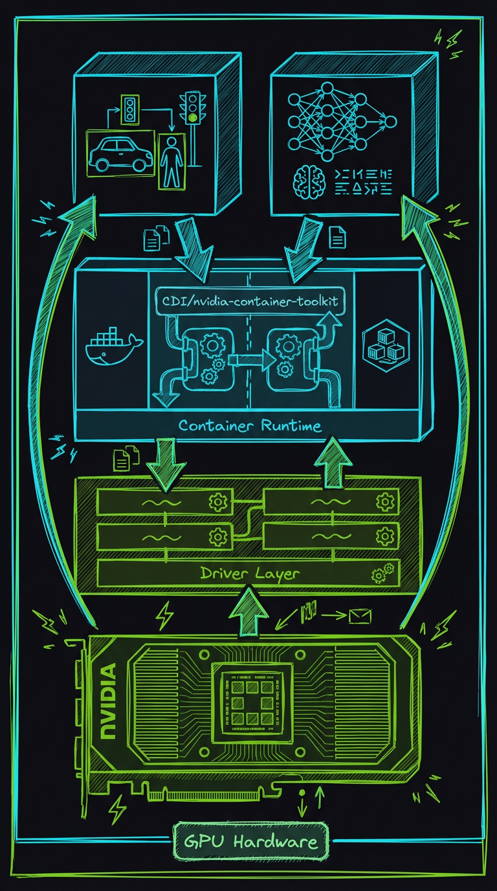
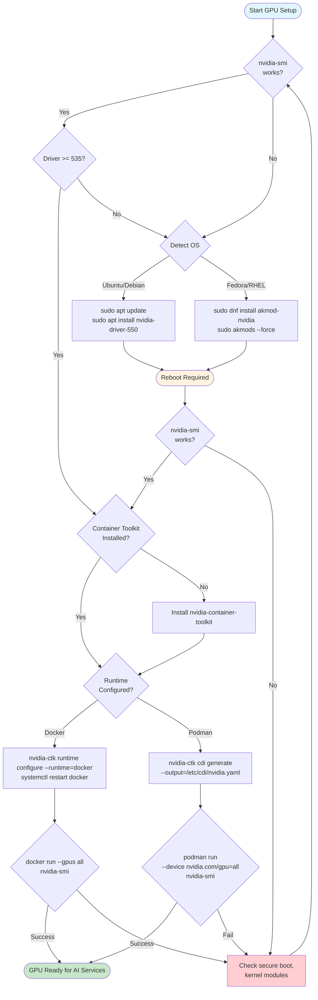

# GPU Setup Guide



_AI-generated visualization of GPU container architecture showing NVIDIA GPU, driver layer, container runtime, and AI services._

> Complete guide to configuring NVIDIA GPUs for container-based AI inference.

**Time to read:** ~15 min
**Prerequisites:** Linux system with NVIDIA GPU

---

## Overview

Home Security Intelligence uses GPU acceleration for AI inference. The core, always-on services are:

| Service             | Purpose             | VRAM Usage     | Inference Time |
| ------------------- | ------------------- | -------------- | -------------- |
| YOLO26              | Object detection    | ~4GB           | 30-50ms        |
| Nemotron-3-Nano-30B | Risk analysis (LLM) | ~14.7GB (prod) | 2-5s           |
| Nemotron Mini 4B    | Risk analysis (LLM) | ~3GB (dev)     | 2-5s           |
| **Total (prod)**    |                     | **~19GB**      |                |

Additional optional AI services (e.g. Florence-2, CLIP, Enrichment) may also use GPU, depending on your deployment and feature toggles. This guide covers the complete setup from bare metal to working GPU inference.

---

## 1. Prerequisites

### Hardware Requirements

| Component | Minimum         | Recommended       |
| --------- | --------------- | ----------------- |
| GPU       | NVIDIA 8GB VRAM | NVIDIA 12GB+ VRAM |
| CUDA CC   | 7.0+            | 7.5+              |

**Supported GPUs:**

- RTX 20xx series (2060, 2070, 2080)
- RTX 30xx series (3060, 3070, 3080, 3090)
- RTX 40xx series (4060, 4070, 4080, 4090)
- RTX A-series workstation GPUs (A2000, A4000, A5500, A6000)
- Tesla/V100/A100 datacenter GPUs

**Not supported:** AMD GPUs, Intel GPUs, Apple Silicon

### Software Requirements

| Component                | Minimum Version | Recommended |
| ------------------------ | --------------- | ----------- |
| NVIDIA Driver            | 535+            | 550+        |
| CUDA                     | 11.8            | 12.x        |
| NVIDIA Container Toolkit | 1.14+           | Latest      |
| Docker Engine or Podman  | 20.10+ / 4.0+   | Latest      |

---

## 2. Installing NVIDIA Drivers

### GPU Driver Installation Workflow



### Check Current Installation

```bash
# Check if driver is installed
nvidia-smi
```

**Expected output:**

```
+-----------------------------------------------------------------------------------------+
| NVIDIA-SMI 550.54.15              Driver Version: 550.54.15      CUDA Version: 12.4     |
|-----------------------------------------+------------------------+----------------------+
| GPU  Name                 Persistence-M | Bus-Id          Disp.A | Volatile Uncorr. ECC |
| Fan  Temp   Perf          Pwr:Usage/Cap |           Memory-Usage | GPU-Util  Compute M. |
|=========================================+========================+======================|
|   0  NVIDIA RTX A5500               Off | 00000000:01:00.0  Off |                  Off |
| 30%   42C    P8              23W / 230W |       1MiB / 24564MiB |      0%      Default |
+-----------------------------------------+------------------------+----------------------+
```

If `nvidia-smi` is not found, install drivers below.

### Ubuntu/Debian

```bash
# Add NVIDIA package repository
sudo apt update
sudo apt install -y software-properties-common
sudo add-apt-repository -y ppa:graphics-drivers/ppa
sudo apt update

# Install driver (adjust version as needed)
sudo apt install -y nvidia-driver-550

# Reboot required
sudo reboot
```

**Verify after reboot:**

```bash
nvidia-smi
# Should show driver version and GPU info
```

### Fedora/RHEL

```bash
# Enable RPM Fusion repository
sudo dnf install -y \
  https://download1.rpmfusion.org/free/fedora/rpmfusion-free-release-$(rpm -E %fedora).noarch.rpm \
  https://download1.rpmfusion.org/nonfree/fedora/rpmfusion-nonfree-release-$(rpm -E %fedora).noarch.rpm

# Install NVIDIA driver
sudo dnf install -y akmod-nvidia xorg-x11-drv-nvidia-cuda

# Wait for kernel module to build (may take several minutes)
sudo akmods --force

# Reboot required
sudo reboot
```

**Verify after reboot:**

```bash
# Check kernel module loaded
lsmod | grep nvidia

# Check driver works
nvidia-smi
```

### Verify CUDA Installation

```bash
# Check CUDA version (shown in nvidia-smi output)
nvidia-smi | grep "CUDA Version"

# Optional: Install CUDA toolkit for development
# Ubuntu/Debian
sudo apt install -y nvidia-cuda-toolkit

# Fedora
sudo dnf install -y cuda
```

---

## 3. Installing NVIDIA Container Toolkit

The NVIDIA Container Toolkit enables GPU access from containers. It works with both Docker and Podman.

### Ubuntu/Debian (Docker)

```bash
# Add NVIDIA container toolkit repository
distribution=$(. /etc/os-release; echo $ID$VERSION_ID)
curl -fsSL https://nvidia.github.io/libnvidia-container/gpgkey | \
  sudo gpg --dearmor -o /usr/share/keyrings/nvidia-container-toolkit-keyring.gpg

curl -s -L https://nvidia.github.io/libnvidia-container/$distribution/libnvidia-container.list | \
  sed 's#deb https://#deb [signed-by=/usr/share/keyrings/nvidia-container-toolkit-keyring.gpg] https://#g' | \
  sudo tee /etc/apt/sources.list.d/nvidia-container-toolkit.list

# Install toolkit
sudo apt update
sudo apt install -y nvidia-container-toolkit

# Configure Docker runtime
sudo nvidia-ctk runtime configure --runtime=docker
sudo systemctl restart docker

# Verify installation
docker run --rm --gpus all nvidia/cuda:12.0-base-ubuntu22.04 nvidia-smi
```

**Expected output:** Same `nvidia-smi` output as on host.

### Fedora/RHEL (Docker)

```bash
# Add NVIDIA container toolkit repository
distribution=$(. /etc/os-release; echo $ID$VERSION_ID)
curl -s -L https://nvidia.github.io/libnvidia-container/$distribution/libnvidia-container.repo | \
  sudo tee /etc/yum.repos.d/nvidia-container-toolkit.repo

# Install toolkit
sudo dnf install -y nvidia-container-toolkit

# Configure Docker runtime
sudo nvidia-ctk runtime configure --runtime=docker
sudo systemctl restart docker

# Verify installation
docker run --rm --gpus all nvidia/cuda:12.0-base-ubuntu22.04 nvidia-smi
```

### Podman (Container Device Interface)

Podman uses CDI (Container Device Interface) instead of the Docker runtime hook.

```bash
# Install NVIDIA Container Toolkit (same as above)
# Ubuntu/Debian
sudo apt install -y nvidia-container-toolkit

# Fedora
sudo dnf install -y nvidia-container-toolkit

# Generate CDI specification
sudo nvidia-ctk cdi generate --output=/etc/cdi/nvidia.yaml

# Verify CDI spec was created
ls -la /etc/cdi/nvidia.yaml

# Verify Podman can see the GPU
podman run --rm --device nvidia.com/gpu=all nvidia/cuda:12.0-base-ubuntu22.04 nvidia-smi
```

**For rootless Podman:**

```bash
# Generate CDI spec in user directory
mkdir -p ~/.config/cdi
nvidia-ctk cdi generate --output=$HOME/.config/cdi/nvidia.yaml

# Verify
podman run --rm --device nvidia.com/gpu=all nvidia/cuda:12.0-base-ubuntu22.04 nvidia-smi
```

---

## 4. Container GPU Configuration

### Docker Compose (docker-compose.prod.yml)

The project's production compose file already includes GPU configuration:

```yaml
services:
  ai-yolo26:
    build:
      context: ./ai/yolo26
      dockerfile: Dockerfile
    deploy:
      resources:
        reservations:
          devices:
            - driver: nvidia
              count: 1
              capabilities: [gpu]

  ai-llm:
    build:
      context: ./ai/nemotron
      dockerfile: Dockerfile
    deploy:
      resources:
        reservations:
          devices:
            - driver: nvidia
              count: 1
              capabilities: [gpu]
```

**Key settings:**

| Setting        | Value  | Description                             |
| -------------- | ------ | --------------------------------------- |
| `driver`       | nvidia | Use NVIDIA runtime                      |
| `count`        | 1      | Number of GPUs (use `all` for all GPUs) |
| `capabilities` | [gpu]  | Request GPU compute capability          |

### Podman Compose

For Podman with CDI, modify the compose file:

```yaml
services:
  ai-yolo26:
    build:
      context: ./ai/yolo26
      dockerfile: Dockerfile
    devices:
      - nvidia.com/gpu=all

  ai-llm:
    build:
      context: ./ai/nemotron
      dockerfile: Dockerfile
    devices:
      - nvidia.com/gpu=all
```

### Environment Variables

CUDA environment variables that may be useful:

```bash
# Force specific GPU (0-indexed)
CUDA_VISIBLE_DEVICES=0

# Enable TensorFloat-32 (faster on Ampere+)
NVIDIA_TF32_OVERRIDE=1

# Memory allocation strategy
PYTORCH_CUDA_ALLOC_CONF=max_split_size_mb:512
```

---

## 5. VRAM Management

### Per-Service Requirements

| Service             | Base VRAM | Peak VRAM | Notes                      |
| ------------------- | --------- | --------- | -------------------------- |
| YOLO26              | ~3.5GB    | ~4.5GB    | Spikes during batch detect |
| Nemotron-3-Nano-30B | ~14GB     | ~15GB     | Production, 128K context   |
| Nemotron Mini 4B    | ~2.8GB    | ~3.2GB    | Development only           |
| CUDA Context        | ~300MB    | ~500MB    | Per-process overhead       |
| **Total (prod)**    | **~18GB** | **~20GB** | Both services concurrent   |
| **Total (dev)**     | **~7GB**  | **~8GB**  | Using Mini 4B              |

### Monitoring VRAM Usage

```bash
# Real-time monitoring
watch -n 1 nvidia-smi

# Detailed process view
nvidia-smi --query-compute-apps=pid,process_name,used_memory --format=csv

# Memory usage over time
nvidia-smi dmon -s m -d 1
```

**Expected output during normal operation:**

```
+-----------------------------------------------------------------------------------------+
| Processes:                                                                              |
|  GPU   GI   CI        PID   Type   Process name                              GPU Memory |
|        ID   ID                                                               Usage      |
|=========================================================================================|
|    0   N/A  N/A     12345      C   python                                      3800MiB |
|    0   N/A  N/A     12346      C   llama-server                                2900MiB |
+-----------------------------------------------------------------------------------------+
```

### Handling VRAM Exhaustion

**Symptoms:**

- `RuntimeError: CUDA out of memory`
- Services crash during model loading
- Slow inference (CPU fallback)

**Solutions:**

1. **Check what's using VRAM:**

   ```bash
   nvidia-smi --query-compute-apps=pid,process_name,used_memory --format=csv
   ```

2. **Kill competing processes:**

   ```bash
   # Terminate all GPU processes (CAUTION: kills AI services too)
   sudo fuser -k /dev/nvidia*
   ```

3. **Restart AI services:**

   ```bash
   docker compose -f docker-compose.prod.yml restart ai-yolo26 ai-llm
   ```

4. **Use smaller model quantization:**

   Edit `ai/start_llm.sh` to use Q4_K_S instead of Q4_K_M (saves ~500MB).

5. **Close GPU-accelerated applications:**

   - Web browsers with hardware acceleration
   - Desktop compositors (Wayland/X11)
   - Other ML/AI workloads

---

## 6. Multi-GPU Setup (Optional)

If you have multiple GPUs, you can dedicate specific GPUs to specific services.

### List Available GPUs

```bash
nvidia-smi -L
```

**Example output:**

```
GPU 0: NVIDIA RTX A5500 (UUID: GPU-abc123...)
GPU 1: NVIDIA RTX 3090 (UUID: GPU-def456...)
```

### Assign GPUs to Services

**Option 1: Docker Compose with device_ids:**

```yaml
services:
  ai-yolo26:
    deploy:
      resources:
        reservations:
          devices:
            - driver: nvidia
              device_ids: ['0'] # Use GPU 0
              capabilities: [gpu]

  ai-llm:
    deploy:
      resources:
        reservations:
          devices:
            - driver: nvidia
              device_ids: ['1'] # Use GPU 1
              capabilities: [gpu]
```

**Option 2: Environment variable:**

```yaml
services:
  ai-yolo26:
    environment:
      - CUDA_VISIBLE_DEVICES=0

  ai-llm:
    environment:
      - CUDA_VISIBLE_DEVICES=1
```

**Option 3: Native services:**

```bash
# Terminal 1: YOLO26 on GPU 0
CUDA_VISIBLE_DEVICES=0 ./ai/start_detector.sh

# Terminal 2: Nemotron on GPU 1
CUDA_VISIBLE_DEVICES=1 ./ai/start_llm.sh
```

### Load Balancing Considerations

For high-throughput deployments:

- Run multiple YOLO26 instances across GPUs
- Use a load balancer (nginx, HAProxy) to distribute requests
- Monitor per-GPU utilization to balance load

---

## 7. Troubleshooting

### "No NVIDIA GPU detected"

**Symptoms:**

- `nvidia-smi` returns "command not found" or "no devices found"
- Health check shows `"cuda_available": false`

**Diagnosis:**

```bash
# Check if GPU hardware is visible
lspci | grep -i nvidia

# Check if driver module is loaded
lsmod | grep nvidia

# Check driver version
cat /proc/driver/nvidia/version
```

**Solutions:**

1. **Install/reinstall driver** (see Section 2)
2. **Reboot after driver installation**
3. **Check secure boot:** Some systems require signing NVIDIA modules

   ```bash
   mokutil --sb-state
   # If enabled, may need to disable or sign modules
   ```

### "CUDA out of memory"

**Symptoms:**

- Error during model loading or inference
- Service exits immediately after start

**Diagnosis:**

```bash
# Check current VRAM usage
nvidia-smi

# Check total VRAM available
nvidia-smi --query-gpu=memory.total --format=csv,noheader
```

**Solutions:**

1. **Ensure 8GB+ VRAM available**
2. **Close other GPU applications**
3. **Restart services to release leaked memory**
4. **Use smaller models** (Q4_K_S quantization)

### Container Can't Access GPU

**Symptoms:**

- `nvidia-smi` works on host but not in container
- Error: "Failed to initialize NVML"
- Error: "GPU device not found"

**Diagnosis:**

```bash
# Check Docker/Podman GPU support
docker info 2>/dev/null | grep -i runtime
podman info 2>/dev/null | grep -i runtime

# Check CDI configuration (Podman)
cat /etc/cdi/nvidia.yaml 2>/dev/null | head -20
```

**Solutions for Docker:**

```bash
# Reinstall and configure toolkit
sudo nvidia-ctk runtime configure --runtime=docker
sudo systemctl restart docker

# Verify
docker run --rm --gpus all nvidia/cuda:12.0-base-ubuntu22.04 nvidia-smi
```

**Solutions for Podman:**

```bash
# Regenerate CDI specification
sudo nvidia-ctk cdi generate --output=/etc/cdi/nvidia.yaml

# For rootless Podman
mkdir -p ~/.config/cdi
nvidia-ctk cdi generate --output=$HOME/.config/cdi/nvidia.yaml

# Verify
podman run --rm --device nvidia.com/gpu=all nvidia/cuda:12.0-base-ubuntu22.04 nvidia-smi
```

### Driver/Toolkit Version Mismatch

**Symptoms:**

- Error: "CUDA driver version is insufficient"
- Error: "version mismatch between driver and CUDA runtime"

**Diagnosis:**

```bash
# Check driver CUDA version
nvidia-smi | grep "CUDA Version"

# Check toolkit CUDA version
nvcc --version
```

**Solutions:**

1. **Update driver to match CUDA requirements:**

   | CUDA Version | Minimum Driver |
   | ------------ | -------------- |
   | 12.4         | 550.54+        |
   | 12.2         | 535.54+        |
   | 11.8         | 520.61+        |

2. **Or use containers with matching CUDA version:**

   ```yaml
   # Use CUDA 12.0 base image
   FROM nvidia/cuda:12.0-runtime-ubuntu22.04
   ```

### Slow Inference (CPU Fallback)

**Symptoms:**

- Detection takes >200ms instead of 30-50ms
- LLM responses take >30s instead of 2-5s
- GPU utilization at 0%

**Diagnosis:**

```bash
# Check YOLO26 device
curl http://localhost:8095/health | jq .device
# Should return "cuda:0", not "cpu"

# Check GPU utilization during inference
nvidia-smi -l 1
```

**Solutions:**

1. **Verify CUDA in container:**

   ```bash
   docker exec <container> python3 -c "import torch; print(torch.cuda.is_available())"
   ```

2. **Rebuild llama.cpp with CUDA:**

   ```bash
   cd /tmp
   git clone https://github.com/ggerganov/llama.cpp
   cd llama.cpp
   make LLAMA_CUDA=1 -j$(nproc)
   sudo install -m 755 llama-server /usr/local/bin/
   ```

3. **Verify `--n-gpu-layers` flag:**

   Nemotron startup should include `--n-gpu-layers 99` to load all layers on GPU.

---

## Quick Reference

### Verification Commands

```bash
# Driver installed?
nvidia-smi

# Container toolkit working?
docker run --rm --gpus all nvidia/cuda:12.0-base-ubuntu22.04 nvidia-smi
# or for Podman:
podman run --rm --device nvidia.com/gpu=all nvidia/cuda:12.0-base-ubuntu22.04 nvidia-smi

# AI services healthy?
curl http://localhost:8095/health | jq .  # YOLO26
curl http://localhost:8091/health         # Nemotron

# VRAM usage?
nvidia-smi --query-gpu=memory.used,memory.total --format=csv
```

### Key Files

| File                          | Purpose                      |
| ----------------------------- | ---------------------------- |
| `/etc/cdi/nvidia.yaml`        | Podman CDI specification     |
| `~/.config/cdi/nvidia.yaml`   | Rootless Podman CDI spec     |
| `/etc/docker/daemon.json`     | Docker runtime configuration |
| `docker-compose.prod.yml`     | Production compose with GPU  |
| `/proc/driver/nvidia/version` | Installed driver version     |

### Minimum VRAM Checklist

Before starting services, ensure:

- [ ] At least 8GB VRAM available
- [ ] No other GPU processes consuming memory
- [ ] Driver version 535+ installed
- [ ] Container toolkit configured
- [ ] Test container GPU access succeeds

---

## Next Steps

- [AI Overview](ai-overview.md) - AI services architecture
- [AI Installation](ai-installation.md) - Set up AI services
- [AI Services](ai-services.md) - Start and verify AI services

---

## See Also

- [GPU Troubleshooting](../reference/troubleshooting/gpu-issues.md) - Detailed GPU problem solving
- [AI Performance](ai-performance.md) - Optimize inference performance
- [Detection Service](../developer/detection-service.md) - How YOLO26 uses the GPU

---

[Back to Operator Hub](./)
