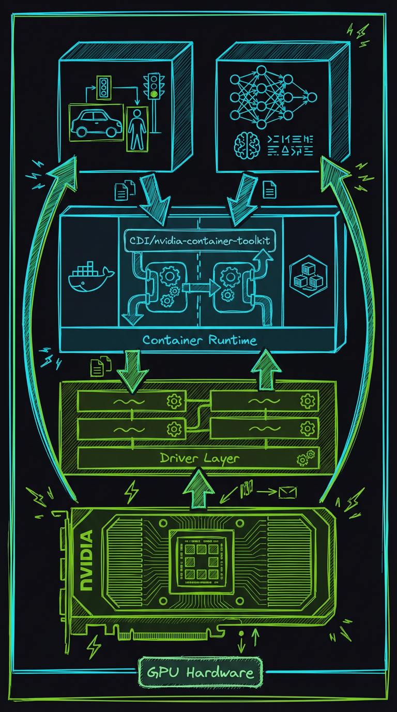
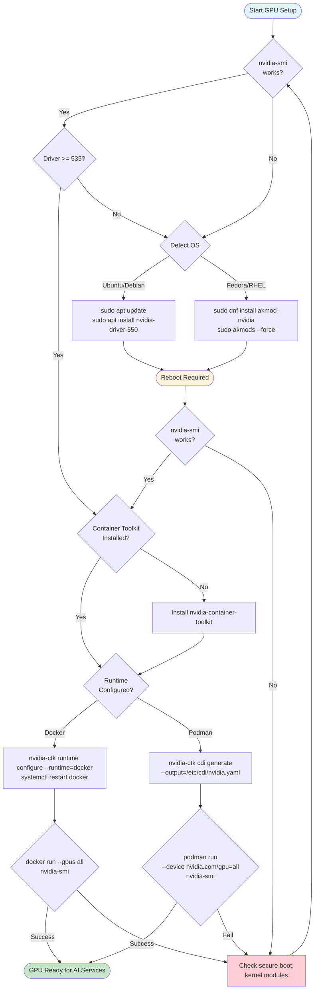

# GPU Setup Guide



_AI-generated visualization of GPU container architecture showing NVIDIA GPU, driver layer, container runtime, and AI services._

> Complete guide to configuring NVIDIA GPUs for container-based AI inference.

**Time to read:** ~15 min
**Prerequisites:** Linux system with NVIDIA GPU

---

## Overview

Home Security Intelligence uses GPU acceleration for AI inference. Production AI is
**two containers**:

| Container    | GPU env var           | What it holds                                                                       | Inference time |
| ------------ | --------------------- | ----------------------------------------------------------------------------------- | -------------- |
| `ai-gateway` | `GPU_AI_SERVICES` (1) | Triton: `yolo26` detection, `reid`, plus `threat` when `GATEWAY_ENABLE_THREAT=true` | 30-50ms        |
| `ai-vlm`     | `GPU_LLM` (0)         | llama.cpp + mmproj serving the Qwen3-VL GGUF pair (default compose set)             | seconds        |

A third consumer lives **inside the backend process**: the face, plate and person-re-ID
lookups (`face_recognizer_loader`, `fast_alpr_loader`, `osnet_loader`). They load only
when `BACKEND_MODEL_PRELOAD=true`, which `setup.py` writes at **>= 24 GB** VRAM; with the
shipped `false` they report `unavailable` and consume nothing. This guide covers the
complete setup from bare metal to working GPU inference.

---

## 1. Prerequisites

### Hardware Requirements

| Component | Minimum         | Recommended       |
| --------- | --------------- | ----------------- |
| GPU       | NVIDIA 8GB VRAM | NVIDIA 12GB+ VRAM |
| CUDA CC   | 7.0+            | 7.5+              |

**Supported GPUs:**

- RTX 20xx series (2060, 2070, 2080)
- RTX 30xx series (3060, 3070, 3080, 3090)
- RTX 40xx series (4060, 4070, 4080, 4090)
- RTX A-series workstation GPUs (A2000, A4000, A5500, A6000)
- Tesla/V100/A100 datacenter GPUs

**Not supported:** AMD GPUs, Intel GPUs, Apple Silicon

### Software Requirements

| Component                | Minimum Version | Recommended |
| ------------------------ | --------------- | ----------- |
| NVIDIA Driver            | 535+            | 550+        |
| CUDA                     | 11.8            | 12.x        |
| NVIDIA Container Toolkit | 1.14+           | Latest      |
| Docker Engine or Podman  | 20.10+ / 4.0+   | Latest      |

---

## 2. Installing NVIDIA Drivers

### GPU Driver Installation Workflow


```mermaid
flowchart TD
    Start([Start GPU Setup]) --> Check{nvidia-smi<br/>works?}

    Check -->|Yes| VerifyVersion{Driver >= 535?}
    Check -->|No| DetectOS{Detect OS}

    VerifyVersion -->|Yes| ToolkitCheck{Container Toolkit<br/>Installed?}
    VerifyVersion -->|No| DetectOS

    DetectOS -->|Ubuntu/Debian| UbuntuInstall["sudo apt update<br/>sudo apt install nvidia-driver-550"]
    DetectOS -->|Fedora/RHEL| FedoraInstall["sudo dnf install akmod-nvidia<br/>sudo akmods --force"]

    UbuntuInstall --> Reboot([Reboot Required])
    FedoraInstall --> Reboot

    Reboot --> VerifyDriver{nvidia-smi<br/>works?}
    VerifyDriver -->|Yes| ToolkitCheck
    VerifyDriver -->|No| Troubleshoot[Check secure boot,<br/>kernel modules]

    ToolkitCheck -->|Yes| ConfigureRuntime{Runtime<br/>Configured?}
    ToolkitCheck -->|No| InstallToolkit["Install nvidia-container-toolkit"]

    InstallToolkit --> ConfigureRuntime

    ConfigureRuntime -->|Docker| DockerConfig["nvidia-ctk runtime configure --runtime=docker<br/>systemctl restart docker"]
    ConfigureRuntime -->|Podman| PodmanConfig["nvidia-ctk cdi generate<br/>--output=/etc/cdi/nvidia.yaml"]

    DockerConfig --> TestContainer{"docker run --gpus all<br/>nvidia-smi"}
    PodmanConfig --> TestContainer2{"podman run<br/>--device nvidia.com/gpu=all<br/>nvidia-smi"}

    TestContainer -->|Success| Done([GPU Ready for AI Services])
    TestContainer -->|Fail| Troubleshoot
    TestContainer2 -->|Success| Done
    TestContainer2 -->|Fail| Troubleshoot

    Troubleshoot --> Check

    style Start fill:#e1f5fe
    style Done fill:#c8e6c9
    style Reboot fill:#fff3e0
    style Troubleshoot fill:#ffcdd2
```

### Check Current Installation

```bash
# Check if driver is installed
nvidia-smi
```

**Expected output:**

```
+-----------------------------------------------------------------------------------------+
| NVIDIA-SMI 550.54.15              Driver Version: 550.54.15      CUDA Version: 12.4     |
|-----------------------------------------+------------------------+----------------------+
| GPU  Name                 Persistence-M | Bus-Id          Disp.A | Volatile Uncorr. ECC |
| Fan  Temp   Perf          Pwr:Usage/Cap |           Memory-Usage | GPU-Util  Compute M. |
|=========================================+========================+======================|
|   0  NVIDIA RTX A5500               Off | 00000000:01:00.0  Off |                  Off |
| 30%   42C    P8              23W / 230W |       1MiB / 24564MiB |      0%      Default |
+-----------------------------------------+------------------------+----------------------+
```

If `nvidia-smi` is not found, install drivers below.

### Ubuntu/Debian

```bash
# Add NVIDIA package repository
sudo apt update
sudo apt install -y software-properties-common
sudo add-apt-repository -y ppa:graphics-drivers/ppa
sudo apt update

# Install driver (adjust version as needed)
sudo apt install -y nvidia-driver-550

# Reboot required
sudo reboot
```

**Verify after reboot:**

```bash
nvidia-smi
# Should show driver version and GPU info
```

### Fedora/RHEL

```bash
# Enable RPM Fusion repository
sudo dnf install -y \
  https://download1.rpmfusion.org/free/fedora/rpmfusion-free-release-$(rpm -E %fedora).noarch.rpm \
  https://download1.rpmfusion.org/nonfree/fedora/rpmfusion-nonfree-release-$(rpm -E %fedora).noarch.rpm

# Install NVIDIA driver
sudo dnf install -y akmod-nvidia xorg-x11-drv-nvidia-cuda

# Wait for kernel module to build (may take several minutes)
sudo akmods --force

# Reboot required
sudo reboot
```

**Verify after reboot:**

```bash
# Check kernel module loaded
lsmod | grep nvidia

# Check driver works
nvidia-smi
```

### Verify CUDA Installation

```bash
# Check CUDA version (shown in nvidia-smi output)
nvidia-smi | grep "CUDA Version"

# Optional: Install CUDA toolkit for development
# Ubuntu/Debian
sudo apt install -y nvidia-cuda-toolkit

# Fedora
sudo dnf install -y cuda
```

---

## 3. Installing NVIDIA Container Toolkit

The NVIDIA Container Toolkit enables GPU access from containers. It works with both Docker and Podman.

### Ubuntu/Debian (Docker)

```bash
# Add NVIDIA container toolkit repository
distribution=$(. /etc/os-release; echo $ID$VERSION_ID)
curl -fsSL https://nvidia.github.io/libnvidia-container/gpgkey | \
  sudo gpg --dearmor -o /usr/share/keyrings/nvidia-container-toolkit-keyring.gpg

curl -s -L https://nvidia.github.io/libnvidia-container/$distribution/libnvidia-container.list | \
  sed 's#deb https://#deb [signed-by=/usr/share/keyrings/nvidia-container-toolkit-keyring.gpg] https://#g' | \
  sudo tee /etc/apt/sources.list.d/nvidia-container-toolkit.list

# Install toolkit
sudo apt update
sudo apt install -y nvidia-container-toolkit

# Configure Docker runtime
sudo nvidia-ctk runtime configure --runtime=docker
sudo systemctl restart docker

# Verify installation
docker run --rm --gpus all nvidia/cuda:12.0-base-ubuntu22.04 nvidia-smi
```

**Expected output:** Same `nvidia-smi` output as on host.

### Fedora/RHEL (Docker)

```bash
# Add NVIDIA container toolkit repository
distribution=$(. /etc/os-release; echo $ID$VERSION_ID)
curl -s -L https://nvidia.github.io/libnvidia-container/$distribution/libnvidia-container.repo | \
  sudo tee /etc/yum.repos.d/nvidia-container-toolkit.repo

# Install toolkit
sudo dnf install -y nvidia-container-toolkit

# Configure Docker runtime
sudo nvidia-ctk runtime configure --runtime=docker
sudo systemctl restart docker

# Verify installation
docker run --rm --gpus all nvidia/cuda:12.0-base-ubuntu22.04 nvidia-smi
```

### Podman (Container Device Interface)

Podman uses CDI (Container Device Interface) instead of the Docker runtime hook.

```bash
# Install NVIDIA Container Toolkit (same as above)
# Ubuntu/Debian
sudo apt install -y nvidia-container-toolkit

# Fedora
sudo dnf install -y nvidia-container-toolkit

# Generate CDI specification
sudo nvidia-ctk cdi generate --output=/etc/cdi/nvidia.yaml

# Verify CDI spec was created
ls -la /etc/cdi/nvidia.yaml

# Verify Podman can see the GPU
podman run --rm --device nvidia.com/gpu=all nvidia/cuda:12.0-base-ubuntu22.04 nvidia-smi
```

**For rootless Podman:**

```bash
# Generate CDI spec in user directory
mkdir -p ~/.config/cdi
nvidia-ctk cdi generate --output=$HOME/.config/cdi/nvidia.yaml

# Verify
podman run --rm --device nvidia.com/gpu=all nvidia/cuda:12.0-base-ubuntu22.04 nvidia-smi
```

---

## 4. Container GPU Configuration

### Docker Compose (docker-compose.prod.yml)

The project's production compose file already includes GPU configuration:

Excerpt from `docker-compose.prod.yml` (only the GPU parts):

```yaml
services:
  ai-gateway:
    devices:
      - nvidia.com/gpu=all # all /dev/nvidiaN nodes must exist
    environment:
      - CUDA_VISIBLE_DEVICES=${GPU_AI_SERVICES:-1} # then restrict inside
    deploy:
      resources:
        reservations:
          devices:
            - driver: nvidia
              device_ids: ['${GPU_AI_SERVICES:-1}']
              capabilities: [gpu]

  ai-vlm:
    devices:
      - nvidia.com/gpu=${GPU_LLM:-0}
    environment:
      - CUDA_VISIBLE_DEVICES=${GPU_LLM:-0}
    deploy:
      resources:
        reservations:
          devices:
            - driver: nvidia
              device_ids: ['${GPU_LLM:-0}']
              capabilities: [gpu]
```

**Key settings:**

| Setting        | Value  | Description                                           |
| -------------- | ------ | ----------------------------------------------------- |
| `driver`       | nvidia | Use NVIDIA runtime                                    |
| `device_ids`   | …      | Specific GPU indices (use `count: all` for every GPU) |
| `capabilities` | [gpu]  | Request GPU compute capability                        |

### Podman Compose (CDI devices)

Podman rootless GPU access goes through CDI. The gateway passes **all** GPUs and
then narrows with `CUDA_VISIBLE_DEVICES`, because `nvidia.com/gpu=N` alone creates
only `/dev/nvidiaN` and CUDA expects `/dev/nvidia0` for the first visible device:

```yaml
services:
  ai-gateway:
    devices:
      - nvidia.com/gpu=all
    environment:
      - CUDA_VISIBLE_DEVICES=${GPU_AI_SERVICES:-1}

  ai-vlm:
    devices:
      - nvidia.com/gpu=${GPU_LLM:-0}
```

`ai-vlm` is in the default compose set, so a plain `up -d` asks for it with everything
else. Until UR-18 it sat behind a profile, and podman-compose dropped a profile-inactive
service _before_ resolving the names on your command line, so `up -d ai-vlm` without the
flag reported success and started nothing. That gate is gone.

**A machine with no GPU:** the `nvidia.com/gpu=` line above has nothing to map there, so
`ai-vlm` fails at start while the rest of the stack comes up — it neither `depends_on`
anything nor has anything depend on it. Name the services you want and leave `ai-vlm` off;
that is the interim path until package O2.1's explicit fake-AI overlay lands.

### Environment Variables

CUDA environment variables that may be useful:

```bash
# Force specific GPU (0-indexed)
CUDA_VISIBLE_DEVICES=0

# Enable TensorFloat-32 (faster on Ampere+)
NVIDIA_TF32_OVERRIDE=1

# Memory allocation strategy
PYTORCH_CUDA_ALLOC_CONF=max_split_size_mb:512
```

---

## 5. VRAM Management

### Per-Service Requirements

Two containers touch the GPUs in production, plus the backend's own lookup weights.

<!-- prettier-ignore-start -->
--8<-- "docs/_includes/vram-requirements.md"
<!-- prettier-ignore-end -->

The `models.yml`-derived part of that budget is measurable today: the gateway's resident
rows are `yolo26` (0 MB estimated — it runs FP32 ONNX), `reid` (~100 MB) and `threat`
(~300 MB, opt-in), and the backend's on-demand lookup rows sum to ~1.0 GB when every
enabled one is loaded. Add roughly 300-500 MB of CUDA context per process.

What is **not** measured yet is the shipped VLM identity's residency:
`VLM_GPU_LAYERS=auto` (compose) hands the decision to llama.cpp's `--fit`, so the number
is whatever your free VRAM allows and changes with the GGUF pair you place. Treat 24 GB
as the comfortable target for the full path — it is the same threshold `setup.py` uses to
switch `BACKEND_MODEL_PRELOAD` on — and expect the 4B fallback pair to be the option on
an 8-12 GB card.

On a single GPU everything lands on one card: point both `GPU_LLM` and
`GPU_AI_SERVICES` at the same index and let `VLM_GPU_LAYERS=auto` do the splitting.

### Monitoring VRAM Usage

```bash
# Real-time monitoring
watch -n 1 nvidia-smi

# Detailed process view
nvidia-smi --query-compute-apps=pid,process_name,used_memory --format=csv

# Memory usage over time
nvidia-smi dmon -s m -d 1
```

**Expected output during normal operation:**

```
+-----------------------------------------------------------------------------------------+
| Processes:                                                                              |
|  GPU   GI   CI        PID   Type   Process name                              GPU Memory |
|        ID   ID                                                               Usage      |
|=========================================================================================|
|    0   N/A  N/A     12345      C   python                                      3800MiB |
|    0   N/A  N/A     12346      C   llama-server                                2900MiB |
+-----------------------------------------------------------------------------------------+
```

### Handling VRAM Exhaustion

**Symptoms:**

- `RuntimeError: CUDA out of memory`
- Services crash during model loading
- Slow inference (CPU fallback)

**Solutions:**

1. **Check what's using VRAM:**

   ```bash
   nvidia-smi --query-compute-apps=pid,process_name,used_memory --format=csv
   ```

2. **Kill competing processes:**

   ```bash
   # Terminate all GPU processes (CAUTION: kills AI services too)
   sudo fuser -k /dev/nvidia*
   ```

3. **Restart AI services** — each service by name, with no profile flag on either:

   ```bash
   podman compose -f docker-compose.prod.yml restart ai-gateway
   podman compose -f docker-compose.prod.yml up -d --force-recreate ai-vlm
   ```

4. **Let the VLM release its VRAM between bursts:** lower `VLM_SLEEP_IDLE_SECONDS`
   (default 300) so the weights drop back to CPU RAM when idle, or set it empty to hold
   the card permanently.

5. **Move to a smaller VLM identity:** drop to the measured 4B pair via
   `VLM_MODEL_PATH` + `VLM_MMPROJ_PATH` + `VLM_MODEL_ID` — those three, plus
   `VLM_MODEL_ALIAS`, are one identity in four spellings and move together.

6. **Trim the KV pool:** the shipped `VLM_CACHE_TYPE_K`/`VLM_CACHE_TYPE_V` are already
   `q8_0` (half the f16 pool). `VLM_CTX_SIZE`/`VLM_PARALLEL` set the pool size and the
   backend reads the same pair for its prompt budget — change the pair, never one side.

7. **Close GPU-accelerated applications:**

   - Web browsers with hardware acceleration
   - Desktop compositors (Wayland/X11)
   - Other ML/AI workloads

---

## 6. Multi-GPU Setup (Optional)

If you have multiple GPUs, you can dedicate specific GPUs to specific services.

### List Available GPUs

```bash
nvidia-smi -L
```

**Example output:**

```
GPU 0: NVIDIA RTX A5500 (UUID: GPU-abc123...)
GPU 1: NVIDIA RTX 3090 (UUID: GPU-def456...)
```

### Assign GPUs to Services

There are two GPU-owning containers, so placement is two `.env` variables — no compose
edit needed:

```bash
# .env
GPU_LLM=0          # GPU for ai-vlm (llama.cpp) — pick the high-VRAM card
GPU_AI_SERVICES=1  # GPU for ai-gateway (Triton: yolo26, reid, threat)
```

`docker-compose.prod.yml` threads both into `devices:`, `CUDA_VISIBLE_DEVICES` and
`deploy.resources.reservations.devices[].device_ids`, so changing `.env` and
recreating the containers is the whole procedure:

```bash
podman compose -f docker-compose.prod.yml up -d --force-recreate ai-gateway
podman compose -f docker-compose.prod.yml up -d --force-recreate ai-vlm
```

To run both on one GPU, set `GPU_LLM` and `GPU_AI_SERVICES` to the same index and leave
`VLM_GPU_LAYERS=auto` so llama.cpp offloads what the card cannot hold.

Per-model execution mode inside the gateway comes from `models.yml`: each model's
`triton_kind` (`KIND_GPU`, `KIND_CPU` or `KIND_MODEL`) is written into its Triton
`config.pbtxt` `instance_group` at container start by
`ai/gateway/patch_triton_configs.py`, and any model that declares a `device_env_var`
gets that variable exported by `ai/gateway/entrypoint.sh`. No shipped manifest row
declares one today, so everything in the gateway runs on the single GPU named by
`GPU_AI_SERVICES`.

**Native (host) services:**

```bash
# Terminal 1: detection stand-in on GPU 0
CUDA_VISIBLE_DEVICES=0 ./ai/start_detector.sh

# Terminal 2: the reasoning engine on GPU 1 — no host-run script exists for it,
# so start llama-server directly with the pair compose passes it
CUDA_VISIBLE_DEVICES=1 llama-server \
  --model  "${AI_MODELS_PATH:-/export/ai_models}/vlm/Qwen3VL-8B-Instruct-Q4_K_M.gguf" \
  --mmproj "${AI_MODELS_PATH:-/export/ai_models}/vlm/mmproj-Qwen3VL-8B-Instruct-Q8_0.gguf" \
  --host 0.0.0.0 --port 8098 --ctx-size 32768 --parallel 2
```

### Load Balancing Considerations

For high-throughput deployments:

- Raise the Triton `instance_group` count for a model in `models.yml` to run several copies on one GPU
- Use a load balancer (nginx, HAProxy) to distribute requests
- Monitor per-GPU utilization to balance load

---

## 7. Troubleshooting

### "No NVIDIA GPU detected"

**Symptoms:**

- `nvidia-smi` returns "command not found" or "no devices found"
- Health check shows `"cuda_available": false`

**Diagnosis:**

```bash
# Check if GPU hardware is visible
lspci | grep -i nvidia

# Check if driver module is loaded
lsmod | grep nvidia

# Check driver version
cat /proc/driver/nvidia/version
```

**Solutions:**

1. **Install/reinstall driver** (see Section 2)
2. **Reboot after driver installation**
3. **Check secure boot:** Some systems require signing NVIDIA modules

   ```bash
   mokutil --sb-state
   # If enabled, may need to disable or sign modules
   ```

### "CUDA out of memory"

**Symptoms:**

- Error during model loading or inference
- Service exits immediately after start

**Diagnosis:**

```bash
# Check current VRAM usage
nvidia-smi

# Check total VRAM available
nvidia-smi --query-gpu=memory.total --format=csv,noheader
```

**Solutions:**

1. **Ensure 8GB+ VRAM available**
2. **Close other GPU applications**
3. **Restart services to release leaked memory**
4. **Use smaller models** (Q4_K_S quantization)

### Container Can't Access GPU

**Symptoms:**

- `nvidia-smi` works on host but not in container
- Error: "Failed to initialize NVML"
- Error: "GPU device not found"

**Diagnosis:**

```bash
# Check Docker/Podman GPU support
docker info 2>/dev/null | grep -i runtime
podman info 2>/dev/null | grep -i runtime

# Check CDI configuration (Podman)
cat /etc/cdi/nvidia.yaml 2>/dev/null | head -20
```

**Solutions for Docker:**

```bash
# Reinstall and configure toolkit
sudo nvidia-ctk runtime configure --runtime=docker
sudo systemctl restart docker

# Verify
docker run --rm --gpus all nvidia/cuda:12.0-base-ubuntu22.04 nvidia-smi
```

**Solutions for Podman:**

```bash
# Regenerate CDI specification
sudo nvidia-ctk cdi generate --output=/etc/cdi/nvidia.yaml

# For rootless Podman
mkdir -p ~/.config/cdi
nvidia-ctk cdi generate --output=$HOME/.config/cdi/nvidia.yaml

# Verify
podman run --rm --device nvidia.com/gpu=all nvidia/cuda:12.0-base-ubuntu22.04 nvidia-smi
```

### Driver/Toolkit Version Mismatch

**Symptoms:**

- Error: "CUDA driver version is insufficient"
- Error: "version mismatch between driver and CUDA runtime"

**Diagnosis:**

```bash
# Check driver CUDA version
nvidia-smi | grep "CUDA Version"

# Check toolkit CUDA version
nvcc --version
```

**Solutions:**

1. **Update driver to match CUDA requirements:**

   | CUDA Version | Minimum Driver |
   | ------------ | -------------- |
   | 12.4         | 550.54+        |
   | 12.2         | 535.54+        |
   | 11.8         | 520.61+        |

2. **Or use containers with matching CUDA version:**

   ```yaml
   # Use CUDA 12.0 base image
   FROM nvidia/cuda:12.0-runtime-ubuntu22.04
   ```

### Slow Inference (CPU Fallback)

**Symptoms:**

- Detection takes >200ms instead of 30-50ms
- LLM responses take >30s instead of 2-5s
- GPU utilization at 0%

**Diagnosis:**

```bash
# Confirm the Triton model is loaded and served from the GPU
curl http://localhost:8090/yolo26/health | jq .
# {"status":"healthy","model":"yolo26","model_loaded":true}

# Confirm the model registered as KIND_GPU (not KIND_CPU) — Triton's own
# control port is container-internal 8000; only its metrics port 8002 is published
podman exec ai-gateway curl -s http://localhost:8000/v2/models/yolo26/config | jq .instance_group
curl -s http://localhost:8002/metrics | grep -c triton_   # published metrics port

# Check GPU utilization during inference
nvidia-smi -l 1
```

**Solutions:**

1. **Verify CUDA in container:**

   ```bash
   podman exec ai-gateway python3 -c "import torch; print(torch.cuda.is_available())"
   ```

2. **Rebuild llama.cpp with CUDA:**

   ```bash
   cd /tmp
   git clone https://github.com/ggerganov/llama.cpp
   cd llama.cpp
   make LLAMA_CUDA=1 -j$(nproc)
   sudo install -m 755 llama-server /usr/local/bin/
   ```

3. **Check the `--n-gpu-layers` value:**

   `ai/vlm/Dockerfile` passes `--n-gpu-layers ${GPU_LAYERS}`, and
   `docker-compose.prod.yml` sets `GPU_LAYERS=${VLM_GPU_LAYERS:-auto}` — so the shipped
   path lets llama.cpp's `--fit` choose the count from free VRAM (the image's own `ENV
GPU_LAYERS=99` only applies when compose is bypassed). Set `VLM_GPU_LAYERS` to a
   number to pin it.

---

## Quick Reference

### Verification Commands

```bash
# Driver installed?
nvidia-smi

# Container toolkit working?
docker run --rm --gpus all nvidia/cuda:12.0-base-ubuntu22.04 nvidia-smi
# or for Podman:
podman run --rm --device nvidia.com/gpu=all nvidia/cuda:12.0-base-ubuntu22.04 nvidia-smi

# AI services healthy?
curl http://localhost:8090/health | jq .  # ai-gateway (Triton aggregate)
curl http://localhost:8098/health         # ai-vlm (up — does NOT prove multimodal)
curl http://localhost:8098/props  | jq     # served model + build
podman logs ai-vlm 2>&1 | grep -i mmproj  # the projector actually loaded

# VRAM usage?
nvidia-smi --query-gpu=memory.used,memory.total --format=csv
```

### Key Files

| File                          | Purpose                      |
| ----------------------------- | ---------------------------- |
| `/etc/cdi/nvidia.yaml`        | Podman CDI specification     |
| `~/.config/cdi/nvidia.yaml`   | Rootless Podman CDI spec     |
| `/etc/docker/daemon.json`     | Docker runtime configuration |
| `docker-compose.prod.yml`     | Production compose with GPU  |
| `/proc/driver/nvidia/version` | Installed driver version     |

### Minimum VRAM Checklist

Before starting services, ensure:

- [ ] At least 8GB VRAM available
- [ ] No other GPU processes consuming memory
- [ ] Driver version 535+ installed
- [ ] Container toolkit configured
- [ ] Test container GPU access succeeds

---

## Next Steps

- [AI Overview](ai-overview.md) - AI services architecture
- [AI Installation](ai-installation.md) - Set up AI services
- [AI Services](ai-services.md) - Start and verify AI services

---

## See Also

- [GPU Troubleshooting](../reference/troubleshooting/gpu-issues.md) - Detailed GPU problem solving
- [AI Performance](ai-performance.md) - Optimize inference performance
- [Detection Service](../developer/detection-service.md) - How YOLO26 uses the GPU

---

[Back to Operator Hub](README.md)
