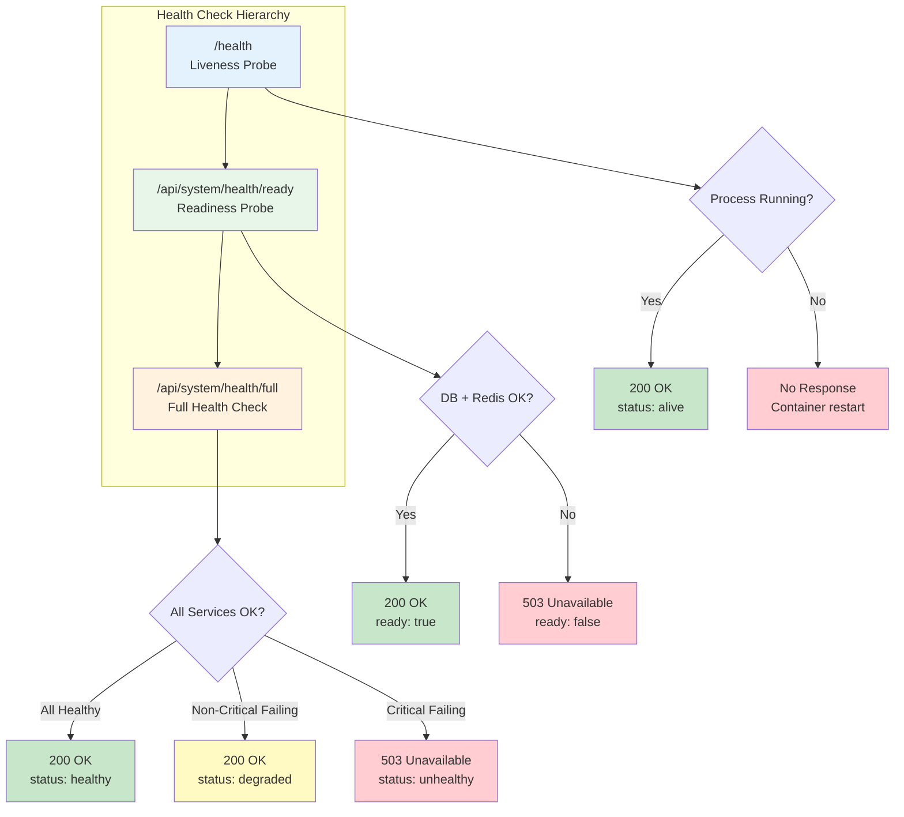
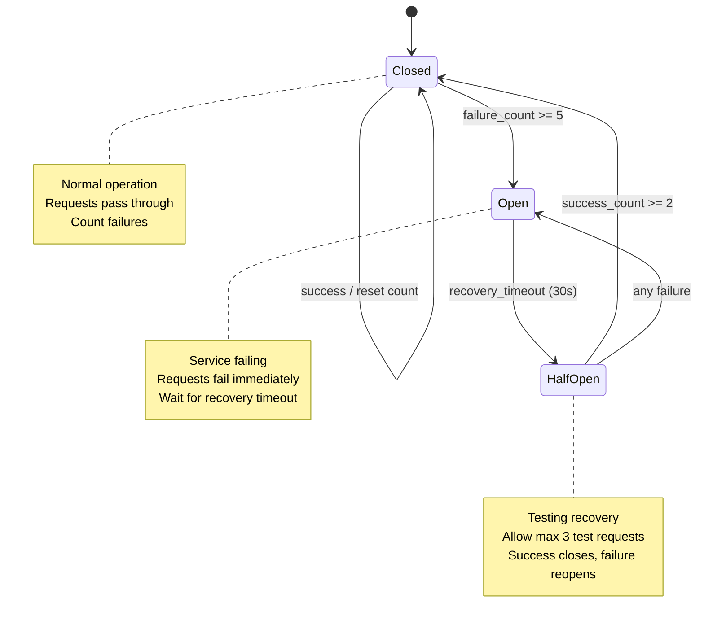

# Monitoring Guide

> Monitor system health, GPU performance, service status, and failed job queues.

---

## Table of Contents

- [Overview](#overview)
- [Health Check Endpoints](#health-check-endpoints)
- [Service Level Objectives](#service-level-objectives)
- [GPU Monitoring](#gpu-monitoring)
- [Service Health Monitoring](#service-health-monitoring)
- [Circuit Breaker Integration](#circuit-breaker-integration)
- [Dead Letter Queue Monitoring](#dead-letter-queue-monitoring)
- [Prometheus and Alerting](#prometheus-and-alerting)
- [Grafana Dashboards](#grafana-dashboards)
- [Troubleshooting](#troubleshooting)

---

## Overview

The monitoring system provides real-time visibility into three domains:

1. **GPU Monitoring** - Utilization, memory, temperature, power
2. **Service Health** - AI services, Redis, PostgreSQL connectivity
3. **Dead Letter Queue** - Failed job inspection and recovery

### Architecture

```
Event Sources           Collection          Storage           Delivery
--------------         -----------         ---------         ---------
GPU Hardware     -->   GPUMonitor     -->  PostgreSQL  -->   WebSocket
AI Services      -->   HealthMonitor  -->  Memory      -->   REST API
Redis Queues     -->   DLQ Stats      -->  Redis       -->   Dashboard
```

---

## Health Check Endpoints

### Health Check Hierarchy

The system provides three levels of health checks, each serving a different purpose:



| Probe     | Use Case                | Checks                  | Failure Action     |
| --------- | ----------------------- | ----------------------- | ------------------ |
| Liveness  | Container orchestration | Process alive           | Restart container  |
| Readiness | Traffic routing         | DB, Redis connectivity  | Remove from LB     |
| Full      | Operational monitoring  | All services + breakers | Alert, investigate |

### Liveness Probe

**Endpoint:** `GET /health`

Simple check that returns "alive" if the process is running.

```bash
curl http://localhost:8000/health
```

```json
{
  "status": "alive"
}
```

**Use Cases:** Kubernetes liveness probe, Docker HEALTHCHECK, process monitoring

### Readiness Probe

**Endpoint:** `GET /api/system/health/ready`

Checks if system is ready to accept traffic (infrastructure only).

```bash
curl http://localhost:8000/api/system/health/ready
```

```json
{
  "ready": true,
  "checks": {
    "database": {
      "status": "healthy",
      "latency_ms": 2.5
    },
    "redis": {
      "status": "healthy",
      "latency_ms": 1.2
    }
  }
}
```

**HTTP Status:**

- `200 OK` - System is ready
- `503 Service Unavailable` - System is not ready

### Full Health Check

**Endpoint:** `GET /api/system/health/full`

Comprehensive health check including all services and circuit breakers.

```bash
curl http://localhost:8000/api/system/health/full
```

```json
{
  "status": "healthy",
  "ready": true,
  "message": "All systems operational",
  "postgres": {
    "name": "postgres",
    "status": "healthy",
    "message": "Database operational"
  },
  "redis": {
    "name": "redis",
    "status": "healthy",
    "message": "Redis connected",
    "details": {
      "redis_version": "7.4.0"
    }
  },
  "ai_services": [
    {
      "name": "yolo26",
      "display_name": "YOLO26 Object Detection",
      "status": "healthy",
      "url": "http://ai-yolo26:8095",
      "response_time_ms": 45.2,
      "circuit_state": "closed",
      "last_check": "2026-01-08T10:30:00Z"
    }
  ],
  "circuit_breakers": {
    "total": 5,
    "open": 0,
    "half_open": 0,
    "closed": 5,
    "breakers": {
      "yolo26": "closed",
      "nemotron": "closed"
    }
  },
  "workers": [
    {
      "name": "file_watcher",
      "running": true,
      "critical": true
    }
  ],
  "timestamp": "2026-01-08T10:30:00Z",
  "version": "0.1.0"
}
```

### Status Values

| Status      | Description                   | HTTP Code |
| ----------- | ----------------------------- | --------- |
| `healthy`   | All services operational      | 200       |
| `degraded`  | Non-critical services failing | 200       |
| `unhealthy` | Critical services failing     | 503       |

---

## Service Level Objectives

### Critical Services

Critical services must be healthy for the system to be considered ready.

| Service    | Target Availability | Max Response Time | Recovery Time |
| ---------- | ------------------- | ----------------- | ------------- |
| PostgreSQL | 99.9%               | 100ms             | 60s           |
| Redis      | 99.9%               | 50ms              | 30s           |
| YOLO26     | 99.5%               | 5000ms            | 60s           |
| Nemotron   | 99.5%               | 10000ms           | 120s          |

### Non-Critical Services

Non-critical services can fail without blocking system readiness.

| Service    | Target Availability | Max Response Time | Recovery Time |
| ---------- | ------------------- | ----------------- | ------------- |
| Florence   | 95.0%               | 5000ms            | 120s          |
| CLIP       | 95.0%               | 3000ms            | 120s          |
| Enrichment | 95.0%               | 5000ms            | 180s          |

### SLO Metrics

| SLO                    | Target    | SLI                         | Measurement Window |
| ---------------------- | --------- | --------------------------- | ------------------ |
| API Availability       | 99.5%     | Non-5xx response ratio      | 30-day rolling     |
| Event Processing       | P95 < 5s  | Event processing duration   | 30-day rolling     |
| Detection Latency      | P95 < 2s  | YOLO26 inference time       | 30-day rolling     |
| Analysis Latency       | P95 < 30s | Nemotron analysis time      | 30-day rolling     |
| WebSocket Availability | 99%       | Successful connection ratio | 30-day rolling     |

### Error Budget Policy

| Threshold       | Action                               |
| --------------- | ------------------------------------ |
| < 50% consumed  | Normal operations                    |
| 50-75% consumed | Caution with risky changes           |
| 75-90% consumed | Feature freeze, focus on reliability |
| > 90% consumed  | Emergency response                   |

---

## GPU Monitoring

### Metrics Collected

| Metric          | Unit    | Description             |
| --------------- | ------- | ----------------------- |
| `utilization`   | %       | GPU compute utilization |
| `memory_used`   | MB      | VRAM currently in use   |
| `memory_total`  | MB      | Total VRAM available    |
| `temperature`   | Celsius | GPU core temperature    |
| `power_usage`   | Watts   | Current power draw      |
| `inference_fps` | FPS     | Inference throughput    |

### Configuration

| Variable                    | Default | Range    | Description       |
| --------------------------- | ------- | -------- | ----------------- |
| `GPU_POLL_INTERVAL_SECONDS` | `5.0`   | 1.0-60.0 | Polling frequency |
| `GPU_STATS_HISTORY_MINUTES` | `60`    | 1-1440   | In-memory history |

### Polling Interval Guidance

| Interval | DB Writes/min | Use Case                   |
| -------- | ------------- | -------------------------- |
| 1-2s     | ~60           | Active debugging           |
| 5s       | ~12           | Normal operation (default) |
| 15-30s   | ~4            | Heavy AI loads             |
| 60s      | ~1            | Minimal monitoring         |

### API Endpoints

```bash
# Current GPU stats
curl http://localhost:8000/api/system/gpu

# GPU history
curl "http://localhost:8000/api/system/gpu/history?since=2025-12-30T09:45:00Z&limit=300"
```

### WebSocket Updates

GPU stats are delivered via `/ws/system` stream:

```json
{
  "type": "system_status",
  "data": {
    "gpu": {
      "gpu_name": "NVIDIA RTX A5500",
      "utilization": 45.0,
      "memory_used": 8192,
      "memory_total": 24576,
      "temperature": 62.0,
      "power_usage": 125.5
    }
  },
  "timestamp": "2025-12-30T10:15:00.000Z"
}
```

---

## Service Health Monitoring

### Monitored Services

| Service    | Health Endpoint | Recovery                    |
| ---------- | --------------- | --------------------------- |
| YOLO26     | `GET /health`   | Restart via service manager |
| Nemotron   | `GET /health`   | Restart via service manager |
| Redis      | `PING` command  | Alert only                  |
| PostgreSQL | Connection test | Alert only                  |

### Service Status Values

| Status           | Meaning                     |
| ---------------- | --------------------------- |
| `healthy`        | Service responding normally |
| `unhealthy`      | Health check failed         |
| `restarting`     | Restart in progress         |
| `restart_failed` | Restart attempt failed      |
| `failed`         | Max retries exceeded        |

### Exponential Backoff

Recovery attempts use exponential backoff:

| Attempt | Delay    |
| ------- | -------- |
| 1       | 5s       |
| 2       | 10s      |
| 3       | 20s      |
| 4+      | Gives up |

### WebSocket Status Updates

```json
{
  "type": "service_status",
  "data": {
    "service": "yolo26",
    "status": "unhealthy",
    "message": "Health check failed"
  },
  "timestamp": "2025-12-30T10:15:00Z"
}
```

---

## Circuit Breaker Integration

### Circuit Breaker State Diagram

The circuit breaker pattern protects the system from cascading failures when AI services become unavailable.



### Circuit Breaker States

| State       | Description      | Behavior                  |
| ----------- | ---------------- | ------------------------- |
| `closed`    | Normal operation | Requests pass through     |
| `open`      | Service failing  | Requests fail immediately |
| `half_open` | Testing recovery | Limited requests allowed  |

### Configuration

```python
CircuitBreakerConfig(
    failure_threshold=5,      # Failures before opening
    recovery_timeout=30.0,    # Seconds before half-open
    half_open_max_calls=3,    # Test calls in half-open
    success_threshold=2,      # Successes to close
)
```

### WebSocket Broadcasting

```json
{
  "type": "circuit_breaker_update",
  "data": {
    "timestamp": "2026-01-08T10:30:00Z",
    "summary": {
      "total": 5,
      "open": 1,
      "half_open": 0,
      "closed": 4
    },
    "breakers": {
      "yolo26": "open",
      "nemotron": "closed"
    }
  }
}
```

---

## Dead Letter Queue Monitoring

### DLQ Queues

| Queue                 | Purpose                      |
| --------------------- | ---------------------------- |
| `dlq:detection_queue` | Failed object detection jobs |
| `dlq:analysis_queue`  | Failed LLM analysis jobs     |

### API Endpoints

```bash
# Get DLQ counts
curl http://localhost:8000/api/dlq/stats

# List jobs in DLQ
curl "http://localhost:8000/api/dlq/jobs/dlq:detection_queue?start=0&limit=50"

# Requeue all jobs
curl -X POST "http://localhost:8000/api/dlq/requeue-all/dlq:detection_queue"

# Clear DLQ
curl -X DELETE "http://localhost:8000/api/dlq/dlq:detection_queue"
```

### DLQ Stats Response

```json
{
  "detection_queue_count": 3,
  "analysis_queue_count": 1,
  "total_count": 4
}
```

### Job Failure Structure

```json
{
  "original_job": {
    "file_path": "/export/foscam/front_door/image001.jpg",
    "camera_id": "front_door"
  },
  "error": "Connection timeout to YOLO26",
  "attempt_count": 3,
  "first_failed_at": "2025-12-30T10:00:00Z",
  "last_failed_at": "2025-12-30T10:01:30Z",
  "queue_name": "detection_queue"
}
```

### DLQ Dashboard

Access the DLQ Monitor in **Settings** in the web interface:

- Badge showing total failed job count
- Expandable panels for each queue
- Job details with error messages
- Requeue All / Clear All buttons
- Auto-refresh every 30 seconds

---

## Prometheus and Alerting

### Enable Monitoring Stack

```bash
docker compose --profile monitoring -f docker-compose.prod.yml up -d

# Access Alertmanager
open http://localhost:9093
```

### Prometheus Metrics

```
# Circuit breaker state (0=closed, 1=open, 2=half_open)
circuit_breaker_state{service="yolo26"} 0

# Health check latency
health_check_latency_seconds{service="postgres"} 0.002

# Service availability
service_available{service="yolo26"} 1
```

### Pre-Configured Alerts

| Category       | Examples                                             |
| -------------- | ---------------------------------------------------- |
| AI Pipeline    | Detector unavailable, high error rate, queue backlog |
| GPU Resources  | Overheating, memory critical, temperature warning    |
| Infrastructure | Database unhealthy, Redis unhealthy                  |
| SLO Violations | API availability, detection latency                  |

### Critical Alerts

| Alert Name           | Condition                        | For |
| -------------------- | -------------------------------- | --- |
| HSIPipelineDown      | All backend replicas unavailable | 1m  |
| HSIDatabaseUnhealthy | PostgreSQL connection failures   | 2m  |
| HSIRedisUnhealthy    | Redis connection failures        | 2m  |
| HSIGPUMemoryHigh     | GPU memory > 90%                 | 5m  |

### Warning Alerts

| Alert Name            | Condition                   | For |
| --------------------- | --------------------------- | --- |
| HSIDetectionQueueHigh | Detection queue > 100 items | 5m  |
| HSIAnalysisQueueHigh  | Analysis queue > 50 items   | 5m  |
| HSIHighErrorRate      | Error rate > 5%             | 5m  |
| HSISlowDetection      | P95 detection latency > 2s  | 10m |
| HSISlowAnalysis       | P95 analysis latency > 30s  | 10m |

### Alerting Rules Example

```yaml
groups:
  - name: health_alerts
    rules:
      - alert: CriticalServiceUnhealthy
        expr: service_available{critical="true"} == 0
        for: 30s
        labels:
          severity: critical
        annotations:
          summary: 'Critical service {{ $labels.service }} is unhealthy'

      - alert: CircuitBreakerOpen
        expr: circuit_breaker_state > 0
        for: 60s
        labels:
          severity: warning
        annotations:
          summary: 'Circuit breaker {{ $labels.service }} is not closed'
```

---

## Grafana Dashboards

### Access Grafana

```bash
open http://localhost:3002
# Default credentials from GF_ADMIN_PASSWORD in .env
```

### Available Dashboards

- **System Overview** - Service health, circuit breakers
- **GPU Metrics** - Utilization, memory, temperature trends
- **SLO Dashboard** - Compliance gauges, error budget
- **AI Pipeline** - Detection/analysis latency, queue depths

### SLO Dashboard Panels

1. **SLO Compliance Gauges** - Current compliance for each SLO
2. **Error Budget Remaining** - Time-based visualization
3. **Burn Rate Trends** - Multi-window burn rate graphs
4. **Historical SLI Trends** - 30-day rolling SLI values

---

## Troubleshooting

### GPU Stats Not Updating

1. Verify pynvml installation:

   ```bash
   python -c "import pynvml; pynvml.nvmlInit(); print('OK')"
   ```

2. Check NVIDIA driver:

   ```bash
   nvidia-smi
   ```

3. Review GPU monitor logs:
   ```bash
   grep "GPU" data/logs/security.log
   ```

### Health Checks Failing

1. Test service endpoints directly:

   ```bash
   curl http://localhost:8095/health  # YOLO26
   curl http://localhost:8091/health  # Nemotron
   ```

2. Check service logs in their respective terminals

3. Verify network connectivity (especially in Docker)

### DLQ Growing

1. Check error messages in DLQ jobs
2. Verify AI service availability
3. Review retry configuration
4. Check for resource exhaustion (memory, disk)

### Built-in Alert Conditions

| Condition              | Severity | Action          |
| ---------------------- | -------- | --------------- |
| Service unhealthy      | WARNING  | WebSocket, logs |
| Service restart failed | ERROR    | WebSocket, logs |
| Max retries exceeded   | CRITICAL | Notification    |
| DLQ jobs present       | WARNING  | Logs            |
| GPU temperature > 85C  | WARNING  | Logs            |
| Disk usage > 90%       | CRITICAL | Notification    |

---

## API Reference

### System Health

| Endpoint                   | Method | Description                       |
| -------------------------- | ------ | --------------------------------- |
| `/api/system/health`       | GET    | Overall system health             |
| `/api/system/health/ready` | GET    | Readiness probe                   |
| `/api/system/health/full`  | GET    | Full health with circuit breakers |
| `/api/system/stats`        | GET    | System statistics                 |

### GPU Monitoring

| Endpoint                  | Method | Description          |
| ------------------------- | ------ | -------------------- |
| `/api/system/gpu`         | GET    | Current GPU stats    |
| `/api/system/gpu/history` | GET    | Historical GPU stats |

### DLQ Management

| Endpoint                            | Method | Description          |
| ----------------------------------- | ------ | -------------------- |
| `/api/dlq/stats`                    | GET    | DLQ queue counts     |
| `/api/dlq/jobs/{queue_name}`        | GET    | List jobs in DLQ     |
| `/api/dlq/requeue-all/{queue_name}` | POST   | Requeue all DLQ jobs |
| `/api/dlq/{queue_name}`             | DELETE | Clear DLQ            |

### Storage

| Endpoint                           | Method | Description           |
| ---------------------------------- | ------ | --------------------- |
| `/api/system/storage`              | GET    | Disk usage statistics |
| `/api/system/cleanup?dry_run=true` | POST   | Cleanup dry run       |

---

## See Also

- [Operator Hub](../) - Main operator documentation
- [Deployment Guide](../deployment/) - Service setup
- [Administration Guide](../admin/) - Configuration
- [SLO Definitions](slos.md) - Detailed SLO specifications
- [Prometheus Alerting](../prometheus-alerting.md) - Alert configuration
