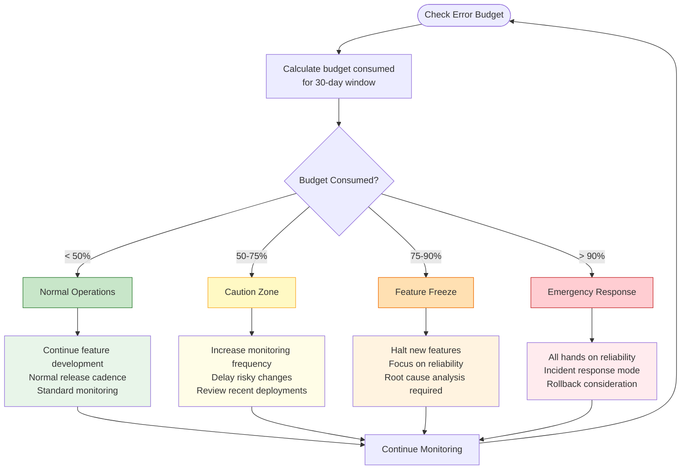
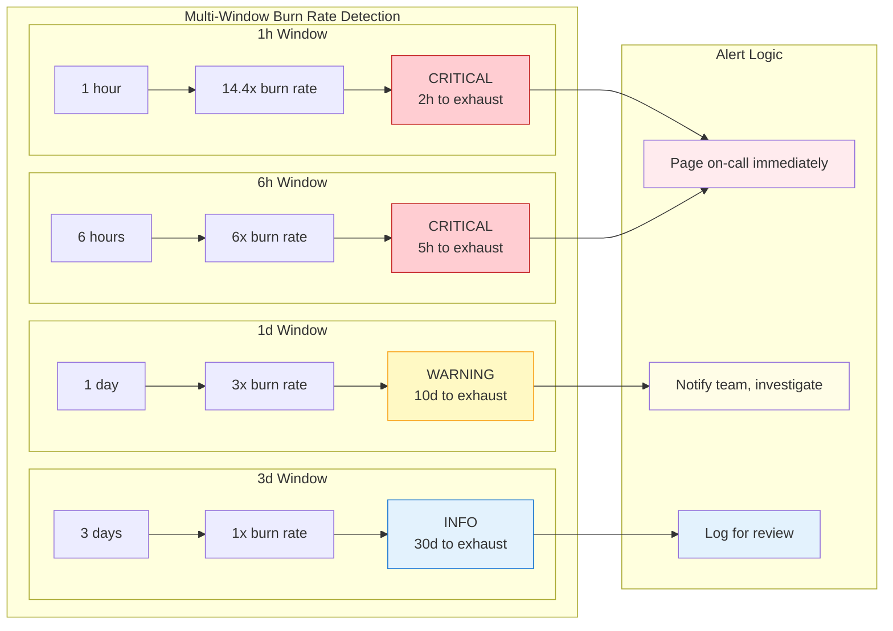

# SLI/SLO Framework for Home Security Intelligence

This document defines the Service Level Indicators (SLIs) and Service Level Objectives (SLOs) for the Home Security Intelligence platform.

## Overview

The SLI/SLO framework provides quantifiable measures of service reliability and performance, enabling data-driven decisions about system changes and incident response.

## Service Level Objectives

### SLO 1: API Availability

| Metric          | Value                                                                                    |
| --------------- | ---------------------------------------------------------------------------------------- |
| **Target**      | 99.5%                                                                                    |
| **Window**      | 30-day rolling                                                                           |
| **SLI**         | Ratio of successful HTTP responses (non-5xx) to total requests                           |
| **Measurement** | `sum(rate(http_requests_total{status!~"5.."}[5m])) / sum(rate(http_requests_total[5m]))` |

**Error Budget:** 0.5% = 3.6 hours/month of allowed unavailability

### SLO 2: Event Processing Latency

| Metric          | Value                                                                              |
| --------------- | ---------------------------------------------------------------------------------- |
| **Target**      | P95 < 5 seconds                                                                    |
| **Window**      | 30-day rolling                                                                     |
| **SLI**         | 95th percentile of event processing time                                           |
| **Measurement** | `histogram_quantile(0.95, rate(hsi_event_processing_duration_seconds_bucket[5m]))` |

**Error Budget:** 5% of events may exceed 5s latency

### SLO 3: Detection Latency

| Metric          | Value                                                                       |
| --------------- | --------------------------------------------------------------------------- |
| **Target**      | P95 < 2 seconds                                                             |
| **Window**      | 30-day rolling                                                              |
| **SLI**         | 95th percentile of RT-DETR detection inference time                         |
| **Measurement** | `histogram_quantile(0.95, rate(hsi_detection_duration_seconds_bucket[5m]))` |

**Error Budget:** 5% of detections may exceed 2s latency

### SLO 4: Analysis Latency

| Metric          | Value                                                                      |
| --------------- | -------------------------------------------------------------------------- |
| **Target**      | P95 < 30 seconds                                                           |
| **Window**      | 30-day rolling                                                             |
| **SLI**         | 95th percentile of Nemotron LLM analysis time                              |
| **Measurement** | `histogram_quantile(0.95, rate(hsi_analysis_duration_seconds_bucket[5m]))` |

**Error Budget:** 5% of analyses may exceed 30s latency

### SLO 5: WebSocket Availability

| Metric          | Value                                                                                                    |
| --------------- | -------------------------------------------------------------------------------------------------------- |
| **Target**      | 99%                                                                                                      |
| **Window**      | 30-day rolling                                                                                           |
| **SLI**         | Ratio of successful WebSocket connections to total connection attempts                                   |
| **Measurement** | `sum(rate(hsi_websocket_connections_successful[5m])) / sum(rate(hsi_websocket_connection_attempts[5m]))` |

**Error Budget:** 1% = 7.2 hours/month of allowed unavailability

## Error Budget Policy

### Error Budget Consumption Flowchart



### Consumption Thresholds

| Threshold | Action                                            |
| --------- | ------------------------------------------------- |
| < 50%     | Normal operations, feature development continues  |
| 50-75%    | Increased monitoring, caution with risky changes  |
| 75-90%    | Feature freeze, focus on reliability improvements |
| > 90%     | Emergency response, all hands on reliability      |

### Burn Rate Alerting

We use multi-window burn rate alerting to detect SLO violations early:

| Window | Burn Rate | Alert Severity | Time to Exhaust Budget |
| ------ | --------- | -------------- | ---------------------- |
| 1h     | 14.4x     | Critical       | 2 hours                |
| 6h     | 6x        | Critical       | 5 hours                |
| 1d     | 3x        | Warning        | 10 days                |
| 3d     | 1x        | Info           | 30 days                |

#### Burn Rate Alerting Windows Visualization



**How it works:**

1. **Short windows (1h, 6h)** detect rapid budget consumption requiring immediate action
2. **Long windows (1d, 3d)** detect gradual degradation for proactive investigation
3. **Both conditions must be true** to fire an alert (prevents false positives from spikes)

## Recording Rules

Pre-computed metrics for efficient dashboard queries:

```yaml
# SLI Recording Rules (prometheus-rules.yml)
- record: hsi:api_availability:ratio_rate5m
  expr: sum(rate(http_requests_total{status!~"5.."}[5m])) / sum(rate(http_requests_total[5m]))

- record: hsi:detection_latency:p95_5m
  expr: histogram_quantile(0.95, rate(hsi_detection_duration_seconds_bucket[5m]))

- record: hsi:analysis_latency:p95_5m
  expr: histogram_quantile(0.95, rate(hsi_analysis_duration_seconds_bucket[5m]))
```

## Alert Rules

### Critical Alerts

| Alert Name           | Condition                        | For |
| -------------------- | -------------------------------- | --- |
| HSIPipelineDown      | All backend replicas unavailable | 1m  |
| HSIDatabaseUnhealthy | PostgreSQL connection failures   | 2m  |
| HSIRedisUnhealthy    | Redis connection failures        | 2m  |
| HSIGPUMemoryHigh     | GPU memory > 90%                 | 5m  |

### Warning Alerts

| Alert Name            | Condition                   | For |
| --------------------- | --------------------------- | --- |
| HSIDetectionQueueHigh | Detection queue > 100 items | 5m  |
| HSIAnalysisQueueHigh  | Analysis queue > 50 items   | 5m  |
| HSIHighErrorRate      | Error rate > 5%             | 5m  |
| HSISlowDetection      | P95 detection latency > 2s  | 10m |
| HSISlowAnalysis       | P95 analysis latency > 30s  | 10m |

## Dashboard

The SLO dashboard (`monitoring/grafana/dashboards/slo.json`) provides:

1. **SLO Compliance Gauges** - Current compliance for each SLO
2. **Error Budget Remaining** - Time-based visualization of remaining budget
3. **Burn Rate Trends** - Multi-window burn rate graphs
4. **Historical SLI Trends** - 30-day rolling SLI values

## Implementation Notes

### Metric Sources

- **API metrics**: FastAPI middleware via Prometheus client
- **Detection metrics**: RT-DETR service instrumentation
- **Analysis metrics**: Nemotron service instrumentation
- **WebSocket metrics**: WebSocket handler instrumentation
- **Infrastructure metrics**: Redis exporter, PostgreSQL exporter

### Data Retention

- Raw metrics: 15 days
- Recording rules (aggregated): 90 days
- Dashboard snapshots: 365 days

## Related Documentation

- [Prometheus Rules](../monitoring/prometheus-rules.yml)
- [Alerting Rules](../monitoring/alerting-rules.yml)
- [Alertmanager Configuration](../monitoring/alertmanager.yml)
- [SLO Dashboard](../monitoring/grafana/dashboards/slo.json)
