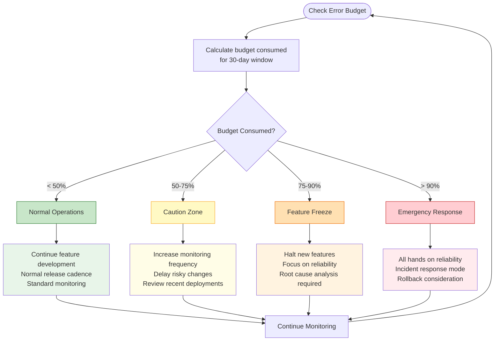
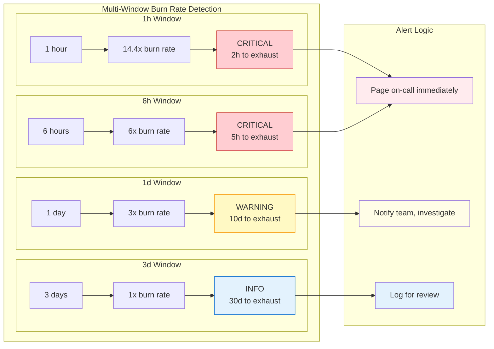

# SLI/SLO Framework for Home Security Intelligence

This document defines the Service Level Indicators (SLIs) and Service Level Objectives (SLOs) for the Home Security Intelligence platform.

## Overview

The SLI/SLO framework provides quantifiable measures of service reliability and performance, enabling data-driven decisions about system changes and incident response.

## Service Level Objectives

> [!IMPORTANT] > **Implementation status (measured against `monitoring/prometheus-rules.yml` and
> `backend/core/metrics.py`):** SLO 1 (API availability) is fully operational, measured via
> blackbox probes. SLOs 2-5 have recording rules and/or metric definitions but **depend on
> histogram series the backend does not emit yet** (`hsi_event_processing_duration_seconds`,
> `hsi_stage_duration_seconds` — defined but never observed — and the websocket counters),
> so their series evaluate empty and their alerts stay commented out.

### SLO 1: API Availability

| Metric          | Value                                                                                                                              |
| --------------- | ---------------------------------------------------------------------------------------------------------------------------------- |
| **Target**      | 99.5%                                                                                                                              |
| **Window**      | 30-day rolling                                                                                                                     |
| **SLI**         | Availability of the backend readiness probe                                                                                        |
| **Measurement** | `avg_over_time(probe_success{job="blackbox-http-ready"}[5m])` (blackbox probe — the backend does not expose `http_requests_total`) |

**Error Budget:** 0.5% = 3.6 hours/month of allowed unavailability
**Recording rules:** `hsi:api_availability:ratio_rate{1h,6h,1d,30d}`

### SLO 2: Event Processing Latency

| Metric          | Value                                                                                                                                                     |
| --------------- | --------------------------------------------------------------------------------------------------------------------------------------------------------- |
| **Target**      | P95 < 5 seconds                                                                                                                                           |
| **Window**      | 30-day rolling                                                                                                                                            |
| **SLI**         | 95th percentile of event processing time                                                                                                                  |
| **Measurement** | `histogram_quantile(0.95, rate(hsi_event_processing_duration_seconds_bucket[5m]))` — **recording rule commented out**; metric not exported by the backend |

**Error Budget:** 5% of events may exceed 5s latency

### SLO 3: Detection Latency

| Metric          | Value                                                                                                                                                                                              |
| --------------- | -------------------------------------------------------------------------------------------------------------------------------------------------------------------------------------------------- |
| **Target**      | P95 < 2 seconds                                                                                                                                                                                    |
| **Window**      | 30-day rolling                                                                                                                                                                                     |
| **SLI**         | 95th percentile of the detect pipeline stage                                                                                                                                                       |
| **Measurement** | `histogram_quantile(0.95, sum(rate(hsi_stage_duration_seconds_bucket{stage="detect"}[5m])) by (le))` — rule active, but the backend defines `hsi_stage_duration_seconds` without ever observing it |

**Error Budget:** 5% of detections may exceed 2s latency

### SLO 4: Analysis Latency

| Metric          | Value                                                                                                                            |
| --------------- | -------------------------------------------------------------------------------------------------------------------------------- |
| **Target**      | P95 < 30 seconds                                                                                                                 |
| **Window**      | 30-day rolling                                                                                                                   |
| **SLI**         | 95th percentile of the analyze pipeline stage                                                                                    |
| **Measurement** | `histogram_quantile(0.95, sum(rate(hsi_stage_duration_seconds_bucket{stage="analyze"}[5m])) by (le))` — same metric gap as SLO 3 |

**Error Budget:** 5% of analyses may exceed 30s latency

### SLO 5: WebSocket Availability

| Metric          | Value                                                                                                                                                |
| --------------- | ---------------------------------------------------------------------------------------------------------------------------------------------------- |
| **Target**      | 99%                                                                                                                                                  |
| **Window**      | 30-day rolling                                                                                                                                       |
| **SLI**         | Ratio of successful WebSocket connections to total connection attempts                                                                               |
| **Measurement** | `hsi:websocket:connection_success_rate_5m` — **recording rule commented out**; `hsi_websocket_connections_successful` / `_attempts` are not exported |

**Error Budget:** 1% = 7.2 hours/month of allowed unavailability

## Error Budget Policy

### Error Budget Consumption Flowchart


```mermaid
flowchart TD
    Start([Check Error Budget]) --> Calculate[Calculate budget consumed<br/>for 30-day window]
    Calculate --> Check{Budget Consumed?}

    Check -->|"< 50%"| Green[Normal Operations]
    Check -->|"50-75%"| Yellow[Caution Zone]
    Check -->|"75-90%"| Orange[Feature Freeze]
    Check -->|"> 90%"| Red[Emergency Response]

    Green --> GreenActions["Continue feature development<br/>Normal release cadence<br/>Standard monitoring"]
    Yellow --> YellowActions["Increase monitoring frequency<br/>Delay risky changes<br/>Review recent deployments"]
    Orange --> OrangeActions["Halt new features<br/>Focus on reliability<br/>Root cause analysis required"]
    Red --> RedActions["All hands on reliability<br/>Incident response mode<br/>Rollback consideration"]

    GreenActions --> Monitor[Continue Monitoring]
    YellowActions --> Monitor
    OrangeActions --> Monitor
    RedActions --> Monitor

    Monitor --> Start

    style Green fill:#c8e6c9,stroke:#2e7d32
    style Yellow fill:#fff9c4,stroke:#f9a825
    style Orange fill:#ffe0b2,stroke:#ef6c00
    style Red fill:#ffcdd2,stroke:#c62828
    style GreenActions fill:#e8f5e9
    style YellowActions fill:#fffde7
    style OrangeActions fill:#fff3e0
    style RedActions fill:#ffebee
```

### Consumption Thresholds

| Threshold | Action                                            |
| --------- | ------------------------------------------------- |
| < 50%     | Normal operations, feature development continues  |
| 50-75%    | Increased monitoring, caution with risky changes  |
| 75-90%    | Feature freeze, focus on reliability improvements |
| > 90%     | Emergency response, all hands on reliability      |

### Burn Rate Alerting

Multi-window burn rate alerting detects SLO violations early. As shipped, only the **API
availability** burns fire (`HSIAPIAvailabilityFastBurn`, `HSIAPIAvailabilitySlowBurn` in
`monitoring/alerting-rules.yml`); the detection/analysis latency burns are commented out
pending the stage-duration histogram:

| Window | Burn Rate | Alert Severity | Time to Exhaust Budget | Alert                   |
| ------ | --------- | -------------- | ---------------------- | ----------------------- |
| 1h     | 14.4x     | Critical       | 2 hours                | FastBurn (and 6h>6x)    |
| 6h     | 6x        | Critical       | 5 hours                | FastBurn (and 1h>14.4x) |
| 1d     | 3x        | Warning        | 10 days                | SlowBurn                |
| 3d     | 1x        | Info           | 30 days                | not shipped as an alert |

#### Burn Rate Alerting Windows Visualization


```mermaid
flowchart LR
    subgraph "Multi-Window Burn Rate Detection"
        direction TB

        subgraph "1h Window"
            W1[1 hour] --> B1["14.4x burn rate"]
            B1 --> A1["CRITICAL<br/>2h to exhaust"]
        end

        subgraph "6h Window"
            W2[6 hours] --> B2["6x burn rate"]
            B2 --> A2["CRITICAL<br/>5h to exhaust"]
        end

        subgraph "1d Window"
            W3[1 day] --> B3["3x burn rate"]
            B3 --> A3["WARNING<br/>10d to exhaust"]
        end

        subgraph "3d Window"
            W4[3 days] --> B4["1x burn rate"]
            B4 --> A4["INFO<br/>30d to exhaust"]
        end
    end

    subgraph "Alert Logic"
        A1 --> Page["Page on-call immediately"]
        A2 --> Page
        A3 --> Notify["Notify team, investigate"]
        A4 --> Log["Log for review"]
    end

    style A1 fill:#ffcdd2,stroke:#c62828
    style A2 fill:#ffcdd2,stroke:#c62828
    style A3 fill:#fff9c4,stroke:#f9a825
    style A4 fill:#e3f2fd,stroke:#1976d2
    style Page fill:#ffebee
    style Notify fill:#fffde7
    style Log fill:#e3f2fd
```

**How it works:**

1. **Short windows (1h, 6h)** detect rapid budget consumption requiring immediate action
2. **Long windows (1d, 3d)** detect gradual degradation for proactive investigation
3. **Both conditions must be true** to fire an alert (prevents false positives from spikes)

## Recording Rules

Pre-computed metrics for efficient dashboard queries (measured from
`monitoring/prometheus-rules.yml`):

```yaml
# SLI Recording Rules (prometheus-rules.yml)
- record: hsi:api_availability:ratio_rate1h
  expr: avg_over_time(probe_success{job="blackbox-http-ready"}[1h])

- record: hsi:detection_latency:p95_5m
  expr: histogram_quantile(0.95, sum(rate(hsi_stage_duration_seconds_bucket{stage="detect"}[5m])) by (le))

- record: hsi:analysis_latency:p95_5m
  expr: histogram_quantile(0.95, sum(rate(hsi_stage_duration_seconds_bucket{stage="analyze"}[5m])) by (le))
```

Error budget and burn-rate rules: `hsi:error_budget:api_availability_remaining`
(target 99.5%), `hsi:error_budget:{detection,analysis}_latency_remaining` (95% within SLO),
and `hsi:burn_rate:api_availability_{1h,6h,1d}`.

## Alert Rules

### Critical Alerts

| Alert Name                 | Condition                                                         | For |
| -------------------------- | ----------------------------------------------------------------- | --- |
| HSIPipelineDown            | `probe_success{job="blackbox-http-live", service="backend"} == 0` | 1m  |
| HSIDatabaseUnhealthy       | `hsi_database_healthy == 0` (json-exporter)                       | 2m  |
| HSIRedisUnhealthy          | `hsi_redis_healthy == 0`                                          | 2m  |
| HSIGPUMemoryHigh           | `hsi:gpu:memory_utilization > 0.9`                                | 5m  |
| HSIAPIAvailabilityFastBurn | burn rate 1h > 14.4 **and** 6h > 6                                | 2m  |

### Warning Alerts

| Alert Name                 | Condition                                              | For |
| -------------------------- | ------------------------------------------------------ | --- |
| HSIDetectionQueueHigh      | `hsi_detection_queue_depth > 100`                      | 5m  |
| HSIAnalysisQueueHigh       | `hsi_analysis_queue_depth > 50`                        | 5m  |
| HSIHighErrorRate           | `1 - hsi:api_requests:success_rate_5m > 0.05`          | 5m  |
| HSIAPIAvailabilitySlowBurn | `hsi:burn_rate:api_availability_1d > 3`                | 1h  |
| HSISlowDetection           | **commented out** — needs the stage-duration histogram | -   |
| HSISlowAnalysis            | **commented out** — same metric gap                    | -   |

## Dashboard

SLO panels live in the provisioned **consolidated** dashboard
(`monitoring/grafana/dashboards/consolidated.json`), served under
`http://localhost:3002/grafana/`:

1. **SLO Compliance Gauges** - Current compliance for each SLO
2. **Error Budget Remaining** - Time-based visualization of remaining budget
3. **Burn Rate Trends** - Multi-window burn rate graphs
4. **Historical SLI Trends** - 30-day rolling SLI values

## Implementation Notes

### Metric Sources

- **API availability**: blackbox-exporter probes against the backend health endpoints
  (the backend does not export a request counter)
- **Detection/analysis latency**: `hsi_stage_duration_seconds` histogram (defined in
  `backend/core/metrics.py`; instrumentation to observe it is still pending)
- **GPU / queue / health gauges**: `monitoring/json-exporter-config.yml` scraping the
  backend health and GPU APIs
- **Infrastructure metrics**: Redis exporter, node-exporter, (optional DCGM exporter under
  the `gpu-rootful` profile)

### Data Retention

Prometheus retains raw samples for `${PROMETHEUS_RETENTION_TIME:-15d}`
(`--storage.tsdb.retention.time` in `docker-compose.prod.yml`). Recording rules are stored
in the same TSDB and age out at the same retention — there is no separate 90/365-day tier.

## Related Documentation

- [Prometheus Rules](https://github.com/mikesvoboda/nemotron-v3-home-security-intelligence/blob/main/monitoring/prometheus-rules.yml)
- [Alerting Rules](https://github.com/mikesvoboda/nemotron-v3-home-security-intelligence/blob/main/monitoring/alerting-rules.yml)
- [Alertmanager Configuration](https://github.com/mikesvoboda/nemotron-v3-home-security-intelligence/blob/main/monitoring/alertmanager.yml)
- [SLO Dashboard](https://github.com/mikesvoboda/nemotron-v3-home-security-intelligence/blob/main/monitoring/grafana/dashboards/) (see dashboards directory)
