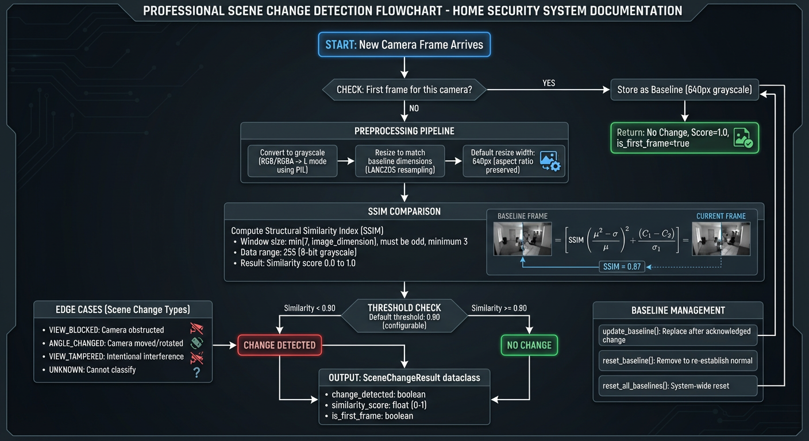

# Scene Change Detection

> Detect camera tampering, view obstruction, and angle changes automatically.

**Time to read:** ~6 min
**Prerequisites:** System running, cameras configured

---

## Overview

Scene Change Detection monitors camera feeds for significant visual changes that may indicate tampering, obstruction, or physical camera movement. The system compares each frame against a stored baseline image using Structural Similarity Index (SSIM) to detect deviations.

### What It Detects

| Change Type     | Description                              | Risk Level |
| --------------- | ---------------------------------------- | ---------- |
| `view_blocked`  | Camera lens obscured or covered          | High       |
| `angle_changed` | Camera physically moved or rotated       | Medium     |
| `view_tampered` | Deliberate interference with camera view | High       |
| `unknown`       | Unclassified visual change               | Review     |

### How It Works



_Scene change detection workflow showing SSIM comparison between current frames and baseline images._

```
┌─────────────────┐     ┌─────────────────┐     ┌─────────────────┐
│  New Frame      │────▶│ SSIM Comparison │────▶│ Change Detected?│
│  from Camera    │     │ (vs Baseline)   │     │                 │
└─────────────────┘     └─────────────────┘     └────────┬────────┘
                                                         │
                              ┌───────────────────────────┴─────────┐
                              │                                     │
                        Yes (similarity < threshold)          No (similar)
                              │                                     │
                              ▼                                     ▼
                    ┌─────────────────┐                    ┌─────────────────┐
                    │ Create Alert    │                    │ Continue Normal │
                    │ Scene Change    │                    │ Processing      │
                    │ Record          │                    │                 │
                    └─────────────────┘                    └─────────────────┘
```

The SSIM algorithm compares structural patterns, luminance, and contrast between the current frame and baseline. A similarity score of 1.0 means identical images; lower scores indicate more difference.

---

## Configuration Options

### Environment Variables

| Variable                 | Default | Range   | Description                              |
| ------------------------ | ------- | ------- | ---------------------------------------- |
| `SCENE_CHANGE_ENABLED`   | `true`  | -       | Enable/disable scene change detection    |
| `SCENE_CHANGE_THRESHOLD` | `0.90`  | 0.0-1.0 | SSIM threshold (below = change detected) |

### Threshold Selection Guide

| Threshold | Sensitivity | Use Case                               |
| --------- | ----------- | -------------------------------------- |
| 0.95      | High        | Indoor cameras with stable lighting    |
| 0.90      | Balanced    | General purpose (default)              |
| 0.85      | Low         | Outdoor cameras with variable lighting |
| 0.80      | Very Low    | Cameras with frequent natural changes  |

**Lower threshold** = Less sensitive (more change required to trigger)
**Higher threshold** = More sensitive (smaller changes trigger alerts)

### Internal Settings

The scene change detector uses these internal settings (not configurable via environment):

| Setting      | Value | Description                             |
| ------------ | ----- | --------------------------------------- |
| Resize Width | 640px | Frames resized for efficient comparison |
| Window Size  | 7px   | SSIM comparison window size             |
| Color Mode   | Gray  | Frames converted to grayscale           |

---

## Alert Thresholds

Scene changes are flagged when the similarity score falls below the configured threshold:

```
Similarity Score:  1.0 ─────────────── 0.90 ─────────────── 0.0
                    │                   │                   │
                 Identical       Threshold (default)    Very Different
                    │                   │                   │
                 No Alert          Alert Triggered     Definite Alert
```

### Example Scenarios

| Scenario                    | Typical Similarity | Alert? (0.90 threshold) |
| --------------------------- | ------------------ | ----------------------- |
| Same scene, no change       | 0.98-1.0           | No                      |
| Lighting change (day/night) | 0.85-0.95          | Maybe                   |
| Person walking through      | 0.80-0.92          | Maybe                   |
| Camera covered with cloth   | 0.20-0.50          | Yes                     |
| Camera rotated 45 degrees   | 0.30-0.60          | Yes                     |
| Complete view obstruction   | 0.10-0.30          | Yes                     |

---

## Use Cases

### Camera Tampering Detection

Detect when someone deliberately interferes with a camera:

- Covering the lens
- Spray painting the lens
- Placing objects in front of camera
- Redirecting the camera

**Recommended Settings:**

- Threshold: 0.90-0.95 (high sensitivity)
- Alert response: Immediate notification

### View Change Monitoring

Detect accidental or unintentional camera movement:

- Wind-blown outdoor cameras
- Vibration from nearby equipment
- Accidental bumps during maintenance

**Recommended Settings:**

- Threshold: 0.85-0.90 (moderate sensitivity)
- Alert response: Review within hours

### Environmental Baseline Updates

Handle legitimate scene changes that should become the new normal:

- Seasonal changes (snow, foliage)
- Furniture rearrangement
- Construction/renovation

**Action:** Acknowledge the change to update the baseline

---

## Dashboard Interface

### Viewing Scene Changes

The Scene Change Panel is available in the Analytics section for each camera.

**Panel Features:**

- List of detected scene changes with timestamps
- Change type classification with color-coded badges
- Similarity score for each detection
- Acknowledged/unacknowledged status

### Change Type Indicators

| Badge Color | Type          | Meaning                   |
| ----------- | ------------- | ------------------------- |
| Red         | View Blocked  | Possible lens obstruction |
| Red         | View Tampered | Deliberate interference   |
| Orange      | Angle Changed | Camera position shifted   |
| Gray        | Unknown       | Unclassified change       |

### Acknowledging Changes

When you review a scene change and determine it's expected:

1. Click the **Acknowledge** button next to the change
2. The change is marked as acknowledged with timestamp
3. Acknowledged changes remain in history but are visually distinguished

**What Acknowledging Does:**

- Marks the change as reviewed
- Updates the baseline to the new view (if applicable)
- Prevents repeated alerts for the same change

---

## API Operations

### List Scene Changes for a Camera

```bash
# Get recent scene changes
curl "http://localhost:8000/api/cameras/{camera_id}/scene-changes?limit=20"
```

**Response:**

```json
{
  "scene_changes": [
    {
      "id": 42,
      "camera_id": "front_door",
      "detected_at": "2025-12-23T10:30:00Z",
      "change_type": "angle_changed",
      "similarity_score": 0.72,
      "acknowledged": false,
      "acknowledged_at": null,
      "file_path": "/export/foscam/front_door/snap_001.jpg"
    }
  ]
}
```

### Acknowledge a Scene Change

```bash
curl -X POST "http://localhost:8000/api/cameras/{camera_id}/scene-changes/{id}/acknowledge"
```

### Query Parameters

| Parameter | Type    | Default | Description                 |
| --------- | ------- | ------- | --------------------------- |
| `limit`   | integer | 20      | Max scene changes to return |

---

## Baseline Management

### How Baselines Work

1. **First Frame**: When a camera first sends an image, it becomes the baseline
2. **Comparison**: Subsequent frames are compared against this baseline
3. **Updates**: Acknowledging a scene change can update the baseline

### Resetting Baselines

Baselines may need to be reset when:

- Camera is reinstalled
- Major legitimate scene changes occur
- False positives are frequent

**Via Service Restart:**
Restarting the backend service clears all baselines (they're held in memory).

```bash
docker compose restart backend
```

### Baseline Persistence

Currently, baselines are stored in-memory and lost on restart. The first frame after restart becomes the new baseline for each camera.

---

## Database Schema

Scene changes are persisted in PostgreSQL:

| Column             | Type      | Description                     |
| ------------------ | --------- | ------------------------------- |
| `id`               | integer   | Auto-incrementing primary key   |
| `camera_id`        | string    | Foreign key to cameras table    |
| `detected_at`      | timestamp | When change was detected        |
| `change_type`      | enum      | Type of change detected         |
| `similarity_score` | float     | SSIM score (0-1)                |
| `acknowledged`     | boolean   | Whether change was acknowledged |
| `acknowledged_at`  | timestamp | When change was acknowledged    |
| `file_path`        | string    | Path to triggering image        |

### Indexes

Optimized queries with:

- `idx_scene_changes_camera_id` - Lookup by camera
- `idx_scene_changes_detected_at` - Time-based queries
- `idx_scene_changes_acknowledged` - Filter by acknowledgment status
- `ix_scene_changes_detected_at_brin` - Efficient time-series queries

---

## Tuning Recommendations

### High-Security Environments

For maximum sensitivity to tampering:

```bash
SCENE_CHANGE_ENABLED=true
SCENE_CHANGE_THRESHOLD=0.95
```

- Review all alerts promptly
- Low tolerance for false negatives

### Variable Outdoor Environments

For cameras with natural lighting changes:

```bash
SCENE_CHANGE_ENABLED=true
SCENE_CHANGE_THRESHOLD=0.80
```

- Accept some false negatives
- Reduce alert fatigue from weather/lighting

### Disabling for Specific Use Cases

If scene change detection isn't needed:

```bash
SCENE_CHANGE_ENABLED=false
```

---

## Troubleshooting

### Too Many False Positives

**Symptoms:** Alerts for normal activity (people, lighting)

**Solutions:**

1. Lower the threshold (e.g., 0.85 instead of 0.90)
2. Review camera placement (avoid high-traffic areas)
3. Consider scheduled baseline updates

### Not Detecting Actual Tampering

**Symptoms:** Camera was covered but no alert

**Solutions:**

1. Raise the threshold (e.g., 0.95 instead of 0.90)
2. Verify scene change detection is enabled
3. Check camera is sending images to system

### Baseline Issues After Restart

**Symptoms:** False alerts immediately after service restart

**Explanation:** Baselines are in-memory; first frame after restart becomes new baseline.

**Solution:** Wait for stable frame, or acknowledge initial false positives.

---

## Related Documentation

- [AI Pipeline Architecture](../architecture/ai-pipeline.md) - How scene changes fit in the pipeline
- [Camera Setup](../getting-started/first-run.md#configure-your-first-camera) - Camera configuration
- [Environment Reference](../reference/config/env-reference.md) - All configuration options
- [Analytics Page](../user/analytics.md) - User guide for analytics features

---

[Back to Operator Hub](../operator-hub.md)
