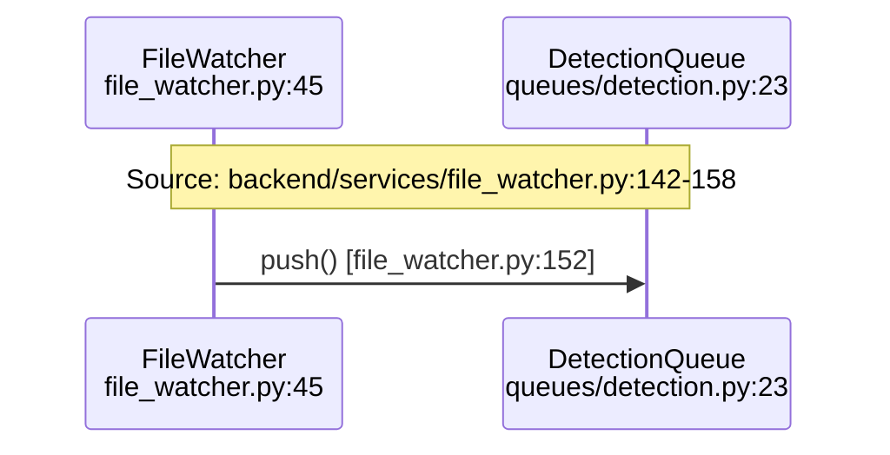

# Architecture Documentation Design

**Date:** 2026-01-24
**Status:** Approved
**Author:** Claude (with Mike Svoboda)

## Overview

This document defines the design for comprehensive technical documentation of the AI-powered home security monitoring system. The documentation targets three audiences: new developers (onboarding), API integrators, and deep reference for future maintenance.

## Design Principles

1. **Hub-and-spoke structure** - Each major topic is a hub linking to focused sub-documents
2. **Mandatory code citations** - Every technical claim includes `file:line` references
3. **Extensive visual diagrams** - Mermaid, PlantUML, and Graphviz throughout
4. **Validation-ready** - All citations verifiable by automated tooling
5. **Low-level dataflows** - End-to-end traces showing exact function calls

## Documentation Structure

```
docs/architecture/
├── README.md                           # Master index, navigation, standards
├── diagrams/                           # Shared diagram assets and themes
│
├── system-overview/                    # Hub: 4 documents
├── detection-pipeline/                 # Hub: 6 documents
├── ai-orchestration/                   # Hub: 6 documents
├── realtime-system/                    # Hub: 6 documents
├── data-model/                         # Hub: 6 documents
├── api-reference/                      # Hub: 7 documents
├── resilience-patterns/                # Hub: 6 documents
├── observability/                      # Hub: 6 documents
├── background-services/                # Hub: 6 documents
├── middleware/                         # Hub: 6 documents
├── frontend/                           # Hub: 6 documents
├── testing/                            # Hub: 6 documents
├── security/                           # Hub: 6 documents
└── dataflows/                          # Hub: 10 documents

Total: 14 hubs, 87 documents
```

---

## Code Citation Requirements

### Format Specification

| Type                | Format                                 | Example                                  |
| ------------------- | -------------------------------------- | ---------------------------------------- |
| Single line         | `file.py:123`                          | `backend/services/file_watcher.py:67`    |
| Line range          | `file.py:123-145`                      | `backend/services/file_watcher.py:67-89` |
| Code block header   | `# file.py:123-145`                    | First line of fenced code block          |
| Diagram participant | `<br/>file.py:45`                      | Mermaid participant label                |
| Diagram note        | `Note over X,Y: Source: file.py:12-34` | Sequence diagram annotation              |

### Citation Examples

**Prose citation:**

```markdown
The FileWatcher monitors directories using inotify events
(`backend/services/file_watcher.py:67-89`) and debounces rapid
successive events with a 100ms window (`backend/services/file_watcher.py:112-134`).
```

**Code block citation:**

```python
# backend/services/file_watcher.py:142-158
async def on_created(self, event: FileSystemEvent) -> None:
    camera_id = self._extract_camera_id(event.src_path)
    await self.detection_queue.push(
        DetectionQueueItem(
            camera_id=camera_id,
            image_path=event.src_path,
            timestamp=datetime.utcnow(),
        )
    )
```

**Diagram citation:**



---

## Diagram Standards

| Diagram Type       | Tool     | Use Case                                        |
| ------------------ | -------- | ----------------------------------------------- |
| Sequence diagrams  | Mermaid  | Function call chains, request/response flows    |
| State machines     | Mermaid  | Circuit breaker states, job states, connections |
| ER diagrams        | Mermaid  | Database relationships                          |
| Component diagrams | PlantUML | Service architecture, container topology        |
| Call graphs        | Graphviz | Function dependencies, module relationships     |
| Flowcharts         | Mermaid  | Decision trees, branching logic                 |
| Timing diagrams    | PlantUML | Batch windows, timeout sequences                |

### Theme Requirements

- Dark theme compatible (NVIDIA green #76B900 accents)
- Consistent styling across all documents
- Icons stored in `diagrams/icons/`
- Theme definitions in `diagrams/themes/`

---

## Validation Script Design

### Architecture

```
scripts/validate-docs/
├── __init__.py
├── cli.py                        # Entry point with --deep flag
├── config.py                     # Patterns, ignore rules, LLM settings
│
├── parsers/
│   ├── __init__.py
│   ├── markdown.py               # Extract citations from prose
│   ├── mermaid.py                # Extract citations from mermaid
│   ├── plantuml.py               # Extract citations from plantuml
│   ├── graphviz.py               # Extract citations from graphviz
│   └── code_blocks.py            # Extract citations from fenced blocks
│
├── validators/
│   ├── __init__.py
│   ├── file_exists.py            # Level 1: File and line existence
│   ├── ast_python.py             # Level 2: Python AST (tree-sitter)
│   ├── ast_typescript.py         # Level 2: TypeScript AST
│   ├── code_match.py             # Level 3: Code block content matching
│   ├── cross_reference.py        # Level 4: Consistency across docs
│   ├── staleness.py              # Level 5: Git-based staleness
│   └── semantic.py               # Level 6: LLM semantic verification
│
├── llm/
│   ├── __init__.py
│   ├── client.py                 # Anthropic API client
│   ├── prompts.py                # Validation prompts
│   └── cache.py                  # Response caching (7 days)
│
├── reports/
│   ├── __init__.py
│   ├── console.py                # Terminal output
│   ├── json.py                   # Machine-readable CI output
│   ├── markdown.py               # Validation report as .md
│   └── github.py                 # PR comment annotations
│
└── utils/
    ├── __init__.py
    ├── git.py                    # File modification times, blame
    └── fuzzy.py                  # Fuzzy matching for code comparison
```

### Validation Levels

| Level | Name                  | Always Runs   | Description                            |
| ----- | --------------------- | ------------- | -------------------------------------- |
| 1     | File Exists           | Yes           | File path exists, line numbers valid   |
| 2     | AST Verification      | Yes           | Functions/classes exist at cited lines |
| 3     | Code Block Match      | Yes           | Cited code matches documentation       |
| 4     | Cross-Reference       | Yes           | Consistent citations across documents  |
| 5     | Staleness Detection   | Yes           | Git-based freshness checking           |
| 6     | Semantic Verification | `--deep` only | LLM verifies prose matches code        |

### CLI Usage

```bash
# Fast validation (Levels 1-5)
python -m validate_docs docs/architecture/

# Deep validation with LLM (Levels 1-6)
python -m validate_docs docs/architecture/ --deep

# Single document
python -m validate_docs docs/architecture/detection-pipeline/file-watcher.md

# Output formats
python -m validate_docs docs/architecture/ --format json > report.json
python -m validate_docs docs/architecture/ --format github  # PR annotations

# Watch mode
python -m validate_docs docs/architecture/ --watch
```

### Integration Points

| Integration             | Implementation                            |
| ----------------------- | ----------------------------------------- |
| pre-commit              | Levels 1-5 on staged docs                 |
| CI pipeline             | Levels 1-5 all docs, Level 6 changed docs |
| `./scripts/validate.sh` | Include validation command                |
| Nightly job             | Full Level 6 validation                   |

---

## Hub Specifications

### 1. System Overview Hub

**Location:** `docs/architecture/system-overview/`

| Document               | Purpose                                                     |
| ---------------------- | ----------------------------------------------------------- |
| README.md              | Hub: architecture summary, component map, service inventory |
| design-decisions.md    | Architectural choices with rationale (ADR format)           |
| deployment-topology.md | Container layout, networking, GPU passthrough, volumes      |
| configuration.md       | Environment variables, settings patterns, validation        |

**Key Diagrams:**

- PlantUML component diagram showing all services
- Container architecture diagram with networking
- VRAM allocation visualization

---

### 2. Detection Pipeline Hub

**Location:** `docs/architecture/detection-pipeline/`

| Document            | Purpose                                                   |
| ------------------- | --------------------------------------------------------- |
| README.md           | Hub: end-to-end flow diagram, stage latencies             |
| file-watcher.md     | inotify monitoring, debouncing, camera ID extraction      |
| detection-queue.md  | Redis queue operations, worker lifecycle, backpressure    |
| batch-aggregator.md | Time windowing (90s/30s), Redis storage, timer management |
| analysis-queue.md   | Enrichment integration, Nemotron analysis, event creation |
| critical-paths.md   | Latency-sensitive paths, hot functions, memory management |

**Key Diagrams:**

- Mermaid flowchart: full pipeline flow
- Sequence diagram: image to event creation
- Timing diagram: batch window behavior

---

### 3. AI Orchestration Hub

**Location:** `docs/architecture/ai-orchestration/`

| Document               | Purpose                                                 |
| ---------------------- | ------------------------------------------------------- |
| README.md              | Hub: model inventory, VRAM budget, service architecture |
| model-zoo.md           | Lazy loading, LRU eviction, priority-based management   |
| yolo26-client.md       | Detection client, image preprocessing, response parsing |
| nemotron-analyzer.md   | LLM inference, prompt building, response parsing        |
| enrichment-pipeline.md | Multi-model routing, parallel inference                 |
| fallback-strategies.md | Degradation levels, rule-based scoring, recovery        |

**Key Diagrams:**

- VRAM budget visualization
- Model loading/eviction state diagram
- Enrichment pipeline flowchart
- Degradation hierarchy

---

### 4. Real-time System Hub

**Location:** `docs/architecture/realtime-system/`

| Document                | Purpose                                           |
| ----------------------- | ------------------------------------------------- |
| README.md               | Hub: pub/sub architecture, event type inventory   |
| websocket-server.md     | Connection lifecycle, authentication, heartbeat   |
| subscription-manager.md | Pattern matching, filtering, index management     |
| event-broadcaster.md    | Redis pub/sub, retry logic, message buffering     |
| message-formats.md      | Event schemas, sequence numbers, control messages |
| client-integration.md   | React hooks, reconnection handling, error states  |

**Key Diagrams:**

- PlantUML: publisher → Redis → broadcaster → clients
- Connection lifecycle state diagram
- Subscription index visualization
- Reconnection flow sequence diagram

---

### 5. Data Model Hub

**Location:** `docs/architecture/data-model/`

| Document          | Purpose                                              |
| ----------------- | ---------------------------------------------------- |
| README.md         | Hub: ER diagram, model inventory                     |
| core-entities.md  | Camera, Detection, Event, Zone models with full code |
| relationships.md  | Foreign keys, cascades, loading strategies           |
| query-patterns.md | Repository pattern, N+1 prevention, JSONB queries    |
| retention.md      | Soft deletes, cleanup service, retention timeline    |
| migrations.md     | Alembic patterns, safe migrations, data backfills    |

**Key Diagrams:**

- Mermaid ER diagram
- Cascade behavior flowchart
- Retention timeline visualization
- Relationship loading strategy comparison

---

### 6. API Reference Hub

**Location:** `docs/architecture/api-reference/`

| Document          | Purpose                                              |
| ----------------- | ---------------------------------------------------- |
| README.md         | Hub: endpoint inventory, authentication, rate limits |
| cameras.md        | `/api/cameras` CRUD, status, zones                   |
| detections.md     | `/api/detections` queries, filtering, pagination     |
| events.md         | `/api/events` management, review workflow, bulk ops  |
| system.md         | `/api/system` health, GPU stats, pipeline status     |
| media.md          | `/api/media` secure file serving, thumbnails         |
| error-handling.md | Error schemas, status codes, error responses         |

**Key Content:**

- Request/response schemas for each endpoint
- Authentication header examples
- Pagination patterns
- Error response format

---

### 7. Resilience Patterns Hub

**Location:** `docs/architecture/resilience-patterns/`

| Document                | Purpose                                        |
| ----------------------- | ---------------------------------------------- |
| README.md               | Hub: failure modes overview, pattern inventory |
| circuit-breaker.md      | States, thresholds, recovery, implementation   |
| retry-handler.md        | Exponential backoff, jitter, DLQ handling      |
| queue-backpressure.md   | Overflow policies, Redis patterns              |
| graceful-degradation.md | Feature toggles, fallback strategies           |
| connection-pooling.md   | Database and Redis pool management             |

**Key Diagrams:**

- Circuit breaker state machine
- Retry timing diagram
- Backpressure flow decision tree

---

### 8. Observability Hub

**Location:** `docs/architecture/observability/`

| Document          | Purpose                                                   |
| ----------------- | --------------------------------------------------------- |
| README.md         | Hub: monitoring stack overview                            |
| metrics.md        | Prometheus metrics, custom collectors, naming conventions |
| logging.md        | Structured logging, context fields, rotation              |
| tracing.md        | OpenTelemetry, span propagation, sampling                 |
| dashboards.md     | Grafana dashboard inventory, panel descriptions           |
| gpu-monitoring.md | pynvml integration, stats collection, alerts              |

**Key Content:**

- Metric naming conventions
- Log format specification
- Dashboard screenshots/descriptions
- Alert rule examples

---

### 9. Background Services Hub

**Location:** `docs/architecture/background-services/`

| Document              | Purpose                                        |
| --------------------- | ---------------------------------------------- |
| README.md             | Hub: service inventory, lifecycle management   |
| gpu-monitor.md        | NVIDIA stats collection loop, database storage |
| health-monitor.md     | AI service health checks, auto-recovery logic  |
| cleanup-service.md    | Retention enforcement, file cleanup            |
| system-broadcaster.md | Periodic status broadcasting                   |
| lifecycle-manager.md  | Startup/shutdown coordination, signal handling |

**Key Diagrams:**

- Service lifecycle state diagram
- Health check flow
- Cleanup operation sequence

---

### 10. Middleware Hub

**Location:** `docs/architecture/middleware/`

| Document            | Purpose                                         |
| ------------------- | ----------------------------------------------- |
| README.md           | Hub: middleware stack order, execution flow     |
| request-context.md  | Request ID generation, correlation              |
| authentication.md   | API key validation, header/query param handling |
| rate-limiting.md    | Per-IP throttling, Redis backend, headers       |
| security-headers.md | CSP, HSTS, X-Frame-Options configuration        |
| deprecation.md      | Version handling, sunset headers, logging       |

**Key Content:**

- Middleware execution order diagram
- Header specifications
- Rate limit response format

---

### 11. Frontend Hub

**Location:** `docs/architecture/frontend/`

| Document               | Purpose                                        |
| ---------------------- | ---------------------------------------------- |
| README.md              | Hub: React architecture, directory structure   |
| component-structure.md | Naming conventions, organization patterns      |
| state-management.md    | React Query, contexts, local state patterns    |
| realtime-hooks.md      | useWebSocket, useEventStream implementation    |
| api-client.md          | Fetch wrapper, error handling, type generation |
| styling.md             | Tailwind config, NVIDIA theme, animations      |

**Key Diagrams:**

- Component hierarchy
- State flow diagram
- Hook dependency graph

---

### 12. Testing Hub

**Location:** `docs/architecture/testing/`

| Document               | Purpose                                           |
| ---------------------- | ------------------------------------------------- |
| README.md              | Hub: test strategy, coverage goals, TDD workflow  |
| backend-unit.md        | pytest patterns, fixtures, async testing          |
| backend-integration.md | Database tests, transaction handling              |
| frontend-unit.md       | Vitest, React Testing Library patterns            |
| e2e.md                 | Playwright setup, multi-browser, mobile viewports |
| mocking.md             | MSW, pytest-mock, factory patterns                |

**Key Content:**

- Coverage requirements table
- Fixture examples
- Mock setup patterns

---

### 13. Security Hub

**Location:** `docs/architecture/security/`

| Document            | Purpose                                         |
| ------------------- | ----------------------------------------------- |
| README.md           | Hub: security model overview, threat summary    |
| authentication.md   | API key flow, future auth plans                 |
| input-validation.md | Pydantic schemas, sanitization patterns         |
| file-security.md    | Path traversal prevention, secure media serving |
| audit-logging.md    | Security events, compliance considerations      |
| rate-limiting.md    | DDoS protection, abuse prevention patterns      |

**Key Content:**

- Security checklist
- Input validation examples
- Audit log format

---

### 14. Dataflows Hub

**Location:** `docs/architecture/dataflows/`

| Document                      | Purpose                                            |
| ----------------------------- | -------------------------------------------------- |
| README.md                     | Hub: dataflow inventory, how to read traces        |
| image-to-event.md             | **COMPLETE TRACE:** FTP upload → Event created     |
| detection-object-lifecycle.md | Detection: birth → enrichment → event → deletion   |
| event-review-workflow.md      | Event created → alert → review → feedback          |
| websocket-message-flow.md     | Client connect → auth → subscribe → receive        |
| model-load-inference.md       | Request → VRAM check → eviction → load → inference |
| queue-item-lifecycle.md       | Queued → worker pickup → processing → completion   |
| api-request-lifecycle.md      | HTTP in → middleware → handler → response          |
| camera-status-change.md       | Health check fail → status update → broadcast      |
| startup-shutdown.md           | Boot sequence → initialization → graceful shutdown |

**Key Requirement:** Each dataflow document must show:

- Exact function calls with file:line citations
- Data transformations at each step
- State changes in databases/Redis
- Error handling paths
- Timing characteristics

---

## Implementation Plan

### Phase 1: Infrastructure

1. Create directory structure
2. Write master README.md with standards
3. Implement validation script (Levels 1-5)
4. Set up diagram themes

### Phase 2: Core Hubs

1. System Overview hub
2. Detection Pipeline hub
3. AI Orchestration hub
4. Data Model hub

### Phase 3: Supporting Hubs

1. Real-time System hub
2. API Reference hub
3. Resilience Patterns hub

### Phase 4: Remaining Hubs

1. Observability hub
2. Background Services hub
3. Middleware hub
4. Frontend hub
5. Testing hub
6. Security hub

### Phase 5: Dataflows

1. image-to-event.md (most critical)
2. Remaining dataflow documents

### Phase 6: Validation

1. Add LLM semantic validation (Level 6)
2. CI integration
3. Full validation pass
4. Fix all citation issues

---

## Detailed Document Specifications

The following sections contain the full content specifications for each document that has been designed and approved.

---

## Master Index: docs/architecture/README.md

```markdown
# Architecture Documentation

Technical reference for the AI-powered home security monitoring system.

## Audiences

| Audience            | Start Here                          | Focus Areas                                         |
| ------------------- | ----------------------------------- | --------------------------------------------------- |
| **New developers**  | [System Overview](system-overview/) | Design decisions, component map, configuration      |
| **API integrators** | [API Reference](api-reference/)     | Endpoints, schemas, authentication                  |
| **Deep reference**  | [Dataflows](dataflows/)             | Low-level traces, function calls, state transitions |

## Documentation Map
```

┌─────────────────────────────────────────────────────────────────────┐
│ SYSTEM ARCHITECTURE │
├─────────────────────────────────────────────────────────────────────┤
│ ┌─────────────┐ ┌─────────────┐ ┌─────────────┐ ┌────────────┐ │
│ │ System │ │ Detection │ │ AI │ │ Realtime │ │
│ │ Overview │──│ Pipeline │──│Orchesttic │──│ System │ │
│ └─────────────┘ └─────────────┘ └─────────────┘ └────────────┘ │
│ │ │ │ │ │
│ ┌─────────────┐ ┌─────────────┐ ┌─────────────┐ ┌────────────┐ │
│ │ Data │ │ API │ │ Resilience │ │Observabil- │ │
│ │ Model │──│ Reference │──│ Patterns │──│ ility │ │
│ └─────────────┘ └─────────────┘ └─────────────┘ └────────────┘ │
│ │ │ │ │ │
│ ┌─────────────┐ ┌─────────────┐ ┌─────────────┐ ┌────────────┐ │
│ │ Background │ │ Middleware │ │ Frontend │ │ Testing │ │
│ │ Services │──│ Stack │──│Architecture │──│Infrastructure│
│ └─────────────┘ └─────────────┘ └─────────────┘ └────────────┘ │
│ │ │
│ ┌─────────────┐ ┌─────────────┐ │
│ │ Security │ │ Dataflows │ ← Low-level end-to-end traces │
│ │ Model │──│ (Deep) │ │
│ └─────────────┘ └─────────────┘ │
└─────────────────────────────────────────────────────────────────────┘

````

## Code Citation Requirements (MANDATORY)

All technical documentation MUST include file:line citations. Validation agents will reject documentation without proper citations.

### Citation Format

| Type | Format | Example |
|------|--------|---------|
| Single line | `file.py:123` | `backend/services/file_watcher.py:67` |
| Line range | `file.py:123-145` | `backend/services/file_watcher.py:67-89` |
| Code block header | `# file.py:123-145` | See below |
| Diagram participant | `<br/>file.py:45` | See below |

### Code Block Example

```python
# backend/services/file_watcher.py:142-158
async def on_created(self, event: FileSystemEvent) -> None:
    camera_id = self._extract_camera_id(event.src_path)
    await self.detection_queue.push(
        DetectionQueueItem(
            camera_id=camera_id,
            image_path=event.src_path,
            timestamp=datetime.utcnow(),
        )
    )
````

### Diagram Citation Example


## Diagram Standards

| Diagram Type       | Tool     | Use Case                                    |
| ------------------ | -------- | ------------------------------------------- |
| Sequence diagrams  | Mermaid  | Function call chains, request/response      |
| State machines     | Mermaid  | Circuit breaker, job states, connections    |
| ER diagrams        | Mermaid  | Database relationships                      |
| Component diagrams | PlantUML | Service architecture, containers            |
| Call graphs        | Graphviz | Function dependencies, module relationships |
| Flowcharts         | Mermaid  | Decision trees, branching logic             |
| Timing diagrams    | PlantUML | Batch windows, timeouts                     |

## Validation

```bash
# Validate all documentation (Levels 1-5: static checks)
python -m validate_docs docs/architecture/

# Deep validation with LLM semantic checks (Level 6)
python -m validate_docs docs/architecture/ --deep

# Watch mode while writing
python -m validate_docs docs/architecture/ --watch
```

## Hub Index

| Hub                                          | Documents | Purpose                                |
| -------------------------------------------- | --------- | -------------------------------------- |
| [system-overview/](system-overview/)         | 4         | Architecture summary, design decisions |
| [detection-pipeline/](detection-pipeline/)   | 6         | Camera → Event flow                    |
| [ai-orchestration/](ai-orchestration/)       | 6         | Model Zoo, inference, enrichment       |
| [realtime-system/](realtime-system/)         | 6         | WebSocket, pub/sub, broadcasting       |
| [data-model/](data-model/)                   | 6         | SQLAlchemy models, queries             |
| [api-reference/](api-reference/)             | 7         | REST endpoints, schemas                |
| [resilience-patterns/](resilience-patterns/) | 6         | Circuit breakers, retry, queues        |
| [observability/](observability/)             | 6         | Metrics, logging, tracing              |
| [background-services/](background-services/) | 6         | GPU monitor, health, cleanup           |
| [middleware/](middleware/)                   | 6         | Request pipeline, security headers     |
| [frontend/](frontend/)                       | 6         | React architecture, hooks              |
| [testing/](testing/)                         | 6         | Test patterns, fixtures                |
| [security/](security/)                       | 6         | Auth, validation, audit                |
| [dataflows/](dataflows/)                     | 10        | Low-level end-to-end traces            |

**Total: 14 hubs, 87 documents**

```

---

## Acceptance Criteria

1. All 87 documents created with proper structure
2. All code citations verified by validation script (Levels 1-5 pass)
3. All diagrams render correctly
4. Navigation between documents works
5. Deep validation (Level 6) passes on sample documents
6. CI integration complete and blocking on failures

---

## Appendix: Detailed Hub Content

The detailed content for each hub document has been specified in the design sessions:
- Section 1: Master Index & Standards (above)
- Section 2: System Overview Hub (4 documents specified)
- Section 3: Detection Pipeline Hub (6 documents specified)
- Section 4: AI Orchestration Hub (6 documents specified)
- Section 5: Real-time System Hub (6 documents specified)
- Section 6: Data Model Hub (6 documents specified)

Remaining hubs (API Reference, Resilience Patterns, Observability, Background Services, Middleware, Frontend, Testing, Security, Dataflows) follow the same patterns and will be detailed during implementation.
```
