# MkDocs Material Documentation Site - Implementation Plan

> **For Claude:** REQUIRED SUB-SKILL: Use superpowers:executing-plans to implement this plan task-by-task.

**Goal:** Set up a professional MkDocs Material documentation site with architecture walkthrough, Mermaid diagrams, CONTRIBUTING.md, and GitHub Pages deployment.

**Architecture:** MkDocs Material renders existing markdown files into a navigable docs portal. The existing `.github/workflows/docs.yml` already handles OpenAPI/TypeDoc/Redoc generation and GitHub Pages deployment -- we replace the custom HTML build step with `mkdocs build`. Mermaid diagrams render natively via `pymdownx.superfences`.

**Tech Stack:** mkdocs-material, pymdownx extensions, GitHub Pages, Mermaid

---

### Task 1: Install MkDocs Material and Create Configuration

**Files:**

- Modify: `pyproject.toml` (add mkdocs deps to `[project.optional-dependencies]`)
- Create: `mkdocs.yml`

**Step 1: Add mkdocs dependencies to pyproject.toml**

Add a `docs` extra to `[project.optional-dependencies]`:

```toml
docs = [
    "mkdocs-material>=9.6.0",
    "mkdocs-awesome-pages-plugin>=2.10.0",
    "mkdocs-minify-plugin>=0.8.0",
]
```

**Step 2: Install docs dependencies**

Run: `uv sync --extra docs`
Expected: mkdocs-material and plugins installed

**Step 3: Create mkdocs.yml**

Create `mkdocs.yml` at project root with:

- Material theme with dark/light mode toggle
- `pymdownx.superfences` with Mermaid support
- `pymdownx.snippets` for `_includes/` deduplication
- `pymdownx.tabbed` for tabbed content
- `search`, `navigation.tabs`, `navigation.indexes`, `navigation.top`, `toc.integrate`
- `awesome-pages` plugin for directory-level nav control
- `docs_dir: docs` pointing to existing docs/
- Nav structure mapping to the role-based hubs:
  - Home (index.md)
  - Getting Started (getting-started/)
  - User Guide (user/)
  - Operator Guide (operator/)
  - Developer Guide (developer/)
  - Architecture (architecture/)
  - AI Model Zoo (ai/)
  - Feature Guides (guides/)
  - Reference (reference/)
  - Decisions (decisions/)
- Site name: "Home Security Intelligence"
- Repo URL pointing to GitHub
- Edit URI for "edit this page" links

**Step 4: Verify mkdocs config is valid**

Run: `uv run mkdocs build --strict 2>&1 | head -50`
Expected: Build starts (may have warnings about missing index.md -- that's Task 2)

**Step 5: Commit**

```bash
git add pyproject.toml mkdocs.yml uv.lock
git commit -m "feat(docs): add MkDocs Material configuration and dependencies"
```

---

### Task 2: Create Homepage and Section Index Pages

**Files:**

- Create: `docs/index.md` (homepage with architecture walkthrough)
- Verify existing: `docs/getting-started/README.md`, `docs/user/README.md`, etc. (MkDocs uses index.md or README.md as section index)

**Step 1: Create docs/index.md**

Create the homepage with:

- Hero section: project name, tagline ("Turn dumb security cameras into an intelligent threat detection system -- 100% local, no cloud"), badges
- "Start Here" cards linking to the 4 hubs (Getting Started, User Guide, Operator Guide, Developer Guide)
- Architecture overview Mermaid diagram (reuse from docs/README.md)
- "How It Works" section with placeholder slots for the 6-panel walkthrough (panels created in Task 5)
- Quick links to API docs, GitHub, Linear

**Step 2: Verify local build**

Run: `uv run mkdocs serve`
Expected: Site builds and serves at http://127.0.0.1:8000, homepage renders with navigation

**Step 3: Verify key sections load**

Open in browser:

- http://127.0.0.1:8000/getting-started/
- http://127.0.0.1:8000/user/
- http://127.0.0.1:8000/operator/
- http://127.0.0.1:8000/developer/
  Expected: Each hub's README.md renders as the section index

**Step 4: Commit**

```bash
git add docs/index.md
git commit -m "feat(docs): add MkDocs homepage with architecture overview"
```

---

### Task 3: Update CI Workflow for MkDocs Build

**Files:**

- Modify: `.github/workflows/docs.yml`

**Step 1: Read current docs.yml workflow**

Read `.github/workflows/docs.yml` to understand the current build-docs job.

**Step 2: Replace custom HTML build with MkDocs**

In the `build-docs` job, replace the "Copy markdown docs" step (which creates a custom index.html) with:

```yaml
- name: Set up uv
  uses: astral-sh/setup-uv@v4
  with:
    version: ${{ env.UV_VERSION }}
    cache: true

- name: Set up Python
  run: uv python install ${{ env.PYTHON_VERSION }}

- name: Install docs dependencies
  run: uv sync --extra docs --frozen

- name: Build MkDocs site
  run: |
    uv run mkdocs build --strict --site-dir docs-site

- name: Copy API artifacts into site
  run: |
    cp -r docs-output/api/ docs-site/api/ 2>/dev/null || true
    cp -r docs-output/typescript/ docs-site/typescript/ 2>/dev/null || true
    cp -r docs-output/api-html/ docs-site/api-docs/ 2>/dev/null || true
```

This builds the MkDocs site first, then overlays the generated API artifacts.

**Step 3: Verify workflow syntax**

Run: `python -c "import yaml; yaml.safe_load(open('.github/workflows/docs.yml'))"`
Expected: No YAML parse errors

**Step 4: Commit**

```bash
git add .github/workflows/docs.yml
git commit -m "ci(docs): replace custom HTML with MkDocs Material build"
```

---

### Task 4: Create CONTRIBUTING.md

**Files:**

- Create: `CONTRIBUTING.md` (project root)

**Step 1: Create CONTRIBUTING.md**

Write a contributor guide (~100 lines) with these sections:

- Welcome & Philosophy (local-first, privacy-focused, open source)
- Hardware Requirements (honest about GPU needs: NVIDIA GPU with 12-24GB VRAM)
- Quick Setup (`python setup.py`, `docker compose -f docker-compose.prod.yml up -d`)
- Running Tests (`./scripts/validate.sh` for full validation, individual test commands)
- Development Workflow (branch from main, TDD required, pre-commit hooks)
- PR Process (use PR template, all tests must pass, no `--no-verify`)
- Issue Tracking (GitHub Issues for public, labels: good-first-issue, help-wanted, frontend, backend, ai, documentation)
- Where to Find Things (link to Developer Hub, AGENTS.md convention, Architecture docs)
- Code of Conduct (brief statement or link)

**Step 2: Verify it renders**

Run: `uv run mkdocs serve` and check if CONTRIBUTING.md is accessible (it's at project root, not in docs/, so it won't be in MkDocs -- that's fine, it lives on the GitHub repo page)

**Step 3: Commit**

```bash
git add CONTRIBUTING.md
git commit -m "docs: add CONTRIBUTING.md for community contributors"
```

---

### Task 5: Create Architecture Walkthrough Mermaid Diagrams

**Files:**

- Modify: `docs/index.md` (add the 6 pipeline panels)

**Step 1: Add 6 pipeline panels to docs/index.md**

Each panel has a heading, 2-3 sentence explanation, and Mermaid diagram:

**Panel 1 - Camera Capture:**

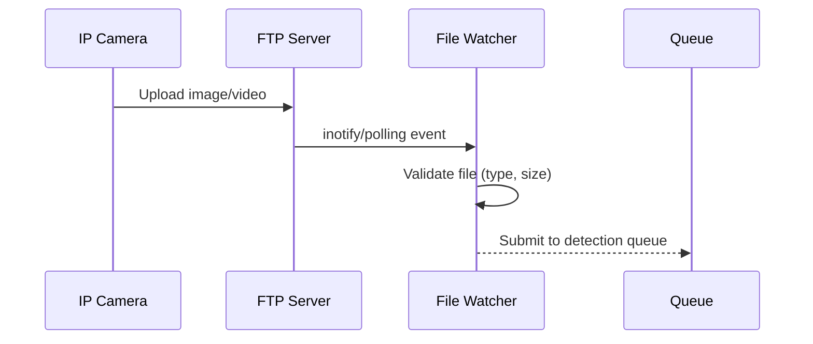

**Panel 2 - Object Detection:**

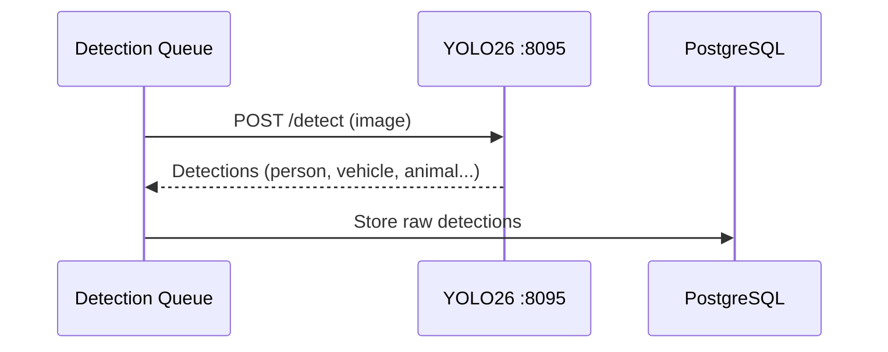

**Panel 3 - Enrichment:**

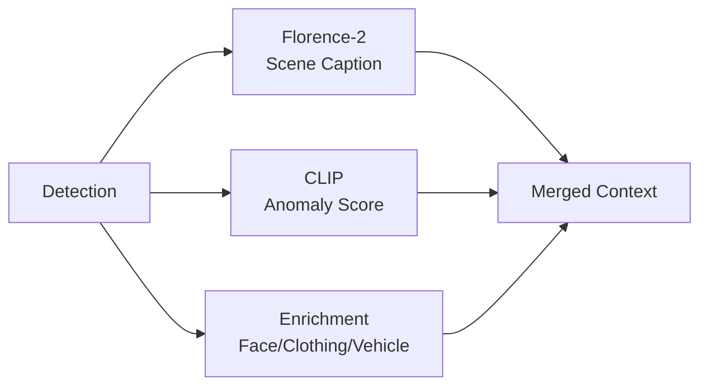

**Panel 4 - Batching:**

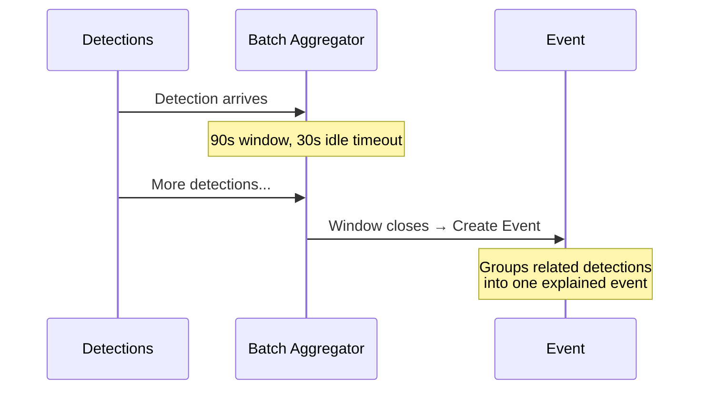

**Panel 5 - AI Reasoning:**

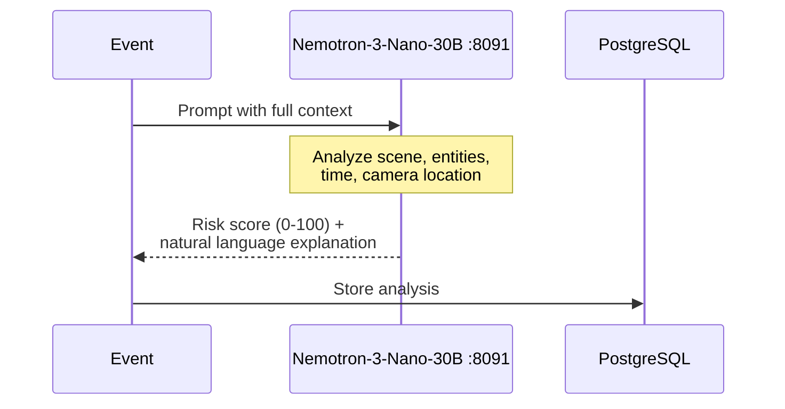

**Panel 6 - Dashboard Alert:**

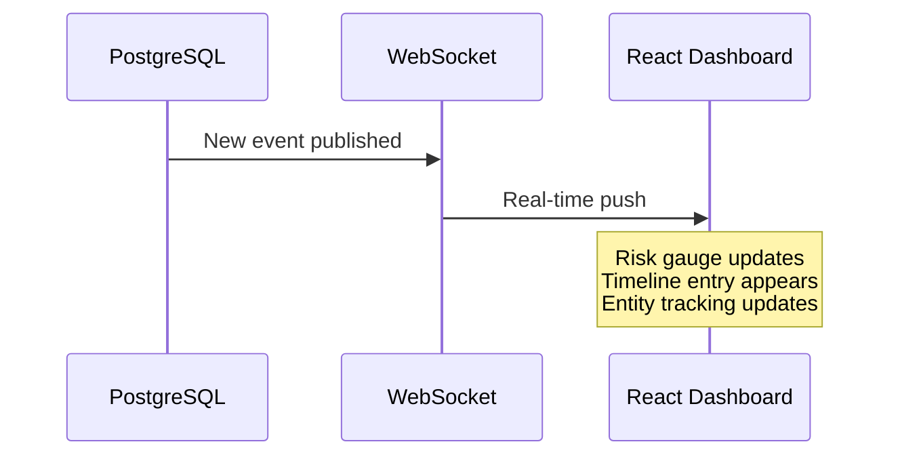

**Step 2: Verify diagrams render locally**

Run: `uv run mkdocs serve`
Expected: All 6 Mermaid diagrams render on the homepage

**Step 3: Commit**

```bash
git add docs/index.md
git commit -m "feat(docs): add 6-panel architecture walkthrough with Mermaid diagrams"
```

---

### Task 6: Create 8 Missing Technical Mermaid Diagrams

**Files:**

- Modify: `docs/architecture/security/README.md` (auth flow)
- Modify: `docs/developer/README.md` or create `docs/architecture/mqtt-integration.md` (MQTT)
- Modify: `docs/developer/api/webhooks.md` (webhook flow)
- Modify: `docs/guides/household-registration.md` (household matching)
- Modify: `docs/ai/model-zoo.md` (VRAM management)
- Modify: `docs/guides/zone-configuration.md` (zone types comparison)
- Modify: `docs/operator/services/ai-enrichment-light.md` or `docs/ai/model-zoo.md` (enrichment split)
- Modify: `docs/operator/README.md` or relevant streaming doc (go2rtc)

**Step 1: Auth flow diagram** in `docs/architecture/security/README.md`

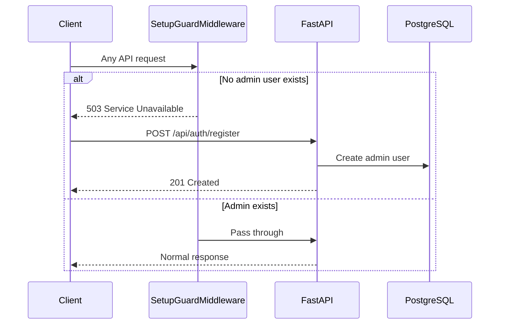

**Step 2: MQTT integration diagram** -- find the right file or create one, add:

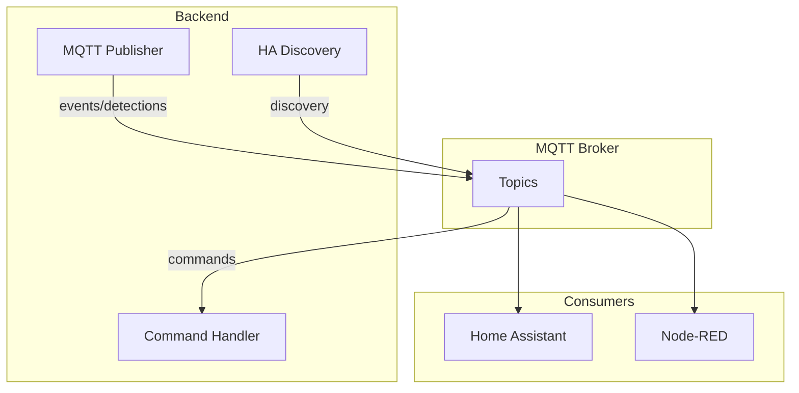

**Step 3: Webhook flow diagram** in `docs/developer/api/webhooks.md`

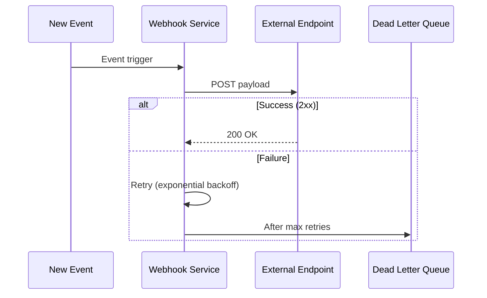

**Step 4: Household matching diagram** in `docs/guides/household-registration.md`

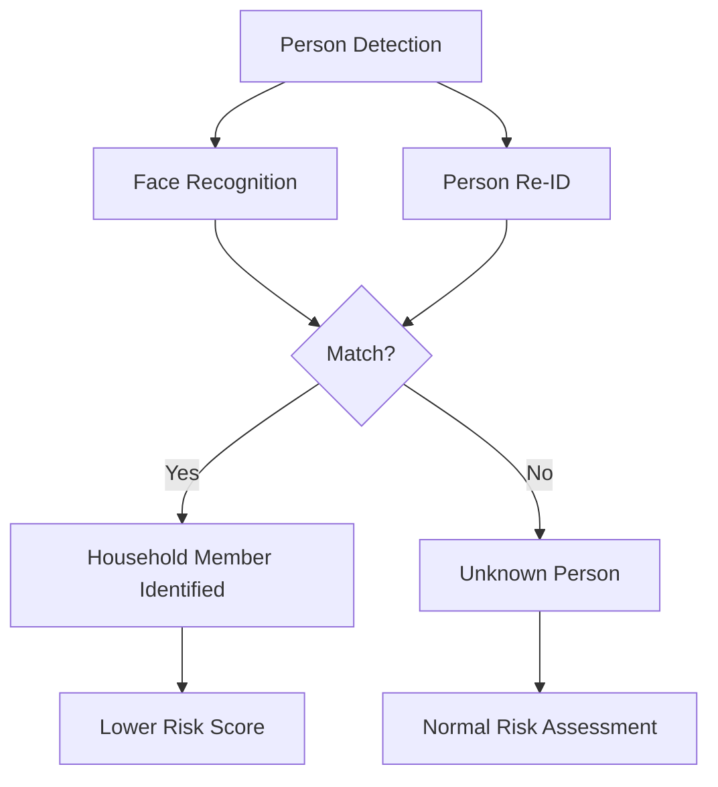

**Step 5: VRAM management diagram** in `docs/ai/model-zoo.md`

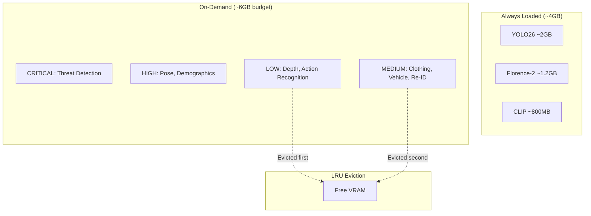

**Step 6: Zone types diagram** in `docs/guides/zone-configuration.md`

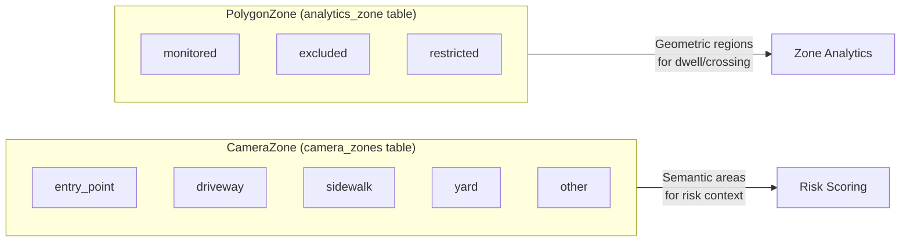

**Step 7: Enrichment split diagram** in `docs/ai/model-zoo.md`

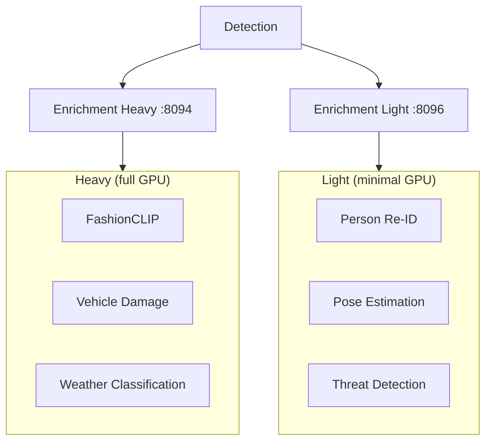

**Step 8: go2rtc diagram** in appropriate operator/streaming doc

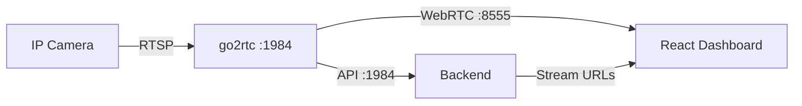

**Step 9: Verify all diagrams render**

Run: `uv run mkdocs serve`
Expected: All 8 diagrams render in their respective pages

**Step 10: Commit**

```bash
git add docs/
git commit -m "feat(docs): add 8 missing architecture Mermaid diagrams"
```

---

### Task 7: Create Content Deduplication Snippets

**Files:**

- Create: `docs/_includes/risk-scoring-levels.md`
- Create: `docs/_includes/batching-config.md`
- Create: `docs/_includes/websocket-channels.md`
- Create: `docs/_includes/auth-model.md`
- Create: `docs/_includes/vram-requirements.md`
- Modify: Files that currently duplicate this content (replace inline content with snippet includes)

**Step 1: Create docs/\_includes/ directory and snippet files**

Extract canonical content from the primary source file for each topic:

- Risk scoring: Extract the 0-29/30-59/60-79/80-100 risk level table from `docs/architecture/ai-pipeline.md`
- Batching: Extract the 90s window / 30s idle timeout description from `docs/architecture/ai-pipeline.md`
- WebSocket channels: Extract the channel table from `docs/architecture/real-time.md`
- Auth model: Write canonical description matching CLAUDE.md (SetupGuardMiddleware, per-route protections)
- VRAM requirements: Extract the VRAM table from `docs/ai/model-zoo.md`

**Step 2: Replace duplicated content in consuming files with snippet includes**

In each file that duplicates the content, replace the inline version with:

```markdown
--8<-- "docs/\_includes/risk-scoring-levels.md"
```

Note: Only replace in files that are primarily consumed via the MkDocs site, not in AGENTS.md or README files that need to be self-contained for GitHub/AI viewing.

**Step 3: Verify snippets render**

Run: `uv run mkdocs serve`
Expected: Pages that use snippets render the included content correctly

**Step 4: Commit**

```bash
git add docs/_includes/ docs/architecture/ docs/ai/
git commit -m "refactor(docs): deduplicate content into _includes/ snippets"
```

---

### Task 8: Final Verification and Cleanup

**Step 1: Full MkDocs build**

Run: `uv run mkdocs build --strict`
Expected: Clean build with no errors (warnings for external links are acceptable)

**Step 2: Verify all hub pages render**

Run: `uv run mkdocs serve` and manually check:

- Homepage with walkthrough panels
- Getting Started hub
- User Guide hub
- Operator Guide hub
- Developer Guide hub
- Architecture section
- AI Model Zoo
- Feature Guides
- Reference section
- Search functionality

**Step 3: Verify Mermaid diagrams render**

Check all 14 Mermaid diagrams (6 walkthrough + 8 technical) render correctly in the browser.

**Step 4: Commit any final tweaks**

```bash
git add -A
git commit -m "docs: finalize MkDocs Material site configuration"
```
