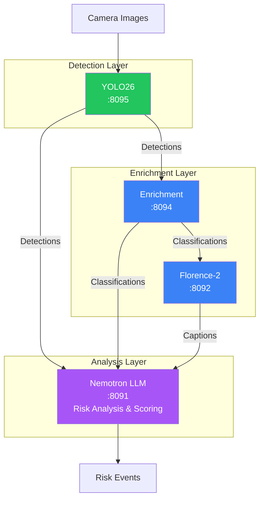

# AI Models Reference

> Canonical reference for all AI models used in the Home Security Intelligence pipeline. This document provides specifications, HuggingFace links, VRAM requirements, and configuration details for each model.

**Target Audiences:** Developers, Operators, ML Engineers

---

## Quick Reference

### Summary Table

| Model                    | Purpose                         | VRAM     | Port | Framework    | Context/Embedding   |
| ------------------------ | ------------------------------- | -------- | ---- | ------------ | ------------------- |
| Nemotron-3-Nano-30B-A3B  | Risk reasoning (production)     | ~14.7 GB | 8091 | llama.cpp    | 131,072 tokens      |
| Nemotron Mini 4B         | Risk reasoning (development)    | ~3 GB    | 8091 | llama.cpp    | 4,096 tokens        |
| YOLO26m                  | Object detection                | ~0.1 GB  | 8090 | Ultralytics  | -                   |
| Florence-2-Large         | Dense captioning, OCR           | ~1.2 GB  | 8092 | HuggingFace  | -                   |
| CLIP ViT-L               | Entity re-ID, anomaly detection | ~0.8 GB  | 8093 | HuggingFace  | 768-dim embedding   |
| FashionSigLIP            | Clothing classification         | ~0.5 GB  | 8094 | OpenCLIP     | Zero-shot           |
| Vehicle Classifier       | Vehicle type classification     | ~1.5 GB  | 8094 | HuggingFace  | 11 classes          |
| Pet Classifier           | Pet detection (dogs, cats)      | ~0.2 GB  | 8094 | HuggingFace  | 2 classes           |
| Depth Anything V2        | Depth estimation                | ~0.15 GB | 8094 | HuggingFace  | Monocular depth     |
| ViTPose+ Small           | Human pose estimation           | ~1.5 GB  | 8094 | HuggingFace  | 17 keypoints (COCO) |
| YOLO11 License Plate     | License plate detection         | ~0.3 GB  | 8094 | Ultralytics  | -                   |
| YOLO11 Face              | Face detection                  | ~0.2 GB  | 8094 | Ultralytics  | -                   |
| PaddleOCR                | OCR text extraction             | ~0.1 GB  | 8094 | PaddlePaddle | -                   |
| YOLO-World-S             | Open-vocabulary detection       | ~1.5 GB  | 8094 | Ultralytics  | Zero-shot           |
| Violence Detection       | Violence classification         | ~0.5 GB  | 8094 | HuggingFace  | Binary              |
| Weather Classification   | Weather condition detection     | ~0.2 GB  | 8094 | HuggingFace  | 5 classes           |
| SegFormer B2 Clothes     | Clothing segmentation           | ~1.5 GB  | 8094 | HuggingFace  | 18 categories       |
| X-CLIP Base              | Temporal action recognition     | ~2.0 GB  | 8094 | HuggingFace  | Video sequences     |
| BRISQUE Quality          | Image quality assessment        | 0 (CPU)  | 8094 | piq          | No-reference        |
| Vehicle Damage Detection | Vehicle damage segmentation     | ~2.0 GB  | 8094 | Ultralytics  | 6 damage types      |
| OSNet-x0-25              | Person re-identification        | ~0.1 GB  | 8094 | torchreid    | 512-dim embedding   |
| Threat Detection YOLOv8n | Weapon/threat detection         | ~0.3 GB  | 8094 | Ultralytics  | -                   |
| ViT Age Classifier       | Age estimation                  | ~0.2 GB  | 8094 | HuggingFace  | 7 age ranges        |
| ViT Gender Classifier    | Gender classification           | ~0.2 GB  | 8094 | HuggingFace  | Binary              |
| YOLOv8n Pose             | Alternative pose estimation     | ~0.2 GB  | 8094 | Ultralytics  | 17 keypoints        |

---

## Core Models

### Nemotron-3-Nano-30B-A3B (Production LLM)

The production model for AI-driven risk reasoning and security analysis. Uses NVIDIA's state-of-the-art reasoning model with massive context capability.

| Specification      | Value                                                                                             |
| ------------------ | ------------------------------------------------------------------------------------------------- |
| **HuggingFace**    | [nvidia/Nemotron-3-Nano-30B-A3B-GGUF](https://huggingface.co/nvidia/Nemotron-3-Nano-30B-A3B-GGUF) |
| **Filename**       | `Nemotron-3-Nano-30B-A3B-Q4_K_M.gguf`                                                             |
| **Parameters**     | 30 billion (A3B active routing variant)                                                           |
| **Architecture**   | Transformer with Mixture-of-Experts (MoE) routing                                                 |
| **Quantization**   | Q4_K_M (4-bit, medium quality)                                                                    |
| **File Size**      | ~18 GB                                                                                            |
| **VRAM Required**  | ~14.7 GB                                                                                          |
| **Context Window** | 131,072 tokens (128K)                                                                             |
| **Format**         | ChatML with `<\|im_start\|>` / `<\|im_end\|>` delimiters                                          |
| **Server**         | llama.cpp with CUDA                                                                               |
| **Port**           | 8091                                                                                              |
| **Inference Time** | 2-5 seconds per analysis                                                                          |

**Purpose in Pipeline:**

- Analyzes batches of object detections from YOLO26
- Generates risk scores (0-100) and natural language summaries
- Considers zone analysis, baseline comparison, and cross-camera correlation
- Processes enrichment data (clothing, vehicles, behavior, scene descriptions)

**Why 128K Context Matters:**

- Analyze all detections across extended time windows (hours of activity)
- Include rich historical baselines ("Is this normal for 3am on Tuesday?")
- Correlate activity across multiple cameras in a single prompt
- Process detailed enrichment data from the model zoo

**Environment Variables:**

| Variable     | Default                                       | Description         |
| ------------ | --------------------------------------------- | ------------------- |
| `MODEL_PATH` | `/models/Nemotron-3-Nano-30B-A3B-Q4_K_M.gguf` | GGUF model path     |
| `PORT`       | `8091`                                        | Server port         |
| `GPU_LAYERS` | `35`                                          | Layers on GPU       |
| `CTX_SIZE`   | `131072`                                      | Context window size |
| `PARALLEL`   | `1`                                           | Parallel requests   |

---

### Nemotron Mini 4B Instruct (Development LLM)

A smaller, faster model for development and resource-constrained environments.

| Specification      | Value                                                                                                       |
| ------------------ | ----------------------------------------------------------------------------------------------------------- |
| **HuggingFace**    | [bartowski/nemotron-mini-4b-instruct-GGUF](https://huggingface.co/bartowski/nemotron-mini-4b-instruct-GGUF) |
| **Filename**       | `nemotron-mini-4b-instruct-q4_k_m.gguf`                                                                     |
| **Parameters**     | 4 billion                                                                                                   |
| **Quantization**   | Q4_K_M (4-bit, medium quality)                                                                              |
| **File Size**      | ~2.5 GB                                                                                                     |
| **VRAM Required**  | ~3 GB                                                                                                       |
| **Context Window** | 4,096 tokens                                                                                                |
| **Format**         | ChatML with `<\|im_start\|>` / `<\|im_end\|>` delimiters                                                    |
| **Server**         | llama.cpp with CUDA                                                                                         |
| **Port**           | 8091                                                                                                        |
| **Inference Time** | 1-3 seconds per analysis                                                                                    |

**Use Cases:**

- Local development without high-end GPU
- Testing prompt templates and integration flows
- CI/CD pipeline testing (faster iteration)

---

### YOLO26 (Object Detection)

Real-time object detection using CNN architecture optimized for speed with TensorRT FP16 inference.

| Specification      | Value                                                     |
| ------------------ | --------------------------------------------------------- |
| **Source**         | [Ultralytics](https://github.com/ultralytics/ultralytics) |
| **Architecture**   | YOLO26 (CNN-based, NMS-free)                              |
| **Training Data**  | COCO                                                      |
| **VRAM Required**  | ~0.1 GB (TensorRT FP16)                                   |
| **Port**           | 8090                                                      |
| **Inference Time** | 5-6ms per image on RTX A5500 (TensorRT FP16)              |
| **Framework**      | Ultralytics + TensorRT                                    |

**Model Variants:**

| Model   | Parameters | Size    | FPS | Best For                |
| ------- | ---------- | ------- | --- | ----------------------- |
| yolo26n | 2.57M      | 5.3 MB  | 223 | Maximum throughput      |
| yolo26s | 10.01M     | 19.5 MB | 206 | Balanced speed/accuracy |
| yolo26m | 21.90M     | 42.2 MB | 174 | Best accuracy (default) |

**Security-Relevant Classes (9 total):**

```python
SECURITY_CLASSES = {
    "person", "car", "truck", "dog", "cat",
    "bird", "bicycle", "motorcycle", "bus"
}
```

**Purpose in Pipeline:**

- First stage of the AI pipeline
- Processes incoming camera images
- Outputs bounding boxes, class labels, and confidence scores
- Filters detections to security-relevant classes only

**Environment Variables:**

| Variable            | Default                                      | Description              |
| ------------------- | -------------------------------------------- | ------------------------ |
| `YOLO26_MODEL_PATH` | `/models/yolo26/exports/yolo26m_fp16.engine` | TensorRT engine path     |
| `YOLO26_CONFIDENCE` | `0.5`                                        | Min confidence threshold |
| `HOST`              | `0.0.0.0`                                    | Bind address             |
| `PORT`              | `8090`                                       | Server port              |

---

## Enrichment Models

These models run in the Enrichment service (port 8094) and provide additional context for detected objects.

### Florence-2-Large (Dense Captioning)

Vision-language model for extracting detailed visual attributes from security camera images.

| Specification      | Value                                                                           |
| ------------------ | ------------------------------------------------------------------------------- |
| **HuggingFace**    | [microsoft/Florence-2-large](https://huggingface.co/microsoft/Florence-2-large) |
| **Architecture**   | Vision-language transformer with task-specific prompts                          |
| **VRAM Required**  | ~1.2 GB                                                                         |
| **Port**           | 8092                                                                            |
| **Inference Time** | 100-300ms per query                                                             |
| **Framework**      | HuggingFace Transformers                                                        |

**Supported Prompts:**

| Prompt                    | Output                        | Use Case                     |
| ------------------------- | ----------------------------- | ---------------------------- |
| `<CAPTION>`               | Brief 1-sentence description  | Quick scene summary          |
| `<DETAILED_CAPTION>`      | Detailed paragraph            | Event logging                |
| `<MORE_DETAILED_CAPTION>` | Very detailed multi-paragraph | Full scene analysis          |
| `<OD>`                    | Objects with bounding boxes   | Object localization          |
| `<DENSE_REGION_CAPTION>`  | Caption per detected region   | Detailed scene understanding |
| `<OCR>`                   | Detected text                 | License plates, signs        |
| `<OCR_WITH_REGION>`       | Text with bounding boxes      | Text localization            |

**Purpose in Pipeline:**

- Scene understanding and captioning
- License plate and sign text extraction (OCR)
- Detailed attribute extraction for Nemotron risk analysis

**Environment Variables:**

| Variable              | Default                    | Description            |
| --------------------- | -------------------------- | ---------------------- |
| `FLORENCE_MODEL_PATH` | `/models/florence-2-large` | HuggingFace model path |
| `PORT`                | `8092`                     | Server port            |

---

### CLIP ViT-L (Vision-Language)

Generates 768-dimensional embeddings for entity re-identification and scene anomaly detection.

| Specification     | Value                                                                                 |
| ----------------- | ------------------------------------------------------------------------------------- |
| **HuggingFace**   | [openai/clip-vit-large-patch14](https://huggingface.co/openai/clip-vit-large-patch14) |
| **Architecture**  | ViT-L/14 (Vision Transformer Large, patch 14)                                         |
| **VRAM Required** | ~0.8 GB                                                                               |
| **Port**          | 8093                                                                                  |
| **Embedding Dim** | 768 floats (L2-normalized)                                                            |
| **Framework**     | HuggingFace Transformers                                                              |

**Use Cases:**

1. **Entity Re-identification**: Track the same person or vehicle across multiple cameras using embedding similarity
2. **Scene Anomaly Detection**: Compare current frame embedding against baseline to detect unusual changes
3. **Zero-shot Classification**: Classify images against text labels without retraining

**Environment Variables:**

| Variable          | Default              | Description            |
| ----------------- | -------------------- | ---------------------- |
| `CLIP_MODEL_PATH` | `/models/clip-vit-l` | HuggingFace model path |
| `PORT`            | `8093`               | Server port            |

---

### FashionSigLIP (Clothing Classification)

Zero-shot clothing classifier for identifying suspicious clothing patterns (hoodies, face coverings) and service uniforms. Uses Marqo FashionSigLIP for 57% improved accuracy over FashionCLIP.

| Specification     | Value                                                                         |
| ----------------- | ----------------------------------------------------------------------------- |
| **HuggingFace**   | [Marqo/marqo-fashionSigLIP](https://huggingface.co/Marqo/marqo-fashionSigLIP) |
| **Architecture**  | SigLIP fine-tuned on fashion dataset                                          |
| **VRAM Required** | ~0.5 GB                                                                       |
| **Port**          | 8094 (Enrichment service)                                                     |
| **Framework**     | OpenCLIP                                                                      |

**Performance Improvement over FashionCLIP:**

- Text-to-Image MRR: 0.239 vs 0.165 (45% improvement)
- Text-to-Image Recall@1: 0.121 vs 0.077 (57% improvement)
- Text-to-Image Recall@10: 0.340 vs 0.249 (37% improvement)

**Security-Focused Clothing Prompts:**

```python
SECURITY_CLOTHING_PROMPTS = [
    "person wearing dark hoodie",
    "person wearing face mask",
    "person wearing ski mask or balaclava",
    "delivery uniform", "Amazon delivery vest",
    "FedEx uniform", "UPS uniform", "USPS postal worker uniform",
    "casual clothing", "business attire or suit", ...
]
```

**Purpose in Pipeline:**

- Identify suspicious clothing (dark hoodies, face coverings)
- Detect service workers (delivery uniforms) for lower risk scoring
- Provide clothing attributes to Nemotron for context-aware analysis

---

### Vehicle Classifier

Classifies vehicle types from cropped detection images.

| Specification     | Value                                                                                                                                           |
| ----------------- | ----------------------------------------------------------------------------------------------------------------------------------------------- |
| **HuggingFace**   | [lxyuan/vit-base-patch16-224-vehicle-segment-classification](https://huggingface.co/lxyuan/vit-base-patch16-224-vehicle-segment-classification) |
| **Architecture**  | ViT-Base fine-tuned for vehicle classification                                                                                                  |
| **VRAM Required** | ~1.5 GB                                                                                                                                         |
| **Port**          | 8094 (Enrichment service)                                                                                                                       |
| **Framework**     | HuggingFace Transformers                                                                                                                        |

**Vehicle Classes (11 total):**

```python
VEHICLE_SEGMENT_CLASSES = [
    "articulated_truck", "background", "bicycle", "bus", "car",
    "motorcycle", "non_motorized_vehicle", "pedestrian",
    "pickup_truck", "single_unit_truck", "work_van"
]
```

**Purpose in Pipeline:**

- Distinguish between personal vehicles and commercial vehicles
- Identify delivery vehicles (work vans, trucks) for context
- Provide vehicle type to Nemotron for risk assessment

---

### Pet Classifier

Classifies detected animals as cats or dogs (household pets).

| Specification     | Value                                                             |
| ----------------- | ----------------------------------------------------------------- |
| **HuggingFace**   | [microsoft/resnet-18](https://huggingface.co/microsoft/resnet-18) |
| **Architecture**  | ResNet-18 (fine-tuned or base for transfer)                       |
| **VRAM Required** | ~0.2 GB                                                           |
| **Port**          | 8094 (Enrichment service)                                         |
| **Framework**     | HuggingFace Transformers                                          |

**Purpose in Pipeline:**

- Identify household pets to reduce false positives
- Distinguish resident pets from wildlife
- Filter pet detections from security alerts

---

### Depth Anything V2

Monocular depth estimation for understanding spatial relationships in camera images.

| Specification     | Value                                                                                                         |
| ----------------- | ------------------------------------------------------------------------------------------------------------- |
| **HuggingFace**   | [depth-anything/Depth-Anything-V2-Small-hf](https://huggingface.co/depth-anything/Depth-Anything-V2-Small-hf) |
| **Architecture**  | DINOv2-based depth estimation                                                                                 |
| **VRAM Required** | ~0.15 GB                                                                                                      |
| **Port**          | 8094 (Enrichment service)                                                                                     |
| **Framework**     | HuggingFace Transformers                                                                                      |

**Purpose in Pipeline:**

- Estimate distance to detected objects
- Understand spatial relationships (near entry point, far from camera)
- Provide proximity context to Nemotron ("person approaching front door")

**Environment Variables:**

| Variable           | Default                           | Description |
| ------------------ | --------------------------------- | ----------- |
| `DEPTH_MODEL_PATH` | `/models/depth-anything-v2-small` | Model path  |

---

### ViTPose+ Small (Pose Estimation)

Human pose estimation for posture analysis and security-relevant behavior detection.

| Specification     | Value                                                                                         |
| ----------------- | --------------------------------------------------------------------------------------------- |
| **HuggingFace**   | [usyd-community/vitpose-plus-small](https://huggingface.co/usyd-community/vitpose-plus-small) |
| **Architecture**  | ViTPose+ (Vision Transformer for Pose)                                                        |
| **VRAM Required** | Loaded on-demand                                                                              |
| **Port**          | 8094 (Enrichment service)                                                                     |
| **Framework**     | HuggingFace Transformers                                                                      |

**COCO Keypoints (17):**

```python
COCO_KEYPOINT_NAMES = [
    "nose", "left_eye", "right_eye", "left_ear", "right_ear",
    "left_shoulder", "right_shoulder", "left_elbow", "right_elbow",
    "left_wrist", "right_wrist", "left_hip", "right_hip",
    "left_knee", "right_knee", "left_ankle", "right_ankle"
]
```

**Posture Classifications:**

| Posture      | Description                    |
| ------------ | ------------------------------ |
| `standing`   | Upright posture                |
| `walking`    | Movement detected              |
| `running`    | Fast movement                  |
| `sitting`    | Seated position                |
| `crouching`  | Low position (security alert)  |
| `lying_down` | On ground (medical emergency?) |
| `unknown`    | Cannot determine               |

**Security Alerts:**

| Alert             | Interpretation                       |
| ----------------- | ------------------------------------ |
| `crouching`       | Potential hiding/break-in behavior   |
| `lying_down`      | Possible medical emergency           |
| `hands_raised`    | Potential surrender/robbery scenario |
| `fighting_stance` | Aggressive posture                   |

---

### YOLO11 License Plate Detection

Detects license plates on vehicles for OCR text extraction.

| Specification     | Value                                       |
| ----------------- | ------------------------------------------- |
| **Model**         | Custom YOLO11 fine-tuned for license plates |
| **Architecture**  | YOLOv11n detection                          |
| **VRAM Required** | ~0.3 GB                                     |
| **Port**          | 8094 (Enrichment service)                   |
| **Framework**     | Ultralytics                                 |

**Purpose in Pipeline:**

- Detect license plate regions on vehicle detections
- Extract plate crops for OCR processing
- Provide plate locations for downstream text extraction

---

### YOLO11 Face Detection

Detects faces on person detections for demographic analysis and re-identification.

| Specification     | Value                                       |
| ----------------- | ------------------------------------------- |
| **Model**         | Custom YOLO11 fine-tuned for face detection |
| **Architecture**  | YOLOv11n detection                          |
| **VRAM Required** | ~0.2 GB                                     |
| **Port**          | 8094 (Enrichment service)                   |
| **Framework**     | Ultralytics                                 |

**Purpose in Pipeline:**

- Detect face regions on person detections
- Extract face crops for age/gender classification
- Enable face-based re-identification across cameras

---

### PaddleOCR

Optical Character Recognition for extracting text from license plates and signs.

| Specification     | Value                                                         |
| ----------------- | ------------------------------------------------------------- |
| **Model**         | [PaddleOCR](https://github.com/PaddlePaddle/PaddleOCR)        |
| **Architecture**  | PP-OCRv4 (detection + recognition + direction classification) |
| **VRAM Required** | ~0.1 GB                                                       |
| **Port**          | 8094 (Enrichment service)                                     |
| **Framework**     | PaddlePaddle                                                  |

**Purpose in Pipeline:**

- Extract text from detected license plates
- Read text on signs and packages (delivery identification)
- Provide textual context for Nemotron analysis

**Note:** Optional dependency. OCR features disabled if PaddlePaddle not installed.

---

### YOLO-World-S (Open-Vocabulary Detection)

Zero-shot object detection using text prompts for security-relevant objects not in COCO.

| Specification     | Value                                                   |
| ----------------- | ------------------------------------------------------- |
| **Model**         | [YOLO-World-S](https://github.com/AILab-CVC/YOLO-World) |
| **Architecture**  | YOLO with vision-language pre-training                  |
| **VRAM Required** | ~1.5 GB                                                 |
| **Port**          | 8094 (Enrichment service)                               |
| **Framework**     | Ultralytics                                             |

**Purpose in Pipeline:**

- Detect objects not in COCO dataset (knives, packages, tools)
- Enable text-prompt-based detection for custom security scenarios
- Zero-shot detection without model retraining

**Security Prompts:**

```python
SECURITY_PROMPTS = [
    "knife", "gun", "weapon", "package", "box",
    "backpack", "suitcase", "crowbar", "flashlight"
]
```

---

### Violence Detection

Binary classification for detecting violent content in video frames.

| Specification     | Value                                      |
| ----------------- | ------------------------------------------ |
| **Model**         | Custom ViT violence classifier             |
| **Architecture**  | Vision Transformer (ViT) binary classifier |
| **VRAM Required** | ~0.5 GB                                    |
| **Accuracy**      | 98.80% reported                            |
| **Port**          | 8094 (Enrichment service)                  |
| **Framework**     | HuggingFace Transformers                   |

**Purpose in Pipeline:**

- Detect violent activity when 2+ persons detected
- Trigger high-priority alerts for physical altercations
- Provide violence context for Nemotron risk analysis

**Output:**

```json
{
  "is_violent": true,
  "confidence": 0.94,
  "label": "violence"
}
```

---

### Weather Classification

Classifies weather conditions for environmental context in risk assessment.

| Specification     | Value                                        |
| ----------------- | -------------------------------------------- |
| **Model**         | SigLIP-based weather classifier              |
| **Architecture**  | Vision-language model fine-tuned for weather |
| **VRAM Required** | ~0.2 GB                                      |
| **Port**          | 8094 (Enrichment service)                    |
| **Framework**     | HuggingFace Transformers                     |

**Weather Classes (5):**

```python
WEATHER_CLASSES = [
    "cloudy/overcast",
    "foggy/hazy",
    "rain/storm",
    "snow/frosty",
    "sun/clear"
]
```

**Purpose in Pipeline:**

- Provide environmental context for risk calibration
- Adjust visibility expectations (foggy = reduced detection confidence)
- Runs once per batch on full frame (not per detection)

---

### SegFormer B2 Clothes

Semantic segmentation of clothing and body parts for person description and re-identification.

| Specification     | Value                                                                                     |
| ----------------- | ----------------------------------------------------------------------------------------- |
| **HuggingFace**   | [mattmdjaga/segformer_b2_clothes](https://huggingface.co/mattmdjaga/segformer_b2_clothes) |
| **Architecture**  | SegFormer B2 semantic segmentation                                                        |
| **VRAM Required** | ~1.5 GB                                                                                   |
| **Port**          | 8094 (Enrichment service)                                                                 |
| **Framework**     | HuggingFace Transformers                                                                  |

**Clothing Categories (18):**

```python
CLOTHING_CATEGORIES = [
    "Background", "Hat", "Hair", "Sunglasses", "Upper-clothes",
    "Skirt", "Pants", "Dress", "Belt", "Left-shoe", "Right-shoe",
    "Face", "Left-leg", "Right-leg", "Left-arm", "Right-arm",
    "Bag", "Scarf"
]
```

**Purpose in Pipeline:**

- Enable clothing-based person matching across cameras
- Detect suspicious attire (masks, gloves, all-black)
- Provide detailed person descriptions for Nemotron

---

### X-CLIP Base (Temporal Action Recognition)

Video-based action classification using multiple frames for temporal understanding.

| Specification     | Value                                                                               |
| ----------------- | ----------------------------------------------------------------------------------- |
| **HuggingFace**   | [microsoft/xclip-base-patch32](https://huggingface.co/microsoft/xclip-base-patch32) |
| **Architecture**  | X-CLIP (CLIP extended for video understanding)                                      |
| **VRAM Required** | ~2.0 GB                                                                             |
| **Port**          | 8094 (Enrichment service)                                                           |
| **Framework**     | HuggingFace Transformers                                                            |

**Purpose in Pipeline:**

- Classify security-relevant actions from video sequences
- Detect loitering, approaching door, running away
- Analyze behavior patterns over multiple frames

**Security Actions:**

```python
SECURITY_ACTIONS = [
    "loitering", "approaching door", "running away",
    "suspicious behavior", "fighting", "falling",
    "walking normally", "standing still"
]
```

---

### BRISQUE Image Quality Assessment

No-reference image quality metric for detecting camera tampering or motion blur.

| Specification     | Value                                               |
| ----------------- | --------------------------------------------------- |
| **Library**       | [piq](https://github.com/photosynthesis-team/piq)   |
| **Architecture**  | BRISQUE (Blind/Referenceless Image Spatial Quality) |
| **VRAM Required** | 0 (CPU-based)                                       |
| **Port**          | 8094 (Enrichment service)                           |
| **Framework**     | piq (NumPy-based)                                   |

**Purpose in Pipeline:**

- Detect camera obstruction or tampering (sudden quality drop)
- Identify motion blur (fast movement detection)
- Monitor general quality degradation (noise, artifacts)

**Output:**

```json
{
  "brisque_score": 23.5,
  "quality_label": "good",
  "is_degraded": false
}
```

**Score Interpretation:**

- 0-20: Excellent quality
- 20-40: Good quality
- 40-60: Fair quality
- 60+: Poor quality (potential tampering)

---

### Vehicle Damage Detection

Segmentation model for detecting various types of vehicle damage.

| Specification     | Value                                  |
| ----------------- | -------------------------------------- |
| **Model**         | Custom YOLOv11x-seg for vehicle damage |
| **Architecture**  | YOLOv11x instance segmentation         |
| **VRAM Required** | ~2.0 GB                                |
| **Port**          | 8094 (Enrichment service)              |
| **Framework**     | Ultralytics                            |

**Damage Classes (6):**

```python
DAMAGE_CLASSES = [
    "cracks",
    "dents",
    "glass_shatter",
    "lamp_broken",
    "scratches",
    "tire_flat"
]
```

**Purpose in Pipeline:**

- Detect suspicious vehicle damage (glass_shatter + lamp_broken at night = break-in)
- Monitor for vandalism or accidents in parking areas
- Provide damage context for security incidents

---

### OSNet-x0-25 (Person Re-identification)

Lightweight model for generating person embeddings for cross-camera tracking.

| Specification     | Value                                 |
| ----------------- | ------------------------------------- |
| **Model**         | OSNet-x0.25 (Omni-Scale Network)      |
| **Architecture**  | Lightweight CNN for re-identification |
| **VRAM Required** | ~0.1 GB                               |
| **Embedding Dim** | 512 floats (L2-normalized)            |
| **Port**          | 8094 (Enrichment service)             |
| **Framework**     | torchreid                             |

**Purpose in Pipeline:**

- Generate 512-dimensional embeddings for person tracking
- Match individuals across multiple cameras
- Enable temporal tracking of persons throughout property

**Output:**

```json
{
  "embedding": [0.123, -0.456, ...],
  "embedding_dimension": 512,
  "model": "osnet_x0_25"
}
```

---

### Threat Detection YOLOv8n

Weapon and threat object detection for high-priority security alerts.

| Specification     | Value                                                                                       |
| ----------------- | ------------------------------------------------------------------------------------------- |
| **HuggingFace**   | [Subh775/Threat-Detection-YOLOv8n](https://huggingface.co/Subh775/Threat-Detection-YOLOv8n) |
| **Architecture**  | YOLOv8n detection                                                                           |
| **VRAM Required** | ~0.3 GB                                                                                     |
| **Port**          | 8094 (Enrichment service)                                                                   |
| **Framework**     | Ultralytics                                                                                 |

**Threat Classes:**

```python
THREAT_CLASSES = [
    "knife", "gun", "pistol", "rifle",
    "bat", "hammer", "crowbar"
]
```

**Purpose in Pipeline:**

- Detect weapons on full frame when suspicious activity detected
- Trigger immediate critical-priority alerts
- Highest priority model (never evicted from memory)

---

### ViT Age Classifier

Age range estimation from face or person crops.

| Specification     | Value                                 |
| ----------------- | ------------------------------------- |
| **Model**         | ViT-based age classifier              |
| **Architecture**  | Vision Transformer for classification |
| **VRAM Required** | ~0.2 GB                               |
| **Port**          | 8094 (Enrichment service)             |
| **Framework**     | HuggingFace Transformers              |

**Age Range Brackets (7):**

```python
AGE_RANGES = [
    "0-12",   # child
    "13-17",  # teenager
    "18-24",  # young adult
    "25-35",  # adult
    "36-50",  # middle-aged
    "51-65",  # mature adult
    "65+"     # senior
]
```

**Purpose in Pipeline:**

- Provide demographic context for person descriptions
- Combined with gender for comprehensive person profiles
- Support security analysis (child alone, unusual age for time)

---

### ViT Gender Classifier

Gender classification from face or person crops.

| Specification     | Value                                        |
| ----------------- | -------------------------------------------- |
| **Model**         | ViT-based gender classifier                  |
| **Architecture**  | Vision Transformer for binary classification |
| **VRAM Required** | ~0.2 GB                                      |
| **Port**          | 8094 (Enrichment service)                    |
| **Framework**     | HuggingFace Transformers                     |

**Output:**

```json
{
  "gender": "male",
  "confidence": 0.94
}
```

**Purpose in Pipeline:**

- Complete demographic profile for person descriptions
- Support cross-camera person matching
- Provide gender context for security reports

---

### YOLOv8n Pose (Alternative Pose Estimation)

Alternative pose estimation model for backup or faster inference scenarios.

| Specification     | Value                            |
| ----------------- | -------------------------------- |
| **Model**         | YOLOv8n-pose                     |
| **Architecture**  | YOLOv8 with pose estimation head |
| **VRAM Required** | ~0.2 GB                          |
| **Keypoints**     | 17 COCO keypoints                |
| **Port**          | 8094 (Enrichment service)        |
| **Framework**     | Ultralytics                      |

**Purpose in Pipeline:**

- Backup to ViTPose+ for pose detection
- Faster inference when ViTPose unavailable
- Same 17 COCO keypoint output format

---

## VRAM Requirements Summary

### Production Configuration (All Services)

| Service    | Models                       | VRAM       |
| ---------- | ---------------------------- | ---------- |
| Nemotron   | Nemotron-3-Nano-30B-A3B      | ~14.7 GB   |
| YOLO26     | YOLO26m (TensorRT FP16)      | ~0.1 GB    |
| Florence-2 | Florence-2-Large             | ~1.2 GB    |
| CLIP       | CLIP ViT-L                   | ~0.8 GB    |
| Enrichment | On-demand models (see below) | ~6.8 GB    |
| **Total**  |                              | **~24 GB** |

### Enrichment Service Model VRAM (On-Demand)

Models are loaded on-demand with LRU eviction. Maximum concurrent VRAM: ~6.8 GB.

| Model                          | VRAM (MB) | Category         | Priority |
| ------------------------------ | --------- | ---------------- | -------- |
| yolo11-license-plate           | 300       | detection        | MEDIUM   |
| yolo11-face                    | 200       | detection        | HIGH     |
| paddleocr                      | 100       | ocr              | MEDIUM   |
| clip-vit-l                     | 800       | embedding        | HIGH     |
| yolo-world-s                   | 1500      | detection        | MEDIUM   |
| vitpose-small                  | 1500      | pose             | HIGH     |
| depth-anything-v2-small        | 150       | depth-estimation | LOW      |
| violence-detection             | 500       | classification   | HIGH     |
| weather-classification         | 200       | classification   | LOW      |
| segformer-b2-clothes           | 1500      | segmentation     | MEDIUM   |
| xclip-base                     | 2000      | action           | LOW      |
| fashion-clip (FashionSigLIP)   | 500       | classification   | HIGH     |
| brisque-quality                | 0 (CPU)   | quality          | LOW      |
| vehicle-segment-classification | 1500      | classification   | MEDIUM   |
| vehicle-damage-detection       | 2000      | detection        | MEDIUM   |
| pet-classifier                 | 200       | classification   | MEDIUM   |
| osnet-x0-25                    | 100       | embedding        | MEDIUM   |
| threat-detection-yolov8n       | 300       | detection        | CRITICAL |
| vit-age-classifier             | 200       | classification   | HIGH     |
| vit-gender-classifier          | 200       | classification   | HIGH     |
| yolov8n-pose                   | 200       | pose             | MEDIUM   |

### Development Configuration (Minimal)

| Service   | Models                  | VRAM      |
| --------- | ----------------------- | --------- |
| Nemotron  | Nemotron Mini 4B        | ~3 GB     |
| YOLO26    | YOLO26m (TensorRT FP16) | ~0.1 GB   |
| **Total** |                         | **~3 GB** |

### Hardware Recommendations

| Configuration | Recommended GPU      | VRAM  |
| ------------- | -------------------- | ----- |
| Production    | NVIDIA RTX A5500     | 24 GB |
| Production    | NVIDIA RTX 4090      | 24 GB |
| Development   | NVIDIA RTX 3070/4070 | 8 GB  |
| Development   | NVIDIA RTX 3060      | 12 GB |

---

## Model Download

All models are downloaded via the `ai/download_models.sh` script:

```bash
# Download all models to default path (/export/ai_models)
./ai/download_models.sh

# Download to custom path
AI_MODELS_PATH=./models ./ai/download_models.sh
```

### Download Directory Structure

```
${AI_MODELS_PATH}/
├── nemotron/
│   └── nemotron-3-nano-30b-a3b-q4km/
│       └── Nemotron-3-Nano-30B-A3B-Q4_K_M.gguf
└── model-zoo/
    ├── florence-2-large/
    ├── clip-vit-l/
    ├── fashion-clip/
    ├── vehicle-segment-classification/
    ├── pet-classifier/
    └── depth-anything-v2-small/
```

### Manual Downloads

For manual downloads or air-gapped environments:

| Model               | Direct Download                                                                                                              |
| ------------------- | ---------------------------------------------------------------------------------------------------------------------------- |
| Nemotron-3-Nano-30B | [Download GGUF](https://huggingface.co/nvidia/Nemotron-3-Nano-30B-A3B-GGUF/resolve/main/Nemotron-3-Nano-30B-A3B-Q4_K_M.gguf) |
| YOLO26              | Auto-downloaded by HuggingFace on first run                                                                                  |
| Florence-2          | `git clone https://huggingface.co/microsoft/Florence-2-large`                                                                |
| CLIP ViT-L          | `git clone https://huggingface.co/openai/clip-vit-large-patch14`                                                             |
| FashionCLIP         | `git clone https://huggingface.co/patrickjohncyh/fashion-clip`                                                               |
| Depth Anything V2   | `git clone https://huggingface.co/depth-anything/Depth-Anything-V2-Small-hf`                                                 |
| ViTPose+ Small      | `git clone https://huggingface.co/usyd-community/vitpose-plus-small`                                                         |

---

## Environment Variables Reference

### Model Paths

| Variable              | Default Path                                 | Model              |
| --------------------- | -------------------------------------------- | ------------------ |
| `NEMOTRON_GGUF_PATH`  | `/export/ai_models/nemotron/...`             | Nemotron LLM       |
| `YOLO26_MODEL_PATH`   | `/models/yolo26/exports/yolo26m_fp16.engine` | YOLO26             |
| `FLORENCE_MODEL_PATH` | `/models/florence-2-large`                   | Florence-2         |
| `CLIP_MODEL_PATH`     | `/models/clip-vit-l`                         | CLIP ViT-L         |
| `CLOTHING_MODEL_PATH` | `/models/fashion-clip`                       | FashionCLIP        |
| `VEHICLE_MODEL_PATH`  | `/models/vehicle-segment-classification`     | Vehicle Classifier |
| `PET_MODEL_PATH`      | `/models/pet-classifier`                     | Pet Classifier     |
| `DEPTH_MODEL_PATH`    | `/models/depth-anything-v2-small`            | Depth Anything V2  |
| `VITPOSE_MODEL_PATH`  | `/models/vitpose-plus-small`                 | ViTPose+           |

### Service Configuration

| Variable         | Default                 | Description                 |
| ---------------- | ----------------------- | --------------------------- |
| `AI_MODELS_PATH` | `/export/ai_models`     | Base path for all models    |
| `HF_HOME`        | `/cache/huggingface`    | HuggingFace cache directory |
| `YOLO26_URL`     | `http://localhost:8090` | YOLO26 service URL          |
| `NEMOTRON_URL`   | `http://localhost:8091` | Nemotron LLM service URL    |
| `FLORENCE_URL`   | `http://localhost:8092` | Florence-2 service URL      |
| `CLIP_URL`       | `http://localhost:8093` | CLIP service URL            |
| `ENRICHMENT_URL` | `http://localhost:8094` | Enrichment service URL      |

---

## Architecture Overview



### Pipeline Flow

1. **YOLO26**: Detects objects in camera images (30-50ms)
2. **Enrichment**: Classifies detections (vehicle type, clothing, pet, depth, pose)
3. **Florence-2**: Generates scene captions and OCR text (optional)
4. **CLIP**: Entity re-identification across cameras (optional)
5. **Nemotron**: Analyzes enriched detections and generates risk scores (2-5s)

---

## Related Documentation

- [AI Pipeline Architecture](../architecture/ai-pipeline.md)
- [Enrichment Service Documentation](../../ai/enrichment/AGENTS.md)
- [Nemotron LLM Configuration](../../ai/nemotron/AGENTS.md)
- [YOLO26 Detection Server](../../ai/yolo26/AGENTS.md)
- [Risk Levels Configuration](config/risk-levels.md)
- [GPU Troubleshooting](troubleshooting/gpu-issues.md)

---

[Back to Reference Hub](README.md) | [AI Troubleshooting](troubleshooting/ai-issues.md) | [Environment Variables](config/env-reference.md)
