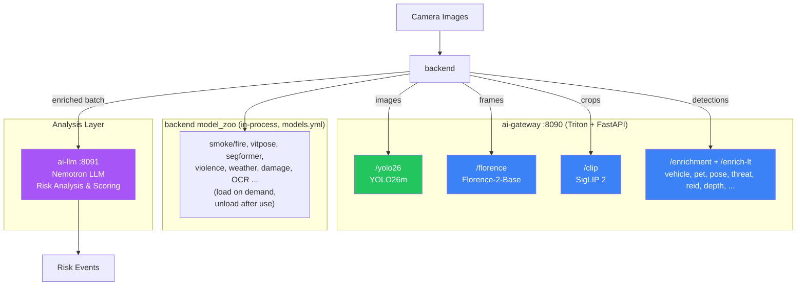

# AI Models Reference

> Canonical reference for all AI models used in the Home Security Intelligence pipeline. This document provides specifications, HuggingFace links, VRAM requirements, and configuration details for each model.

**Target Audiences:** Developers, Operators, ML Engineers

> **Deployment topology:** In production (`docker-compose.prod.yml`) the models are served by two AI services: **ai-gateway** — Triton + FastAPI on port **8090** with routers `/yolo26` `/clip` `/florence` `/enrichment` `/enrich-lt` (`ai/gateway/main.py`) — and **ai-llm** (llama.cpp) on port **8091**. Heavy enrichment models are loaded **in-process by the backend** from `models.yml` via `backend/services/model_zoo.py`. The standalone containers (`ai-yolo26` :8095, `ai-florence` :8092, `ai-clip` :8093, `ai-enrichment` :8094, `ai-enrichment-light` :8096) are built from `ai/*/Dockerfile` but are **not in the production compose file**; their ports are the local-development defaults in `backend/core/config.py`.

---

## Quick Reference

### Summary Table

Service column: **ai-llm** = llama.cpp container (:8091) · **gateway** = Triton via ai-gateway (:8090) · **backend** = loaded in-process by `backend/services/model_zoo.py` from `models.yml`.

| Model                          | Purpose                                  | VRAM     | Service                | Framework    | Context/Embedding            |
| ------------------------------ | ---------------------------------------- | -------- | ---------------------- | ------------ | ---------------------------- |
| Nemotron-3-Nano-30B-A3B        | Risk reasoning (production)              | ~14.7 GB | ai-llm                 | llama.cpp    | 32768/slot (see ai/nemotron) |
| Nemotron Mini 4B               | Risk reasoning (development)             | ~3 GB    | ai-llm                 | llama.cpp    | 4,096 tokens                 |
| YOLO26m                        | Object detection                         | ~0.1 GB  | gateway                | Ultralytics  | -                            |
| Florence-2-Base                | Dense captioning, OCR                    | ~1.0 GB  | gateway                | HuggingFace  | -                            |
| SigLIP 2 Base                  | Entity re-ID, embeddings                 | ~0.2 GB  | gateway + backend      | HuggingFace  | 768-dim embedding            |
| CLIP ViT-L                     | Entity re-ID (legacy standalone)         | ~0.8 GB  | standalone :8093 (dev) | HuggingFace  | 768-dim embedding            |
| FashionSigLIP                  | Clothing classification                  | ~0.5 GB  | gateway + backend      | OpenCLIP     | Zero-shot                    |
| Vehicle Classifier (ResNet-50) | Vehicle type classification              | ~1.5 GB  | gateway + backend      | HuggingFace  | 11 classes                   |
| Pet Classifier                 | Pet detection (dogs, cats)               | ~0.2 GB  | gateway + backend      | HuggingFace  | 2 classes                    |
| Depth Anything V2 Tiny         | Depth estimation                         | ~0.1 GB  | gateway + backend      | HuggingFace  | Monocular depth              |
| ViTPose+ Small                 | Human pose estimation                    | ~1.5 GB  | backend                | HuggingFace  | 17 keypoints (COCO)          |
| YOLO11 License Plate           | License plate detection                  | ~0.3 GB  | backend                | Ultralytics  | -                            |
| YOLO11 Face                    | Face detection                           | ~0.2 GB  | backend                | Ultralytics  | -                            |
| FastALPR                       | End-to-end license plate OCR             | ~28 MB   | backend                | ONNX         | Detection + OCR              |
| PaddleOCR                      | OCR text extraction                      | ~0.1 GB  | backend                | PaddlePaddle | -                            |
| YOLO-World-S                   | Open-vocabulary detection                | ~1.5 GB  | backend                | Ultralytics  | Zero-shot                    |
| Smoke/Fire YOLOv8n             | Smoke and fire detection                 | ~0.35 GB | backend                | Ultralytics  | never evicted                |
| Violence Detection             | Violence classification                  | ~0.5 GB  | backend                | HuggingFace  | Binary                       |
| Weather Classification         | Weather condition detection              | ~0.2 GB  | backend                | HuggingFace  | 5 classes                    |
| SegFormer B2 Clothes           | Clothing segmentation                    | ~1.5 GB  | backend                | HuggingFace  | 18 categories                |
| ST-GCN++                       | Skeleton action recognition              | ~20 MB   | gateway + backend      | ONNX         | 60 classes (NTU60)           |
| X-CLIP Base                    | Temporal action recognition (deprecated) | --       | disabled               | HuggingFace  | Video sequences              |
| BRISQUE Quality                | Image quality assessment                 | 0 (CPU)  | backend                | piq          | No-reference                 |
| Vehicle Damage Detection       | Vehicle damage segmentation              | ~2.0 GB  | backend                | Ultralytics  | 6 damage types               |
| OSNet-AIN x1.0                 | Person re-identification                 | ~0.1 GB  | gateway + backend      | torchreid    | 512-dim embedding            |
| Threat Detection YOLOv8n       | Weapon/threat detection                  | ~0.3 GB  | gateway + backend      | Ultralytics  | -                            |
| ViT Age Classifier             | Age estimation                           | ~0.2 GB  | gateway + backend      | HuggingFace  | age groups                   |
| ViT Gender Classifier          | Gender classification                    | ~0.2 GB  | gateway + backend      | HuggingFace  | Binary                       |
| YOLOv8n Pose                   | Pose estimation (Triton `pose`)          | ~0.2 GB  | gateway + backend      | Ultralytics  | 17 keypoints                 |

---

## Core Models

### Nemotron-3-Nano-30B-A3B (Production LLM)

The production model for AI-driven risk reasoning and security analysis. Uses NVIDIA's state-of-the-art reasoning model with massive context capability.

| Specification      | Value                                                                                                                                                              |
| ------------------ | ------------------------------------------------------------------------------------------------------------------------------------------------------------------ |
| **HuggingFace**    | [unsloth/Nemotron-3-Nano-30B-A3B-GGUF](https://huggingface.co/unsloth/Nemotron-3-Nano-30B-A3B-GGUF) (downloaded by `models.yml` / `setup_lib/model_downloader.py`) |
| **Filename**       | `Nemotron-3-Nano-30B-A3B-Q4_K_M.gguf`                                                                                                                              |
| **Parameters**     | 30 billion total / ~3.5B active (A3B MoE routing)                                                                                                                  |
| **Architecture**   | Hybrid Mamba-Transformer with Mixture-of-Experts (MoE) routing                                                                                                     |
| **Quantization**   | Q4_K_M (4-bit, medium quality)                                                                                                                                     |
| **File Size**      | ~15 GB (models.yml `size_mb: 15073`)                                                                                                                               |
| **VRAM Required**  | ~14.7 GB                                                                                                                                                           |
| **Context Window** | 131,072 tokens model maximum; served window is `CTX_SIZE` (compose: 262,144 total = 8 slots × 32,768)                                                              |
| **Format**         | ChatML with `<\|im_start\|>` / `<\|im_end\|>` delimiters                                                                                                           |
| **Server**         | llama.cpp with CUDA (tag b7972, `ai/nemotron/Dockerfile`)                                                                                                          |
| **Port**           | 8091 (`LLM_PORT`, compose service `ai-llm`)                                                                                                                        |
| **Inference Time** | 2-5 seconds per analysis                                                                                                                                           |

**Purpose in Pipeline:**

- Analyzes batches of object detections from YOLO26
- Generates risk scores (0-100) and natural language summaries
- Considers zone analysis, baseline comparison, and cross-camera correlation
- Processes enrichment data (clothing, vehicles, behavior, scene descriptions)

**Why a large context matters:**

- Analyze all detections across extended time windows (hours of activity)
- Include rich historical baselines ("Is this normal for 3am on Tuesday?")
- Correlate activity across multiple cameras in a single prompt
- Process detailed enrichment data from the model zoo

**Environment Variables:**

| Variable     | Dockerfile default                            | Compose default (`docker-compose.prod.yml`)                      | Description         |
| ------------ | --------------------------------------------- | ---------------------------------------------------------------- | ------------------- |
| `MODEL_PATH` | `/models/Nemotron-3-Nano-30B-A3B-Q4_K_M.gguf` | `${LLM_MODEL_PATH:-/models/Nemotron-3-Nano-30B-A3B-Q4_K_M.gguf}` | GGUF model path     |
| `PORT`       | `8091`                                        | host mapping `${LLM_PORT:-8091}`                                 | Server port         |
| `GPU_LAYERS` | `35`                                          | `auto` (llama.cpp --fit determines layer count)                  | Layers on GPU       |
| `CTX_SIZE`   | `32768`                                       | `262144` (8 slots × 32768)                                       | Context window size |
| `PARALLEL`   | `2`                                           | `8`                                                              | Parallel requests   |

---

### Nemotron Mini 4B Instruct (Development LLM)

A smaller, faster model for development and resource-constrained environments.

> **Status:** Not part of the managed download set — `models.yml` has no entry for it. It is referenced as an optional vLLM test model (`docker-compose.prod.yml` `ai-llm-vllm` comments: `nvidia/Nemotron-Mini-4B-Instruct`) and survives in code as a metrics label default (`backend/core/otel_metrics.py`: `model_version="nemotron-mini-4b-instruct"`). To use it, download the GGUF manually and point `LLM_MODEL_PATH` at it.

| Specification      | Value                                                                                                       |
| ------------------ | ----------------------------------------------------------------------------------------------------------- |
| **HuggingFace**    | [bartowski/nemotron-mini-4b-instruct-GGUF](https://huggingface.co/bartowski/nemotron-mini-4b-instruct-GGUF) |
| **Filename**       | `nemotron-mini-4b-instruct-q4_k_m.gguf`                                                                     |
| **Parameters**     | 4 billion                                                                                                   |
| **Quantization**   | Q4_K_M (4-bit, medium quality)                                                                              |
| **File Size**      | ~2.5 GB                                                                                                     |
| **VRAM Required**  | ~3 GB                                                                                                       |
| **Context Window** | 4,096 tokens                                                                                                |
| **Format**         | ChatML with `<\|im_start\|>` / `<\|im_end\|>` delimiters                                                    |
| **Server**         | llama.cpp with CUDA                                                                                         |
| **Port**           | 8091                                                                                                        |
| **Inference Time** | 1-3 seconds per analysis                                                                                    |

**Use Cases:**

- Local development without high-end GPU
- Testing prompt templates and integration flows
- CI/CD pipeline testing (faster iteration)

---

### YOLO26 (Object Detection)

Real-time object detection using CNN architecture optimized for speed with TensorRT FP16 inference.

| Specification      | Value                                                                                                                                                                                                                                                                                         |
| ------------------ | --------------------------------------------------------------------------------------------------------------------------------------------------------------------------------------------------------------------------------------------------------------------------------------------- |
| **Source**         | [Ultralytics](https://github.com/ultralytics/ultralytics)                                                                                                                                                                                                                                     |
| **Architecture**   | YOLO26 (CNN-based, NMS-free)                                                                                                                                                                                                                                                                  |
| **Training Data**  | COCO                                                                                                                                                                                                                                                                                          |
| **VRAM Required**  | ~0.1 GB (TensorRT FP16)                                                                                                                                                                                                                                                                       |
| **Port**           | 8095 (standalone server, dev) — production reaches it via ai-gateway `:8090/yolo26`                                                                                                                                                                                                           |
| **Inference Time** | 10-20ms per image FP16 (5-10ms INT8) on RTX A5500 with TensorRT — per the archived server README (`archive/ai-yolo26-image/README.md`; GPU image retired 2026-09-23). Production runs FP32 ONNX under Triton (ONNX Runtime CUDA EP), which is slower per frame than the TensorRT numbers here |
| **Framework**      | Ultralytics + TensorRT                                                                                                                                                                                                                                                                        |

**Model Variants:**

| Model   | Parameters | Size    | FPS (TensorRT FP16) | Best For                |
| ------- | ---------- | ------- | ------------------- | ----------------------- |
| yolo26n | 2.57M      | 5.3 MB  | 223                 | Maximum throughput      |
| yolo26s | 10.01M     | 19.5 MB | 206                 | Balanced speed/accuracy |
| yolo26m | 21.90M     | 42.2 MB | 174                 | Best accuracy (default) |

> FPS provenance: the only A5500 TensorRT FP16 run recorded in this repo is a single 5.76 ms /
> 174 FPS standalone benchmark (2026-01-26, commit `a5e47aa2`, variant not recorded -- see the
> decision timeline in
> [NVIDIA Technology Inventory](nvidia-technology-inventory.md)). The 223/206/174 row values are
> vendor-published-style figures that cannot be re-derived from the current `.pt`-based benchmark
> script; current measured numbers for the ONNX path live in
> [docs/benchmarks/yolo26-benchmarks.md](../benchmarks/yolo26-benchmarks.md) and are roughly an
> order of magnitude lower.

**Security-Relevant Classes (9 total):**

```python
SECURITY_CLASSES = {
    "person", "car", "truck", "dog", "cat",
    "bird", "bicycle", "motorcycle", "bus"
}
```

**Purpose in Pipeline:**

- First stage of the AI pipeline
- Processes incoming camera images
- Outputs bounding boxes, class labels, and confidence scores
- Filters detections to security-relevant classes only

**Environment Variables:**

| Variable            | Default                                      | Description              |
| ------------------- | -------------------------------------------- | ------------------------ |
| `YOLO26_MODEL_PATH` | `/models/yolo26/exports/yolo26m_fp16.engine` | TensorRT engine path     |
| `YOLO26_CONFIDENCE` | `0.5`                                        | Min confidence threshold |
| `HOST`              | `0.0.0.0`                                    | Bind address             |
| `PORT`              | `8095`                                       | Server port              |

---

## Enrichment Models

These models provide additional context for detected objects. In production they are served through **ai-gateway** (Triton models, reached via `:8090/enrichment` and `:8090/enrich-lt`) and/or loaded **in-process by the backend** from `models.yml` via `backend/services/model_zoo.py` (`ai/enrichment` standalone on :8094 and `ai-enrichment-light` :8096 exist as buildable dev services but are not in the production compose).

### Florence-2 (Dense Captioning)

Vision-language model for extracting detailed visual attributes from security camera images. Production runs **Florence-2-Base** as a Triton Python-backend model in ai-gateway (`models.yml`: `florence-2-base`, required). Florence-2-**Large** remains a model-zoo entry (`florence-2-large`) that is `enabled: false` in `models.yml`; the standalone `ai/florence` server (dev, port 8092) also defaults to Base (`FLORENCE_MODEL_PATH=/models/florence-2-base`).

| Specification      | Value                                                                                                                                                                                                  |
| ------------------ | ------------------------------------------------------------------------------------------------------------------------------------------------------------------------------------------------------ |
| **HuggingFace**    | [microsoft/Florence-2-base](https://huggingface.co/microsoft/Florence-2-base) (production; Large variant available at [microsoft/Florence-2-large](https://huggingface.co/microsoft/Florence-2-large)) |
| **Architecture**   | Vision-language transformer with task-specific prompts                                                                                                                                                 |
| **VRAM Required**  | ~1.0 GB (Base; ~1.2 GB Large)                                                                                                                                                                          |
| **Port**           | ai-gateway `:8090/florence` (production) — standalone dev server :8092                                                                                                                                 |
| **Inference Time** | 100-300ms per query                                                                                                                                                                                    |
| **Framework**      | HuggingFace Transformers                                                                                                                                                                               |

**Supported Prompts:**

| Prompt                    | Output                        | Use Case                     |
| ------------------------- | ----------------------------- | ---------------------------- |
| `<CAPTION>`               | Brief 1-sentence description  | Quick scene summary          |
| `<DETAILED_CAPTION>`      | Detailed paragraph            | Event logging                |
| `<MORE_DETAILED_CAPTION>` | Very detailed multi-paragraph | Full scene analysis          |
| `<OD>`                    | Objects with bounding boxes   | Object localization          |
| `<DENSE_REGION_CAPTION>`  | Caption per detected region   | Detailed scene understanding |
| `<OCR>`                   | Detected text                 | License plates, signs        |
| `<OCR_WITH_REGION>`       | Text with bounding boxes      | Text localization            |

**Purpose in Pipeline:**

- Scene understanding and captioning
- License plate and sign text extraction (OCR)
- Detailed attribute extraction for Nemotron risk analysis

**Environment Variables:**

| Variable              | Default                   | Description                                                |
| --------------------- | ------------------------- | ---------------------------------------------------------- |
| `FLORENCE_MODEL_PATH` | `/models/florence-2-base` | HuggingFace model path (standalone `ai/florence/model.py`) |
| `PORT`                | `8092`                    | Standalone server port                                     |

---

### CLIP ViT-L (Vision-Language)

> **Status:** Superseded in production. The Triton gateway `clip`/`clip_text` models and the backend embedding service now use **SigLIP 2 Base** (`models.yml`: `siglip2-base-patch16-224`, ONNX from `onnx-community/siglip2-base-patch16-224-ONNX`, same 768-dim embedding output — `backend/services/clip_loader.py`). This ViT-L entry documents the standalone `ai/clip` server, which still loads it when `CLIP_MODEL_PATH` points at a CLIP checkpoint.

Generates 768-dimensional embeddings for entity re-identification and scene anomaly detection.

| Specification     | Value                                                                                 |
| ----------------- | ------------------------------------------------------------------------------------- |
| **HuggingFace**   | [openai/clip-vit-large-patch14](https://huggingface.co/openai/clip-vit-large-patch14) |
| **Architecture**  | ViT-L/14 (Vision Transformer Large, patch 14)                                         |
| **VRAM Required** | ~0.8 GB                                                                               |
| **Port**          | 8093                                                                                  |
| **Embedding Dim** | 768 floats (L2-normalized)                                                            |
| **Framework**     | HuggingFace Transformers                                                              |

**Use Cases:**

1. **Entity Re-identification**: Track the same person or vehicle across multiple cameras using embedding similarity
2. **Scene Anomaly Detection**: Compare current frame embedding against baseline to detect unusual changes
3. **Zero-shot Classification**: Classify images against text labels without retraining

**Environment Variables:**

| Variable          | Default              | Description            |
| ----------------- | -------------------- | ---------------------- |
| `CLIP_MODEL_PATH` | `/models/clip-vit-l` | HuggingFace model path |
| `PORT`            | `8093`               | Server port            |

---

### SigLIP 2 Base (Production Embeddings)

The embedding model actually deployed in production (Triton `clip` + `clip_text` models, and the backend `siglip2-base-patch16-224` model-zoo entry).

| Specification     | Value                                                                                                               |
| ----------------- | ------------------------------------------------------------------------------------------------------------------- |
| **HuggingFace**   | [onnx-community/siglip2-base-patch16-224-ONNX](https://huggingface.co/onnx-community/siglip2-base-patch16-224-ONNX) |
| **Architecture**  | SigLIP 2 Base patch16-224 (ONNX export)                                                                             |
| **VRAM Required** | ~200 MB (models.yml `vram_mb: 200`)                                                                                 |
| **Embedding Dim** | 768 floats (L2-normalized)                                                                                          |
| **Served by**     | ai-gateway Triton — `clip` (KIND_GPU) + `clip_text` (KIND_CPU, INT8-quantized text tower)                           |

The text tower runs on CPU because its INT8 quantization uses `MatMulInteger` ops that the ONNX Runtime CUDA execution provider does not support (`models.yml` triton_models comment).

---

### FashionSigLIP (Clothing Classification)

Zero-shot clothing classifier for identifying suspicious clothing patterns (hoodies, face coverings) and service uniforms. Uses Marqo FashionSigLIP for 57% improved accuracy over FashionCLIP.

| Specification     | Value                                                                         |
| ----------------- | ----------------------------------------------------------------------------- |
| **HuggingFace**   | [Marqo/marqo-fashionSigLIP](https://huggingface.co/Marqo/marqo-fashionSigLIP) |
| **Architecture**  | SigLIP fine-tuned on fashion dataset                                          |
| **VRAM Required** | ~0.5 GB                                                                       |
| **Port**          | ai-gateway + backend                                                          |
| **Framework**     | OpenCLIP                                                                      |

**Performance Improvement over FashionCLIP:**

- Text-to-Image MRR: 0.239 vs 0.165 (45% improvement)
- Text-to-Image Recall@1: 0.121 vs 0.077 (57% improvement)
- Text-to-Image Recall@10: 0.340 vs 0.249 (37% improvement)

**Security-Focused Clothing Prompts:**

```python
SECURITY_CLOTHING_PROMPTS = [
    "person wearing dark hoodie",
    "person wearing face mask",
    "person wearing ski mask or balaclava",
    "delivery uniform", "Amazon delivery vest",
    "FedEx uniform", "UPS uniform", "USPS postal worker uniform",
    "casual clothing", "business attire or suit", ...
]
```

**Purpose in Pipeline:**

- Identify suspicious clothing (dark hoodies, face coverings)
- Detect service workers (delivery uniforms) for lower risk scoring
- Provide clothing attributes to Nemotron for context-aware analysis

---

### Vehicle Classifier

Classifies vehicle types from cropped detection images.

> `models.yml` (single source of truth) pins `AventIQ-AI/ResNet-50-Vehicle-Segment-classification`; the legacy `ai/download_models.sh` script still references the older `lxyuan/vit-base-patch16-224-vehicle-segment-classification` ViT checkpoint for its manual download path. The Triton `vehicle` model is the exported ONNX ResNet-50.

| Specification     | Value                                                                                                                             |
| ----------------- | --------------------------------------------------------------------------------------------------------------------------------- |
| **HuggingFace**   | [AventIQ-AI/ResNet-50-Vehicle-Segment-classification](https://huggingface.co/AventIQ-AI/ResNet-50-Vehicle-Segment-classification) |
| **Architecture**  | ResNet-50 fine-tuned for vehicle classification                                                                                   |
| **VRAM Required** | ~1.5 GB                                                                                                                           |
| **Port**          | ai-gateway + backend                                                                                                              |
| **Framework**     | HuggingFace Transformers                                                                                                          |

**Vehicle Classes (11 total):**

```python
VEHICLE_SEGMENT_CLASSES = [
    "articulated_truck", "background", "bicycle", "bus", "car",
    "motorcycle", "non_motorized_vehicle", "pedestrian",
    "pickup_truck", "single_unit_truck", "work_van"
]
```

**Purpose in Pipeline:**

- Distinguish between personal vehicles and commercial vehicles
- Identify delivery vehicles (work vans, trucks) for context
- Provide vehicle type to Nemotron for risk assessment

---

### Pet Classifier

Classifies detected animals as cats or dogs (household pets).

| Specification     | Value                                                             |
| ----------------- | ----------------------------------------------------------------- |
| **HuggingFace**   | [microsoft/resnet-18](https://huggingface.co/microsoft/resnet-18) |
| **Architecture**  | ResNet-18 (fine-tuned or base for transfer)                       |
| **VRAM Required** | ~0.2 GB                                                           |
| **Port**          | ai-gateway + backend                                              |
| **Framework**     | HuggingFace Transformers                                          |

**Purpose in Pipeline:**

- Identify household pets to reduce false positives
- Distinguish resident pets from wildlife
- Filter pet detections from security alerts

---

### Depth Anything V2 Tiny

Monocular depth estimation for understanding spatial relationships in camera images.

> Production uses the **Tiny** variant (5.8 M params, 518×518 input; `models.yml`: `depth-anything-v2-tiny`, downloaded from `depth-anything/Depth-Anything-V2-Small-hf` per that entry's `hf_repo` — `ai/download_models.sh` clones the Tiny repo into `model-zoo/depth-anything-v2-tiny`). The standalone enrichment service reads `DEPTH_MODEL_PATH=/models/depth-anything-v2-tiny`.

| Specification     | Value                                                                                                                                                       |
| ----------------- | ----------------------------------------------------------------------------------------------------------------------------------------------------------- |
| **HuggingFace**   | [depth-anything/Depth-Anything-V2-Tiny-hf](https://huggingface.co/depth-anything/Depth-Anything-V2-Tiny-hf) (script path; `models.yml` pins the Small repo) |
| **Architecture**  | DINOv2-based depth estimation                                                                                                                               |
| **VRAM Required** | ~0.1 GB                                                                                                                                                     |
| **Port**          | ai-gateway :8090/enrichment + backend                                                                                                                       |
| **Framework**     | HuggingFace Transformers                                                                                                                                    |

**Purpose in Pipeline:**

- Estimate distance to detected objects
- Understand spatial relationships (near entry point, far from camera)
- Provide proximity context to Nemotron ("person approaching front door")

**Environment Variables:**

| Variable           | Default                          | Description |
| ------------------ | -------------------------------- | ----------- |
| `DEPTH_MODEL_PATH` | `/models/depth-anything-v2-tiny` | Model path  |

---

### ViTPose+ Small (Pose Estimation)

Human pose estimation for posture analysis and security-relevant behavior detection.

| Specification     | Value                                                                                         |
| ----------------- | --------------------------------------------------------------------------------------------- |
| **HuggingFace**   | [usyd-community/vitpose-plus-small](https://huggingface.co/usyd-community/vitpose-plus-small) |
| **Architecture**  | ViTPose+ (Vision Transformer for Pose)                                                        |
| **VRAM Required** | Loaded on-demand                                                                              |
| **Port**          | backend (`model_zoo`, on-demand)                                                              |
| **Framework**     | HuggingFace Transformers                                                                      |

**COCO Keypoints (17):**

```python
COCO_KEYPOINT_NAMES = [
    "nose", "left_eye", "right_eye", "left_ear", "right_ear",
    "left_shoulder", "right_shoulder", "left_elbow", "right_elbow",
    "left_wrist", "right_wrist", "left_hip", "right_hip",
    "left_knee", "right_knee", "left_ankle", "right_ankle"
]
```

**Posture Classifications:**

| Posture      | Description                    |
| ------------ | ------------------------------ |
| `standing`   | Upright posture                |
| `walking`    | Movement detected              |
| `running`    | Fast movement                  |
| `sitting`    | Seated position                |
| `crouching`  | Low position (security alert)  |
| `lying_down` | On ground (medical emergency?) |
| `unknown`    | Cannot determine               |

**Security Alerts:**

| Alert             | Interpretation                       |
| ----------------- | ------------------------------------ |
| `crouching`       | Potential hiding/break-in behavior   |
| `lying_down`      | Possible medical emergency           |
| `hands_raised`    | Potential surrender/robbery scenario |
| `fighting_stance` | Aggressive posture                   |

---

### YOLO11 License Plate Detection

Detects license plates on vehicles for OCR text extraction.

| Specification     | Value                                                                                                                                                 |
| ----------------- | ----------------------------------------------------------------------------------------------------------------------------------------------------- |
| **Model**         | [morsetechlab/yolov11-license-plate-detection](https://huggingface.co/morsetechlab/yolov11-license-plate-detection) (`license-plate-finetune-v1n.pt`) |
| **Architecture**  | YOLOv11n detection                                                                                                                                    |
| **VRAM Required** | ~0.3 GB                                                                                                                                               |
| **Port**          | backend (`model_zoo`, on-demand)                                                                                                                      |
| **Framework**     | Ultralytics                                                                                                                                           |

**Purpose in Pipeline:**

- Detect license plate regions on vehicle detections
- Extract plate crops for OCR processing
- Provide plate locations for downstream text extraction

---

### YOLO11 Face Detection

Detects faces on person detections for demographic analysis and re-identification.

| Specification     | Value                                                                                                    |
| ----------------- | -------------------------------------------------------------------------------------------------------- |
| **Model**         | [AdamCodd/YOLOv11n-face-detection](https://huggingface.co/AdamCodd/YOLOv11n-face-detection) (`model.pt`) |
| **Architecture**  | YOLOv11n detection                                                                                       |
| **VRAM Required** | ~0.2 GB                                                                                                  |
| **Port**          | backend (`model_zoo`, on-demand)                                                                         |
| **Framework**     | Ultralytics                                                                                              |

**Purpose in Pipeline:**

- Detect face regions on person detections
- Extract face crops for age/gender classification
- Enable face-based re-identification across cameras

---

### PaddleOCR

Optical Character Recognition for extracting text from license plates and signs.

| Specification     | Value                                                         |
| ----------------- | ------------------------------------------------------------- |
| **Model**         | [PaddleOCR](https://github.com/PaddlePaddle/PaddleOCR)        |
| **Architecture**  | PP-OCRv4 (detection + recognition + direction classification) |
| **VRAM Required** | ~0.1 GB                                                       |
| **Port**          | backend (`model_zoo`, on-demand)                              |
| **Framework**     | PaddlePaddle                                                  |

**Purpose in Pipeline:**

- Extract text from detected license plates
- Read text on signs and packages (delivery identification)
- Provide textual context for Nemotron analysis

**Note:** Optional dependency. OCR features disabled if PaddlePaddle not installed.

---

### YOLO-World-S (Open-Vocabulary Detection)

Zero-shot object detection using text prompts for security-relevant objects not in COCO.

| Specification     | Value                                                                                                                    |
| ----------------- | ------------------------------------------------------------------------------------------------------------------------ |
| **Model**         | [YOLO-World-S](https://github.com/AILab-CVC/YOLO-World) (`yolov8s-worldv2.pt`, models.yml `download_method: yolo_world`) |
| **Architecture**  | YOLO with vision-language pre-training                                                                                   |
| **VRAM Required** | ~1.5 GB                                                                                                                  |
| **Port**          | backend (`model_zoo`, on-demand)                                                                                         |
| **Framework**     | Ultralytics                                                                                                              |

**Purpose in Pipeline:**

- Detect objects not in COCO dataset (knives, packages, tools)
- Enable text-prompt-based detection for custom security scenarios
- Zero-shot detection without model retraining

**Security Prompts:**

```python
SECURITY_PROMPTS = [
    "knife", "gun", "weapon", "package", "box",
    "backpack", "suitcase", "crowbar", "flashlight"
]
```

---

### Violence Detection

Binary classification for detecting violent content in video frames.

| Specification     | Value                                                                                                   |
| ----------------- | ------------------------------------------------------------------------------------------------------- |
| **HuggingFace**   | [jaranohaal/vit-base-violence-detection](https://huggingface.co/jaranohaal/vit-base-violence-detection) |
| **Architecture**  | Vision Transformer (ViT) binary classifier                                                              |
| **VRAM Required** | ~0.5 GB                                                                                                 |
| **Accuracy**      | 98.80% reported                                                                                         |
| **Port**          | backend (`model_zoo`, on-demand)                                                                        |
| **Framework**     | HuggingFace Transformers                                                                                |

**Purpose in Pipeline:**

- Detect violent activity when 2+ persons detected
- Trigger high-priority alerts for physical altercations
- Provide violence context for Nemotron risk analysis

**Output:**

```json
{
  "is_violent": true,
  "confidence": 0.94,
  "label": "violence"
}
```

---

### Weather Classification

Classifies weather conditions for environmental context in risk assessment.

| Specification     | Value                                                                                                           |
| ----------------- | --------------------------------------------------------------------------------------------------------------- |
| **HuggingFace**   | [prithivMLmods/Weather-Image-Classification](https://huggingface.co/prithivMLmods/Weather-Image-Classification) |
| **Architecture**  | Vision-language model fine-tuned for weather                                                                    |
| **VRAM Required** | ~0.2 GB                                                                                                         |
| **Port**          | backend (`model_zoo`, on-demand)                                                                                |
| **Framework**     | HuggingFace Transformers                                                                                        |

**Weather Classes (5):**

```python
WEATHER_CLASSES = [
    "cloudy/overcast",
    "foggy/hazy",
    "rain/storm",
    "snow/frosty",
    "sun/clear"
]
```

**Purpose in Pipeline:**

- Provide environmental context for risk calibration
- Adjust visibility expectations (foggy = reduced detection confidence)
- Runs once per batch on full frame (not per detection)

---

### SegFormer B2 Clothes

Semantic segmentation of clothing and body parts for person description and re-identification.

| Specification     | Value                                                                                     |
| ----------------- | ----------------------------------------------------------------------------------------- |
| **HuggingFace**   | [mattmdjaga/segformer_b2_clothes](https://huggingface.co/mattmdjaga/segformer_b2_clothes) |
| **Architecture**  | SegFormer B2 semantic segmentation                                                        |
| **VRAM Required** | ~1.5 GB                                                                                   |
| **Port**          | backend (`model_zoo`, on-demand)                                                          |
| **Framework**     | HuggingFace Transformers                                                                  |

**Clothing Categories (18):**

```python
CLOTHING_CATEGORIES = [
    "Background", "Hat", "Hair", "Sunglasses", "Upper-clothes",
    "Skirt", "Pants", "Dress", "Belt", "Left-shoe", "Right-shoe",
    "Face", "Left-leg", "Right-leg", "Left-arm", "Right-arm",
    "Bag", "Scarf"
]
```

**Purpose in Pipeline:**

- Enable clothing-based person matching across cameras
- Detect suspicious attire (masks, gloves, all-black)
- Provide detailed person descriptions for Nemotron

---

### X-CLIP Base (Temporal Action Recognition — Deprecated)

> **Status: deprecated / disabled.** `models.yml` marks `xclip-base` as "DEPRECATED: replaced by stgcn-plus-plus" with `enabled: false` and `vram_mb: 0`. Skeleton-based **ST-GCN++** (below) now handles action recognition. The Triton `xclip_action` model (Python backend, CPU) has been retired from `ai/triton/model_repository/` — its config and model.py now live at `archive/triton-model-repository/xclip_action/` — and is absent from the gateway's `ALL_MODELS` and adapters.

Video-based action classification using multiple frames for temporal understanding.

| Specification     | Value                                                                               |
| ----------------- | ----------------------------------------------------------------------------------- |
| **HuggingFace**   | [microsoft/xclip-base-patch32](https://huggingface.co/microsoft/xclip-base-patch32) |
| **Architecture**  | X-CLIP (CLIP extended for video understanding)                                      |
| **VRAM Required** | ~2.0 GB                                                                             |
| **Port**          | disabled (X-CLIP deprecated)                                                        |
| **Framework**     | HuggingFace Transformers                                                            |

**Purpose in Pipeline:**

- Classify security-relevant actions from video sequences
- Detect loitering, approaching door, running away
- Analyze behavior patterns over multiple frames

**Security Actions:**

```python
SECURITY_ACTIONS = [
    "loitering", "approaching door", "running away",
    "suspicious behavior", "fighting", "falling",
    "walking normally", "standing still"
]
```

---

### ST-GCN++ (Skeleton Action Recognition)

Replaces X-CLIP as the production action-recognition model: ~14 MB ONNX export of pyskl ST-GCN++ trained on NTU RGB+D 60 (60 action classes), consuming COCO 17-keypoint tracks from the pose models instead of raw video frames.

| Specification     | Value                                                            |
| ----------------- | ---------------------------------------------------------------- |
| **Source**        | OpenMMLab pyskl checkpoint (models.yml `download_method: stgcn`) |
| **Architecture**  | Spatial-Temporal Graph Convolutional Network++ (ONNX)            |
| **VRAM Required** | ~20 MB (models.yml `vram_mb: 20`)                                |
| **Port**          | ai-gateway (Triton `stgcn_action`, KIND_CPU) + backend           |
| **Framework**     | ONNX Runtime (CPU — 14 MB skeleton model, no GPU benefit)        |

**Purpose in Pipeline:**

- Classify security-relevant actions from skeleton sequences (loitering, falling, fighting)
- Far cheaper than X-CLIP: no frame buffering, CPU-only inference

---

### Smoke/Fire Detection (YOLOv8n)

| Specification     | Value                                                                     |
| ----------------- | ------------------------------------------------------------------------- |
| **HuggingFace**   | [SHOU-ISD/fire-and-smoke](https://huggingface.co/SHOU-ISD/fire-and-smoke) |
| **Architecture**  | YOLOv8n detection                                                         |
| **VRAM Required** | ~0.35 GB                                                                  |
| **Port**          | backend (`model_zoo`, on-demand)                                          |
| **Framework**     | Ultralytics                                                               |

Critical-priority model: `models.yml` sets `priority: critical`, `preload: true`, `never_evict: true` — it is the only model the VRAM evictor will not unload.

---

### FastALPR (End-to-End License Plate OCR)

| Specification     | Value                                                  |
| ----------------- | ------------------------------------------------------ |
| **Model**         | FastALPR ONNX (auto-downloaded by the library, ~28 MB) |
| **Architecture**  | Detection + OCR in one ONNX pipeline                   |
| **VRAM Required** | ~28 MB                                                 |
| **Port**          | backend (`model_zoo`, on-demand)                       |
| **Framework**     | ONNX Runtime                                           |

`models.yml` describes PaddleOCR as "superseded by fast-alpr for license plates"; PaddleOCR remains enabled for general sign/package text.

---

### BRISQUE Image Quality Assessment

No-reference image quality metric for detecting camera tampering or motion blur.

| Specification     | Value                                               |
| ----------------- | --------------------------------------------------- |
| **Library**       | [piq](https://github.com/photosynthesis-team/piq)   |
| **Architecture**  | BRISQUE (Blind/Referenceless Image Spatial Quality) |
| **VRAM Required** | 0 (CPU-based)                                       |
| **Port**          | backend (`model_zoo`, on-demand)                    |
| **Framework**     | piq (NumPy-based)                                   |

**Purpose in Pipeline:**

- Detect camera obstruction or tampering (sudden quality drop)
- Identify motion blur (fast movement detection)
- Monitor general quality degradation (noise, artifacts)

**Output:**

```json
{
  "brisque_score": 23.5,
  "quality_label": "good",
  "is_degraded": false
}
```

**Score Interpretation:**

- 0-20: Excellent quality
- 20-40: Good quality
- 40-60: Fair quality
- 60+: Poor quality (potential tampering)

---

### Vehicle Damage Detection

Segmentation model for detecting various types of vehicle damage.

| Specification     | Value                                                                                                                         |
| ----------------- | ----------------------------------------------------------------------------------------------------------------------------- |
| **Model**         | [harpreetsahota/car-dd-segmentation-yolov11](https://huggingface.co/harpreetsahota/car-dd-segmentation-yolov11) (YOLOv11 seg) |
| **Architecture**  | YOLOv11x instance segmentation                                                                                                |
| **VRAM Required** | ~2.0 GB                                                                                                                       |
| **Port**          | backend (`model_zoo`, on-demand)                                                                                              |
| **Framework**     | Ultralytics                                                                                                                   |

**Damage Classes (6):**

```python
DAMAGE_CLASSES = [
    "crack",
    "dent",
    "glass_shatter",
    "lamp_broken",
    "scratch",
    "tire_flat",
]
```

**Purpose in Pipeline:**

- Detect suspicious vehicle damage (glass_shatter + lamp_broken at night = break-in)
- Monitor for vandalism or accidents in parking areas
- Provide damage context for security incidents

---

### OSNet-AIN x1.0 (Person Re-identification)

Lightweight model for generating person embeddings for cross-camera tracking.

| Specification     | Value                                               |
| ----------------- | --------------------------------------------------- |
| **Model**         | OSNet-AIN x1.0 (Omni-Scale Network, MSMT17 weights) |
| **Architecture**  | Lightweight CNN for re-identification               |
| **VRAM Required** | ~0.1 GB                                             |
| **Embedding Dim** | 512 floats (L2-normalized)                          |
| **Port**          | ai-gateway + backend                                |
| **Framework**     | torchreid                                           |

**Purpose in Pipeline:**

- Generate 512-dimensional embeddings for person tracking
- Match individuals across multiple cameras
- Enable temporal tracking of persons throughout property

**Output:**

```json
{
  "embedding": [0.123, -0.456, "..."],
  "embedding_dimension": 512,
  "model": "osnet_ain_x1_0"
}
```

---

### Threat Detection YOLOv8n

Weapon and threat object detection for high-priority security alerts.

| Specification     | Value                                                                                       |
| ----------------- | ------------------------------------------------------------------------------------------- |
| **HuggingFace**   | [Subh775/Threat-Detection-YOLOv8n](https://huggingface.co/Subh775/Threat-Detection-YOLOv8n) |
| **Architecture**  | YOLOv8n detection                                                                           |
| **VRAM Required** | ~0.3 GB                                                                                     |
| **Port**          | ai-gateway + backend                                                                        |
| **Framework**     | Ultralytics                                                                                 |

**Threat Classes:**

```python
THREAT_CLASSES = [
    "knife", "gun", "rifle", "pistol", "bat", "crowbar"
]
```

**Purpose in Pipeline:**

- Detect weapons on full frame when suspicious activity detected
- Trigger immediate critical-priority alerts
- Triton `threat` model runs at instance priority 1 (high) — the never-evicted model is Smoke/Fire YOLOv8n (`models.yml`: `never_evict: true`), not this one

---

### ViT Age Classifier

Age range estimation from face or person crops.

| Specification     | Value                                                                           |
| ----------------- | ------------------------------------------------------------------------------- |
| **HuggingFace**   | [nateraw/vit-age-classifier](https://huggingface.co/nateraw/vit-age-classifier) |
| **Architecture**  | Vision Transformer for classification                                           |
| **VRAM Required** | ~0.2 GB                                                                         |
| **Port**          | ai-gateway + backend                                                            |
| **Framework**     | HuggingFace Transformers                                                        |

**Age Groups (6, per `backend/services/age_classifier_loader.py`):**

```python
AGE_GROUPS = [
    "child",        # 0-12
    "teenager",     # 13-19
    "young_adult",  # 20-35
    "adult",        # 36-50
    "middle_aged",  # 51-65
    "senior",       # 65+
]
```

The loader also maps a second, finer label scheme some checkpoints emit (`"0-2": infant, "3-9": child, "10-19": teenager, "20-29": young_adult, "30-39"/"40-49": adult, "50-59": middle_aged, "60-69"/"70+": senior`) onto these display groups.

**Purpose in Pipeline:**

- Provide demographic context for person descriptions
- Combined with gender for comprehensive person profiles
- Support security analysis (child alone, unusual age for time)

---

### ViT Gender Classifier

Gender classification from face or person crops.

| Specification     | Value                                                                                         |
| ----------------- | --------------------------------------------------------------------------------------------- |
| **HuggingFace**   | [rizvandwiki/gender-classification](https://huggingface.co/rizvandwiki/gender-classification) |
| **Architecture**  | Vision Transformer for binary classification                                                  |
| **VRAM Required** | ~0.2 GB                                                                                       |
| **Port**          | ai-gateway + backend                                                                          |
| **Framework**     | HuggingFace Transformers                                                                      |

**Output:**

```json
{
  "gender": "male",
  "confidence": 0.94
}
```

**Purpose in Pipeline:**

- Complete demographic profile for person descriptions
- Support cross-camera person matching
- Provide gender context for security reports

---

### YOLOv8n Pose (Pose Estimation)

Pose estimation model serving the ai-gateway Triton `pose` model; feeds the 17-keypoint skeletons that ST-GCN++ consumes.

| Specification     | Value                            |
| ----------------- | -------------------------------- |
| **Model**         | YOLOv8n-pose                     |
| **Architecture**  | YOLOv8 with pose estimation head |
| **VRAM Required** | ~0.2 GB                          |
| **Keypoints**     | 17 COCO keypoints                |
| **Port**          | ai-gateway + backend             |
| **Framework**     | Ultralytics                      |

**Purpose in Pipeline:**

- Fast pose detection on the gateway GPU (the default Triton pose path)
- Same 17 COCO keypoint output format as ViTPose+ (the higher-accuracy, backend-side alternative)
- Provides the skeleton sequences for ST-GCN++ action recognition

---

## VRAM Requirements Summary

### Production Configuration (Reference Hardware: RTX A5500 24 GB + RTX A400 4 GB)

| Component                         | Models                                                                                                                                                                                                                                                                              | VRAM (approx)                                                                                                                                                                             |
| --------------------------------- | ----------------------------------------------------------------------------------------------------------------------------------------------------------------------------------------------------------------------------------------------------------------------------------- | ----------------------------------------------------------------------------------------------------------------------------------------------------------------------------------------- |
| `ai-llm` (GPU 0)                  | Nemotron-3-Nano-30B-A3B Q4_K_M + KV cache                                                                                                                                                                                                                                           | ~14.7 GB                                                                                                                                                                                  |
| `ai-gateway` Triton (GPU 1, A400) | 14 model repos (yolo26, clip, florence2, pose, threat, reid, pet, depth, clip_text, fashion_clip, vehicle, demographics_age/gender, stgcn_action) — 12 on GPU, 2 CPU-only (`clip_text`, `stgcn_action`); `xclip_action` retired to `archive/triton-model-repository/` with NEM-5563 | per-model estimates in [NVIDIA Technology Inventory](nvidia-technology-inventory.md); the older "~76.5% of 4 GB" claim was computed when 5 models ran on CPU and has not been re-measured |
| backend model_zoo (GPU 0)         | Heavy enrichment models, on-demand (loaded per use, unloaded after)                                                                                                                                                                                                                 | typically 1-2 models resident; see table below                                                                                                                                            |

The gateway VRAM split is documented in [NVIDIA Technology Inventory](nvidia-technology-inventory.md) (VRAM Budget Summary).

### Backend Model-Zoo VRAM (On-Demand, from `models.yml`)

`backend/services/model_zoo.py` loads these lazily and **unloads them right after each use** (async context manager with reference counting, CUDA cache cleared on unload), so typically only one or a few models are resident at a time rather than a budget-capped working set (23 enabled entries, ~11.7 GB total `vram_mb` if all were somehow resident). `smoke-fire-yolov8n` is the only `never_evict` model; the `vram_mb`/`priority` fields drive reporting and preload decisions. (Priority-ordered LRU eviction under a VRAM budget is the sibling manager in `ai/enrichment/model_manager.py`, which belongs to the undeployed standalone container.)

| Model                          | VRAM (MB) | Category           | Priority |
| ------------------------------ | --------- | ------------------ | -------- |
| yolo11-license-plate           | 300       | detection          | medium   |
| yolo11-face                    | 200       | detection          | medium   |
| paddleocr                      | 100       | ocr                | medium   |
| fast-alpr                      | 28        | alpr               | medium   |
| siglip2-base-patch16-224       | 200       | embedding          | medium   |
| yolo-world-s                   | 1500      | detection          | medium   |
| vitpose-small                  | 1500      | pose               | medium   |
| depth-anything-v2-tiny         | 100       | depth-estimation   | medium   |
| violence-detection             | 500       | classification     | medium   |
| weather-classification         | 200       | classification     | medium   |
| segformer-b2-clothes           | 1500      | segmentation       | medium   |
| stgcn-plus-plus                | 20        | action-recognition | medium   |
| fashion-clip (FashionSigLIP)   | 500       | classification     | medium   |
| brisque-quality                | 0 (CPU)   | quality-assessment | medium   |
| vehicle-segment-classification | 1500      | classification     | medium   |
| vehicle-damage-detection       | 2000      | detection          | medium   |
| pet-classifier                 | 200       | classification     | medium   |
| osnet-ain-x1-0                 | 100       | embedding          | medium   |
| threat-detection-yolov8n       | 300       | detection          | medium   |
| vit-age-classifier             | 200       | classification     | medium   |
| vit-gender-classifier          | 200       | classification     | medium   |
| yolov8n-pose                   | 200       | pose               | medium   |
| smoke-fire-yolov8n             | 350       | detection          | critical |

### Development Configuration (Minimal)

| Service   | Models                  | VRAM      |
| --------- | ----------------------- | --------- |
| Nemotron  | Nemotron Mini 4B        | ~3 GB     |
| YOLO26    | YOLO26m (TensorRT FP16) | ~0.1 GB   |
| **Total** |                         | **~3 GB** |

### Hardware Recommendations

| Configuration | Recommended GPU      | VRAM  |
| ------------- | -------------------- | ----- |
| Production    | NVIDIA RTX A5500     | 24 GB |
| Production    | NVIDIA RTX 4090      | 24 GB |
| Development   | NVIDIA RTX 3070/4070 | 8 GB  |
| Development   | NVIDIA RTX 3060      | 12 GB |

---

## Model Download

The primary path is `setup.py deploy` → `setup_lib/model_downloader.py`, which downloads everything declared in `models.yml` (repo-root file). The standalone script covers the same first-generation set manually:

```bash
# Download all models to default path (/export/ai_models)
./ai/download_models.sh

# Download to custom path
AI_MODELS_PATH=./models ./ai/download_models.sh
```

### Download Directory Structure

`models.yml` is the single source of truth for what `setup.py deploy` (`setup_lib/model_downloader.py`) fetches and where. `ai/download_models.sh` is the legacy manual path (it still clones some first-generation artifacts such as `model-zoo/florence-2-large`, `model-zoo/clip-vit-l` and `model-zoo/fashion-clip` that the current production set replaced with `florence-2-base`, the SigLIP 2 ONNX export and the open_clip hf-hub FashionSigLIP cache).

```
${AI_MODELS_PATH}/
├── nemotron/
│   └── nemotron-3-nano-30b-a3b-q4km/
│       └── Nemotron-3-Nano-30B-A3B-Q4_K_M.gguf
└── model-zoo/
    ├── yolo26/                       # yolo26n/s/m .pt (Ultralytics releases)
    ├── florence-2-base/              # production Triton model
    ├── siglip2-base-patch16-224/     # ONNX embeddings (clip / clip_text)
    ├── vehicle-segment-classification/
    ├── pet-classifier/
    ├── depth-anything-v2-tiny/
    ├── osnet-ain-x1-0/
    ├── yolov8n-pose/
    ├── threat-detection-yolov8n/
    ├── vit-age-classifier/           # + vit-gender-classifier, stgcn-plus-plus,
    │                                 #   yolo11-face-detection, yolo11-license-plate,
    │                                 #   smoke-fire-yolov8n, yolo-world-s,
    │                                 #   vitpose-small, segformer-b2-clothes,
    │                                 #   vehicle-damage-detection, weather-classification,
    │                                 #   violence-detection, xclip-base (disabled) ...
    └── (fashion-clip downloads into ~/.cache/huggingface/hub via download_method: hf_cache)
```

### Manual Downloads

For manual downloads or air-gapped environments (rows marked _script_ are what `ai/download_models.sh` clones; production model sources are the `hf_repo` values in `models.yml`):

| Model               | Direct Download                                                                                                                                                                                                                                                          |
| ------------------- | ------------------------------------------------------------------------------------------------------------------------------------------------------------------------------------------------------------------------------------------------------------------------ |
| Nemotron-3-Nano-30B | [Download GGUF](https://huggingface.co/nvidia/Nemotron-3-Nano-30B-A3B-GGUF/resolve/main/Nemotron-3-Nano-30B-A3B-Q4_K_M.gguf) — `setup_lib/model_downloader.py` pulls the same quant from [unsloth/...-GGUF](https://huggingface.co/unsloth/Nemotron-3-Nano-30B-A3B-GGUF) |
| YOLO26              | Ultralytics GitHub releases (`models.yml` `download_method: yolo26`): `yolo26n/s/m.pt` from `github.com/ultralytics/assets/releases/download/v8.4.0`                                                                                                                     |
| Florence-2          | script: `git clone https://huggingface.co/microsoft/Florence-2-large` — production: `microsoft/Florence-2-base`                                                                                                                                                          |
| CLIP / embeddings   | script: `git clone https://huggingface.co/openai/clip-vit-large-patch14` — production: `onnx-community/siglip2-base-patch16-224-ONNX`                                                                                                                                    |
| FashionSigLIP       | open_clip hf-hub cache download of `Marqo/marqo-fashionSigLIP` (script still clones legacy `patrickjohncyh/fashion-clip`)                                                                                                                                                |
| Depth Anything V2   | script: `git clone https://huggingface.co/depth-anything/Depth-Anything-V2-Tiny-hf` (`models.yml` pins `depth-anything/Depth-Anything-V2-Small-hf`)                                                                                                                      |
| ViTPose+ Small      | `git clone https://huggingface.co/usyd-community/vitpose-plus-small`                                                                                                                                                                                                     |

---

## Environment Variables Reference

### Model Paths

| Variable              | Default Path                                                                                     | Model                                                        |
| --------------------- | ------------------------------------------------------------------------------------------------ | ------------------------------------------------------------ |
| `LLM_MODEL_PATH`      | `/models/Nemotron-3-Nano-30B-A3B-Q4_K_M.gguf`                                                    | Nemotron LLM (compose → `MODEL_PATH`)                        |
| `NEMOTRON_GGUF_PATH`  | — (search hint read by `ai/download_models.sh` when locating a pre-downloaded GGUF)              | Nemotron LLM                                                 |
| `YOLO26_MODEL_PATH`   | `/models/yolo26/exports/yolo26m_fp16.engine`                                                     | YOLO26 (standalone server)                                   |
| `FLORENCE_MODEL_PATH` | `/models/florence-2-base`                                                                        | Florence-2                                                   |
| `CLIP_MODEL_PATH`     | `/models/clip-vit-l`                                                                             | CLIP ViT-L (standalone; production uses SigLIP 2 via Triton) |
| `CLOTHING_MODEL_PATH` | `/models/fashion-clip`                                                                           | FashionSigLIP                                                |
| `VEHICLE_MODEL_PATH`  | `/models/vehicle-segment-classification`                                                         | Vehicle Classifier                                           |
| `PET_MODEL_PATH`      | `/models/pet-classifier`                                                                         | Pet Classifier                                               |
| `DEPTH_MODEL_PATH`    | `/models/depth-anything-v2-tiny`                                                                 | Depth Anything V2 Tiny                                       |
| `POSE_MODEL_PATH`     | `/models/yolov8n-pose/yolov8n-pose.pt` (registry) / `/models/vitpose-plus-small` (heavy service) | Pose                                                         |

Backend model-zoo paths resolve as `MODEL_ZOO_PATH` (default `/models/model-zoo`, the container mount of `${AI_MODELS_PATH}/model-zoo`) + the `local_path` from `models.yml`.

### Service Configuration

| Variable         | Default (code)                                                                          | Production value (`docker-compose.prod.yml`) | Description                    |
| ---------------- | --------------------------------------------------------------------------------------- | -------------------------------------------- | ------------------------------ |
| `AI_MODELS_PATH` | `/export/ai_models`                                                                     | same (host path)                             | Base path for all models       |
| `HF_HOME`        | `/root/.cache/huggingface` in AI containers; backend mounts `/models/huggingface-cache` | —                                            | HuggingFace cache directory    |
| `YOLO26_URL`     | `http://ai-gateway:8090/yolo26`                                                         | `http://ai-gateway:8090/yolo26`              | YOLO26 detection endpoint      |
| `NEMOTRON_URL`   | `http://localhost:8091`                                                                 | `http://ai-llm:8091`                         | Nemotron LLM service URL       |
| `FLORENCE_URL`   | `http://localhost:8092` (dev)                                                           | `http://ai-gateway:8090/florence`            | Florence-2 endpoint            |
| `CLIP_URL`       | `http://localhost:8093` (dev)                                                           | `http://ai-gateway:8090/clip`                | CLIP/SigLIP embedding endpoint |
| `ENRICHMENT_URL` | `http://localhost:8094` (dev)                                                           | `http://ai-gateway:8090/enrichment`          | Heavy enrichment endpoint      |

---

## Architecture Overview


```mermaid
flowchart TD
    CAM[Camera Images] --> BE[backend]

    subgraph Gateway["ai-gateway :8090 (Triton + FastAPI)"]
        YOLO["/yolo26<br/>YOLO26m"]
        FLO["/florence<br/>Florence-2-Base"]
        CLIP["/clip<br/>SigLIP 2"]
        ENR["/enrichment + /enrich-lt<br/>vehicle, pet, pose, threat, reid, depth, ..."]
    end

    subgraph Zoo["backend model_zoo (in-process, models.yml)"]
        HEAVY["smoke/fire, vitpose, segformer,<br/>violence, weather, damage, OCR ...<br/>(load on demand,<br/>unload after use)"]
    end

    subgraph Analysis["Analysis Layer"]
        NEM["ai-llm :8091<br/>Nemotron LLM<br/>Risk Analysis & Scoring"]
    end

    BE -->|images| YOLO
    BE -->|detections| ENR
    BE -->|frames| FLO
    BE -->|crops| CLIP
    BE --> HEAVY
    BE -->|enriched batch| NEM
    NEM --> OUT[Risk Events]

    style YOLO fill:#22C55E,color:#fff
    style ENR fill:#3B82F6,color:#fff
    style FLO fill:#3B82F6,color:#fff
    style CLIP fill:#3B82F6,color:#fff
    style NEM fill:#A855F7,color:#fff
```

### Pipeline Flow

1. **YOLO26** (gateway `/yolo26`): Detects objects in camera images (30-50ms)
2. **Enrichment** (gateway `/enrichment`, `/enrich-lt` + backend model_zoo): Classifies detections (vehicle type, clothing, pet, depth, pose, threats)
3. **Florence-2** (gateway `/florence`): Generates scene captions and OCR text (optional)
4. **SigLIP 2** (gateway `/clip`): Entity re-identification embeddings (optional)
5. **Nemotron** (`ai-llm` :8091): Analyzes enriched detections and generates risk scores (2-5s)

---

## Related Documentation

- [AI Pipeline Architecture](../architecture/ai-pipeline.md)
- [Enrichment Service Documentation](../../ai/enrichment/AGENTS.md)
- [Nemotron LLM Configuration](../../ai/nemotron/AGENTS.md)
- [YOLO26 Detection Server](../../ai/yolo26/AGENTS.md)
- [Risk Levels Configuration](config/risk-levels.md)
- [GPU Troubleshooting](troubleshooting/gpu-issues.md)

---

[Back to Reference Hub](README.md) | [AI Troubleshooting](troubleshooting/ai-issues.md) | [Environment Variables](config/env-reference.md)
