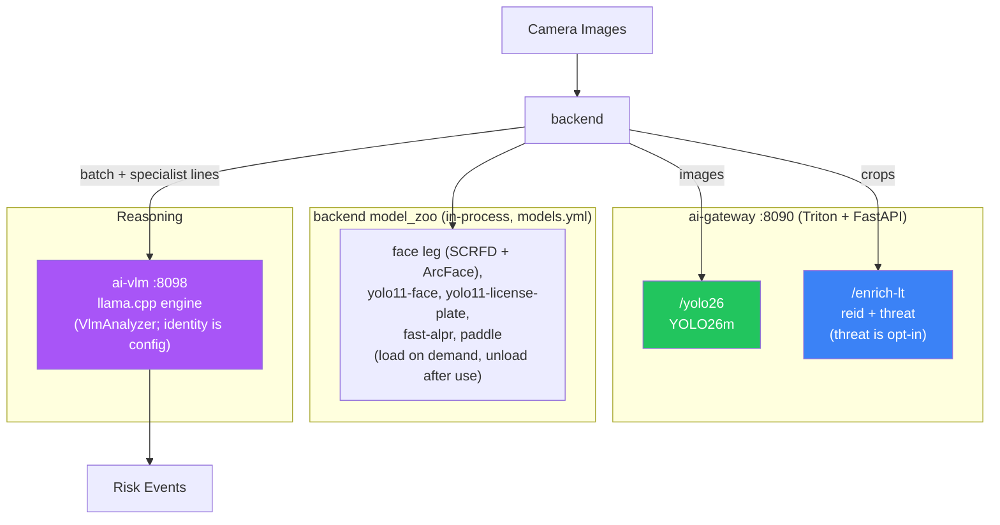

# AI Models Reference

> Canonical reference for all AI models used in the Home Security Intelligence pipeline. This document provides specifications, HuggingFace links, VRAM requirements, and configuration details for each model.

**Target Audiences:** Developers, Operators, ML Engineers

> **Deployment topology:** In production (`docker-compose.prod.yml`) the AI surface is two services: **ai-gateway** — Triton + FastAPI on port **8090**, mounting exactly two routers, `/yolo26` and `/enrich-lt` (`ai/gateway/main.py`) — and **ai-vlm** (llama.cpp) on container port **8098**, in the default compose set. Triton's model repository (`ai/triton/model_repository/`) holds `yolo26`, `reid` and `threat`, and `GATEWAY_MODEL_SET` decides which of them load. Everything else the backend uses is loaded in-process from `models.yml` via `backend/services/model_zoo.py`. `ai/yolo26/model.py` is a host-side debug server for the detector (`ai/start_detector.sh`) whose GPU image lives at `archive/ai-yolo26-image/`; production detection is Triton inside ai-gateway.

---

## Quick Reference

Service column: **ai-vlm** = llama.cpp container :8098 (default compose set) · **gateway** = Triton via ai-gateway (:8090) · **backend** = loaded in-process by `backend/services/model_zoo.py` from `models.yml`.

| Model                    | Purpose                                   | VRAM      | Service           | Framework    | Context/Embedding     |
| ------------------------ | ----------------------------------------- | --------- | ----------------- | ------------ | --------------------- |
| YOLO26m                  | Object detection                          | ~0.1 GB   | gateway           | Ultralytics  | -                     |
| Threat Detection YOLOv8n | Weapon/threat detection                   | ~0.3 GB   | gateway + backend | Ultralytics  | opt-in, see below     |
| OSNet-AIN x1.0           | Person re-identification (lookup support) | ~0.1 GB   | gateway + backend | torchreid    | 512-dim embedding     |
| SCRFD-10G-KPS            | Face detection (boxes + 5 landmarks)      | 0 (CPU)   | backend           | ONNX Runtime | ArcFace alignment     |
| ArcFace w600k_r50        | Face embedding (DB lookup)                | 0 (CPU)   | backend           | ONNX Runtime | 512-dim embedding     |
| YOLO11 Face              | Face detection on person crops            | ~0.2 GB   | backend           | Ultralytics  | -                     |
| YOLO11 License Plate     | License plate detection                   | ~0.3 GB   | backend           | Ultralytics  | -                     |
| FastALPR                 | End-to-end license plate OCR              | ~28 MB    | backend           | ONNX         | Detection + OCR       |
| PaddleOCR                | OCR text extraction                       | ~0.1 GB   | backend           | PaddlePaddle | -                     |
| YOLO26-general           | General detection (future, TBD)           | ~0.4 GB   | disabled          | Ultralytics  | `enabled: false`      |
| VLM (llama.cpp engine)   | Risk reasoning (the shipped pipeline)     | see below | ai-vlm :8098      | llama.cpp    | 16384 tokens per slot |

The reasoning engine's model identity is config, not a fact of this document — see [Serving VLM](#serving-vlm-the-ai-vlm-llamacpp-engine).

---

## Core Models

### YOLO26 (Object Detection)

Real-time object detection using CNN architecture optimized for speed with TensorRT FP16 inference.

| Specification      | Value                                                                                                                                                                                                                                                           |
| ------------------ | --------------------------------------------------------------------------------------------------------------------------------------------------------------------------------------------------------------------------------------------------------------- |
| **Source**         | [Ultralytics](https://github.com/ultralytics/ultralytics)                                                                                                                                                                                                       |
| **Architecture**   | YOLO26 (CNN-based, NMS-free)                                                                                                                                                                                                                                    |
| **Training Data**  | COCO                                                                                                                                                                                                                                                            |
| **VRAM Required**  | ~0.1 GB (TensorRT FP16)                                                                                                                                                                                                                                         |
| **Port**           | 8095 (standalone server, dev) — production reaches it via ai-gateway `:8090/yolo26`                                                                                                                                                                             |
| **Inference Time** | 10-20ms per image FP16 (5-10ms INT8) on RTX A5500 with TensorRT — per the archived server README (`archive/ai-yolo26-image/README.md`). Production runs FP32 ONNX under Triton (ONNX Runtime CUDA EP), which is slower per frame than the TensorRT numbers here |
| **Framework**      | Ultralytics + TensorRT                                                                                                                                                                                                                                          |

**Model Variants:**

| Model   | Parameters | Size    | FPS (TensorRT FP16) | Best For                |
| ------- | ---------- | ------- | ------------------- | ----------------------- |
| yolo26n | 2.57M      | 5.3 MB  | 223                 | Maximum throughput      |
| yolo26s | 10.01M     | 19.5 MB | 206                 | Balanced speed/accuracy |
| yolo26m | 21.90M     | 42.2 MB | 174                 | Best accuracy (default) |

> FPS provenance: the only A5500 TensorRT FP16 run recorded in this repo is a single 5.76 ms /
> 174 FPS standalone benchmark (2026-01-26, commit `a5e47aa2`, variant not recorded -- see the
> decision timeline in
> [NVIDIA Technology Inventory](nvidia-technology-inventory.md)). The 223/206/174 row values are
> vendor-published-style figures that cannot be re-derived from the current `.pt`-based benchmark
> script; current measured numbers for the ONNX path live in
> [docs/benchmarks/yolo26-benchmarks.md](../benchmarks/yolo26-benchmarks.md) and are roughly an
> order of magnitude lower.

**Security-Relevant Classes (9 total):**

```python
SECURITY_CLASSES = {
    "person", "car", "truck", "dog", "cat",
    "bird", "bicycle", "motorcycle", "bus"
}
```

**Purpose in Pipeline:**

- First stage of the AI pipeline
- Processes incoming camera images
- Outputs bounding boxes, class labels, and confidence scores
- Filters detections to security-relevant classes only

**How it is served:** the Triton `yolo26` model (ONNX Runtime, CUDA execution provider, FP32, `ai/triton/model_repository/yolo26/config.pbtxt`) behind the gateway's `/yolo26` adapter. `models.yml` keeps the `yolo26` row `enabled: false` on purpose — the backend never loads it in-process; the row exists so the download and export/TensorRT-prebuild paths can find the `.pt` files on disk.

**Environment Variables:**

| Variable            | Default                                      | Description                           |
| ------------------- | -------------------------------------------- | ------------------------------------- |
| `YOLO26_MODEL_PATH` | `/models/yolo26/exports/yolo26m_fp16.engine` | TensorRT engine path (dev server)     |
| `YOLO26_CONFIDENCE` | `0.5`                                        | Min confidence threshold              |
| `HOST`              | `0.0.0.0`                                    | Bind address (dev server)             |
| `PORT`              | `8095`                                       | Server port (dev server, not shipped) |

---

### Serving VLM: the `ai-vlm` llama.cpp engine

Risk reasoning in the shipped pipeline is the `ai-vlm` llama.cpp engine (VlmAnalyzer; risk reasoning — model identity is config, ledger D5). Because identity is config, this entry documents the **serve**; the weight names below are the compose/`.env.example` defaults, not a claim that this model is required.

| Specification     | Value                                                                                                                                                                                      |
| ----------------- | ------------------------------------------------------------------------------------------------------------------------------------------------------------------------------------------ |
| **Service**       | `ai-vlm` :8098 (llama.cpp, `--jinja`, `--sleep-idle-seconds`), in the default compose set                                                                                                  |
| **Port mapping**  | `127.0.0.1:${AI_VLM_PORT:-8098}:8098` — host var configurable, container `PORT` fixed at 8098                                                                                              |
| **Backend URL**   | `AI_VLM_URL` — `http://localhost:8098` (dev default) / `http://ai-vlm:8098` (compose)                                                                                                      |
| **Files**         | `VLM_MODEL_PATH` + `VLM_MMPROJ_PATH`, default `Qwen3VL-8B-Instruct-Q4_K_M.gguf` + `mmproj-Qwen3VL-8B-Instruct-Q8_0.gguf`, host-mounted read-only from `${AI_MODELS_PATH}/vlm` at `/models` |
| **Identity vars** | `VLM_MODEL_ID` / `VLM_MODEL_ALIAS` (keep them matched to `VLM_MODEL_PATH`; override together)                                                                                              |
| **Context**       | `VLM_CTX_SIZE` 32768 ÷ `VLM_PARALLEL` 2 = **16384 tokens per slot**; the backend derives its prompt budget from the same pair                                                              |
| **Vision cap**    | `LLAMA_ARG_IMAGE_MAX_TOKENS=1280` per still — uncapped, a fitted batch overruns the slot                                                                                                   |
| **Projector**     | The `mmproj` file is part of the identity: without it the serve is **text-only and every `vlm_assess` degrades silently**, so the two files are configured as one pair                     |

The default identity is a **provisional pick** (owner ruling 2026-09-28, spec rev 7, ledger item
35); the 4B identity is the measured fallback row in the A5500 handout, same KV geometry. There is
**no measured 24 GB-class residency figure for this model** — the bake-off's `vram_actual_mib 11216`
reading is a GB300 single-container floor and is not transferable. For residency numbers see
`.env.example` / the bring-up record.

---

## Lookup and Enrichment-Lane Models

These are the models behind the gateway's `/enrich-lt` routes and the backend's in-process lookups. Each one answers a lookup — an embedding, a box, a plate string — against your own registrations; none of them grades risk.

### Threat Detection YOLOv8n

Weapon and threat object detection for high-priority security alerts.

| Specification     | Value                                                                                       |
| ----------------- | ------------------------------------------------------------------------------------------- |
| **HuggingFace**   | [Subh775/Threat-Detection-YOLOv8n](https://huggingface.co/Subh775/Threat-Detection-YOLOv8n) |
| **Architecture**  | YOLOv8n detection                                                                           |
| **VRAM Required** | ~0.3 GB (`models.yml` `vram_mb: 300`)                                                       |
| **Port**          | ai-gateway `/enrich-lt` (`/threat-detect`) + backend                                        |
| **Framework**     | Ultralytics                                                                                 |

**Threat Classes (Triton `threat` post-processing, `ai/gateway/adapters/enrichment_light.py`):**

```python
THREAT_CLASSES = ["knife", "pistol", "rifle", "threat_object"]
```

**Purpose in Pipeline:**

- Detect weapons on full frame when suspicious activity is detected
- Feed the weapon line into the batch's specialist text (see the note below on what the verdict reads)
- Triton `threat` runs at instance priority 1 (high)

> **Served, but out of the VLM prompt.** The `/enrich-lt` router always mounts `/threat-detect`,
> but `threat` is not in the default Triton residency set: `VLM_MODEL_BASE` is `yolo26` + `reid`
> and `threat` joins only when `GATEWAY_ENABLE_THREAT=true` (`ai/gateway/residency.py`;
> `.env.example` ships `false`). `vlm_specialists.SPECIALIST_KEYS` is `{faces, plates, person_reid}`
> — threat is deliberately absent from what the verdict reads (the F12 call on the
> checkpoint's provenance), and weapon hints return as a later YOLOE-26 feature.

---

### OSNet-AIN x1.0 (Person Re-identification)

Lightweight model for generating person embeddings for cross-camera tracking.

| Specification      | Value                                               |
| ------------------ | --------------------------------------------------- |
| **Model**          | OSNet-AIN x1.0 (Omni-Scale Network, MSMT17 weights) |
| **Architecture**   | Lightweight CNN for re-identification               |
| **VRAM Required**  | ~0.1 GB                                             |
| **Embedding Dim**  | 512 floats (L2-normalized)                          |
| **Port**           | ai-gateway `/enrich-lt` (`/person-reid`) + backend  |
| **Framework**      | torchreid                                           |
| **Weights file**   | `osnet_ain_x1_0_msmt17.pth`                         |
| **model_id (F11)** | `osnet-ain-x1-0@osnet_ain_x1_0_msmt17@8a07e8da3894` |

**Purpose in Pipeline:**

- Generate 512-dimensional embeddings for person tracking — the **one** person re-ID vector
  space, `osnet-ain-x1-0` throughout (ledger item 20)
- Match individuals across multiple cameras
- Enable temporal tracking of persons throughout property

The shipped verdict path computes re-ID **in-process** (`vlm_specialists` → `reid_service` →
`osnet_loader`); the Triton `reid` producer behind `/enrich-lt/person-reid` keeps the same wire
shape and the same `model_id` stamp, and is what the AI contract harness exercises.

`backend/services/osnet_loader.py` loads the `osnet-ain-x1-0` row of `models.yml`, verifies the
weights sha256 before loading, and stamps every vector with the `model_id` above. That id is
**derived** from the row (`role@weightsfile@sha[:12]`) — never a literal — so the backend handle,
the Triton `reid` producer and the safe-extract payloads all stamp one string. A stored row that
predates provenance decodes to the sentinel `legacy-unknown-provenance` and is **never scored** —
it reads as "unavailable (re-enroll)", so re-enroll rather than backfill. When the weights are not
resident, `reid_service.generate_embedding()` raises `ReIDUnavailableError` (the enrollment route
answers 503 naming the cause) — never a zero-vector stub. Vehicle identity is separate: no vehicle
embedding producer ships in resident mode, so it rides license-plate match; vehicle-specific re-ID
is a named follow-up.

**Output:**

```json
{
  "embedding": [0.123, -0.456, "..."],
  "embedding_dimension": 512,
  "model_id": "osnet-ain-x1-0@osnet_ain_x1_0_msmt17@8a07e8da3894"
}
```

Stored under Redis key `entity_embeddings:{model_id}:{date}` — the model_id partition is the
guard that keeps two spaces from ever being compared. `reid_similarity_threshold` is **0.7**
(`backend/core/config.py`, allowed range 0.5-1.0) — the value that fits the `osnet-ain-x1-0`
cosine distribution — and is still PROVISIONAL pending calibration against real household
galleries.

---

### Face Leg: SCRFD-10G-KPS + ArcFace w600k_r50

The face leg of the VLM specialist stage (`models.yml` rows `face-detector-scrfd` and
`face-recognizer`; `backend/services/face_recognizer_loader.py`). These are DB-lookup models —
they identify enrolled household members against a gallery, they do not perceive attributes.

| Specification  | Value                                                                                                                                              |
| -------------- | -------------------------------------------------------------------------------------------------------------------------------------------------- |
| **Detector**   | SCRFD-10G-KPS — boxes + 5 landmarks for ArcFace 5-point alignment (`det_10g.onnx`, WIDER easy/med/hard 95.16/93.87/83.05)                          |
| **Recognizer** | ArcFace `w600k_r50` — aligned 112×112 crop in, L2-normalized 512-d vector out (IJB-C TAR@FAR 1e-4 97.25)                                           |
| **Source**     | The two ONNX files extracted from InsightFace `buffalo_l.zip` (owner-pinned 2026-09-26, sha256 over the whole file)                                |
| **Runtime**    | CPU `onnxruntime` directly — never the `insightface` package's `FaceAnalysis`, which drags in all five pack models                                 |
| **Residency**  | Both rows are `preload: true`: the leg never triggers a load, so `get_face_leg_handles` answers "unavailable" unless **both** are resident at boot |
| **local_path** | `model-zoo/face-recognizer/` (keep only these two files there, renaming `det_10g.onnx` → `scrfd_10g_bnkps.onnx`)                                   |

A missing detector, a missing recognizer, or weights that fail the sha256 pin raise
`FaceRecognizerUnavailable` and the specialist stage renders "unavailable" — the same shape the
`yolo11-face` row relies on when its weights are absent.

---

### YOLO11 Face Detection

Detects faces on person detections. A lookup-support row that stays in `models.yml`; note that the
**shipped** VLM face leg runs the SCRFD detector above, not this model
(`backend/services/vlm_specialists.py`), so this row feeds the standalone face-detection service
(`backend/services/face_detector.py`) rather than the verdict path.

| Specification     | Value                                                                                                    |
| ----------------- | -------------------------------------------------------------------------------------------------------- |
| **Model**         | [AdamCodd/YOLOv11n-face-detection](https://huggingface.co/AdamCodd/YOLOv11n-face-detection) (`model.pt`) |
| **Architecture**  | YOLOv11n detection                                                                                       |
| **VRAM Required** | ~0.2 GB (`models.yml` `vram_mb: 200`)                                                                    |
| **Port**          | backend (`model_zoo`, on-demand)                                                                         |
| **Framework**     | Ultralytics                                                                                              |

**Purpose in Pipeline:**

- Detect face regions on person detections
- Enable face-based re-identification across cameras

---

### YOLO11 License Plate Detection

Detects license plates on vehicles for OCR text extraction.

| Specification     | Value                                                                                                                                                 |
| ----------------- | ----------------------------------------------------------------------------------------------------------------------------------------------------- |
| **Model**         | [morsetechlab/yolov11-license-plate-detection](https://huggingface.co/morsetechlab/yolov11-license-plate-detection) (`license-plate-finetune-v1n.pt`) |
| **Architecture**  | YOLOv11n detection                                                                                                                                    |
| **VRAM Required** | ~0.3 GB (`models.yml` `vram_mb: 300`)                                                                                                                 |
| **Port**          | backend (`model_zoo`, on-demand)                                                                                                                      |
| **Framework**     | Ultralytics                                                                                                                                           |

**Purpose in Pipeline:**

- Detect license plate regions on vehicle detections
- Extract plate crops for OCR processing
- Provide plate locations for downstream text extraction

---

### FastALPR (End-to-End License Plate OCR)

| Specification     | Value                                                  |
| ----------------- | ------------------------------------------------------ |
| **Model**         | FastALPR ONNX (auto-downloaded by the library, ~28 MB) |
| **Architecture**  | Detection + OCR in one ONNX pipeline                   |
| **VRAM Required** | ~28 MB                                                 |
| **Port**          | backend (`model_zoo`, on-demand)                       |
| **Framework**     | ONNX Runtime                                           |

This is the shipped plate leg: `vlm_specialists.collect_plate_text()` runs `fast-alpr` over the
key frames and then does the household-vehicle lookup. The `[alpr]` extra is optional — where the
package is absent (sandbox/CI) `fast_alpr_loader` raises and the specialist line reads
"unavailable", never a false "0 plates".

`models.yml` scopes PaddleOCR to general sign and package text; license plates go through `fast-alpr`.

---

### PaddleOCR

Optical Character Recognition for extracting text from signs and packages.

| Specification     | Value                                                         |
| ----------------- | ------------------------------------------------------------- |
| **Model**         | [PaddleOCR](https://github.com/PaddlePaddle/PaddleOCR)        |
| **Architecture**  | PP-OCRv4 (detection + recognition + direction classification) |
| **VRAM Required** | ~0.1 GB (`models.yml` `vram_mb: 100`)                         |
| **Port**          | backend (`model_zoo`, on-demand)                              |
| **Framework**     | PaddlePaddle                                                  |

**Note:** Optional dependency — the OCR features are absent when PaddlePaddle is not
installed. `fast-alpr` handles license plates; PaddleOCR reads general sign and package text.

---

### YOLO26-general (Disabled)

`models.yml` keeps a `yolo26-general` row marked "future release, TBD" with `enabled: false` and
`download_method: skip`. It has no artifact to download and nothing loads it; it is a placeholder,
not a deployment option.

---

## VRAM Requirements Summary

### Production Configuration (Reference Hardware: RTX A5500 24 GB + RTX A400 4 GB)

| Component                                    | Models                                                                                                                                                          | VRAM (approx)                                                                           |
| -------------------------------------------- | --------------------------------------------------------------------------------------------------------------------------------------------------------------- | --------------------------------------------------------------------------------------- |
| `ai-vlm` (GPU 0, default compose set)        | The configured GGUF + `mmproj` + KV cache                                                                                                                       | see `.env.example` / the bring-up record — no measured 24 GB-class figure exists yet    |
| `ai-gateway` Triton (GPU 1, A400)            | 3 model repos on disk (`yolo26`, `reid`, `threat`), all `KIND_GPU`; the default `vlm` set serves `yolo26` + `reid`, `threat` joins with `GATEWAY_ENABLE_THREAT` | per-model estimates in [NVIDIA Technology Inventory](nvidia-technology-inventory.md)    |
| backend model_zoo (1 GPU reserved, unpinned) | `osnet-ain-x1-0`, `face-detector-scrfd`, `face-recognizer` preload at boot; lookup models load per use                                                          | ~100 MB resident at boot (OSNet); the face leg is CPU ONNX (0 GB VRAM); see table below |

The gateway VRAM split is documented in [NVIDIA Technology Inventory](nvidia-technology-inventory.md) (VRAM Budget Summary).

### Backend Model-Zoo VRAM (On-Demand, from `models.yml`)

`backend/services/model_zoo.py` builds its registry from `models.yml` (rows without a
`_LOADER_MAP` entry are skipped at init), loads lazily and **unloads right after each use** (async
context manager with reference counting, CUDA cache cleared on unload), so typically only one or a
few models are resident at a time. The `vram_mb`/`priority` fields drive reporting and the
`BACKEND_MODEL_PRELOAD` boot sweep (`preload: true` rows: OSNet and the two face-leg files). There
is no VRAM-budget eviction pass in this manager, so nothing consults `never_evict` — the flag is
the intended contract for the day eviction exists (ledger item 32 notes it), and no shipped row
sets it.

| Model                    | VRAM (MB) | Category  | Priority | Enabled | Preload |
| ------------------------ | --------- | --------- | -------- | ------- | ------- |
| yolo26                   | 0         | detection | medium   | no      | no      |
| osnet-ain-x1-0           | 100       | embedding | medium   | yes     | yes     |
| face-detector-scrfd      | 0 (CPU)   | detection | low      | yes     | yes     |
| face-recognizer          | 0 (CPU)   | embedding | low      | yes     | yes     |
| threat-detection-yolov8n | 300       | detection | medium   | yes     | no      |
| yolo11-face              | 200       | detection | medium   | yes     | no      |
| yolo11-license-plate     | 300       | detection | medium   | yes     | no      |
| fast-alpr                | 28        | alpr      | medium   | yes     | no      |
| paddleocr                | 100       | ocr       | medium   | yes     | no      |
| yolo26-general           | 400       | detection | medium   | no      | no      |

Total `vram_mb` across the ten rows: 1.428 GB. The single heaviest entry (`yolo26-general`, 400)
is `enabled: false`, and so is `yolo26` — the backend never loads the primary detector in-process.

### Development Configuration (Minimal)

| Service       | Models                   | VRAM                                     |
| ------------- | ------------------------ | ---------------------------------------- |
| `ai-vlm`      | Configured GGUF identity | see `.env.example` / the bring-up record |
| YOLO26        | YOLO26m (TensorRT FP16)  | ~0.1 GB                                  |
| Lookup models | OSNet + face leg         | ~0.1 GB                                  |

### Hardware Recommendations

| Configuration | Recommended GPU      | VRAM  |
| ------------- | -------------------- | ----- |
| Production    | NVIDIA RTX A5500     | 24 GB |
| Production    | NVIDIA RTX 4090      | 24 GB |
| Development   | NVIDIA RTX 3070/4070 | 8 GB  |
| Development   | NVIDIA RTX 3060      | 12 GB |

---

## Model Download

The primary path is `setup.py deploy` → `setup_lib/model_downloader.py`, which downloads everything declared in `models.yml` (repo-root file).

```bash
# Download all models to default path (/export/ai_models)
./ai/download_models.sh

# Download to custom path
AI_MODELS_PATH=./models ./ai/download_models.sh
```

> **Fetch list.** What `setup_lib/models_config.get_downloadable_models()` selects — rule
> `download_method != "skip"` AND (`hf_repo` OR `download_method`) — is five artifacts today:
> `yolo26`, `osnet-ain-x1-0`, `threat-detection-yolov8n`, `yolo11-face`, `yolo11-license-plate`.
> The rest of the live inventory is `download_method: skip`: the face leg's two ONNX files are
> unpacked from `buffalo_l.zip` by hand (sha256-pinned rows), `fast-alpr` and `paddleocr` fetch at
> runtime, and the VLM weights are host-mounted. `ai/download_models.sh` is supposed to mirror that
> rule; when it names anything outside those five it is carrying a pre-S3 artifact, and `models.yml`
> is the authority.

### Download Directory Structure

`models.yml` is the single source of truth for what `setup.py deploy` (`setup_lib/model_downloader.py`) fetches and where.

```
${AI_MODELS_PATH}/
├── vlm/                            # the configured GGUF + mmproj (compose mounts :ro at /models)
└── model-zoo/
    ├── yolo26/                     # yolo26n/s/m .pt (Ultralytics releases)
    ├── osnet-ain-x1-0/             # osnet_ain_x1_0_msmt17.pth
    ├── face-recognizer/            # scrfd_10g_bnkps.onnx + w600k_r50.onnx (from buffalo_l.zip)
    ├── threat-detection-yolov8n/
    ├── yolo11-face-detection/      # model.pt
    ├── yolo11-license-plate/       # license-plate-finetune-v1n.pt
    └── paddleocr/                  # fast-alpr needs no directory (library auto-download)
```

### Manual Downloads

For manual downloads or air-gapped environments (production model sources are the `hf_repo` /
`download_method` values in `models.yml`):

| Model                | Direct Download                                                                                                                                                                 |
| -------------------- | ------------------------------------------------------------------------------------------------------------------------------------------------------------------------------- |
| VLM weights          | Host-mounted, never downloaded by `models.yml` — place the GGUF + `mmproj` under `${AI_MODELS_PATH}/vlm` and point `VLM_MODEL_PATH` / `VLM_MMPROJ_PATH` at them                 |
| YOLO26               | Ultralytics GitHub releases (`models.yml` `download_method: yolo26`): `yolo26n/s/m.pt`                                                                                          |
| OSNet-AIN x1.0       | `models.yml` `download_method: osnet` — `huggingface.co/kaiyangzhou/osnet` (the long-dated MSMT17 checkpoint, renamed to `osnet_ain_x1_0_msmt17.pth`); sha256-pinned in the row |
| Face leg             | Unpack `buffalo_l.zip`, keep `det_10g.onnx` (→ `scrfd_10g_bnkps.onnx`) and `w600k_r50.onnx`; both rows are `download_method: skip` with a sha256 pin                            |
| Threat YOLOv8n       | `Subh775/Threat-Detection-YOLOv8n` (`hf_repo`)                                                                                                                                  |
| YOLO11 face / plate  | `AdamCodd/YOLOv11n-face-detection`, `morsetechlab/yolov11-license-plate-detection` (`hf_repo`)                                                                                  |
| FastALPR / PaddleOCR | `download_method: skip` — the libraries fetch what they need at runtime                                                                                                         |

---

## Environment Variables Reference

### Model Paths

| Variable            | Default Path                                               | Model                                             |
| ------------------- | ---------------------------------------------------------- | ------------------------------------------------- |
| `VLM_MODEL_PATH`    | `/models/Qwen3VL-8B-Instruct-Q4_K_M.gguf` (`.env.example`) | The `ai-vlm` engine's GGUF (identity is config)   |
| `VLM_MMPROJ_PATH`   | `/models/mmproj-Qwen3VL-8B-Instruct-Q8_0.gguf`             | Its vision projector (same identity)              |
| `VLM_MODEL_ID`      | `Qwen3VL-8B-Instruct-Q4_K_M`                               | Identity label — keep matched to `VLM_MODEL_PATH` |
| `VLM_MODEL_ALIAS`   | `Qwen3VL-8B`                                               | Serve-side alias                                  |
| `YOLO26_MODEL_PATH` | `/models/yolo26/exports/yolo26m_fp16.engine`               | YOLO26 (dev server; production uses Triton ONNX)  |
| `YOLO26_CONFIDENCE` | `0.5`                                                      | YOLO26 min confidence threshold                   |

Backend model-zoo paths resolve as `MODEL_ZOO_PATH` (default `/models/model-zoo`, the container mount of `${AI_MODELS_PATH}/model-zoo`) + the `local_path` from `models.yml`. The `ai-gateway` container mounts that same host directory read-only at `/models/zoo`.

### Service Configuration

| Variable                | Default (code)                                                                          | Production value (`docker-compose.prod.yml`)       | Description                                                                         |
| ----------------------- | --------------------------------------------------------------------------------------- | -------------------------------------------------- | ----------------------------------------------------------------------------------- |
| `AI_MODELS_PATH`        | `/export/ai_models`                                                                     | same (host path)                                   | Base path for all models                                                            |
| `HF_HOME`               | `/root/.cache/huggingface` in AI containers; backend mounts `/models/huggingface-cache` | —                                                  | HuggingFace cache directory                                                         |
| `YOLO26_URL`            | `http://ai-gateway:8090/yolo26`                                                         | `http://ai-gateway:8090/yolo26`                    | YOLO26 detection endpoint                                                           |
| `AI_GATEWAY_URL`        | unset                                                                                   | `http://ai-gateway:8090`                           | Triton gateway base URL (`USE_AI_GATEWAY=true`)                                     |
| `ENRICHMENT_LIGHT_URL`  | `http://ai-gateway:8090/enrich-lt` (`.env.example` ships the `localhost:8090` dev form) | `http://ai-gateway:8090/enrich-lt`                 | Threat + re-ID lane                                                                 |
| `AI_VLM_URL`            | `http://localhost:8098`                                                                 | `http://ai-vlm:8098`                               | `ai-vlm` (llama.cpp) endpoint                                                       |
| `AI_VLM_PORT`           | not a `Settings` field (compose interpolation only)                                     | host mapping `127.0.0.1:${AI_VLM_PORT:-8098}:8098` | Host-side port for the VLM serve                                                    |
| `GATEWAY_MODEL_SET`     | hard-raises when unset                                                                  | `${GATEWAY_MODEL_SET:-vlm}`                        | Triton residency set; `vlm` = yolo26 + reid (+ threat when `GATEWAY_ENABLE_THREAT`) |
| `VLM_CTX_SIZE`          | `32768`                                                                                 | `${VLM_CTX_SIZE:-32768}`                           | Shared context pool                                                                 |
| `VLM_PARALLEL`          | `2`                                                                                     | `${VLM_PARALLEL:-2}`                               | llama.cpp slots (per-slot = ctx ÷ parallel)                                         |
| `BACKEND_MODEL_PRELOAD` | `false`                                                                                 | per-host (true when the GPU has ≥ 24 GB)           | Boot sweep for `preload: true` rows                                                 |

---

## Architecture Overview


```mermaid
flowchart TD
    CAM[Camera Images] --> BE[backend]

    subgraph Gateway["ai-gateway :8090 (Triton + FastAPI)"]
        YOLO["/yolo26<br/>YOLO26m"]
        ENRLT["/enrich-lt<br/>reid + threat<br/>(threat is opt-in)"]
    end

    subgraph Zoo["backend model_zoo (in-process, models.yml)"]
        LOOKUP["face leg (SCRFD + ArcFace),<br/>yolo11-face, yolo11-license-plate,<br/>fast-alpr, paddle<br/>(load on demand, unload after use)"]
    end

    subgraph Reasoning["Reasoning"]
        VLM["ai-vlm :8098<br/>llama.cpp engine<br/>(VlmAnalyzer; identity is config)"]
    end

    BE -->|images| YOLO
    BE -->|crops| ENRLT
    BE --> LOOKUP
    BE -->|batch + specialist lines| VLM
    VLM --> OUT[Risk Events]

    style YOLO fill:#22C55E,color:#fff
    style ENRLT fill:#3B82F6,color:#fff
    style VLM fill:#A855F7,color:#fff
```

### Pipeline Flow

1. **YOLO26** (gateway `/yolo26`): Detects objects in camera images
2. **Specialists** (gateway `/enrich-lt`): Threat detection and person re-ID embeddings on crops
3. **Lookups** (backend model_zoo): Face recognition against the enrolled gallery, plate detection and ALPR/OCR text
4. **Reasoning** (`ai-vlm` :8098): The llama.cpp engine grades the batch and generates risk scores and summaries

Each step reads only the outputs of the steps above it: the verdict is built from the detections,
the specialist lookups and the key frames, and nothing else is consulted.

---

## Related Documentation

- [AI Pipeline — Current State](../architecture/ai-pipeline-current-state.md)
- [AI Services Guide](../../ai/AGENTS.md)
- [AI Gateway](../../ai/gateway/AGENTS.md)
- [Triton Model Repository](../../ai/triton/AGENTS.md)
- [YOLO26 Detection Server](../../ai/yolo26/AGENTS.md)
- [Risk Levels Configuration](config/risk-levels.md)
- [GPU Troubleshooting](troubleshooting/gpu-issues.md)

---

[Back to Reference Hub](README.md) | [AI Troubleshooting](troubleshooting/ai-issues.md) | [Environment Variables](config/env-reference.md)
