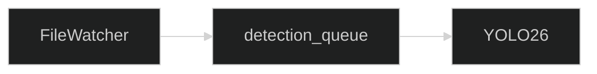
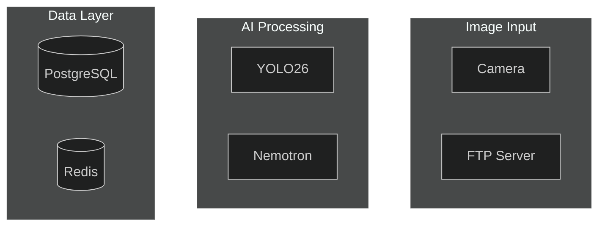
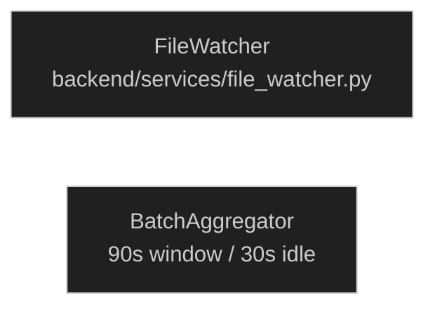
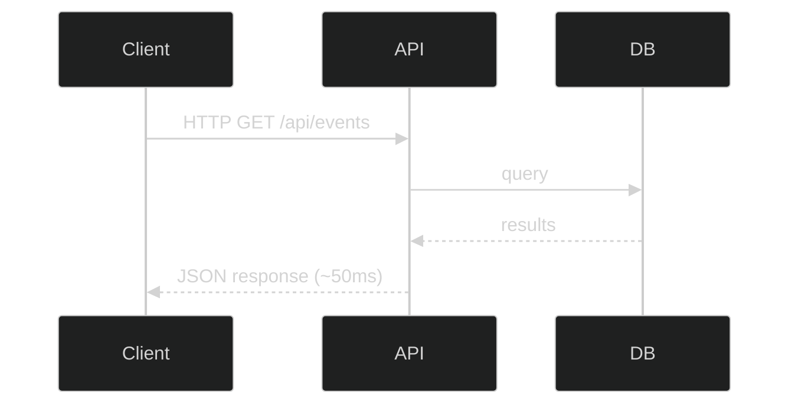
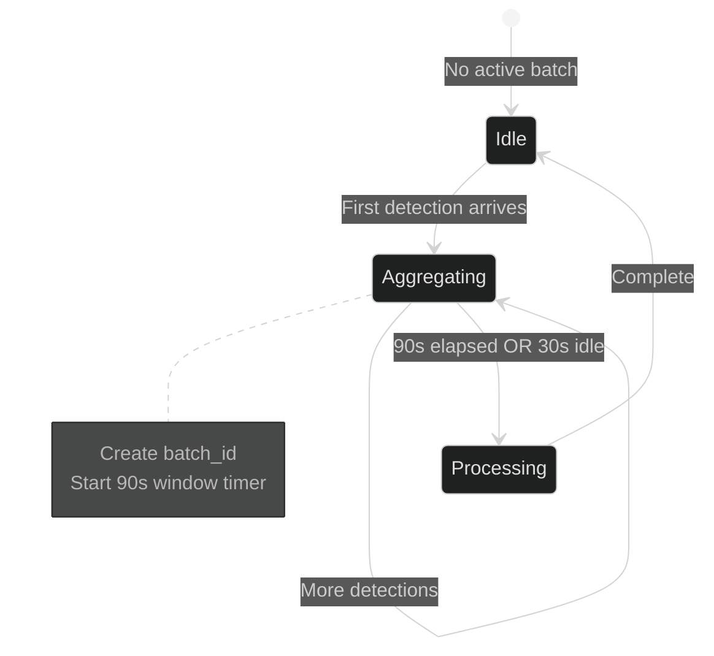
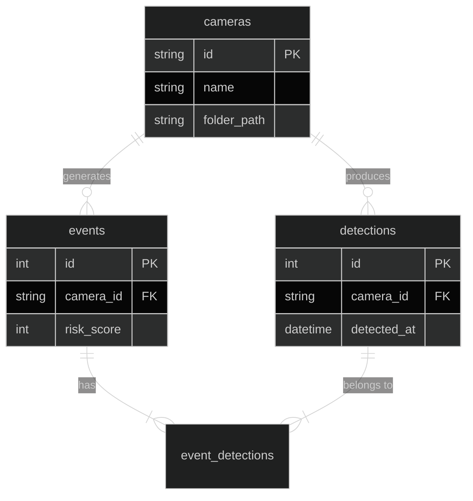
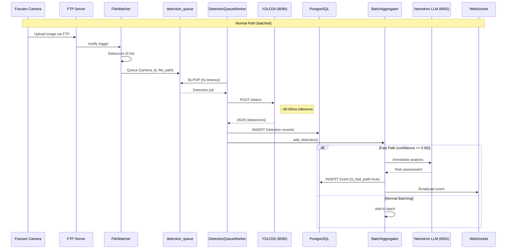
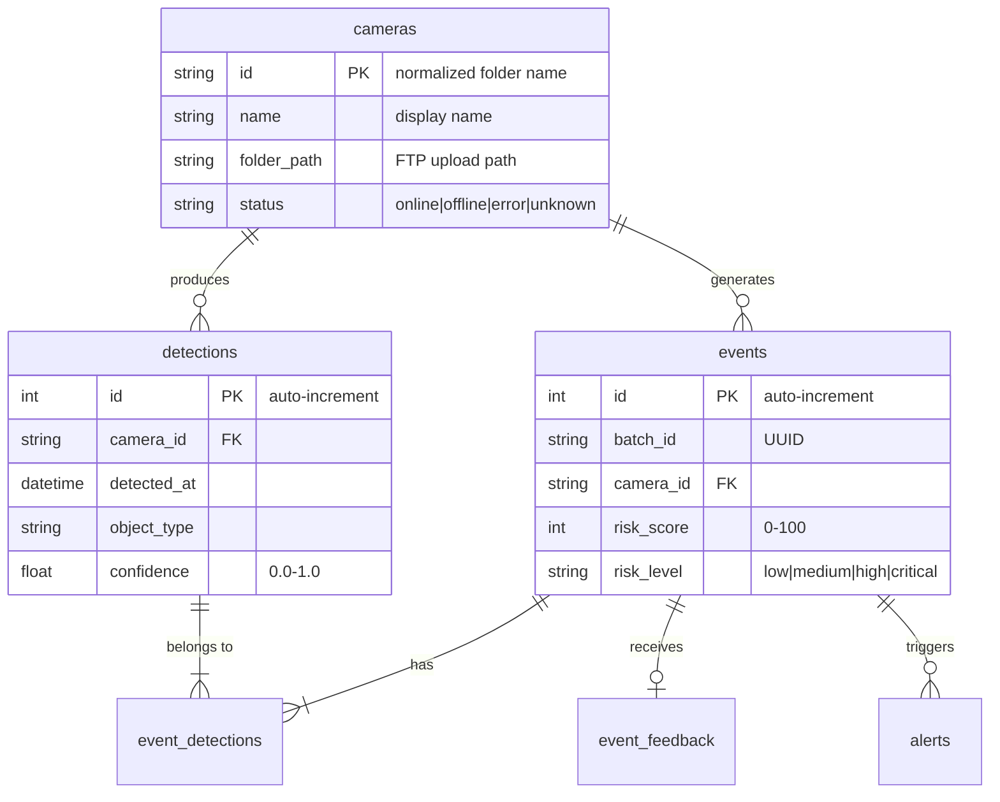
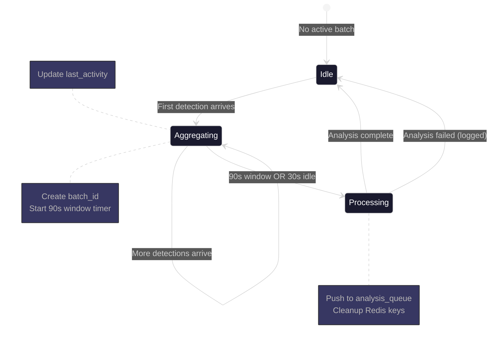

# Diagram Style Guide

> Standards for creating consistent, maintainable diagrams across documentation

This guide establishes conventions for diagrams in the Home Security Intelligence documentation. It complements the [Visual Style Guide](../images/style-guide.md) which covers colors, component styling, and general design principles.

## Table of Contents

1. [Diagram Type Selection](#diagram-type-selection)
2. [Mermaid vs Other Tools](#mermaid-vs-other-tools)
3. [Mermaid Theme Configuration](#mermaid-theme-configuration)
4. [Node Naming Conventions](#node-naming-conventions)
5. [Label Formatting](#label-formatting)
6. [Reusable Theme Snippets](#reusable-theme-snippets)
7. [Diagram Type Guidelines](#diagram-type-guidelines)
8. [Good Examples from Codebase](#good-examples-from-codebase)
9. [Accessibility Considerations](#accessibility-considerations)
10. [Validation Checklist](#validation-checklist)

---

## Diagram Type Selection

Choose the diagram type based on what you're documenting:

| Content Type               | Recommended Diagram           | Example Use Case                          |
| -------------------------- | ----------------------------- | ----------------------------------------- |
| System architecture        | `flowchart TB/LR`             | Service relationships, container topology |
| Data flow                  | `flowchart LR`                | Pipeline stages, processing steps         |
| Request/response sequences | `sequenceDiagram`             | API calls, WebSocket flows                |
| Entity relationships       | `erDiagram`                   | Database schema, model relationships      |
| State transitions          | `stateDiagram-v2`             | Circuit breaker, batch aggregator states  |
| Component structure        | `classDiagram`                | Service interfaces, API schemas           |
| Timelines                  | `flowchart LR` with subgraphs | Processing stages with timing             |
| Decision trees             | `flowchart TD`                | Error handling paths, routing logic       |

### Diagram Orientation Guidelines

| Orientation          | When to Use                                 |
| -------------------- | ------------------------------------------- |
| `TB` (top-to-bottom) | Hierarchical relationships, component trees |
| `LR` (left-to-right) | Sequential processes, data pipelines        |
| `RL` (right-to-left) | Response flows (rarely used)                |
| `BT` (bottom-to-top) | Inheritance hierarchies (rarely used)       |

**Recommendation:** Prefer `LR` for data flows and `TB` for architecture diagrams.

---

## Mermaid vs Other Tools

### When to Use Mermaid (Default Choice)

Use Mermaid for:

- All documentation embedded in Markdown files
- Diagrams that need GitHub/GitLab rendering
- Standard flowcharts, sequences, and ER diagrams
- Diagrams requiring version control with readable diffs

**Advantages:**

- Native GitHub/GitLab rendering
- Text-based (version control friendly)
- No external dependencies for viewing
- Easy to maintain alongside code

### When to Consider Graphviz

Use Graphviz (DOT format) for:

- Complex node positioning requirements
- Cluster layouts with precise control
- Diagrams needing export to multiple formats
- State machines with complex transitions

**Source files:** Store as `.dot` in `/docs/images/sources/`
**Rendered files:** Export as `.svg` to `/docs/images/`

### When to Consider PlantUML

Use PlantUML for:

- Complex sequence diagrams with nested fragments
- Full UML notation requirements
- Diagrams requiring icons from standard libraries

**Note:** PlantUML requires external rendering; prefer Mermaid when possible.

### When to Use External Tools

Use draw.io/Excalidraw for:

- High-fidelity mockups
- Diagrams requiring custom icons
- One-time explanatory diagrams
- User-facing documentation images

---

## Mermaid Theme Configuration

All Mermaid diagrams should use the project's dark theme for consistency. Configure themes using the `%%{init:}%%` directive.

### Standard Theme (Simple)

For basic diagrams that don't need extensive customization:


### Full Theme Configuration (Recommended)

For diagrams requiring consistent brand colors:


### Theme Color Reference

| Variable             | Hex Code  | Purpose                       |
| -------------------- | --------- | ----------------------------- |
| `primaryColor`       | `#3B82F6` | Frontend/React components     |
| `primaryTextColor`   | `#FFFFFF` | Text on primary backgrounds   |
| `primaryBorderColor` | `#60A5FA` | Borders on primary components |
| `secondaryColor`     | `#A855F7` | AI/ML components              |
| `tertiaryColor`      | `#009688` | Backend/FastAPI components    |
| `background`         | `#121212` | Diagram background            |
| `mainBkg`            | `#1a1a2e` | Subgraph backgrounds          |
| `lineColor`          | `#666666` | Default connection lines      |

See [Visual Style Guide - Color Palette](../images/style-guide.md#color-palette) for the complete color reference.

---

## Node Naming Conventions

### ID Format

Node IDs should be:

- **Short and descriptive:** Use PascalCase or UPPERCASE abbreviations
- **Unique within the diagram:** No duplicate IDs
- **Semantic:** Reflect the component's purpose



### Standard Abbreviations

Use these consistent abbreviations across diagrams:

| Abbreviation | Full Name          | Component Type |
| ------------ | ------------------ | -------------- |
| `FW`         | FileWatcher        | Service        |
| `DQ`         | detection_queue    | Redis Queue    |
| `AQ`         | analysis_queue     | Redis Queue    |
| `RT`         | YOLO26 (Real-Time) | AI Model       |
| `NEM`        | Nemotron           | AI Model       |
| `BA`         | BatchAggregator    | Service        |
| `EB`         | EventBroadcaster   | Service        |
| `WS`         | WebSocket          | Communication  |
| `DB`         | PostgreSQL         | Database       |
| `REDIS`      | Redis              | Cache/Queue    |
| `API`        | FastAPI            | API Layer      |
| `UI`         | React Frontend     | Frontend       |

### Subgraph Naming

Subgraph IDs should describe the logical grouping:



---

## Label Formatting

### Node Labels

| Element       | Format                  | Example              |
| ------------- | ----------------------- | -------------------- |
| Service names | Title Case              | `Event Service`      |
| Queue names   | snake_case in backticks | `detection_queue`    |
| Model names   | Original casing         | `YOLO26`, `Nemotron` |
| File paths    | Monospace               | `/api/events`        |
| Ports         | Suffix in parentheses   | `FastAPI (8000)`     |

### Multi-line Labels

Use `<br/>` for line breaks in labels:



### Edge Labels

- **Use lowercase** for actions: `fetch`, `query`, `broadcast`
- **Use UPPERCASE** for protocols: `HTTP`, `WS`, `FTP`
- **Keep brief:** 1-3 words maximum
- **Include timing** when relevant: `~30ms`, `5s timeout`



---

## Reusable Theme Snippets

Copy these snippets as starting points for your diagrams.

### Flowchart - Full Theme

````markdown
```mermaid
%%{init: {
  'theme': 'dark',
  'themeVariables': {
    'primaryColor': '#3B82F6',
    'primaryTextColor': '#FFFFFF',
    'primaryBorderColor': '#60A5FA',
    'secondaryColor': '#A855F7',
    'tertiaryColor': '#009688',
    'background': '#121212',
    'mainBkg': '#1a1a2e',
    'lineColor': '#666666'
  }
}}%%
flowchart LR
    %% Your diagram content here
```
````

````

### Sequence Diagram - Standard

```markdown
```mermaid
%%{init: {'theme': 'dark'}}%%
sequenceDiagram
    participant C as Client
    participant A as API
    participant D as Database

    C->>A: Request
    A->>D: Query
    D-->>A: Result
    A-->>C: Response
````

````

### State Diagram - With Theme

```markdown
```mermaid
%%{init: {
  'theme': 'dark',
  'themeVariables': {
    'primaryColor': '#3B82F6',
    'primaryTextColor': '#FFFFFF',
    'primaryBorderColor': '#60A5FA',
    'secondaryColor': '#A855F7',
    'tertiaryColor': '#009688',
    'background': '#121212',
    'mainBkg': '#1a1a2e',
    'lineColor': '#666666'
  }
}}%%
stateDiagram-v2
    [*] --> Idle
    Idle --> Active: trigger
    Active --> Idle: complete
````

````

### ER Diagram - Standard

```markdown
```mermaid
%%{init: {'theme': 'dark'}}%%
erDiagram
    ENTITY_A ||--o{ ENTITY_B : "has"
    ENTITY_B ||--|{ ENTITY_C : "contains"

    ENTITY_A {
        int id PK
        string name
        datetime created_at
    }
````

````

### Architecture Flowchart with Subgraphs

```markdown
```mermaid
%%{init: {
  'theme': 'dark',
  'themeVariables': {
    'primaryColor': '#3B82F6',
    'primaryTextColor': '#FFFFFF',
    'primaryBorderColor': '#60A5FA',
    'secondaryColor': '#A855F7',
    'tertiaryColor': '#009688',
    'background': '#121212',
    'mainBkg': '#1a1a2e',
    'lineColor': '#666666'
  }
}}%%
flowchart TB
    subgraph Frontend["Frontend Layer"]
        UI[React App]
    end

    subgraph Backend["Backend Layer"]
        API[FastAPI]
        WS[WebSocket]
    end

    subgraph AI["AI Pipeline"]
        YOLO[YOLO26]
        NEM[Nemotron]
    end

    subgraph Data["Data Layer"]
        DB[(PostgreSQL)]
        REDIS[(Redis)]
    end

    UI --> API
    UI <--> WS
    API --> YOLO
    YOLO --> NEM
    API --> DB
    API --> REDIS
````

````

---

## Diagram Type Guidelines

### Flowcharts

**Use for:** System architecture, data flows, component relationships

**Best practices:**
- Group related components in subgraphs
- Use consistent arrow styles (solid for sync, dashed for async)
- Include port numbers for services
- Add file path references in node labels

```mermaid
%%{init: {'theme': 'dark'}}%%
flowchart LR
    subgraph Input["Image Input"]
        CAM[Camera FTP Upload]
        FW[File Watcher]
    end

    subgraph Detection["Object Detection"]
        DQ[detection_queue]
        YOLO[YOLO26]
    end

    CAM --> FW
    FW --> DQ
    DQ --> YOLO
````

### Sequence Diagrams

**Use for:** API request/response flows, WebSocket communication, multi-service interactions

**Best practices:**

- Name participants with abbreviation and full name: `participant FW as FileWatcher`
- Use activation boxes for long-running operations
- Add notes for timing or important details
- Use `alt`/`else` for conditional paths

```mermaid
%%{init: {'theme': 'dark'}}%%
sequenceDiagram
    participant C as Client
    participant API as FastAPI
    participant DB as PostgreSQL

    C->>API: GET /api/events
    activate API
    API->>DB: SELECT events
    DB-->>API: Event rows
    API-->>C: JSON response
    deactivate API
    Note right of API: ~50ms typical
```

### State Diagrams

**Use for:** Component lifecycle, circuit breaker states, batch processing states

**Best practices:**

- Start with `[*]` for initial state
- Add notes for transition conditions
- Use descriptive state names



### Entity Relationship Diagrams

**Use for:** Database schema, model relationships

**Best practices:**

- Use standard cardinality notation (`||`, `|{`, `o{`, etc.)
- Include key attributes (PK, FK)
- Group related entities visually



---

## Good Examples from Codebase

### Example 1: Pipeline Sequence (from ai-pipeline.md)

This example demonstrates a comprehensive sequence diagram with participants, activations, alternatives, and notes:



**Why it's good:**

- Clear participant naming with service ports
- Notes for timing information
- Alternative paths for conditional logic
- Logical grouping with activation boxes

### Example 2: Data Model ER Diagram (from core-entities.md)



**Why it's good:**

- Clear cardinality notation
- Descriptive comments in attribute definitions
- Includes primary and foreign key markers
- Shows junction table relationships

### Example 3: State Machine (from ai-pipeline.md)



**Why it's good:**

- Uses full theme configuration
- Clear state transitions with conditions
- Notes explain side effects
- Shows self-transitions

---

## Accessibility Considerations

### Color Contrast

All diagrams inherit accessibility from the [Visual Style Guide](../images/style-guide.md#accessibility-considerations):

- Text contrast meets WCAG AA (4.5:1 minimum)
- Don't rely on color alone to convey meaning
- Use patterns or shapes in addition to colors

### Alternative Differentiation

When color-coding paths, also use:

| Path Type | Color | Line Style | Shape        |
| --------- | ----- | ---------- | ------------ |
| Success   | Green | Solid      | Arrow        |
| Error     | Red   | Dashed     | X marker     |
| Warning   | Amber | Dotted     | Warning icon |
| Info      | Blue  | Solid      | Info icon    |

### Text Size

Minimum text sizes in diagrams:

- Node labels: 11pt
- Edge labels: 9pt
- Notes: 10pt

---

## Validation Checklist

Before committing diagrams, verify:

- [ ] Diagram renders correctly in GitHub preview
- [ ] Theme is applied (dark mode)
- [ ] All nodes have semantic IDs
- [ ] All edges are labeled (if non-obvious)
- [ ] Participant/node names are consistent with codebase
- [ ] File path references are accurate
- [ ] No broken subgraph syntax
- [ ] Diagram has a title or caption explaining its purpose
- [ ] Colors follow [Visual Style Guide](../images/style-guide.md)
- [ ] Accessibility: not relying solely on color

### Common Rendering Issues

| Issue                     | Solution                              |
| ------------------------- | ------------------------------------- |
| Diagram not rendering     | Check for unclosed brackets or quotes |
| Theme not applied         | Ensure `%%{init:}%%` is on first line |
| Labels cut off            | Use `<br/>` for multi-line labels     |
| Subgraph overlap          | Add direction hint: `flowchart TB`    |
| Arrows pointing wrong way | Check node order in edge definitions  |

---

## Related Documentation

- [Visual Style Guide](../images/style-guide.md) - Colors, shapes, and design principles
- [Documentation Standards](../architecture/STANDARDS.md) - Code citations and structure
- [Dataflow Template](../architecture/templates/dataflow-template.md) - Template for dataflow documents
- [Contributing Guide](../development/contributing.md) - PR process and standards
