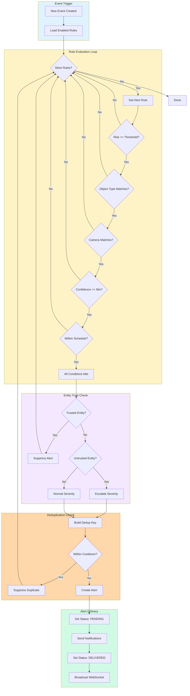
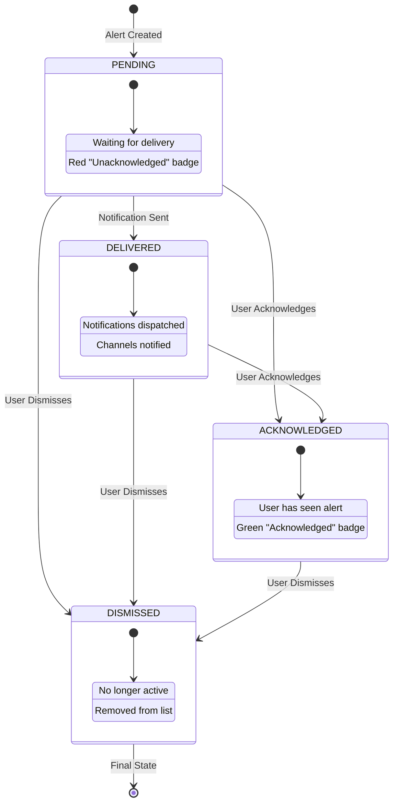

# Alerts


The Alerts page displays high and critical risk security events that require immediate attention.

## What You're Looking At

The Alerts page is your notification center for significant security events. Unlike the general Events page that shows all detections, Alerts focuses exclusively on high-risk and critical events that the AI has flagged as potentially dangerous or unusual. These are the events you should review immediately.

Key features at a glance:

- **Severity Filtering** - Filter alerts by "All", "Critical Only", or "High Only" using a dropdown selector
- **Event Cards** - Individual event summaries displayed as cards with risk badges
- **Risk Summary Badges** - Visual indicators showing counts of critical and high severity events
- **Infinite Scroll** - Efficiently loads alerts as you scroll (25 per page)
- **Event Detail Modal** - Click any card to view full event details with navigation

## Key Components

### Severity Filter

A dropdown selector at the top lets you filter by severity level:

| Filter            | Description                                      |
| ----------------- | ------------------------------------------------ |
| **All Alerts**    | Shows all high and critical risk events combined |
| **Critical Only** | Events requiring immediate response              |
| **High Only**     | Important events requiring action                |

The results summary shows a count of total alerts found and displays risk summary badges with counts for critical and high severity events when available.

**Note:** The AlertFilters component (with filter buttons including "Unread") exists in the codebase for advanced filtering scenarios but the main Alerts page uses a simpler dropdown-based filter.

### Event Cards

Each event card displays:

- **Camera Name** - Which camera captured the event
- **Timestamp** - When the event started (formatted date/time)
- **Risk Badge** - Color-coded severity indicator with risk level label
- **Summary** - AI-generated description of what was detected
- **Thumbnail** - Event thumbnail image when available
- **Detection Tags** - Object types detected (person, vehicle, etc.)

The Alerts page reuses the `EventCard` component from the Events page, providing a consistent experience across the application.

**Dedicated AlertCard Component:**

A separate `AlertCard` component exists for alert-specific displays (used in advanced scenarios). It includes additional features:

- **Status Badge** - Shows alert status:
  - "Unacknowledged" (red) - for pending alerts
  - "Acknowledged" (green) - for acknowledged alerts
- **Selection Checkbox** - For bulk operations
- **Action Buttons** - Acknowledge, Dismiss, View Event, Snooze dropdown

Card styling in AlertCard indicates severity with a colored left border:

- **Critical**: Red border and red-tinted background
- **High**: Orange border and orange-tinted background
- **Medium**: Yellow border and yellow-tinted background
- **Low**: Blue border and blue-tinted background

### Alert Actions

When using the AlertCard component, each card has action buttons:

| Action          | Description                                                                |
| --------------- | -------------------------------------------------------------------------- |
| **Acknowledge** | Mark the alert as reviewed (green button, only shown for pending alerts)   |
| **Dismiss**     | Remove the alert from the active list                                      |
| **View Event**  | Open the full event detail modal                                           |
| **Snooze**      | Dropdown menu (chevron icon) with options: 15 min, 30 min, 1 hour, 4 hours |

On the main Alerts page (using EventCard), clicking a card opens the Event Detail Modal where you can:

- View the full AI-generated summary
- See all detections with confidence scores
- Mark the event as reviewed
- Navigate between alerts using prev/next arrows

### Bulk Operations

When you have multiple alerts to manage, use the bulk actions toolbar:

1. **Select All / Deselect All** - Toggle selection for all visible alerts
2. **Selection Count** - Shows how many alerts are selected
3. **Acknowledge Selected** - Mark all selected alerts as reviewed
4. **Dismiss Selected** - Dismiss all selected alerts at once
5. **Clear Selection** - Deselect all without taking action

### Event Detail Modal

Clicking any alert card opens a detailed view showing:

- Full event summary from AI analysis
- All detections (objects, people, vehicles, etc.)
- Event timeline (start and end times)
- Mark as reviewed option
- Navigation arrows to move between alerts

## Alert Rules

Alert rules define when and how alerts are triggered. You can create custom rules to match your security needs.

### Rule Conditions (AND Logic)

All conditions in a rule must match for an alert to trigger:

| Condition          | Description                            | Example                                |
| ------------------ | -------------------------------------- | -------------------------------------- |
| **Risk Threshold** | Minimum risk score (0-100)             | Alert when risk >= 70                  |
| **Object Types**   | Specific objects to detect             | person, vehicle, animal, package, face |
| **Camera IDs**     | Only apply to specific cameras         | front_door, backyard                   |
| **Zone IDs**       | Only apply to specific zones           | entry_zone, driveway                   |
| **Min Confidence** | Minimum detection confidence (0.0-1.0) | Only detections with 80%+ confidence   |
| **Schedule**       | Time-based conditions                  | Only during 10pm-6am on weekdays       |

**How conditions work:** When multiple conditions are specified, they are evaluated using AND logic - all conditions must match for the rule to trigger. If a condition field is left empty (e.g., no cameras selected), it matches all values for that field.

### Diagram: Alert Rule Evaluation Flow



### Rule Severity Levels

| Severity     | Use Case                                   |
| ------------ | ------------------------------------------ |
| **Low**      | Minor events, informational only           |
| **Medium**   | Standard events requiring attention        |
| **High**     | Important events requiring action          |
| **Critical** | Urgent events requiring immediate response |

### Entity Trust Integration

The alert engine considers entity trust status when generating alerts:

- **Trusted Entities**: If ANY detection in an event is linked to a trusted person (like a family member), all alerts for that event are suppressed entirely. This means if a trusted person is detected alongside unknown individuals, no alert is generated.
- **Untrusted Entities**: If a detection is linked to an untrusted person (and no trusted entities are present), alert severity is escalated by one level:
  - Low becomes Medium
  - Medium becomes High
  - High becomes Critical
  - Critical stays Critical (already at maximum)
- **Unknown Entities**: Normal processing, severity based on rule configuration

**Trust Priority:** TRUSTED > UNTRUSTED > UNKNOWN. The presence of a trusted entity always takes precedence.

### Cooldown and Deduplication

To prevent alert fatigue, the system uses cooldown periods and deduplication:

**Cooldown Period:**

- Minimum time between similar alerts (default: 5 minutes / 300 seconds)
- Configurable per rule via `cooldown_seconds` field
- Must be a non-negative integer

**Deduplication Key (dedup_key):**

- Unique identifier used to detect duplicate alerts
- Built from template variables that capture the alert's key characteristics
- Default template: `{camera_id}:{rule_id}`

**Template Variables:**
| Variable | Description |
|----------|-------------|
| `{camera_id}` | The camera that detected the event |
| `{rule_id}` | The alert rule that triggered |
| `{object_type}` | The type of object detected (person, vehicle, etc.) |

**Example Templates:**

- `{camera_id}:{rule_id}` - One alert per camera per rule during cooldown
- `{camera_id}:{object_type}:{rule_id}` - Separate cooldowns for different object types
- `{camera_id}:{object_type}` - Rule-agnostic deduplication by camera and object

**How it works:** When an alert triggers, the system builds a dedup_key from the template. If another alert with the same dedup_key was created within the cooldown window, the new alert is suppressed. For example, if you get an alert for "person at front door" with a 5-minute cooldown, you won't get another identical alert for 5 minutes, even if the camera captures multiple frames.

### Notification Channels

Alerts can be delivered through multiple channels:

- **Email** - Send alert details to configured email addresses
- **Webhook** - POST alert data to external services
- **Pushover** - Push notifications to mobile devices

### Testing Rules Before Enabling

Before enabling a rule in production, you can test it against historical events using the rule testing endpoint:

```
POST /api/alerts/rules/{rule_id}/test
```

**Request body:**

```json
{
  "event_ids": [1, 2, 3], // Optional: specific events to test
  "limit": 50, // Default: test against 50 most recent events
  "test_time": "2024-01-15T22:30:00Z" // Optional: override current time for schedule testing
}
```

**Response:**

```json
{
  "rule_id": "uuid",
  "rule_name": "Night Intruder Alert",
  "events_tested": 50,
  "events_matched": 12,
  "match_rate": 0.24,
  "results": [
    {
      "event_id": 123,
      "camera_id": "front_door",
      "risk_score": 75,
      "object_types": ["person"],
      "matches": true,
      "matched_conditions": ["risk_score >= 60", "object_type in ['person']", "within_schedule"],
      "started_at": "2024-01-15T22:45:00Z"
    }
  ]
}
```

This allows you to validate rule configuration without generating actual alerts.

## Settings and Configuration

### Creating an Alert Rule

1. Navigate to Settings > Alert Rules
2. Click "Create Rule"
3. Fill in the rule form:

   - **Name**: Descriptive rule name (e.g., "Night Intruder Alert")
   - **Description**: Optional explanation of the rule's purpose
   - **Enabled**: Toggle to activate/deactivate the rule
   - **Severity**: Choose the alert severity level

4. Configure trigger conditions:

   - Set risk threshold (0-100)
   - Select object types to match
   - Choose specific cameras (or leave empty for all)
   - Set minimum confidence threshold

5. Configure schedule (optional):

   - Enable schedule toggle
   - Select active days
   - Set start and end times
   - Choose timezone

6. Configure notifications:

   - Select notification channels
   - Set cooldown period (seconds between duplicate alerts)

7. Save the rule

### Example Rules

**Night Person Detection**

```
Name: Night Intruder Alert
Severity: High
Risk Threshold: 60
Object Types: person
Schedule:
  - Days: (all days - leave empty)
  - Start Time: 22:00
  - End Time: 06:00
  - Timezone: America/New_York
Cooldown: 300 seconds
Dedup Key Template: {camera_id}:{object_type}:{rule_id}
```

**Vehicle in Driveway**

```
Name: Vehicle Alert
Severity: Medium
Object Types: vehicle
Cameras: driveway_cam
Cooldown: 600 seconds
Dedup Key Template: {camera_id}:{rule_id}
```

**Critical Package Detection**

```
Name: Package Delivery
Severity: Low
Object Types: package
Cameras: front_porch
Min Confidence: 0.8
Cooldown: 1800 seconds (30 min)
```

**Unknown Face Detection**

```
Name: Unknown Face Alert
Severity: High
Object Types: face
Risk Threshold: 50
Cooldown: 300 seconds
Channels: email, pushover
```

**Weekend Security**

```
Name: Weekend All Activity
Severity: Medium
Risk Threshold: 40
Schedule:
  - Days: saturday, sunday
  - Start Time: 00:00
  - End Time: 23:59
  - Timezone: UTC
Cooldown: 600 seconds
```

## Troubleshooting

### No alerts are showing

1. **Check filter settings** - Make sure you haven't filtered out all alerts
2. **Verify alert rules exist** - Go to Settings > Alert Rules and ensure rules are enabled
3. **Check rule conditions** - Rules may be too restrictive (e.g., risk threshold too high)
4. **Confirm events are being detected** - Check the Events page to see if detections are occurring

### Too many alerts (alert fatigue)

1. **Increase cooldown period** - Set longer cooldown times on rules (e.g., 600+ seconds)
2. **Raise risk threshold** - Only alert on higher-risk events
3. **Add camera filters** - Limit rules to specific high-priority cameras
4. **Use schedules** - Only alert during specific time windows
5. **Mark trusted entities** - Add family members and regular visitors as trusted to suppress alerts

### Alerts not matching expected events

1. **Check object types** - Ensure the object type filter includes the detection type
2. **Verify camera selection** - Confirm the camera is included in the rule
3. **Check confidence threshold** - Lower min_confidence if detections are being filtered out
4. **Review schedule settings** - Ensure current time falls within schedule

### Snooze not working

1. Snooze applies to the specific alert, not the underlying detection pattern
2. New events with different characteristics will still generate alerts
3. For persistent suppression, use cooldown settings in alert rules or mark entities as trusted

### WebSocket updates not appearing

1. **Check connection status** - Look for the health indicator in the header
2. **Refresh the page** - WebSocket connections may need re-establishment
3. **Check backend logs** - Look for WebSocket emission errors

## Understanding Risk Levels

Risk scores are calculated by the Nemotron AI model, ranging from 0-100. Understanding these levels helps you prioritize your response.

### Risk Level Reference

| Level        | Score Range | Color  | Description                                    | Response                                       |
| ------------ | ----------- | ------ | ---------------------------------------------- | ---------------------------------------------- |
| **Low**      | 0-29        | Green  | Normal, expected activity                      | No action needed - informational only          |
| **Medium**   | 30-59       | Yellow | Unusual activity worth monitoring              | Quick review when convenient                   |
| **High**     | 60-84       | Orange | Concerning activity requiring attention        | Review promptly, consider response             |
| **Critical** | 85-100      | Red    | Potentially dangerous situation                | Immediate attention required                   |

### Factors That Influence Risk Scores

The AI analyzes multiple factors:

- **What was detected** - Person, vehicle, animal, or package
- **Time of day** - Activity at unusual hours scores higher
- **Behavior patterns** - Lingering, approaching entry points, or unusual movement
- **Location context** - Sidewalk vs. trying door handles
- **Detection confidence** - Clear images produce more reliable scores

### Reading AI Reasoning

Each alert includes an "AI Reasoning" section explaining why the system assigned a particular risk score:

- **What it observed** - "Person detected near side gate at 2:47 AM"
- **Behavioral analysis** - "Subject exhibited slow, deliberate movement pattern"
- **Time context** - "Activity occurred outside normal hours"
- **Risk factors** - "Multiple indicators: unfamiliar individual, unusual hour, lingering behavior"

---

## Common False Positives

No AI system is perfect. Here are common causes of false positive alerts:

| Cause                    | Examples                                         | Typical Score |
| ------------------------ | ------------------------------------------------ | ------------- |
| **Pets and Wildlife**    | Dogs, cats, deer, raccoons, birds                | Low           |
| **Shadows and Lighting** | Tree branches, car headlights, cloud shadows     | Very Low      |
| **Delivery Workers**     | Amazon, UPS, FedEx, USPS, utility meter readers  | Low to Medium |
| **Neighbors**            | Dog walkers, kids playing, people checking mail  | Low           |
| **Weather**              | Rain, snow, fog, blowing debris                  | Low           |

**Tips for handling false positives:**

1. Mark events as reviewed with notes like "FedEx delivery" to build pattern history
2. If shadow-related alerts are frequent, consider adjusting camera angles
3. Use detection zones to exclude high-motion areas like roads or tree lines

---

## Alert Deduplication

The system prevents duplicate alerts using a deduplication mechanism to reduce alert fatigue.

### How Deduplication Works

When an alert rule triggers, the system checks if a similar alert was recently sent. If so, the new alert is suppressed during the cooldown period.

**Deduplication Key Format:**

The key combines event characteristics:

```
{camera_id}:{object_type}:{zone}
```

**Examples:**

- `front_door:person` - Person detected at front door
- `backyard:vehicle:driveway` - Vehicle in backyard driveway zone
- `garage:person:entry` - Person in garage entry zone

### Cooldown Timeline Example

```
10:00:00 - Alert: "Person at front door" (SENT)
10:02:00 - Alert: "Person at front door" (suppressed - within 5min cooldown)
10:04:00 - Alert: "Person at front door" (suppressed - within 5min cooldown)
10:06:00 - Alert: "Person at front door" (SENT - cooldown expired)
```

### Why Deduplication Matters

Without deduplication, you might receive:

- 20 alerts for the same person walking to your door
- Multiple alerts for a car slowly pulling into the driveway
- Repeated notifications while reviewing a single incident

With deduplication:

- One alert per distinct security event
- Cooldown period prevents notification spam
- All underlying detections still visible in event details

---

## Tips for Managing Alerts

1. **Respond to Critical alerts promptly** - Even if most turn out to be nothing, the one time it matters will be worth it
2. **Set up notifications** - Do not rely solely on checking the dashboard
3. **Review AI reasoning** - The explanation often provides useful context the summary omits
4. **Add notes to events** - Document "Delivery driver" or "Neighbor's guest" to build pattern history
5. **Mark events as reviewed** - Track what you have already looked at
6. **Trust your instincts** - If something feels wrong even with a low score, investigate
7. **Use trust classification** - Mark family members as "Trusted" to suppress alerts for them

---

## Technical Deep Dive

For developers wanting to understand the underlying systems.

### Architecture

- **Data Model**: [Data Model](../architecture/data-model.md) - Database schema and relationships
- **Real-time Events**: [Real-time Architecture](../architecture/real-time.md) - WebSocket implementation
- **AI Pipeline**: [AI Pipeline](../architecture/ai-pipeline.md) - Detection and risk scoring

### Related Code

**Frontend:**

- Page Component: `frontend/src/components/alerts/AlertsPage.tsx`
- Alert Card: `frontend/src/components/alerts/AlertCard.tsx`
- Alert Filters: `frontend/src/components/alerts/AlertFilters.tsx`
- Bulk Actions: `frontend/src/components/alerts/AlertActions.tsx`
- Rule Form: `frontend/src/components/alerts/AlertRuleForm.tsx`
- Legacy Form: `frontend/src/components/alerts/AlertForm.tsx`
- Validation Schema: `frontend/src/schemas/alertRule.ts`
- Component Index: `frontend/src/components/alerts/index.ts`

**Backend:**

- Alert Model: `backend/models/alert.py` - Alert and AlertRule SQLAlchemy models
- Alert Engine: `backend/services/alert_engine.py` - Rule evaluation and condition matching
- Deduplication: `backend/services/alert_dedup.py` - Cooldown and duplicate prevention
- Alert Service: `backend/services/alert_service.py` - Business logic layer
- API Routes: `backend/api/routes/alerts.py` - REST endpoints

### API Endpoints

**Alert Rules:**

| Endpoint                           | Method | Description                                        |
| ---------------------------------- | ------ | -------------------------------------------------- |
| `/api/alerts/rules`                | GET    | List all alert rules with filtering and pagination |
| `/api/alerts/rules`                | POST   | Create a new alert rule                            |
| `/api/alerts/rules/{rule_id}`      | GET    | Get a specific alert rule by ID                    |
| `/api/alerts/rules/{rule_id}`      | PUT    | Update an existing alert rule                      |
| `/api/alerts/rules/{rule_id}`      | DELETE | Delete an alert rule                               |
| `/api/alerts/rules/{rule_id}/test` | POST   | Test a rule against historical events              |

**Alert Instances:**

| Endpoint                             | Method | Description                                           |
| ------------------------------------ | ------ | ----------------------------------------------------- |
| `/api/alerts/{alert_id}/acknowledge` | POST   | Acknowledge an alert (changes status to ACKNOWLEDGED) |
| `/api/alerts/{alert_id}/dismiss`     | POST   | Dismiss an alert (changes status to DISMISSED)        |

### Alert Status Flow

Alerts have four possible statuses:

### Diagram: Alert Status State Machine



- **PENDING**: Initial state when alert is created
- **DELIVERED**: Alert has been sent via notification channels
- **ACKNOWLEDGED**: User has marked the alert as reviewed
- **DISMISSED**: Alert has been dismissed (final state)

### WebSocket Events

| Event                | Description                    |
| -------------------- | ------------------------------ |
| `ALERT_ACKNOWLEDGED` | Alert was acknowledged by user |
| `ALERT_DISMISSED`    | Alert was dismissed by user    |

WebSocket broadcasts use background tasks with retry logic to ensure delivery without blocking the main HTTP request.

### Database Schema

**alerts table:**

| Column         | Type         | Description                                               |
| -------------- | ------------ | --------------------------------------------------------- |
| `id`           | UUID         | Primary key                                               |
| `event_id`     | INT          | Foreign key to events (CASCADE delete)                    |
| `rule_id`      | UUID         | Foreign key to alert_rules (SET NULL on delete)           |
| `severity`     | ENUM         | low, medium, high, critical                               |
| `status`       | ENUM         | pending, delivered, acknowledged, dismissed               |
| `dedup_key`    | VARCHAR(255) | Deduplication key                                         |
| `channels`     | JSON         | Notification channels (array)                             |
| `metadata`     | JSON         | Additional context (stores matched_conditions, rule_name) |
| `version_id`   | INT          | Optimistic locking version (prevents race conditions)     |
| `created_at`   | TIMESTAMP    | Creation time (with timezone)                             |
| `updated_at`   | TIMESTAMP    | Last update time (with timezone)                          |
| `delivered_at` | TIMESTAMP    | When notifications were sent (nullable)                   |

**Indexes:** event_id, rule_id, severity, status, created_at, dedup_key, (dedup_key + created_at), delivered_at, (event_id + rule_id + delivered_at)

**alert_rules table:**

| Column               | Type         | Description                                                              |
| -------------------- | ------------ | ------------------------------------------------------------------------ |
| `id`                 | UUID         | Primary key                                                              |
| `name`               | VARCHAR(255) | Rule name (required)                                                     |
| `description`        | TEXT         | Optional description                                                     |
| `enabled`            | BOOLEAN      | Active flag (default: true)                                              |
| `severity`           | ENUM         | Alert severity level (default: medium)                                   |
| `risk_threshold`     | INT          | Minimum risk score (0-100, nullable)                                     |
| `object_types`       | JSON         | Object types to match (array, nullable)                                  |
| `camera_ids`         | JSON         | Camera filters (array, nullable)                                         |
| `zone_ids`           | JSON         | Zone filters (array, nullable)                                           |
| `min_confidence`     | FLOAT        | Minimum confidence (0.0-1.0, nullable)                                   |
| `schedule`           | JSON         | Time-based conditions (object with days, start_time, end_time, timezone) |
| `conditions`         | JSON         | Legacy conditions field (deprecated)                                     |
| `cooldown_seconds`   | INT          | Deduplication window (default: 300)                                      |
| `dedup_key_template` | VARCHAR(255) | Key format template (default: `{camera_id}:{rule_id}`)                   |
| `channels`           | JSON         | Notification channels (array)                                            |
| `created_at`         | TIMESTAMP    | Creation time (with timezone)                                            |
| `updated_at`         | TIMESTAMP    | Last update time (with timezone)                                         |

**Constraints:**

- risk_threshold must be 0-100 when specified
- min_confidence must be 0.0-1.0 when specified
- cooldown_seconds must be non-negative

**Indexes:** name, enabled, severity
