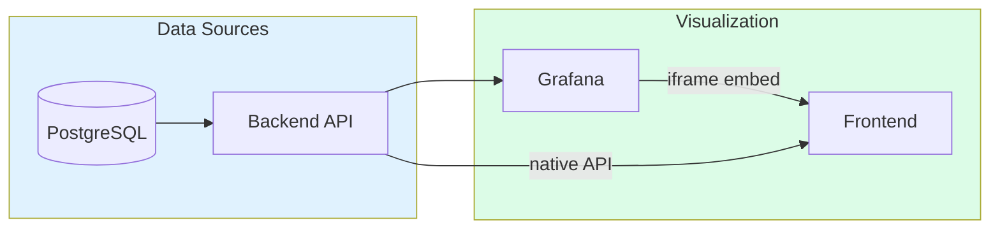

# Analytics


Analytics dashboard for monitoring detection trends, risk analysis, and camera performance metrics.

## What You're Looking At

The Analytics page provides comprehensive insights into security detection patterns, risk trends, and camera performance. Powered by Grafana dashboards, this page helps you understand activity patterns, identify anomalies, and monitor system health.

### Layout Overview

```
+----------------------------------------------------------+
|  HEADER: BarChart Icon | "Analytics" | Action Buttons     |
+----------------------------------------------------------+
|                                                          |
|  +----------------------------------------------------+  |
|  |                                                    |  |
|  |           GRAFANA DASHBOARD EMBED                  |  |
|  |                                                    |  |
|  |  +------------+ +------------+ +------------+      |  |
|  |  | Detection  | | Risk       | | Camera     |      |  |
|  |  | Trends     | | Analysis   | | Performance|      |  |
|  |  +------------+ +------------+ +------------+      |  |
|  |                                                    |  |
|  |  +------------------------------------------+      |  |
|  |  |                                          |      |  |
|  |  |           VISUALIZATION PANELS           |      |  |
|  |  |                                          |      |  |
|  |  +------------------------------------------+      |  |
|  |                                                    |  |
|  +----------------------------------------------------+  |
|                                                          |
+----------------------------------------------------------+
```

The page embeds the HSI Analytics dashboard from Grafana, which provides:

- **Detection Trends** - Daily detection counts visualized over time
- **Risk Analysis** - Risk score distribution and historical breakdown
- **Camera Activity** - Metrics and activity patterns per camera
- **Activity Baselines** - Learned patterns for anomaly detection

## Key Components

### Header Controls

| Button | Function |
|--------|----------|
| **Grafana / Native Toggle** | Switch between embedded Grafana dashboard and native React components |
| **Open in Grafana** | Opens the full Grafana dashboard in a new tab for advanced features (Grafana view only) |
| **Refresh** | Reloads the embedded dashboard (Grafana view only) |

### View Modes

The Analytics page supports two view modes:

#### Grafana View (Default)

The primary view embeds the HSI Analytics Grafana dashboard (`hsi-analytics`) in kiosk mode. This provides:

- Consistent visualization style with other monitoring dashboards
- Auto-refresh every 30 seconds
- Full Grafana interactivity (zoom, pan, time range selection)
- Access to all Grafana features when opened in full mode

#### Native View

A fallback view showing select React-based analytics components:

| Component | Description |
|-----------|-------------|
| **Camera Uptime Card** | 7-day uptime statistics for all cameras |
| **Pipeline Latency Panel** | Real-time AI pipeline processing metrics |

Use native view when Grafana is unavailable or for quick access to specific metrics.

### Grafana Dashboard Panels

The embedded Grafana dashboard includes panels for:

| Panel | Description |
|-------|-------------|
| **Detection Trend** | Time series of daily detection counts |
| **Risk Distribution** | Breakdown of events by risk level (Low/Medium/High/Critical) |
| **Camera Activity** | Event counts and activity per camera |
| **Object Distribution** | Detection counts by object type |
| **Risk History** | Stacked area chart of risk levels over time |

## Understanding Analytics Data

### Detection Trends

The detection trend visualization shows how many detections occur over time:

| Pattern | Meaning |
|---------|---------|
| **Activity spikes** | Unusual increase in detections (potential event) |
| **Quiet periods** | Low activity (normal or potential camera issues) |
| **Day/night cycles** | Expected pattern for outdoor cameras |
| **Consistent baseline** | Normal operation |

### Risk Analysis

Events are categorized by risk level based on AI analysis:

| Risk Level | Score Range | Color | Meaning |
|------------|-------------|-------|---------|
| Low | 0-30 | Green | Routine activity |
| Medium | 31-60 | Yellow | Notable but expected |
| High | 61-80 | Orange | Requires attention |
| Critical | 81-100 | Red | Immediate review needed |

### Camera Performance

Monitor camera health through:

- **Uptime percentage** - Days with detections vs. total days
- **Activity distribution** - Which cameras are most active
- **Detection quality** - Confidence scores of AI detections

## Using Analytics Effectively

### Daily Review

1. Check detection trends for any unusual spikes
2. Review high-risk events in the risk distribution panel
3. Verify all cameras show expected activity

### Weekly Review

1. Compare this week's trends to previous weeks
2. Look for pattern changes in activity levels
3. Check if any cameras are underperforming

### After Incidents

1. Use time range selection to focus on incident period
2. Review risk levels during the timeframe
3. Check which cameras captured the activity

## Settings & Configuration

### Grafana URL

The Grafana URL is automatically configured from the backend. If the embedded dashboard fails to load:

1. Verify Grafana is running
2. Check the `grafana_url` config setting
3. Verify network connectivity between frontend and Grafana

### Dashboard Configuration

The HSI Analytics dashboard is provisioned automatically:

```yaml
# Grafana provisioning location
grafana/dashboards/hsi-analytics.json
```

### Auto-Refresh

The embedded dashboard refreshes every 30 seconds automatically. Use the manual Refresh button for immediate updates.

## Troubleshooting

### Dashboard Shows "No Data"

1. **Check time range**: Expand the time period in Grafana
2. **Verify cameras are active**: Check camera status in the Cameras page
3. **Check AI pipeline**: Verify the detection pipeline is running
4. **Verify datasources**: Confirm Grafana can reach the backend API

### "Failed to load configuration" Error

The frontend couldn't fetch the Grafana URL from the backend:

1. Verify the backend is running
2. Check network connectivity
3. The dashboard will use `/grafana` as a fallback

### Dashboard Loads But Shows Empty Panels

1. Check that data exists in the database
2. Verify the Grafana datasource is configured correctly
3. Try opening in full Grafana to see any error messages

### Native View Shows Errors

If the native view components fail to load:

1. Check backend API connectivity
2. Verify the `/api/analytics/*` endpoints are responding
3. Check browser console for specific error messages

## Technical Deep Dive

### Architecture



### Related Code

**Frontend:**
- Analytics Page: `frontend/src/components/analytics/AnalyticsPage.tsx`
- Camera Uptime Card: `frontend/src/components/analytics/CameraUptimeCard.tsx`
- Pipeline Latency Panel: `frontend/src/components/analytics/PipelineLatencyPanel.tsx`
- Grafana URL Utility: `frontend/src/utils/grafanaUrl.ts`

**Backend:**
- Analytics Routes: `backend/api/routes/analytics.py`
- System Routes: `backend/api/routes/system.py` (pipeline latency)

**Infrastructure:**
- Grafana Dashboard: `grafana/dashboards/hsi-analytics.json`
- Grafana Container: `docker-compose.prod.yml` (grafana service)

### API Endpoints

| Endpoint | Method | Description |
|----------|--------|-------------|
| `/api/analytics/detection-trends` | GET | Daily detection counts |
| `/api/analytics/risk-history` | GET | Daily risk level breakdown |
| `/api/analytics/camera-uptime` | GET | Camera uptime percentages |
| `/api/analytics/object-distribution` | GET | Detection counts by object type |
| `/api/system/pipeline-latency` | GET | Pipeline stage latencies |

### Data Flow

1. Detection data is stored in PostgreSQL via the AI pipeline
2. Backend API aggregates and serves analytics data
3. Grafana queries the backend API for visualizations
4. Frontend embeds the Grafana dashboard in an iframe
5. Native view components query the API directly

---

## Quick Reference

### When to Use Analytics

| Scenario | What to Look For |
|----------|------------------|
| Daily monitoring | Detection trends, high-risk events |
| Camera issues | Low activity, missing detections |
| Security review | Risk distribution, activity patterns |
| Performance check | Pipeline latency (native view) |

### Common Actions

| I want to... | Do this... |
|--------------|------------|
| See overall trends | Use Grafana view (default) |
| Check pipeline health | Switch to Native view |
| Get more dashboard controls | Click "Open in Grafana" |
| Force data refresh | Click "Refresh" button |
| Compare time periods | Use Grafana time range picker |
