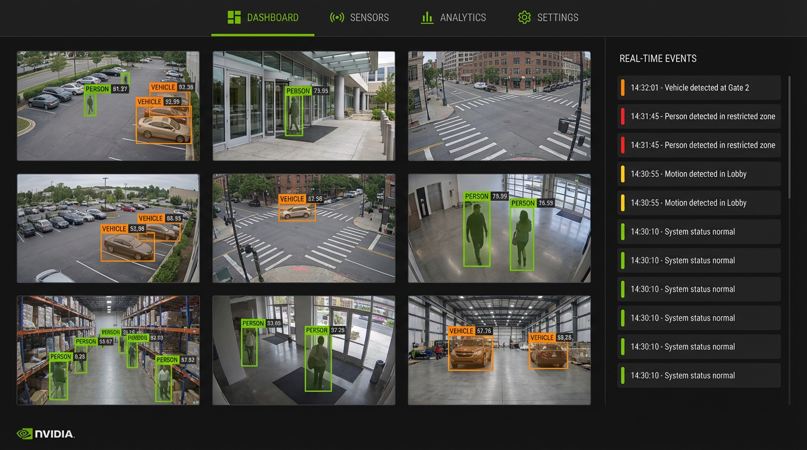
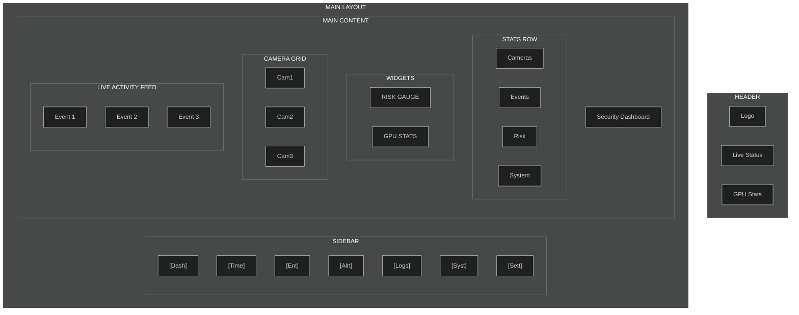
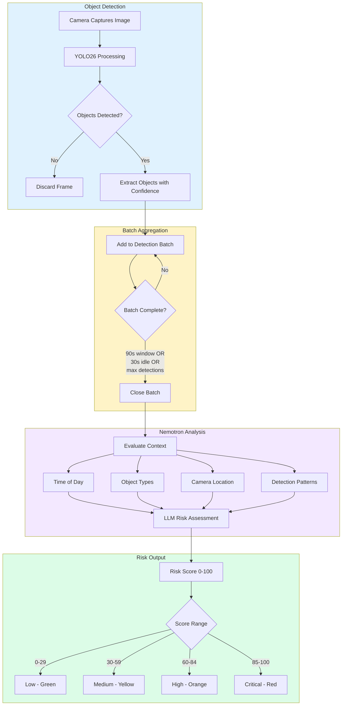
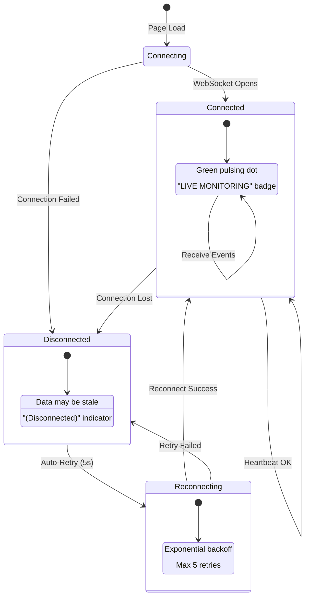

# Dashboard

_AI-generated visualization of the security dashboard interface with camera grid and real-time event feed._

The main monitoring view showing real-time security status across all cameras.

## What You're Looking At

The Dashboard is your central hub for home security monitoring. When you open the dashboard, you see the main Security Dashboard page - your home base for monitoring everything happening around your property. The system automatically watches your cameras, detects movement, and uses AI to assess whether activity might be a security concern.

### Layout Overview

It provides a customizable layout with these default widgets:

- **Stats Row** - Key metrics including active cameras, events today, current risk level, and system status
- **Camera Grid** - Live status of all connected cameras with thumbnails
- **Activity Feed** - Real-time scrolling list of recent detection events

Additional widgets can be enabled via the **Configure** button:

- **GPU Statistics** - NVIDIA GPU utilization, memory, temperature, and inference metrics
- **Pipeline Telemetry** - AI pipeline latency, throughput, and queue metrics
- **Pipeline Queues** - Detection and analysis queue depths

## Key Components

### Stats Row

The Stats Row displays four clickable metric cards at the top of the dashboard:

| Card               | Shows                                    | Click Action          |
| ------------------ | ---------------------------------------- | --------------------- |
| **Active Cameras** | Number of online cameras                 | Opens Settings page   |
| **Events Today**   | Total events detected today              | Opens Timeline page   |
| **Current Risk**   | Latest risk score (0-100) with sparkline | Opens Alerts page     |
| **System Status**  | Service health (Online/Degraded/Offline) | Opens Operations page |

The **Risk Sparkline** displays a mini chart of the last 10 risk scores, providing a visual trend of recent activity levels.

**Reading the Sparkline:**

| Pattern            | Meaning                                  |
| ------------------ | ---------------------------------------- |
| **Flat low line**  | Consistent low-risk activity (normal)    |
| **Rising trend**   | Risk increasing over recent events       |
| **Falling trend**  | Risk decreasing - situation improving    |
| **Spiky pattern**  | Mixed activity with varying risk levels  |
| **Flat high line** | Sustained high-risk period - investigate |

The sparkline only appears when there are at least 2 recent events to compare. The line color matches the current risk level (green, yellow, orange, or red).

> **Tip:** A rising sparkline with increasing risk scores may indicate developing security concerns worth investigating, even if the current score is still moderate.

### Risk Levels

The risk score is determined by the NVIDIA Nemotron LLM analyzing detected objects, time of day, location context, and behavioral patterns. Scores map to four severity levels:

| Score Range | Level        | Color  | Description                                        |
| ----------- | ------------ | ------ | -------------------------------------------------- |
| 0-29        | **Low**      | Green  | Normal activity, no concerns                       |
| 30-59       | **Medium**   | Yellow | Unusual but not threatening                        |
| 60-84       | **High**     | Orange | Suspicious activity requiring attention            |
| 85-100      | **Critical** | Red    | Potential security threat, immediate action needed |

**What Each Level Typically Means:**

- **Low (0-29):** Regular household activity, family members coming and going, expected deliveries, animals and wildlife, normal neighborhood traffic
- **Medium (30-59):** Unfamiliar people near property, activity at unusual hours, longer-than-normal presence, vehicles stopping briefly
- **High (60-84):** Unknown individuals approaching doors/windows, activity late at night, multiple people acting together, repeated visits by same unknown person
- **Critical (85-100):** Attempted unauthorized entry, suspicious behavior near entry points, known threat indicators, emergency situations

**How Nemotron Calculates Risk:**

1. **Object Detection**: YOLO26 identifies objects (persons, vehicles, animals) with confidence scores
2. **Batch Aggregation**: Related detections are grouped into up to 90-second time windows (closing after 30 seconds of idle or when max detections reached)
3. **Context Analysis**: Nemotron evaluates:
   - Time of day (e.g., 2 AM person detection vs noon)
   - Object types and confidence levels
   - Camera location (e.g., entry points vs backyard)
   - Detection frequency and patterns
4. **Risk Assessment**: LLM generates a score, level, summary, and reasoning

### Diagram: Risk Score Calculation Flow

### Camera Grid

Each camera card displays:

- **Thumbnail** - Latest snapshot (refreshed on page load)
- **Camera name** - Location identifier (e.g., "Front Door")
- **Status badge** - Current connection status
- **Last seen time** - When the camera was last active

**Status Indicators:**

| Status    | Color  | Description                           |
| --------- | ------ | ------------------------------------- |
| Online    | Green  | Camera is connected and active        |
| Recording | Yellow | Camera is actively recording motion   |
| Offline   | Gray   | Camera is disconnected or powered off |
| Error     | Red    | Camera has a connection error         |
| Unknown   | Gray   | Status could not be determined        |

Click any camera card to navigate to the Timeline filtered to that camera's events.

### Activity Feed

The right panel shows a real-time scrolling list of recent security events:

- **Thumbnail** - Small preview image from the detection
- **Camera name** - Which camera captured it
- **Risk badge** - Color-coded severity level with score
- **Summary** - AI-generated description of the event
- **Timestamp** - Relative time (e.g., "5 mins ago") or absolute date

**Features:**

- **Auto-scroll**: New events automatically scroll into view (can be paused)
- **Click to expand**: Click any event to open it in the Timeline with full details
- **Event limit**: Shows the 10 most recent events by default

### GPU Statistics (Optional)

When enabled via Configure, displays real-time NVIDIA GPU metrics:

- **Utilization** - GPU compute usage percentage
- **Memory** - VRAM usage (used / total in GB)
- **Temperature** - GPU temperature with color coding
- **Power Usage** - Wattage consumption
- **Inference FPS** - AI model frames per second
- **History Charts** - Tabbed view of utilization, temperature, and memory trends

**Temperature Color Coding:**

| Range  | Color  | Meaning                 |
| ------ | ------ | ----------------------- |
| < 70C  | Green  | Normal operation        |
| 70-80C | Yellow | Moderate load           |
| >= 80C | Red    | High load, may throttle |

**Power Color Coding:**

| Range    | Color  | Meaning          |
| -------- | ------ | ---------------- |
| < 150W   | Green  | Normal operation |
| 150-250W | Yellow | Moderate load    |
| > 250W   | Red    | High load        |

**Controls:**

- **Pause/Resume** - Stop or start data collection
- **Clear** - Reset the history chart data

### Pipeline Telemetry (Optional)

When enabled via Configure, displays AI pipeline metrics:

- **Queue Depths** - Detection and analysis queue sizes
- **Processing Latency** - Average, p95, and p99 latencies for each stage
- **Throughput** - Detections and analyses per minute
- **Error Rate** - Pipeline error percentage
- **History Charts** - Detection latency, analysis latency, and throughput trends

### Pipeline Queues (Optional)

Shows the current backlog of images waiting to be processed:

| Queue               | Purpose                                    |
| ------------------- | ------------------------------------------ |
| **Detection Queue** | Images waiting for YOLO26 object detection |
| **Analysis Queue**  | Batches waiting for Nemotron AI analysis   |

**Queue Status Colors:**

| Depth | Color  | Meaning                             |
| ----- | ------ | ----------------------------------- |
| 0     | Gray   | Empty queue                         |
| 1-5   | Green  | Normal operation                    |
| 6-10  | Yellow | Building up                         |
| 10+   | Red    | Backlog - processing may be delayed |

A warning message appears when queues exceed the threshold (default: 10), indicating processing is falling behind and events may be delayed.

## AI Enrichment Data in Event Details

When you view an event in detail (by clicking an event in the Activity Feed), the system shows AI Enrichment Analysis - additional information extracted by specialized AI models that run on each detection. This enrichment data provides deeper insight into what was detected.

### What is AI Enrichment?

Basic object detection tells you "there is a person" or "there is a vehicle." AI enrichment goes further:

- **For vehicles:** What type? What color? Any damage? Is there a license plate?
- **For people:** What are they wearing? Are they carrying anything? Face visible?
- **For animals:** Is it a cat or dog? Is it likely a household pet?
- **For the scene:** What's the weather? What's the image quality?

This additional context helps the system assign more accurate risk scores and helps you understand situations at a glance.

### Enrichment Data Types

#### Vehicle Information

| Field          | Description                                      | Example Values                      |
| -------------- | ------------------------------------------------ | ----------------------------------- |
| **Type**       | Vehicle category                                 | Sedan, SUV, Pickup, Van, Truck      |
| **Color**      | Primary vehicle color                            | Silver, Black, White, Red, Blue     |
| **Damage**     | Detected damage types (security relevant)        | Cracks, Dents, Scratches, Tire Flat |
| **Commercial** | Whether it appears to be a delivery/work vehicle | Badge shown if detected             |

**Damage Types (Security Relevant):**

- **Glass Shatter** - Broken windows (possible break-in)
- **Lamp Broken** - Damaged headlights/taillights
- **Cracks, Dents, Scratches** - Body damage
- **Tire Flat** - Deflated or damaged tires

#### Person Information

| Field                 | Description                         | Example Values                       |
| --------------------- | ----------------------------------- | ------------------------------------ |
| **Clothing**          | General clothing description        | Red t-shirt, Blue jeans, Dark jacket |
| **Action**            | What the person appears to be doing | Walking, Standing, Crouching         |
| **Carrying**          | Items being carried                 | Backpack, Package, Bag               |
| **Suspicious Attire** | Security-relevant clothing flags    | Face covered, All-dark clothing      |
| **Service Uniform**   | Delivery/service worker clothing    | Visible if detected                  |

**Security Flags:**

- **Suspicious Attire** (yellow warning) - Face coverings, all-dark clothing at night, masks
- **Service Uniform** (blue info) - Delivery driver uniforms, maintenance worker clothing

#### License Plate Detection

| Field          | Description                      | Format     |
| -------------- | -------------------------------- | ---------- |
| **Plate Text** | OCR-extracted plate number       | ABC-1234   |
| **Confidence** | How confident the OCR reading is | Percentage |

#### Pet Identification

| Field          | Description                        | Example Values  |
| -------------- | ---------------------------------- | --------------- |
| **Type**       | Animal type                        | Cat, Dog        |
| **Breed**      | Detected breed (when identifiable) | Labrador, Tabby |
| **Confidence** | Classification confidence          | Percentage      |

Pet detection helps reduce false alarms - when the system identifies a high-confidence household pet with no other concerning factors, it can automatically lower the risk score.

#### Weather Conditions

| Field          | Description          | Example Values         |
| -------------- | -------------------- | ---------------------- |
| **Condition**  | Detected weather     | Clear, Rain, Snow, Fog |
| **Confidence** | Detection confidence | Percentage             |

Weather context helps interpret events - a person running in rain may be rushing to get inside rather than fleeing a scene.

### Understanding Confidence Scores

Each enrichment section shows a confidence badge indicating how certain the AI is:

| Confidence Level    | Color  | Meaning                          |
| ------------------- | ------ | -------------------------------- |
| **High (>80%)**     | Green  | AI is confident in the result    |
| **Medium (50-80%)** | Yellow | AI is moderately confident       |
| **Low (<50%)**      | Red    | AI is uncertain; verify manually |

### How Enrichment Affects Risk Scores

**Factors that increase risk:**

- Suspicious attire (face coverings, all-dark at night)
- High-security vehicle damage (broken glass, broken lights)
- Poor image quality (possible camera tampering)
- Violence detection (when multiple people are present)

**Factors that decrease risk:**

- Confirmed household pets
- Service uniforms (delivery drivers, maintenance workers)
- Commercial vehicles (during daytime)

## Customizing the Dashboard

Click the **Configure** button (gear icon) in the top-right corner to:

1. **Toggle widgets** - Show or hide any widget using the switches
2. **Reorder widgets** - Use up/down arrows to change display order
3. **Reset to defaults** - Restore the original layout

Configuration is saved to your browser's localStorage and persists across sessions.

**Default Configuration:**

| Widget             | Default State |
| ------------------ | ------------- |
| Stats Row          | Visible       |
| Camera Grid        | Visible       |
| Activity Feed      | Visible       |
| GPU Statistics     | Hidden        |
| Pipeline Telemetry | Hidden        |
| Pipeline Queues    | Hidden        |

## Real-Time Updates

The dashboard receives real-time updates via WebSocket connections:

- **Events channel** (`/ws/events`) - New security events as they're created
- **System channel** (`/ws/system`) - GPU stats, queue depths, service health every 5 seconds

### Connection Status

At the top of the dashboard, a status indicator shows whether you are receiving real-time updates:

- **Connected** (green pulsing dot with "LIVE MONITORING") - Everything is working normally
- **Disconnected** - Real-time updates paused; data may be stale

If disconnected, the dashboard will still show the most recent data but will not update automatically until connection is restored. A **(Disconnected)** indicator appears in the header when WebSocket connections are lost.

**Hovering over the status indicator** displays a tooltip showing the health of individual services (database, Redis, detector, file watcher, Nemotron).

### Diagram: Connection Status States

## Troubleshooting

### Risk score shows "0"

No events have been detected recently. This is normal when cameras are idle or the system just started.

### System Status shows "Unknown"

The system status WebSocket may still be connecting. This typically resolves within a few seconds of page load.

### Camera shows "Offline"

1. Verify the camera is powered on and connected to the network
2. Check FTP upload settings on the camera (should point to your server)
3. Ensure the camera's folder exists at `/export/foscam/{camera_name}/`
4. Check the backend logs for FTP connection errors

### Activity Feed is empty

No events have been detected in the current time range. Possible causes:

- Cameras are not detecting motion
- Detection confidence is below threshold (default 50%)
- AI services (YOLO26 or Nemotron) are offline

### GPU Statistics shows "N/A"

- The GPU monitoring service may not have data yet (wait 5-10 seconds)
- NVIDIA drivers may not be properly configured on the host
- The AI services container may not have GPU access

### Dashboard looks different than expected

Your dashboard configuration is stored in localStorage. Click **Configure** > **Reset to Defaults** to restore the standard layout.

---

## Navigation

The left sidebar provides navigation to different areas of the application:

| Button        | What It Does                              |
| ------------- | ----------------------------------------- |
| **Dashboard** | Main overview (current page)              |
| **Timeline**  | All past events with filters              |
| **Entities**  | Tracked people/objects (work in progress) |
| **Alerts**    | High-priority events only                 |
| **Logs**      | Technical logs                            |
| **Audit Log** | Security-sensitive actions (advanced)     |
| **System**    | Performance monitoring                    |
| **Settings**  | Configuration options                     |

The current page is highlighted in bright green.

### Keyboard Shortcuts

When viewing event details (from the Activity Feed):

| Key         | Action               |
| ----------- | -------------------- |
| Left Arrow  | Go to previous event |
| Right Arrow | Go to next event     |
| Escape      | Close the popup      |

---

## Tips for Effective Dashboard Use

### For Everyday Monitoring

1. Keep **Stats Row** and **Camera Grid** visible for a quick overview
2. Enable **Activity Feed** if you want to see events in real-time
3. Hide technical widgets (GPU, Pipeline) unless troubleshooting
4. Check the dashboard periodically to stay aware of security status
5. Watch the risk gauge - if it turns yellow, orange, or red, investigate the activity feed

### For Technical Monitoring

1. Enable **GPU Statistics** to monitor AI hardware health
2. Add **Pipeline Telemetry** to track processing performance
3. Use **Pipeline Queues** to spot processing bottlenecks
4. Monitor GPU temperature - high temperatures may indicate the system needs attention

### When Investigating Events

1. Use the **Pause** button on the Activity Feed to stop auto-scrolling
2. Click any event to see full details in a popup window
3. Review high and critical events promptly
4. Add notes to events for future reference

---

## Quick Reference

### Color Guide

| Color  | Meaning               | Action            |
| ------ | --------------------- | ----------------- |
| Green  | Normal / Low Risk     | No action needed  |
| Yellow | Caution / Medium Risk | Worth monitoring  |
| Orange | Warning / High Risk   | Check soon        |
| Red    | Critical / Urgent     | Check immediately |

### Status Indicators

| Indicator     | Meaning                      |
| ------------- | ---------------------------- |
| Pulsing dot   | System active and working    |
| Solid dot     | Status indicator (see color) |
| Spinning icon | Loading or refreshing        |

### Common Actions

| I want to...               | Do this...                                     |
| -------------------------- | ---------------------------------------------- |
| See what just happened     | Look at the Live Activity feed                 |
| Find old events            | Go to Timeline and use filters                 |
| See urgent items only      | Go to Alerts page                              |
| Mark something as reviewed | Click event, then "Mark as Reviewed"           |
| Add notes to an event      | Click event, type in Notes section, click Save |
| Check system health        | Hover over the status indicator in the header  |

---

## Technical Deep Dive

For developers wanting to understand the underlying systems.

### Architecture

- **AI Pipeline**: [Detection, Batching, and Analysis Flow](../architecture/ai-pipeline.md)
- **Real-time Updates**: [WebSocket and Redis Pub/Sub](../architecture/real-time.md)
- **Risk Level Configuration**: See `frontend/src/utils/risk.ts` for threshold definitions

### Related Code

**Frontend:**

- Dashboard Page: `frontend/src/components/dashboard/DashboardPage.tsx`
- Dashboard Layout: `frontend/src/components/dashboard/DashboardLayout.tsx`
- Stats Row: `frontend/src/components/dashboard/StatsRow.tsx`
- Camera Grid: `frontend/src/components/dashboard/CameraGrid.tsx`
- Activity Feed: `frontend/src/components/dashboard/ActivityFeed.tsx`
- GPU Stats: `frontend/src/components/dashboard/GpuStats.tsx`
- Pipeline Telemetry: `frontend/src/components/dashboard/PipelineTelemetry.tsx`
- Configuration Modal: `frontend/src/components/dashboard/DashboardConfigModal.tsx`
- Configuration Store: `frontend/src/stores/dashboardConfig.ts`

**Hooks:**

- WebSocket Events: `frontend/src/hooks/useEventStream.ts`
- System Status: `frontend/src/hooks/useSystemStatus.ts`
- Risk Utilities: `frontend/src/utils/risk.ts`

**Backend:**

- Event Broadcasting: `backend/services/event_broadcaster.py`
- System Broadcasting: `backend/services/system_broadcaster.py`
- Nemotron Analyzer: `backend/services/nemotron_analyzer.py`
- Batch Aggregator: `backend/services/batch_aggregator.py`
