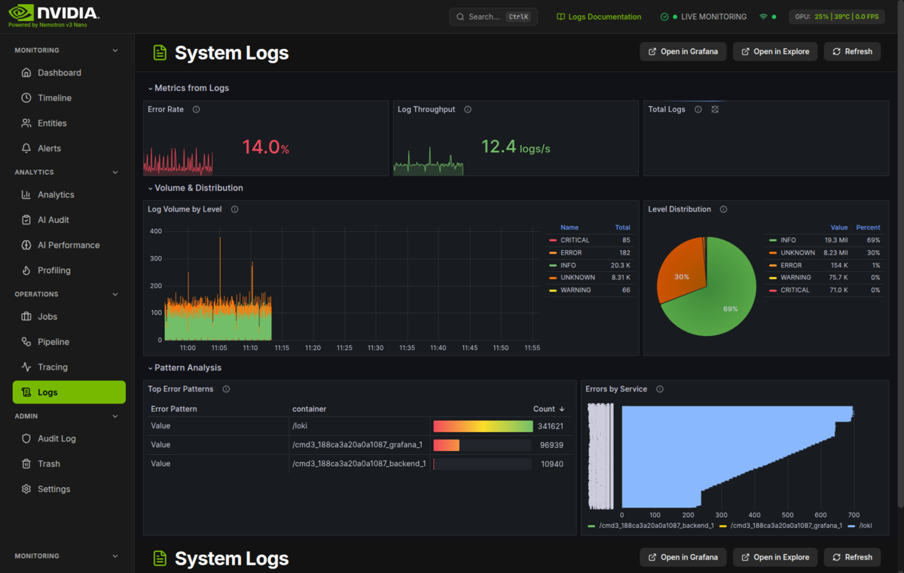
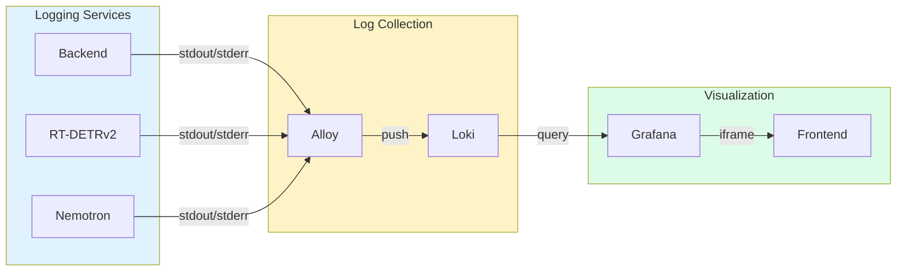

# System Logs



Centralized logging dashboard for viewing, filtering, and analyzing system logs via Grafana/Loki.

## What You're Looking At

The System Logs page provides a unified view of all application logs using the HSI System Logs dashboard embedded from Grafana. Powered by Loki, this page helps you monitor system health, debug issues, and track activity across the entire security monitoring platform.

### Layout Overview

```
+----------------------------------------------------------+
|  HEADER: FileText Icon | "System Logs" | Action Buttons   |
+----------------------------------------------------------+
|                                                          |
|  +----------------------------------------------------+  |
|  |                                                    |  |
|  |           GRAFANA DASHBOARD EMBED                  |  |
|  |                                                    |  |
|  |  +------------+ +------------+ +------------+      |  |
|  |  | Log Level  | | Component  | | Time       |      |  |
|  |  | Filter     | | Filter     | | Range      |      |  |
|  |  +------------+ +------------+ +------------+      |  |
|  |                                                    |  |
|  |  +------------------------------------------+      |  |
|  |  |                                          |      |  |
|  |  |           LOG STREAM / TABLE             |      |  |
|  |  |                                          |      |  |
|  |  +------------------------------------------+      |  |
|  |                                                    |  |
|  +----------------------------------------------------+  |
|                                                          |
+----------------------------------------------------------+
```

The page embeds the HSI System Logs dashboard from Grafana, which provides:

- **Log Level Filter** - Filter by severity (DEBUG, INFO, WARNING, ERROR, CRITICAL)
- **Component Filter** - Filter by source service or component
- **Time Range** - Select the time period to view
- **Log Stream** - Real-time log viewing with LogQL query support

### Log Sources

The centralized logging system collects logs from:

- **Backend API services** - API route handlers, authentication, and request processing
- **AI detection pipeline** - RT-DETRv2 detection, Nemotron risk analysis, batch aggregation
- **File watcher** - Camera FTP uploads and image processing
- **WebSocket events** - Real-time connection status and broadcast messages
- **Cleanup services** - Data retention and file management

## Key Components

### Header Controls

| Button | Function |
|--------|----------|
| **Open in Grafana** | Opens the full HSI System Logs dashboard in a new tab for advanced features |
| **Open in Explore** | Opens Grafana Explore with Loki datasource for ad-hoc LogQL queries |
| **Refresh** | Reloads the embedded dashboard |

### Log Levels

Logs are categorized by severity level:

| Level | Color | Use Case |
|-------|-------|----------|
| **DEBUG** | Gray | Verbose development information |
| **INFO** | Blue | Normal operations, successful actions |
| **WARNING** | Yellow | Potential issues that don't block operations |
| **ERROR** | Red | Failed operations requiring attention |
| **CRITICAL** | Red (bold) | Severe failures, system instability |

### Using LogQL

Loki uses LogQL, a query language similar to PromQL. Common query patterns:

**Basic filtering:**

```logql
{job="hsi-backend"} |= "error"
```

**Filter by log level:**

```logql
{job="hsi-backend"} | json | level="ERROR"
```

**Search across all services:**

```logql
{namespace="hsi"} |~ "(?i)detection"
```

**Common LogQL Operators:**

| Operator | Description | Example |
|----------|-------------|---------|
| `\|=` | Contains string | `\|= "error"` |
| `\|~` | Matches regex | `\|~ "timeout\|failed"` |
| `!=` | Does not contain | `!= "health"` |
| `!~` | Does not match regex | `!~ "debug"` |

## Common Use Cases

### Troubleshooting a Specific Issue

1. Click **Open in Explore** to access the full LogQL interface
2. Use a query like `{job="hsi-backend"} |= "error" | json | line_format "{{.message}}"`
3. Adjust the time range to cover when the issue occurred
4. Review matching log entries and their context

### Monitoring a Specific Service

1. In the embedded dashboard, use the component/job filter dropdown
2. Select the service you want to monitor (e.g., `hsi-rtdetr`, `hsi-nemotron`)
3. Optionally filter by log level to focus on warnings and errors

### Real-time Log Streaming

1. Set the time range to "Last 5 minutes" or similar recent range
2. Enable auto-refresh (30s is set by default in the dashboard)
3. Watch logs stream in as they are generated

### Finding Logs for a Specific Camera

Use LogQL to filter by camera:

```logql
{job="hsi-backend"} | json | camera_id="front_door"
```

### Investigating High Error Rates

1. Click **Open in Explore**
2. Query error logs: `{namespace="hsi"} | json | level="ERROR"`
3. Use the log visualization to see error distribution over time
4. Drill into specific time periods with high error counts

## Settings & Configuration

### Grafana URL

The Grafana URL is automatically configured from the backend. If the embedded dashboard fails to load:

1. Verify Grafana is running
2. Check the `grafana_url` config setting
3. Verify network connectivity

### Loki Data Source

Loki must be configured as a data source in Grafana:

```yaml
# Grafana provisioning (grafana/datasources.yml)
- name: Loki
  type: loki
  url: http://loki:3100
  access: proxy
```

### Dashboard Auto-Refresh

The embedded dashboard is configured with:

| Setting | Default | Description |
|---------|---------|-------------|
| Refresh Interval | 30 seconds | How often the dashboard auto-updates |
| Kiosk Mode | Enabled | Hides Grafana navigation for clean embed |
| Theme | Dark | Matches the HSI application theme |

### Retention

Log data retention is configured in Loki:

| Setting | Default | Description |
|---------|---------|-------------|
| Retention Period | 7 days | How long logs are kept |
| Compaction | Enabled | Automatic storage optimization |

## Troubleshooting

### Dashboard Shows "No Data"

1. **Check Loki is running**: `docker ps | grep loki`
2. **Verify Alloy is collecting logs**: Check Alloy container logs
3. **Check time range**: Ensure the selected time range has log data
4. **Verify datasource**: Confirm Loki is configured in Grafana

### Logs are Missing from a Service

1. **Check service labels**: Ensure the service has proper job/namespace labels
2. **Verify Alloy configuration**: Check that the service logs are being scraped
3. **Check log format**: Ensure logs are in a format Loki can parse

### "Failed to load configuration" Error

The frontend couldn't fetch the Grafana URL from the backend:

1. Verify the backend is running
2. Check network connectivity
3. The dashboard will use `/grafana` as a fallback

### Embedded Dashboard Doesn't Load

1. **Check Grafana is accessible**: Navigate directly to the Grafana URL
2. **Verify dashboard exists**: Check that `hsi-logs` dashboard is provisioned
3. **Check browser console**: Look for CORS or iframe errors
4. **Try refreshing**: Click the Refresh button in the header

### LogQL Query Errors

1. **Check syntax**: LogQL requires labels in curly braces first
2. **Escape special characters**: Use backslash for regex special chars
3. **Use Explore**: The Grafana Explore view provides query hints and autocomplete

## Technical Deep Dive

### Architecture



### Data Flow

1. Services write logs to stdout/stderr
2. Grafana Alloy collects and labels log streams
3. Alloy pushes logs to Loki for storage and indexing
4. Grafana queries Loki for visualization
5. Frontend embeds Grafana dashboard in iframe

### Related Code

**Frontend:**
- Logs Page: `frontend/src/components/logs/LogsPage.tsx`
- Grafana URL Utility: `frontend/src/utils/grafanaUrl.ts`

**Backend:**
- Configuration: `backend/core/config.py`

**Infrastructure:**
- Loki Container: `docker-compose.prod.yml` (loki service)
- Grafana Dashboard: `grafana/dashboards/hsi-logs.json`
- Alloy Configuration: `alloy/config.alloy`

### Dashboard Configuration

The embedded dashboard URL includes these parameters:

| Parameter | Value | Purpose |
|-----------|-------|---------|
| `orgId` | 1 | Grafana organization ID |
| `kiosk` | 1 | Hide Grafana navigation |
| `theme` | dark | Match HSI dark theme |
| `refresh` | 30s | Auto-refresh interval |

Full URL pattern:
```
{grafana_url}/d/hsi-logs/hsi-system-logs?orgId=1&kiosk=1&theme=dark&refresh=30s
```

## Correlation with Other Observability Tools

### Logs to Traces

When investigating an issue, correlate logs with distributed traces:

1. Find a relevant log entry with a trace ID
2. Open the [Distributed Tracing](tracing.md) page
3. Search for the trace ID to see the full request flow

### Logs to Profiling

Correlate logs with continuous profiling data:

1. Note the timestamp of interesting log entries
2. Open the [Profiling](pyroscope.md) page
3. Select the same time range to see resource usage patterns

### Logs to Events

Investigate security events through their logs:

1. Note the Event ID from the [Timeline](timeline.md)
2. Use LogQL to search: `{job="hsi-backend"} |= "event_id=123"`
3. Review the processing logs for that event

---

## Quick Reference

### When to Use Logs

| Scenario | Query Approach |
|----------|----------------|
| Debugging errors | Filter by level=ERROR |
| Service health | Filter by job/service |
| Specific event | Search by event ID or correlation ID |
| Time-based investigation | Set time range, scan chronologically |

### Common Actions

| I want to... | Do this... |
|--------------|------------|
| See all errors | `{namespace="hsi"} \| json \| level="ERROR"` |
| Filter by service | Use job dropdown in dashboard |
| Advanced queries | Click "Open in Explore" |
| Full Grafana features | Click "Open in Grafana" |
| Refresh view | Click the Refresh button |
