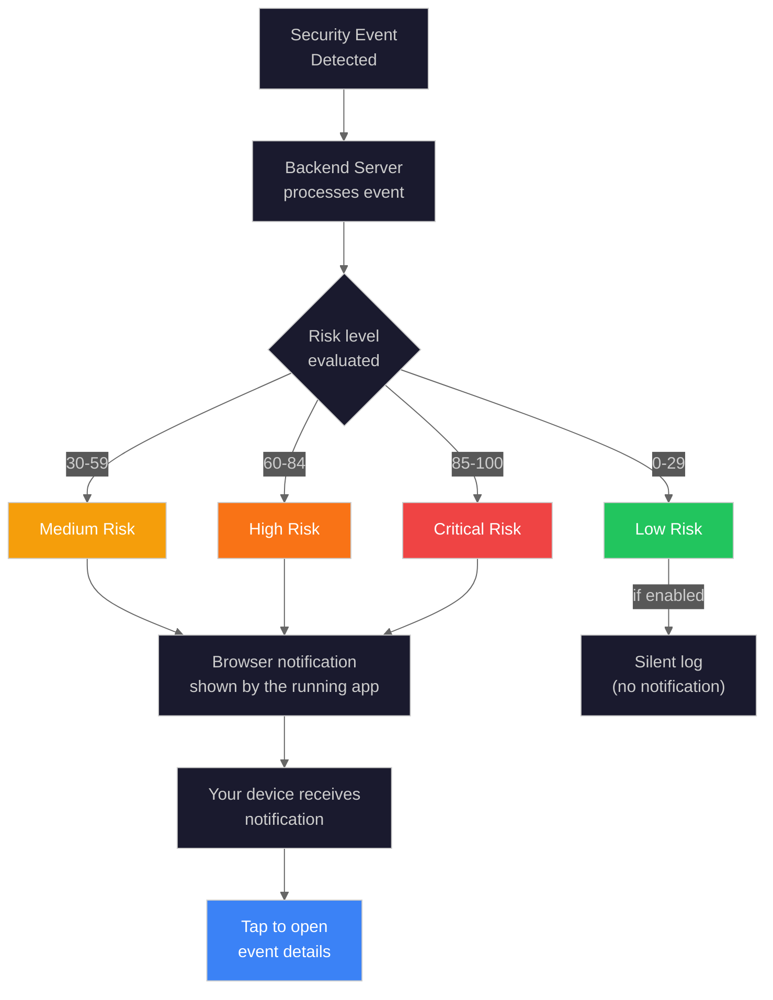

# Mobile and PWA Guide

> Install the security dashboard on your phone or tablet and receive instant security alerts.

**Time to read:** ~15 min
**Prerequisites:** a running dashboard you can already open in the browser (see [Getting Started](getting-started.md) if you have not installed one yet)

---

The Nemotron Security Dashboard works as a Progressive Web App (PWA), meaning you can install it on your phone, tablet, or desktop computer and use it like a native app. You can also enable notifications to receive security alerts while the app is open.

> **What notifications actually are today:** the app uses the browser
> `Notification` API — alerts fire while the page or installed app is running
> (`frontend/src/hooks/usePushNotifications.ts`). There is no server-side push
> service: the backend never calls `pushManager.subscribe()` and there is no
> VAPID key or push endpoint in `backend/`, so alerts are **not** delivered while
> the app is fully closed, despite the "Web Push" wording you may see elsewhere.

---

## What is a PWA?

A Progressive Web App is a website that can be installed on your device and used like a native application. PWAs combine the best of web and native apps:

| Feature             | Website | Native App | PWA |
| ------------------- | ------- | ---------- | --- |
| Install to home     | No      | Yes        | Yes |
| Works offline       | No      | Yes        | Yes |
| Push notifications  | No      | Yes        | Yes |
| Auto-updates        | Yes     | No         | Yes |
| No app store needed | Yes     | No         | Yes |
| Uses local storage  | Limited | Yes        | Yes |

---

## Installing as a PWA

Installing the dashboard as a PWA gives you:

- **Home screen icon** - Launch with one tap, just like a native app
- **Standalone mode** - No browser address bar for a cleaner experience
- **Faster loading** - App assets are cached locally
- **Offline access** - View recent cached events when network is unavailable

### Before You Install

1. Make sure you can access the dashboard in your browser
2. Verify the URL — with the compose stack that is `http://your-server:8080`
   (`FRONTEND_HTTP_PORT`) or `https://your-server:8444` (`FRONTEND_HTTPS_PORT`), or
   your custom domain. Port 5173 is only the Vite dev-server port used when running
   the frontend outside Docker.
3. The site must load successfully before installation

---

### iOS Installation (iPhone/iPad)

**Step-by-step with Safari:**

1. Open **Safari** (the blue compass icon)
2. Navigate to your dashboard URL
3. Wait for the page to fully load
4. Tap the **Share** button (square with arrow pointing up)
   - On iPhone: Bottom of screen
   - On iPad: Top right of screen
5. Scroll down in the share sheet
6. Tap **"Add to Home Screen"**
7. Edit the name if desired (default: "Security Dashboard")
8. Tap **"Add"** in the top right
9. The dashboard icon appears on your Home Screen

**iOS Limitations:**

| Limitation                | Explanation                                  |
| ------------------------- | -------------------------------------------- |
| Safari only               | Chrome/Firefox on iOS cannot install PWAs    |
| No persistent background  | iOS closes background apps more aggressively |
| Badge icons not supported | App icon won't show notification count       |
| Limited storage           | iOS may clear cache if device runs low       |

> **Tip:** Add the PWA to your main Home Screen (not a folder) to ensure iOS gives it priority for background execution.

---

### Android Installation

**From Chrome (Recommended):**

1. Open **Chrome** browser
2. Navigate to your dashboard URL
3. Wait for the page to fully load
4. Look for one of these options:
   - An **"Install"** banner at the bottom of the screen
   - Tap the **three-dot menu** (top right)
5. Tap **"Install app"** or **"Add to Home screen"**
6. Confirm by tapping **"Install"**
7. The app appears in your app drawer and home screen

**From Samsung Internet:**

1. Open **Samsung Internet** browser
2. Navigate to your dashboard URL
3. Tap the **three-line menu** (bottom)
4. Tap **"Add page to"**
5. Select **"Home screen"**
6. Tap **"Add"**

**From Firefox:**

1. Open **Firefox** browser
2. Navigate to your dashboard URL
3. Tap the **three-dot menu**
4. Tap **"Install"** (if available) or **"Add to Home screen"**

**Android-Specific Features:**

| Feature                | Benefit                                   |
| ---------------------- | ----------------------------------------- |
| True app-like behavior | Appears in app switcher and notifications |
| Badge notifications    | App icon shows unread count               |
| Background sync        | Updates even when app is closed           |
| Intent handling        | Can open security-related links           |

---

### Desktop Browser Installation

**Chrome, Edge, or Brave:**

1. Navigate to your dashboard URL
2. Look for the install icon in the address bar:
   - Chrome: Plus symbol in a house (right side of address bar)
   - Edge: Plus symbol or "App available" prompt
   - Brave: Plus symbol in address bar
3. Click the icon
4. Click **"Install"** in the dialog
5. The app opens in its own window without browser chrome

**Keyboard Shortcut (Chrome):**

- Press `Ctrl+Shift+I` (Windows) or `Cmd+Shift+I` (Mac) to open DevTools
- Go to Application > Manifest > Install

**Firefox Desktop:**

Firefox does not currently support PWA installation on desktop. Alternatives:

- Use the web version in a browser tab
- Use Chrome or Edge for PWA installation
- Pin the tab for quick access

---

## First-Time Setup After Installation

After installing the PWA, complete these steps:

### 1. Allow Notifications

1. Open the installed PWA
2. Navigate to **Settings > Notifications** (`/settings/notifications`)
3. In the **Desktop & Push Notifications** section, click **Enable** on the
   "Desktop Notifications" row (and on the "Push Notifications" row — both grant
   the same browser notification permission)
4. When the browser prompts, click **"Allow"**

### 2. Verify Connection

1. Check the connection indicator in the header
2. It should show "Connected" (green)
3. If disconnected, verify your server is running

### 3. Test Notifications

1. Go to **Settings > Notifications**
2. Click the **Test** button on the Desktop Notifications row — it shows a local
   "Test Notification" so you can confirm permission and display work
3. Email and Webhook channels have their own **Send Test Email** /
   **Send Test Webhook** buttons further down the same page

---

## Notifications

Notifications alert you to security events while the app is running. Medium,
high, and critical events each raise a notification; low-risk events are silent.
(As noted above, these are browser notifications shown by the running app —
there is no server push, so nothing arrives while the app is closed.)

### How Notifications Work

```mermaid
%%{init: {
  'theme': 'dark',
  'themeVariables': {
    'primaryColor': '#3B82F6',
    'primaryTextColor': '#FFFFFF',
    'primaryBorderColor': '#60A5FA',
    'secondaryColor': '#A855F7',
    'tertiaryColor': '#009688',
    'background': '#121212',
    'mainBkg': '#1a1a2e',
    'lineColor': '#666666'
  }
}}%%
flowchart TD
    EVENT["Security Event<br/>Detected"]
    PROCESS["Backend Server<br/>processes event"]
    RISK{"Risk level<br/>evaluated"}
    LOW["Low Risk"]
    MED["Medium Risk"]
    HIGH["High Risk"]
    CRIT["Critical Risk"]
    PUSH["Browser notification<br/>shown by the running app"]
    DEVICE["Your device receives<br/>notification"]
    TAP["Tap to open<br/>event details"]
    SILENT["Silent log<br/>(no notification)"]

    EVENT --> PROCESS
    PROCESS --> RISK
    RISK -->|"0-29"| LOW
    RISK -->|"30-59"| MED
    RISK -->|"60-84"| HIGH
    RISK -->|"85-100"| CRIT

    LOW -->|"if enabled"| SILENT
    MED --> PUSH
    HIGH --> PUSH
    CRIT --> PUSH

    PUSH --> DEVICE
    DEVICE --> TAP

    style LOW fill:#22C55E,color:#fff
    style MED fill:#F59E0B,color:#fff
    style HIGH fill:#F97316,color:#fff
    style CRIT fill:#EF4444,color:#fff
    style TAP fill:#3B82F6,color:#fff
```

### Notification Risk Levels

| Risk Level   | Sound                          | Persistence  | Use Case                   |
| ------------ | ------------------------------ | ------------ | -------------------------- |
| **Low**      | Silent (suppressed by the app) | Auto-dismiss | Routine detections         |
| **Medium**   | Browser/system default         | Auto-dismiss | Unusual activity           |
| **High**     | Browser/system default         | Stays open   | Concerning detections      |
| **Critical** | Browser/system default         | Stays open   | Immediate attention needed |

"Stays open" is the Notification API `requireInteraction` flag (set for high and
critical in `usePushNotifications.ts`); low-risk alerts are sent `silent: true`.
The app itself has one notification sound setting (the in-app audio channel
volume in Settings > Notifications) — per-level ringtones are an OS-side choice.

### Notification Content

Each notification includes:

| Element | Description                                   |
| ------- | --------------------------------------------- |
| Title   | Risk level and camera name                    |
| Body    | AI-generated summary of what was detected     |
| Image   | Thumbnail from the detection (when available) |
| Action  | Tap to open full event details                |
| Time    | When the event occurred                       |

### Enabling Notifications

**In the Dashboard:**

1. Open **Settings**
2. Click the **Notifications** tab
3. In **Desktop & Push Notifications**, click **Enable** on the desired row
4. Browser prompt appears - click **"Allow"**
5. The row's badge changes from "Not Set" to "Enabled"

**If Prompt Does Not Appear:**

The browser may have previously blocked notifications. Reset permission:

| Platform | Steps to Reset                                          |
| -------- | ------------------------------------------------------- |
| Chrome   | Click lock icon in address bar > Site Settings > Reset  |
| Safari   | Preferences > Websites > Notifications > Remove site    |
| Firefox  | Click lock icon > Permissions > Clear notification data |
| Edge     | Click lock icon > Site permissions > Reset              |

### Managing Notification Preferences

**To disable notifications:**

1. Open **Settings** in the dashboard
2. Navigate to **Notifications**
3. Toggle off notification permissions

**To manage at the browser level:**

| Browser/Platform | Location                                                        |
| ---------------- | --------------------------------------------------------------- |
| Chrome Desktop   | Settings > Privacy and Security > Site Settings > Notifications |
| Chrome Android   | Settings > Site Settings > Notifications                        |
| Firefox Desktop  | Settings > Privacy & Security > Permissions > Notifications     |
| Safari Desktop   | Preferences > Websites > Notifications                          |
| Safari iOS       | Settings > Safari > Notifications                               |
| Android System   | Settings > Apps > Browser > Notifications                       |
| iOS System       | Settings > Notifications > Safari/PWA Name                      |

### Notification Quiet Hours

To avoid notifications at certain times:

**Android:**

1. Settings > Do Not Disturb
2. Set schedule
3. Optionally allow exceptions for High/Critical alerts

**iOS:**

1. Settings > Focus
2. Create a "Sleep" or custom focus
3. Configure allowed notifications

**In Dashboard:**

- Settings > Notifications > Quiet Hours (if available)

---

## Mobile-Optimized Features

The dashboard is designed to work seamlessly on mobile devices with touch-friendly interfaces.

### Bottom Navigation

On mobile viewports (under 768px), the dashboard displays a bottom navigation bar for easy thumb access (`frontend/src/components/layout/MobileBottomNav.tsx`):

| Icon  | Page      | Description                                                                    |
| ----- | --------- | ------------------------------------------------------------------------------ |
| Home  | Dashboard | Main security overview                                                         |
| Clock | Timeline  | Event history and timeline                                                     |
| Bell  | Alerts    | Active alerts and notifications                                                |
| ⋯     | More      | Opens the full navigation menu for every other page (Entities, Settings, etc.) |

The alerts icon shows a **badge count** (capped at "9+") when you have unread events.

### Touch Gestures

The mobile interface supports these touch gestures:

| Gesture                                | Action                                       | Where It Works                                   |
| -------------------------------------- | -------------------------------------------- | ------------------------------------------------ |
| **Swipe left** on event card           | Marks the event reviewed (archive behaviour) | Timeline (`MobileEventCard` + `useSwipeGesture`) |
| **Swipe right** on event card          | Also marks the event reviewed                | Timeline                                         |
| **Pull down** at the top of a list     | Refresh content (`PullToRefresh` wrapper)    | Timeline and other wrapped lists                 |
| **Double-click** a detection thumbnail | Opens the full-size lightbox                 | Event detail modal                               |

### Mobile-Friendly Event Cards

Event cards on mobile show:

| Element           | Description                           |
| ----------------- | ------------------------------------- |
| Compact layout    | Single-line for quick scanning        |
| Large tap targets | Minimum 44px for easy tapping         |
| Relative time     | "5 min ago" instead of full timestamp |
| Duration badge    | Shows if event is still ongoing       |
| Risk badge        | Color-coded risk level indicator      |
| Thumbnail         | Small preview image of detection      |

### Safe Area Support

On devices with notches or home indicators (iPhone X and later, etc.):

| Area               | Behavior                            |
| ------------------ | ----------------------------------- |
| Top (notch)        | Content avoids notch area           |
| Bottom (indicator) | Navigation bar above home indicator |
| Landscape mode     | Content adjusts for side notches    |
| Floating buttons   | Position correctly in safe areas    |

---

## Offline Capabilities

The dashboard continues to work with limited functionality when you lose network connectivity.

### What Works Offline

| Feature             | Offline Capability                  |
| ------------------- | ----------------------------------- |
| View cached events  | Previously viewed events available  |
| Browse interface    | Navigation and UI remain responsive |
| View event details  | Cached event data accessible        |
| Check settings      | Last known configuration visible    |
| Use command palette | Navigation shortcuts work           |

### What Requires Network

| Feature                 | Why Network Required                |
| ----------------------- | ----------------------------------- |
| Live camera feeds       | Streams from server in real-time    |
| New event detection     | AI processing runs on server        |
| Real-time updates       | WebSocket connection needed         |
| Push notifications      | Delivered via internet              |
| Entity tracking updates | Database queries require connection |
| Analytics data          | Computed server-side                |

### Offline Indicator

**When network is lost:**

1. The `OfflineIndicator` appears (amber banner, bottom-left by default):
   "Offline Mode" with "Last online: \<relative time\>" and the cached count
   (e.g. "| 3 events cached"), plus an optional Retry button
2. The header connection status flips to disconnected
3. Queries stop refetching and fall back to cached data

**When network returns:**

1. The offline indicator disappears
2. Data automatically syncs with server
3. Missed events are loaded
4. Real-time updates resume

### Cached Event Storage

What is actually cached, from the code:

| Data                          | Where cached                                                           | Limits (measured)                                         |
| ----------------------------- | ---------------------------------------------------------------------- | --------------------------------------------------------- |
| App shell (JS/CSS/HTML/icons) | Workbox precache (service worker)                                      | Everything built (`globPatterns` in `vite.config.ts`)     |
| Images                        | Workbox `images-cache`                                                 | 100 entries, 30 days                                      |
| API responses                 | Workbox `api-cache` (NetworkFirst)                                     | 50 entries, 5 minutes, 10s network timeout                |
| Google Fonts                  | Workbox cache                                                          | 10 entries, 1 year                                        |
| Events you saved for offline  | IndexedDB `nemotron-security` / `cached-events` (`useCachedEvents.ts`) | No hard cap in code — events are stored as you cache them |
| UI preferences                | `localStorage` (per-browser)                                           | Survives until site data is cleared                       |

**Cache Management:**

- The PWA updates automatically: the service worker is built with
  `skipWaiting: true` / `clientsClaim: true` (`vite.config.ts`), so a new
  version takes over on the next load without manual steps
- **Settings > Admin** has a "Clear Cache" button — note it clears the backend's
  **Redis** cache (`POST /api/admin/maintenance/clear-cache`), not this browser's
  PWA cache
- To clear this browser's PWA cache: clear site data in the browser, or
  uninstall and reinstall the PWA

---

## Performance Tips

### For Best Mobile Experience

1. **Install as PWA** - Faster loading and more reliable than browser
2. **Enable notifications** - Stay informed of critical events
3. **Use WiFi when available** - Preserves mobile data
4. **Close unused apps** - Frees memory for smoother performance
5. **Keep device charged** - Low battery triggers aggressive power saving

### Battery Optimization

The PWA keeps background work light:

| Feature              | How It Saves Battery                                  |
| -------------------- | ----------------------------------------------------- |
| WebSocket connection | One persistent connection instead of constant polling |
| System notifications | Uses OS notification service                          |
| Service worker       | Assets served from local cache, no repeat fetches     |

(The app does not currently read the Battery Status API, so query polling does
not automatically slow down on low battery.)

### Data Usage Optimization

| Feature        | Data Saved                          |
| -------------- | ----------------------------------- |
| Thumbnail mode | Loads small images first            |
| Lazy loading   | Only loads visible content          |
| Cache reuse    | Does not re-download cached content |

**To reduce data usage:**

1. Disable auto-refresh when on mobile data
2. View thumbnails instead of full images

---

## Troubleshooting

### PWA Installation Issues

| Problem                     | Cause                    | Solution                               |
| --------------------------- | ------------------------ | -------------------------------------- |
| No "Add to Home Screen"     | Wrong browser            | Use Safari (iOS) or Chrome (Android)   |
| Install option grayed out   | HTTPS required           | Access via HTTPS or localhost only     |
| App not updating            | Stale cache              | Clear app cache in device settings     |
| PWA shows blank page        | Server unreachable       | Check network and server status        |
| Icon missing after install  | Installation interrupted | Uninstall and reinstall the PWA        |
| "App not available offline" | Service worker issue     | Force reload (pull down while loading) |

### Notification Issues

| Problem                     | Cause                    | Solution                                     |
| --------------------------- | ------------------------ | -------------------------------------------- |
| No permission prompt        | Previously blocked       | Reset site permissions in browser settings   |
| Notifications not appearing | Do Not Disturb enabled   | Check device DND settings                    |
| Delayed notifications       | Battery optimization     | Disable battery optimization for browser/PWA |
| Notifications silent        | Volume or alert settings | Check device notification sound settings     |
| Wrong notification sound    | System default used      | Configure in Settings > Notifications        |
| Duplicate notifications     | Multiple tabs open       | Close extra browser tabs                     |

### Mobile Display Issues

| Problem                   | Cause                     | Solution                                     |
| ------------------------- | ------------------------- | -------------------------------------------- |
| Bottom nav hidden         | Browser toolbar overlap   | Use PWA mode (installed version)             |
| Text too small            | Device font settings      | Use accessibility zoom or text size settings |
| Touch targets hard to tap | Small screen              | Zoom in or use landscape mode                |
| Content cut off by notch  | Missing safe area support | Update to latest version                     |
| Landscape mode broken     | Browser compatibility     | Try different browser or PWA mode            |
| Keyboard covers input     | Virtual keyboard overlap  | Scroll page or use keyboard "minimize"       |

### Connection Issues

| Problem                | Cause              | Solution                                     |
| ---------------------- | ------------------ | -------------------------------------------- |
| "Disconnected" status  | Network issue      | Check WiFi/data connection                   |
| Frequent reconnections | Unstable network   | Move closer to WiFi or check signal strength |
| Slow loading           | Server performance | Check backend health at `/api/system/health` |
| Timeout errors         | Network latency    | Try on different network                     |

### Offline Mode Issues

| Problem                  | Cause                      | Solution                                   |
| ------------------------ | -------------------------- | ------------------------------------------ |
| No cached events         | Never viewed events online | View events while online to cache them     |
| Stale data               | Cache not updated          | Connect to network and refresh             |
| "Storage quota exceeded" | Too much cached data       | Clear this site's data in browser settings |
| Offline mode not working | Service worker disabled    | Enable service workers in browser settings |

---

## Advanced Configuration

### Enabling Background Sync (Android)

For best notification delivery on Android:

1. Go to device Settings > Apps
2. Find your browser or the installed PWA
3. Tap "Battery"
4. Select "Unrestricted" or "Not optimized"
5. Go back and tap "Mobile data"
6. Enable "Allow background data usage"

### Enabling Persistent Notifications (iOS)

iOS aggressively manages background apps. To improve notification delivery:

1. Settings > Notifications > PWA Name
2. Enable "Allow Notifications"
3. Enable "Time Sensitive Notifications" (if available)
4. Set notification style to "Banners" or "Alerts"
5. Keep PWA on main Home Screen (not in folder)

### Testing Notifications

To verify notifications work:

1. Open Settings > Notifications
2. Click "Send Test Notification"
3. Lock your device
4. Wait for test notification to appear
5. If not received within 30 seconds, check troubleshooting section

---

## Updating the PWA

PWAs update automatically when new versions are deployed:

| When             | What Happens                     |
| ---------------- | -------------------------------- |
| App launches     | Checks for updates in background |
| Update available | Downloads new version silently   |
| Next app launch  | New version activates            |
| Force update     | Pull down to refresh on any page |

**To force an update:**

1. Close the PWA completely
2. Wait 10 seconds
3. Reopen the PWA
4. Pull down to refresh

**If updates are not working:**

1. Clear app cache
2. Uninstall and reinstall PWA
3. Check that server is running latest version

---

## Related Documentation

- [Dashboard](../ui/dashboard.md) - Learn about the main dashboard interface
- [Understanding Alerts](understanding-alerts.md) - Learn what risk levels mean
- [Settings](settings.md) - Configure notification preferences
- [Keyboard Shortcuts](keyboard-shortcuts.md) - Navigate efficiently
- [Accessibility Features](accessibility.md) - Mobile accessibility options

---

[Back to User Hub](../user/README.md)
