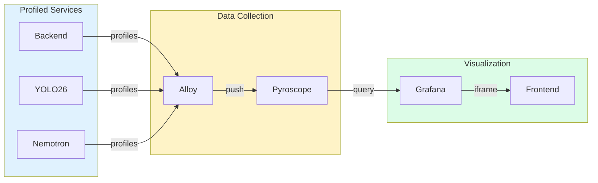

# Profiling (Pyroscope)


Continuous profiling dashboard for analyzing CPU and memory usage across all services.

## What You're Looking At

The Profiling page provides continuous profiling capabilities powered by Pyroscope and visualized through Grafana. This page helps you identify performance bottlenecks, memory leaks, and CPU hotspots in the AI pipeline services.

### Layout Overview

```
+----------------------------------------------------------+
|  HEADER: Flame Icon | "Profiling" | Action Buttons        |
+----------------------------------------------------------+
|                                                          |
|  +----------------------------------------------------+  |
|  |                                                    |  |
|  |           GRAFANA DASHBOARD EMBED                  |  |
|  |                                                    |  |
|  |  +------------+ +------------+ +------------+      |  |
|  |  | Service    | | Profile    | | Time       |      |  |
|  |  | Selector   | | Type       | | Range      |      |  |
|  |  +------------+ +------------+ +------------+      |  |
|  |                                                    |  |
|  |  +------------------------------------------+      |  |
|  |  |                                          |      |  |
|  |  |           FLAME GRAPH                    |      |  |
|  |  |                                          |      |  |
|  |  +------------------------------------------+      |  |
|  |                                                    |  |
|  +----------------------------------------------------+  |
|                                                          |
+----------------------------------------------------------+
```

The page embeds the HSI Profiling dashboard from Grafana, which provides:

- **Service Selector** - Choose which service to profile (backend, YOLO26, Nemotron)
- **Profile Type** - Switch between CPU and memory profiles
- **Time Range** - Select the time period to analyze
- **Flame Graph** - Visual representation of where time/memory is spent

## Key Components

### Header Controls

| Button              | Function                                                            |
| ------------------- | ------------------------------------------------------------------- |
| **Open in Grafana** | Opens the full Grafana dashboard in a new tab for advanced features |
| **Explore**         | Opens Grafana Explore with Pyroscope datasource for ad-hoc queries  |
| **Open Pyroscope**  | Opens the native Pyroscope UI at `localhost:4040`                   |
| **Refresh**         | Reloads the embedded dashboard                                      |

### Flame Graph

The flame graph is the primary visualization for understanding where time or memory is being consumed:

- **Width** - Represents the proportion of time/memory used by that function
- **Depth** - Shows the call stack hierarchy (callers on top, callees below)
- **Color** - Different colors represent different packages or modules
- **Hover** - Shows detailed information about that function call

**Reading the Flame Graph:**

| Pattern                | Meaning                                             |
| ---------------------- | --------------------------------------------------- |
| **Wide bar at top**    | High-level function consuming significant resources |
| **Wide bar at bottom** | Leaf function (actual work) consuming resources     |
| **Narrow tower**       | Deep call stack but minimal resource usage          |
| **Flat top**           | Most time spent in this specific function           |

### Profile Types

| Type           | Description                                | Use Case                            |
| -------------- | ------------------------------------------ | ----------------------------------- |
| **CPU**        | Shows where processing time is spent       | Finding slow code paths             |
| **Memory**     | Shows where memory is allocated            | Finding memory leaks                |
| **Goroutines** | Shows goroutine distribution (Go services) | Finding concurrency issues          |
| **Mutex**      | Shows lock contention (Go services)        | Finding synchronization bottlenecks |

### Service Selection

The dashboard can profile these services:

| Service          | Description                       |
| ---------------- | --------------------------------- |
| **hsi-backend**  | Main FastAPI backend service      |
| **hsi-yolo26**   | YOLO26 object detection service   |
| **hsi-nemotron** | Nemotron LLM inference service    |
| **alloy**        | Grafana Alloy telemetry collector |

## Understanding Profiling Data

### CPU Profiling

CPU profiles show where processing time is spent. Look for:

1. **Wide flames at the bottom** - Functions doing actual computation
2. **Unexpected wide bars** - Code paths consuming more CPU than expected
3. **Third-party libraries** - External code that may need optimization or caching

**Common CPU Hotspots in AI Pipelines:**

| Area               | Expected    | Potential Issue                    |
| ------------------ | ----------- | ---------------------------------- |
| Model inference    | High CPU    | Normal operation                   |
| JSON serialization | Low-Medium  | Consider caching or binary formats |
| Database queries   | Low         | Add query optimization/caching     |
| Image processing   | Medium-High | Consider GPU acceleration          |

### Memory Profiling

Memory profiles show allocation patterns. Look for:

1. **Growing allocations** - Potential memory leaks
2. **Large single allocations** - May cause GC pressure
3. **Frequent small allocations** - May benefit from pooling

**Common Memory Patterns:**

| Pattern          | Meaning            | Action                          |
| ---------------- | ------------------ | ------------------------------- |
| Steady flat line | Normal operation   | None needed                     |
| Gradual increase | Potential leak     | Investigate retained references |
| Sawtooth pattern | Normal GC behavior | None needed                     |
| Sudden spikes    | Burst allocations  | Consider rate limiting          |

## Correlation with Tracing

Profiling data can be correlated with distributed traces:

1. Find a slow trace in the [Tracing](tracing.md) page
2. Note the time range of the slow operation
3. Open Profiling and select the same time range
4. Identify which code paths consumed the most resources during that period

This helps pinpoint exactly why a specific request was slow.

## Settings & Configuration

### Grafana URL

The Grafana URL is automatically configured from the backend. If the embedded dashboard fails to load, verify:

1. Grafana is running and accessible
2. The `grafana_url` config setting is correct
3. Network connectivity between frontend and Grafana

### Pyroscope Data Source

Pyroscope must be configured as a data source in Grafana:

```yaml
# Grafana provisioning (monitoring/grafana/provisioning/datasources/prometheus.yml)
- name: Pyroscope
  type: pyroscope
  url: http://pyroscope:4040
  access: proxy
```

### Retention

Profiling data retention is configured in Pyroscope:

| Setting          | Default    | Description                   |
| ---------------- | ---------- | ----------------------------- |
| Retention Period | 15 days    | How long profile data is kept |
| Resolution       | 10 seconds | Profile sampling interval     |

## Troubleshooting

### Dashboard Shows "No Data"

1. **Check Pyroscope is running**: `docker ps | grep pyroscope`
2. **Verify services are instrumented**: Check that services have Pyroscope SDK configured
3. **Check time range**: Ensure the selected time range has profiling data
4. **Verify datasource**: Confirm Pyroscope is configured in Grafana

### Flame Graph is Empty

1. Select a different service from the dropdown
2. Expand the time range
3. Check if the service was active during the selected period
4. Verify the profile type is appropriate for the service

### High Memory Usage in Profiling

Continuous profiling has minimal overhead (typically 1-3%), but:

1. Reduce sampling frequency if needed
2. Limit the number of profiled services
3. Reduce retention period for older data

### "Failed to load configuration" Error

The frontend couldn't fetch the Grafana URL from the backend:

1. Verify the backend is running
2. Check network connectivity
3. The dashboard will use `/grafana` as a fallback

## Technical Deep Dive

### Architecture



### Related Code

**Frontend:**

- Pyroscope Page: `frontend/src/components/pyroscope/PyroscopePage.tsx`
- Grafana URL Utility: `frontend/src/utils/grafanaUrl.ts`

**Backend:**

- Profiling Configuration: `backend/core/config.py`

**Infrastructure:**

- Pyroscope Container: `docker-compose.prod.yml` (pyroscope service)
- Grafana Dashboard: `monitoring/grafana/dashboards/hsi-profiling.json`
- Alloy Configuration: `monitoring/alloy/config.alloy`

### Data Flow

1. Services are instrumented with Pyroscope SDK
2. Profile data is pushed to Grafana Alloy
3. Alloy forwards profiles to Pyroscope
4. Grafana queries Pyroscope for visualization
5. Frontend embeds Grafana dashboard in iframe

---

## Quick Reference

### When to Use Profiling

| Scenario                 | Profile Type | What to Look For                 |
| ------------------------ | ------------ | -------------------------------- |
| Slow API responses       | CPU          | Wide bars in request handlers    |
| Memory growing over time | Memory       | Allocations that don't get freed |
| High CPU usage           | CPU          | Unexpected hotspots              |
| OOM errors               | Memory       | Large allocation spikes          |

### Common Actions

| I want to...         | Do this...                                 |
| -------------------- | ------------------------------------------ |
| Find slow code       | Select CPU profile, look for wide flames   |
| Find memory leaks    | Select Memory profile over long time range |
| Compare before/after | Use Grafana's comparison feature           |
| Share a profile      | Open in Grafana, create a snapshot         |
| Drill into details   | Click on flame graph bars to zoom          |
