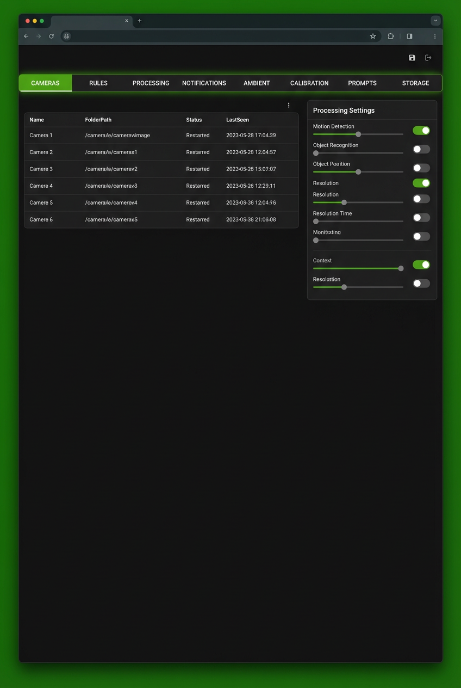
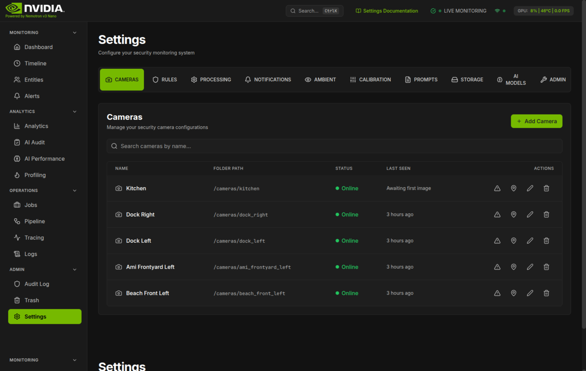
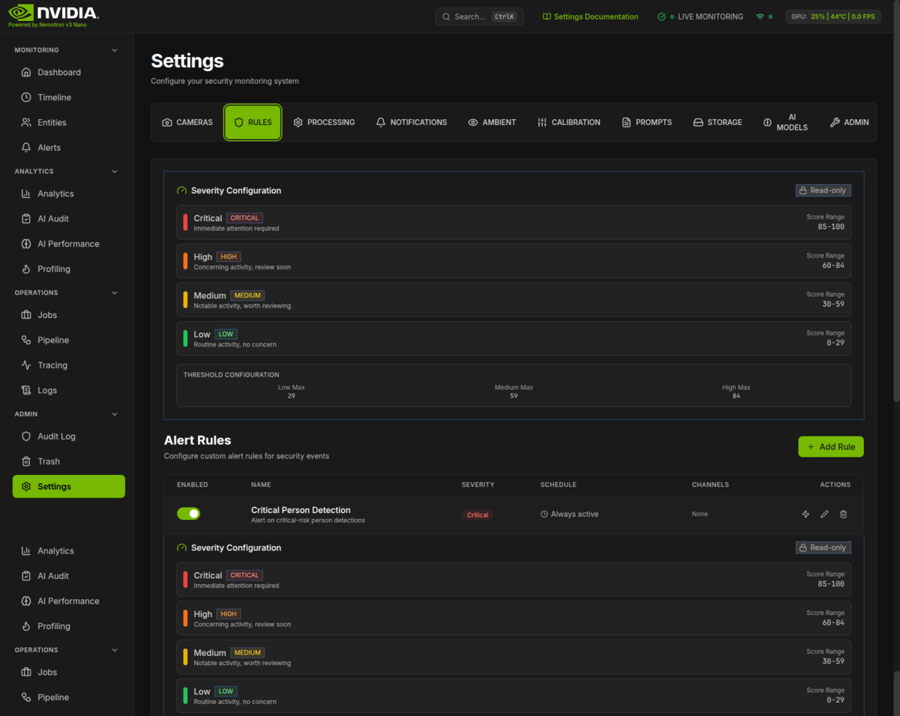
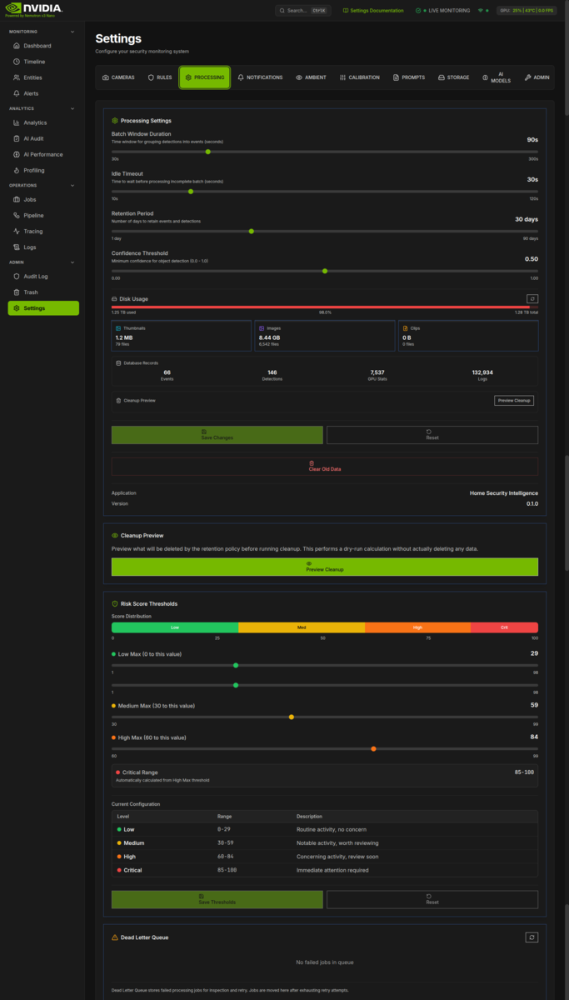
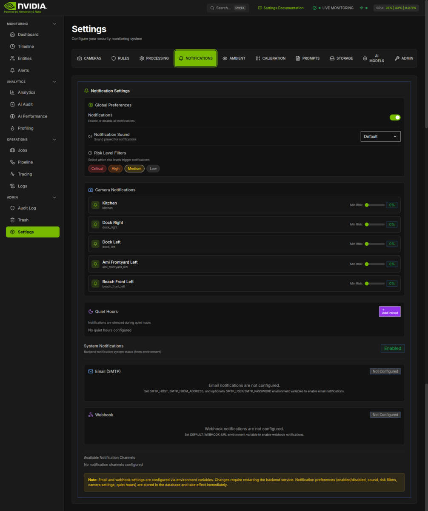
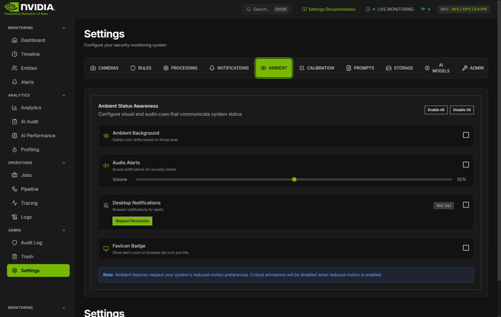
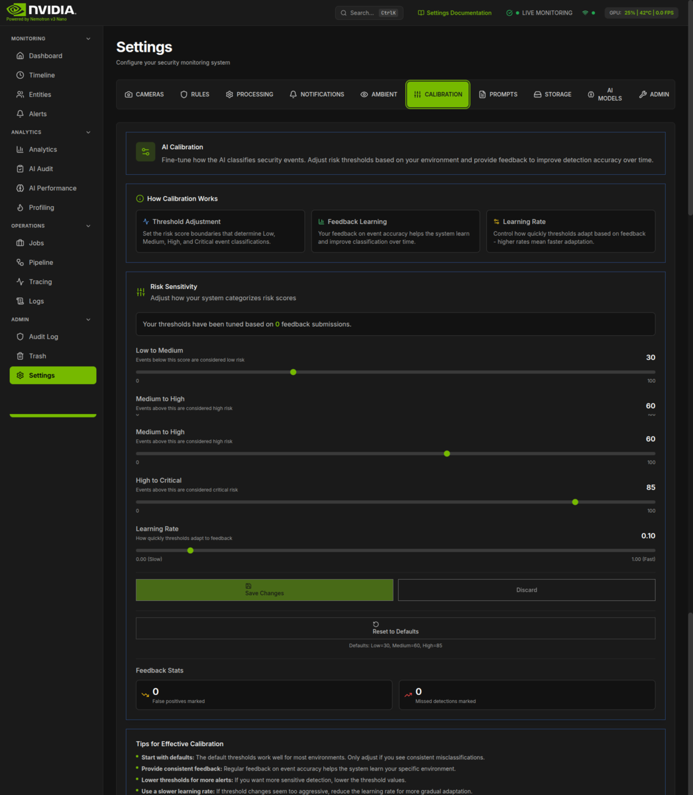
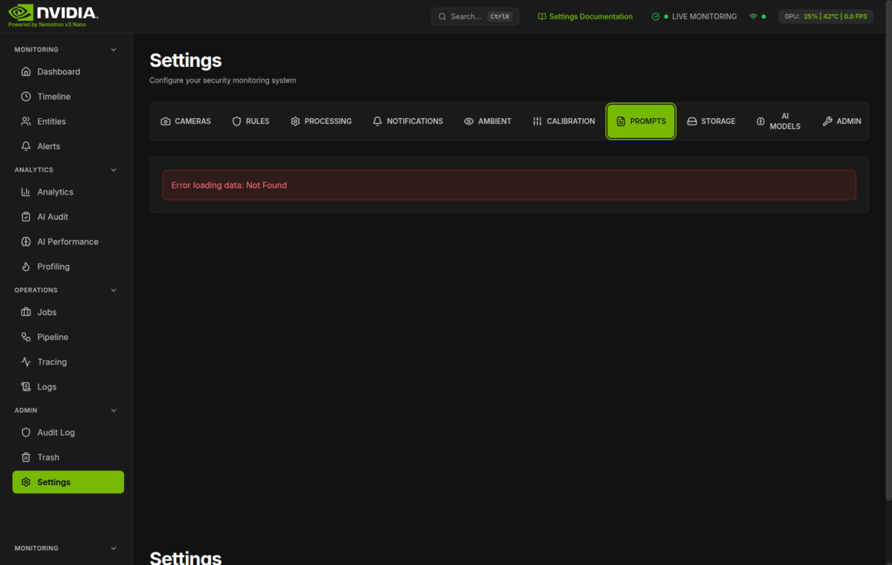
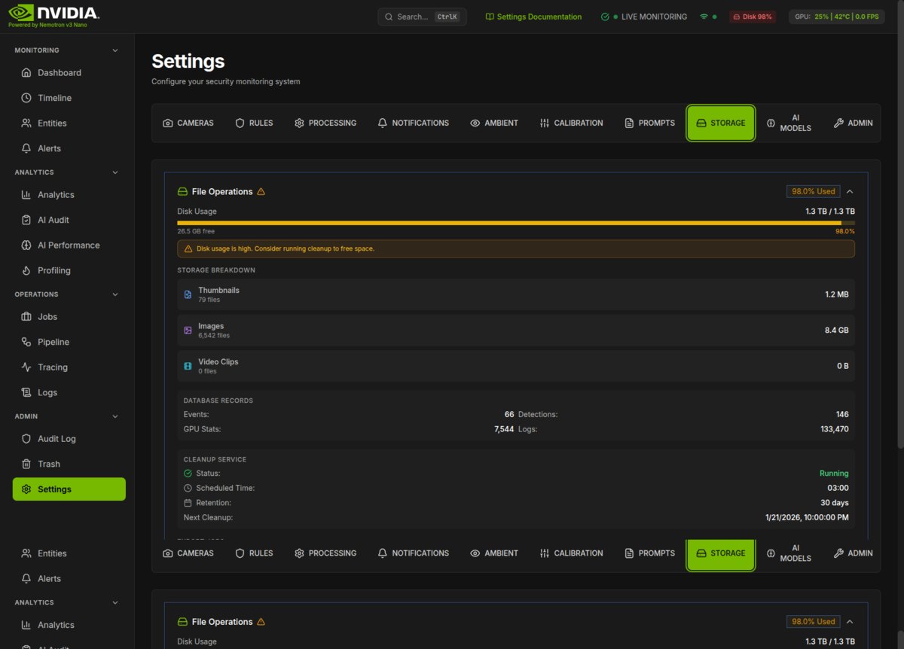

# Settings

_AI-generated visualization of the settings interface with tabbed navigation and camera configuration._

The central configuration hub for your home security monitoring system.

## What You're Looking At

The Settings page provides comprehensive control over all aspects of your security system. It uses a tabbed interface with eleven distinct sections, each focused on a specific configuration area:

- **CAMERAS** - Manage security camera configurations and detection zones
- **RULES** - Configure alert rules that trigger notifications
- **PROCESSING** - Adjust event processing parameters and data retention
- **NOTIFICATIONS** - Set up email, webhook, and quiet hours for alerts
- **AMBIENT** - Configure visual and audio status awareness features
- **CALIBRATION** - Fine-tune AI risk sensitivity and feedback learning
- **ACCESS** - Manage household members, vehicles, and zone-based access control
- **PROMPTS** - Manage AI model prompt configurations with version history
- **STORAGE** - Monitor disk usage and perform cleanup operations
- **AI MODELS** - View status and performance of core AI models and Model Zoo
- **ADMIN** - Feature toggles, system configuration, and maintenance actions

Access the Settings page from the navigation menu or by clicking the gear icon in the header. When debug mode is enabled, a "Developer Tools" link appears in the top-right corner for additional debugging capabilities.

If the application is accessed without HTTPS, a **Secure Context Warning** banner appears at the top of the page, alerting that certain browser features (like desktop notifications and clipboard access) may not work properly without a secure connection.

---

## Navigation

The Settings page uses **Headless UI Tab components** for tab navigation, providing:

- **Keyboard Navigation** - Use arrow keys to move between tabs, Enter/Space to select
- **Focus Management** - Proper focus ring indicators for accessibility
- **Active State Styling** - Selected tab highlighted with NVIDIA green (`#76B900`) background

Each tab displays an icon alongside its name for quick visual identification.

---

## Key Components

### Cameras Tab

Manage your security camera configurations with full CRUD (Create, Read, Update, Delete) functionality.

#### Camera Table

Each camera entry displays:

- **Name** - Human-readable identifier (e.g., "Front Door", "Backyard")
- **Folder Path** - Location where FTP uploads are stored (e.g., `/export/foscam/front_door`)
- **Status** - Current state: Online (green), Offline (gray), or Error (red)
- **Last Seen** - Time since the camera's last image upload

#### Camera Actions

- **Add Camera** - Click the green "Add Camera" button to create a new camera configuration
- **Edit Camera** - Click the pencil icon to modify camera name, folder path, or status
- **Delete Camera** - Click the trash icon to remove a camera (with confirmation)
- **Configure Zones** - Click the map pin icon to open the Zone Editor for defining detection regions

#### Zone Editor

The Zone Editor allows you to define specific areas within a camera's view for detection filtering:

- Draw polygons to define zones
- Name zones for easy identification (e.g., "Driveway", "Entry Path")
- Set zone-specific detection rules

#### Search

When multiple cameras are configured, use the search bar to filter cameras by name.

---

### Rules Tab

Configure custom alert rules that determine when and how you receive notifications about security events.

#### Severity Configuration Panel

At the top of the Rules tab, view the current severity threshold configuration that determines how risk scores map to severity levels (Low, Medium, High, Critical).

#### Alert Rules Table

Each rule displays:

- **Enabled/Disabled Toggle** - Quickly enable or disable rules
- **Name** - Descriptive name for the rule
- **Severity** - Alert level (Low, Medium, High, Critical) with color-coded badges
- **Schedule** - When the rule is active (e.g., "Always active" or "Mon-Fri, 22:00 - 06:00")
- **Channels** - Notification methods (email, webhook, pushover)

#### Rule Actions

- **Add Rule** - Create a new alert rule
- **Edit Rule** - Modify rule configuration
- **Delete Rule** - Remove a rule (with confirmation)
- **Test Rule** - Evaluate the rule against recent events to see match statistics

#### Rule Configuration Options

When creating or editing a rule:

**Basic Information:**

- Rule name (required)
- Description (optional)
- Enabled/disabled status
- Severity level (Low, Medium, High, Critical)

**Trigger Conditions:**

- Risk threshold (0-100) - Minimum risk score to trigger
- Min confidence (0-1) - Minimum detection confidence
- Object types - Filter by person, vehicle, animal, package, or face
- Cameras - Apply to specific cameras or all

**Schedule:**

- Enable/disable scheduled operation
- Days of the week selection
- Start and end time
- Timezone selection

**Notifications:**

- Notification channels (email, webhook, pushover)
- Cooldown period (seconds between duplicate alerts)

---

### Processing Tab

Configure how the system processes detection events and manages data retention.

#### Processing Parameters

Adjust these sliders to control event processing behavior:

| Setting               | Range     | Default | Description                                     |
| --------------------- | --------- | ------- | ----------------------------------------------- |
| Batch Window Duration | 30-300s   | 90s     | Time window for grouping detections into events |
| Idle Timeout          | 10-120s   | 30s     | Wait time before processing incomplete batches  |
| Retention Period      | 1-90 days | 30 days | How long to keep events and detections          |
| Confidence Threshold  | 0.00-1.00 | 0.50    | Minimum confidence for object detection         |

#### Storage Dashboard

View real-time disk usage metrics:

- **Overall Usage** - Progress bar showing total disk utilization
- **Storage Breakdown** - Size and file count for thumbnails, images, and clips
- **Database Records** - Counts for events, detections, GPU stats, and logs

#### Data Cleanup

- **Clear Old Data** - Trigger manual cleanup of data older than the retention period
- **Cleanup Results** - Shows deleted counts for events, detections, GPU stats, logs, and thumbnails

#### Additional Panels

The Processing tab includes several specialized panels below the main settings card:

**Cleanup Preview Panel (`CleanupPreviewPanel`)**

- Preview what data will be deleted before running cleanup
- Shows counts for events, detections, GPU stats, logs, and thumbnails
- Allows you to see the impact of cleanup before committing

**Severity Thresholds (`SeverityThresholds`)**

- Visual display of risk score boundaries for each severity level
- Shows the range thresholds: 0-25 (Low), 25-50 (Medium), 50-75 (High), 75-100 (Critical)
- Read-only display; editing is done in the Calibration tab

**DLQ Monitor (`DlqMonitor`)**

- Dead Letter Queue monitoring for failed AI processing jobs
- Shows failed jobs that couldn't be processed by the AI pipeline
- Allows retry or dismissal of failed jobs
- Displays error messages and failure timestamps

#### Application Info

Displays current application name and version at the bottom of the settings card.

---

### Notifications Tab

Configure how and when you receive notifications about security events.

#### Global Preferences

- **Notifications Toggle** - Master switch to enable/disable all notifications
- **Notification Sound** - Select from: None (Silent), Default, Alert, Chime, Urgent
- **Risk Level Filters** - Choose which severity levels trigger notifications (Critical, High, Medium, Low)

#### Camera Notifications

Per-camera notification settings:

- **Enable/Disable** - Toggle notifications for specific cameras
- **Risk Threshold Slider** - Set minimum risk score (0-100%) required to notify

#### Quiet Hours

Schedule periods when notifications are silenced:

- **Add Period** - Create a new quiet hours schedule
- **Label** - Name for the quiet period (e.g., "Night Time", "Work Hours")
- **Time Range** - Start and end times
- **Days** - Select which days of the week apply

Existing quiet hours periods display with:

- Label and time range
- Active days
- Delete button

#### Channel Configuration

View environment-based notification channel settings:

**Email (SMTP):**

- Configuration status badge
- SMTP host, port, from address, TLS status
- Default recipients
- "Send Test Email" button

**Webhook:**

- Configuration status badge
- Webhook URL
- Timeout setting
- "Send Test Webhook" button

**System Notifications Status:**

- Shows overall backend notification system status (Enabled/Disabled)
- Reflects the `NOTIFICATIONS_ENABLED` environment variable setting

**Available Channels Summary** - Shows which notification channels are configured and available, displayed as green badges.

> **Note:** Email and webhook settings are configured via environment variables and require a backend restart to change. Notification preferences (enabled/disabled, sound, risk filters, camera settings, quiet hours) are stored in the database and take effect immediately.

---

### Ambient Tab

Configure visual and audio cues that communicate system status at a glance.

#### Available Features

| Feature                   | Description                                                 |
| ------------------------- | ----------------------------------------------------------- |
| **Ambient Background**    | Subtle color shifts based on current threat level           |
| **Audio Alerts**          | Sound notifications for security events with volume control |
| **Desktop Notifications** | Browser notifications for alerts (requires permission)      |
| **Favicon Badge**         | Show alert count on browser tab icon and title              |

#### Quick Actions

- **Enable All** - Turn on all ambient status features
- **Disable All** - Turn off all ambient status features

#### Audio Volume

When audio alerts are enabled, a volume slider appears (0-100%) for fine-tuning notification volume.

#### Desktop Notifications

Desktop notifications require browser permission:

- **Permission Status** - Shows "Granted", "Blocked", or "Not Set"
- **Request Permission** - Button to request browser notification permission
- **Suppress When Focused** - Option to hide notifications when the app window has focus

> **Note:** Ambient features respect your system's reduced motion preferences. Critical animations will be disabled when reduced motion is enabled.

---

### Calibration Tab

Fine-tune how the AI classifies security events based on your specific environment.

#### How Calibration Works

The calibration system has three main components:

1. **Threshold Adjustment** - Set risk score boundaries for Low, Medium, High, and Critical event classifications
2. **Feedback Learning** - Your feedback on event accuracy helps the system improve over time
3. **Learning Rate** - Control how quickly thresholds adapt based on feedback

#### Risk Sensitivity Settings

The core calibration interface (RiskSensitivitySettings component) provides:

- **Visual threshold editor** - Adjust boundaries between severity levels (Low, Medium, High, Critical)
- **Current values display** - See active threshold configuration with numeric values
- **Feedback statistics** - View accuracy metrics from user feedback submissions
- **Learning rate control** - Adjust how quickly thresholds adapt based on feedback (decay factor)
- **Reset to defaults** - Restore factory threshold settings with confirmation

#### Tips for Effective Calibration

- **Start with defaults** - Only adjust if you see consistent misclassifications
- **Provide consistent feedback** - Regular feedback helps the system learn your environment
- **Lower thresholds for more alerts** - More sensitive detection means more notifications
- **Use a slower learning rate** - If changes seem too aggressive, reduce the rate

---

### Access Tab

Manage household members, vehicles, and zone-based access permissions. This tab contains two sub-tabs:

#### Household Sub-Tab

Manage recognized people and vehicles:

- **Members** - Add household members with names and optional photos for face recognition
- **Vehicles** - Register known vehicles by license plate for automatic identification
- **Member Actions** - Edit or remove household members
- **Vehicle Actions** - Edit or remove registered vehicles

#### Zone Access Sub-Tab

Configure zone-specific access control:

- **Zone Selection** - Choose which zones to configure access for
- **Permission Assignment** - Assign access permissions to household members per zone
- **Schedule-Based Access** - Configure time-based access restrictions
- **Access Logging** - View access events by zone

---

### Prompts Tab

Manage AI model prompt configurations with full version history and import/export capabilities.

#### Model Selection

Choose from available AI models:

- **Nemotron** - Risk analysis and reasoning
- **Florence-2** - Scene analysis
- **YOLO-World** - Object detection
- **X-CLIP** - Action recognition
- **Fashion-CLIP** - Clothing analysis

#### Current Configuration

View the active prompt configuration for the selected model:

- Version number and description
- Last updated timestamp
- JSON configuration display
- **Edit** button to modify the configuration

#### Version History

Browse and restore previous configurations:

- Version number and active status badge
- Change description
- Creation timestamp and author
- **Restore** button to revert to a previous version

#### Import/Export

- **Export** - Download all prompt configurations as JSON
- **Import** - Upload configurations with diff preview before applying

#### Testing Prompts

The prompt management system includes testing capabilities to validate configurations:

- **Test Modal** - Test prompts against historical events to verify behavior
- **Event Selector** - Choose specific events from history to use as test inputs
- **Results Comparison** - View side-by-side comparison of current vs. new configuration outputs

---

### Storage Tab

Monitor disk usage and perform storage maintenance operations. The panel is collapsible and shows a summary badge with current disk usage percentage when collapsed.

#### Disk Usage Overview

- **Progress Bar** - Visual representation of disk utilization with color-coded indicator (green under 85%, amber at 85%+)
- **Used/Total** - Bytes used vs. total capacity displayed in human-readable format
- **Free Space** - Available disk space shown below the progress bar
- **Warning Indicator** - Amber warning banner appears when usage exceeds 85%, recommending cleanup

#### Storage Breakdown

File categories displayed with icons, file counts, and sizes:

| Category        | Description                | Icon                 |
| --------------- | -------------------------- | -------------------- |
| **Thumbnails**  | Detection thumbnail images | Blue file image icon |
| **Images**      | Camera capture images      | Purple image icon    |
| **Video Clips** | Recorded video segments    | Cyan film icon       |

#### Database Records

Current record counts displayed in a 2x2 grid:

- Events
- Detections
- GPU Stats
- Logs

#### Cleanup Service

View scheduled cleanup configuration in a summary panel:

- **Status** - Running or Stopped indicator with checkmark/X icon
- **Scheduled Time** - Daily cleanup time (e.g., "03:00")
- **Retention** - Number of days data is retained
- **Next Cleanup** - Date and time of next scheduled cleanup

#### Orphaned Files

Warning panel for files that exist on disk but aren't referenced in the database:

- Count of orphaned files with amber warning styling
- Total size that can be reclaimed (formatted to human-readable)
- **Clean Up** button to trigger orphaned file cleanup
- Helpful explanation text about what orphaned files are

#### Export Jobs

Monitor data export operations with up to 5 recent jobs displayed:

- **Job Type** - Type of export job
- **Status Badge** - Color-coded status (green for running/completed, red for failed, gray for pending)
- **Progress Bar** - Percentage progress for running jobs
- **Timestamps** - Started or created time
- **Error Messages** - Displayed in red-bordered box for failed jobs

When no exports exist, shows "No active exports" placeholder.

#### Actions

Bottom action bar with cleanup and export controls:

- **Run Cleanup** - Opens preview modal showing:
  - Events, detections, GPU stats, logs, and thumbnails to be deleted
  - Space to be reclaimed
  - Retention period applied
  - Confirm/Cancel buttons with warning that action cannot be undone
- **Export Data** - Start a data export job (disabled when exports are in progress)
- **Refresh** - Manually refresh storage statistics with last updated timestamp displayed

---

### AI Models Tab

View status and performance of all AI models used in the system.

#### Core Models Section

Status cards for the primary AI models:

- **RT-DETRv2** - Real-time object detection model status
- **Nemotron** - Risk analysis and reasoning model status

Each card displays:

- Model name and description
- Current status (loaded/unloaded)
- Last inference time
- Model version

#### Model Management Panel

VRAM usage overview and categorized model status:

- **VRAM Usage** - Visual bar showing GPU memory utilization with color-coded indicators
- **Model Status Summary** - Counts of loaded, available, and unavailable models
- **Categorized Models** - Models grouped by function (Detection, Recognition, Analysis, etc.)

#### Model Zoo Section

Detailed cards for all 18+ specialized models:

- **Model Cards** - Individual status cards with latency charts
- **Performance Metrics** - Load count, average latency, error rate
- **Model Controls** - Manual load/unload actions (when applicable)

---

### Admin Tab

Administrative controls for system management, available in four collapsible sections.

#### Feature Toggles

Enable or disable system features:

| Toggle                | Description                                 |
| --------------------- | ------------------------------------------- |
| **Vision Extraction** | Extract visual features using AI models     |
| **Re-ID Tracking**    | Track individuals across camera views       |
| **Scene Change**      | Detect significant changes in camera scenes |
| **Clip Generation**   | Generate video clips for events             |
| **Image Quality**     | Assess image quality before processing      |
| **Background Eval**   | Evaluate background changes                 |

#### System Config

Rate limiting and queue settings:

- **Rate Limiting** - Configure API rate limits per endpoint
- **Queue Settings** - Adjust processing queue parameters

#### Maintenance Actions

System maintenance operations:

- **Orphan Cleanup** - Remove orphaned files not linked to events
- **Clear Cache** - Clear Redis and application caches
- **Flush Queues** - Clear pending processing queues (use with caution)

#### Developer Tools

Debug-only features (visible only when `DEBUG=true`):

- **Seed Test Cameras** - Create test camera configurations
- **Seed Test Events** - Generate sample events for testing
- **Debug Utilities** - Additional debugging tools

> **Note:** Developer Tools section only appears when debug mode is enabled via the `DEBUG` environment variable.

---

## Settings & Configuration

### Environment Variables

Many settings are configured via environment variables and require a backend restart:

| Variable                  | Purpose                                |
| ------------------------- | -------------------------------------- |
| `SMTP_HOST`               | Email server hostname                  |
| `SMTP_PORT`               | Email server port                      |
| `SMTP_FROM_ADDRESS`       | Sender email address                   |
| `SMTP_USER`               | SMTP authentication username           |
| `SMTP_PASSWORD`           | SMTP authentication password           |
| `SMTP_USE_TLS`            | Enable TLS encryption for SMTP         |
| `DEFAULT_WEBHOOK_URL`     | Webhook endpoint URL                   |
| `WEBHOOK_TIMEOUT_SECONDS` | Webhook request timeout (default: 30)  |
| `NOTIFICATIONS_ENABLED`   | Enable/disable the notification system |
| `DEBUG`                   | Enable debug mode and Developer Tools  |

### Database-Persisted Settings

These settings are stored in the database and take effect immediately:

- Processing parameters (batch window, idle timeout, retention, confidence)
- Alert rules and schedules
- Notification preferences (enabled, sound, risk filters)
- Per-camera notification settings
- Quiet hours schedules
- AI prompt configurations
- Risk sensitivity thresholds

### URL State Management

The Prompts tab uses URL parameters for model selection, allowing direct linking to specific model configurations (e.g., `?model=nemotron`).

---

## Troubleshooting

### Cameras

#### Camera shows "Offline"

1. Verify the camera is powered on and connected to the network
2. Check FTP upload settings on the camera
3. Ensure the camera's folder exists at the configured path
4. Check for permission issues on the upload directory

#### "Awaiting first image" message

The camera is configured but hasn't sent any images yet. Trigger motion on the camera or check FTP settings.

#### Zone Editor not loading

The zone editor requires a camera to have at least one recent image. Ensure the camera has uploaded images before configuring zones.

### Alert Rules

#### Rule not triggering

1. Verify the rule is enabled (toggle is green)
2. Check that the schedule matches the current time
3. Confirm risk threshold is set appropriately
4. Verify at least one notification channel is selected
5. Use the "Test" button to evaluate against recent events

#### Too many notifications

1. Increase the risk threshold to filter low-confidence events
2. Enable schedule to limit active hours
3. Increase the cooldown period between alerts
4. Use camera filters to focus on specific areas

### Notifications

#### Email not sending

1. Verify SMTP settings are configured via environment variables
2. Check that the notification system is enabled
3. Test the connection with "Send Test Email"
4. Check backend logs for SMTP errors

#### Webhook failures

1. Confirm the webhook URL is accessible from the server
2. Check timeout settings if requests are timing out
3. Verify the receiving endpoint accepts POST requests
4. Use "Send Test Webhook" to diagnose issues

#### Desktop notifications blocked

1. Click "Request Permission" if permission status shows "Not Set"
2. If blocked, manually enable in browser settings:
   - Chrome: Settings > Privacy and Security > Site Settings > Notifications
   - Firefox: Settings > Privacy & Security > Permissions > Notifications
3. Ensure the site is accessed via HTTPS for notification permissions

### Storage

#### High disk usage warning

1. Review the retention period and consider reducing it
2. Run cleanup to remove old data
3. Check for orphaned files and clean them up
4. Consider increasing disk capacity

#### Cleanup not removing expected data

1. Verify the retention period is set correctly
2. Use "Preview" to see what will be deleted before cleanup
3. Check that the cleanup service is running (shown in Cleanup Service section)

### Calibration

#### AI classifications seem wrong

1. Provide feedback on incorrectly classified events
2. Adjust severity thresholds based on your environment
3. Use a higher learning rate for faster adaptation
4. Consider resetting to defaults if calibration has drifted too far

---

## Technical Deep Dive

For developers wanting to understand the underlying systems.

### Architecture

- **System Overview**: [Architecture Overview](../architecture/overview.md)
- **AI Pipeline**: [AI Pipeline Architecture](../architecture/ai-pipeline.md)
- **Data Model**: [Data Model](../architecture/data-model.md)
- **Real-time System**: [Real-time Events](../architecture/real-time.md)

### Related Code

| Component             | Path                                                                                       |
| --------------------- | ------------------------------------------------------------------------------------------ |
| Settings Page         | `frontend/src/components/settings/SettingsPage.tsx` (routes via `frontend/src/router.tsx`) |
| Camera Settings       | `frontend/src/components/settings/CamerasSettings.tsx`                                     |
| Alert Rules Settings  | `frontend/src/components/settings/AlertRulesSettings.tsx`                                  |
| Processing Settings   | `frontend/src/components/settings/ProcessingSettings.tsx`                                  |
| Notification Settings | `frontend/src/components/settings/NotificationSettings.tsx`                                |
| Ambient Settings      | `frontend/src/components/settings/AmbientStatusSettings.tsx`                               |
| Calibration Panel     | `frontend/src/components/settings/CalibrationPanel.tsx`                                    |
| Access Control        | `frontend/src/components/settings/AccessControlSettings.tsx`                               |
| Prompt Management     | `frontend/src/components/settings/prompts/PromptManagementPage.tsx`                        |
| Storage Panel         | `frontend/src/components/system/FileOperationsPanel.tsx`                                   |
| AI Models Tab         | `frontend/src/components/settings/AIModelsTab.tsx`                                         |
| Admin Settings        | `frontend/src/components/settings/AdminSettings.tsx`                                       |
| Zone Editor           | `frontend/src/components/zones/ZoneEditor.tsx`                                             |

### Backend APIs

| Endpoint                                 | Purpose                        |
| ---------------------------------------- | ------------------------------ |
| `GET /api/cameras`                       | List all cameras               |
| `POST /api/cameras`                      | Create new camera              |
| `PUT /api/cameras/:id`                   | Update camera                  |
| `DELETE /api/cameras/:id`                | Delete camera                  |
| `GET /api/alerts/rules`                  | List alert rules               |
| `POST /api/alerts/rules`                 | Create alert rule              |
| `PUT /api/alerts/rules/:id`              | Update alert rule              |
| `DELETE /api/alerts/rules/:id`           | Delete alert rule              |
| `POST /api/alerts/rules/:id/test`        | Test alert rule                |
| `GET /api/system/config`                 | Fetch system configuration     |
| `PATCH /api/system/config`               | Update system configuration    |
| `GET /api/notification/config`           | Get notification configuration |
| `POST /api/notification/test`            | Test notification channel      |
| `GET /api/system/storage`                | Get storage statistics         |
| `POST /api/system/cleanup`               | Trigger data cleanup           |
| `GET /api/system/cleanup/status`         | Get cleanup service status     |
| `GET /api/prompts/{model}`               | Get prompt configuration       |
| `PUT /api/prompts/{model}`               | Update prompt configuration    |
| `GET /api/prompts/history`               | Get prompt version history     |
| `POST /api/prompts/history/{version_id}` | Restore prompt version         |
| `GET /api/calibration`                   | Get risk thresholds            |
| `PUT /api/calibration`                   | Update risk thresholds         |
| `PATCH /api/calibration`                 | Partial update risk thresholds |
| `POST /api/calibration/reset`            | Reset to default thresholds    |
| `GET /api/calibration/defaults`          | Get default threshold values   |
