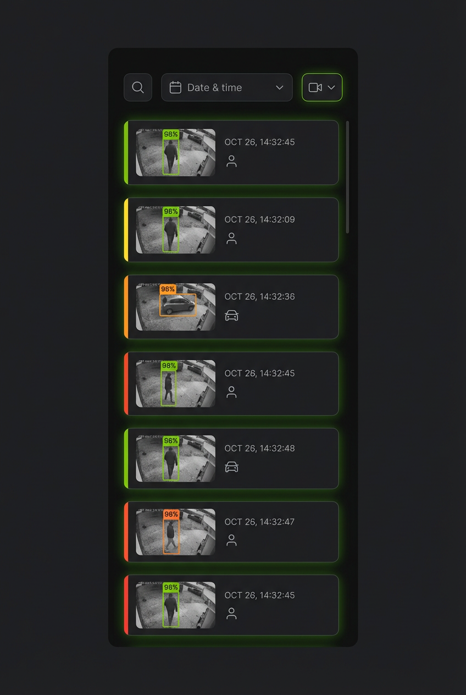
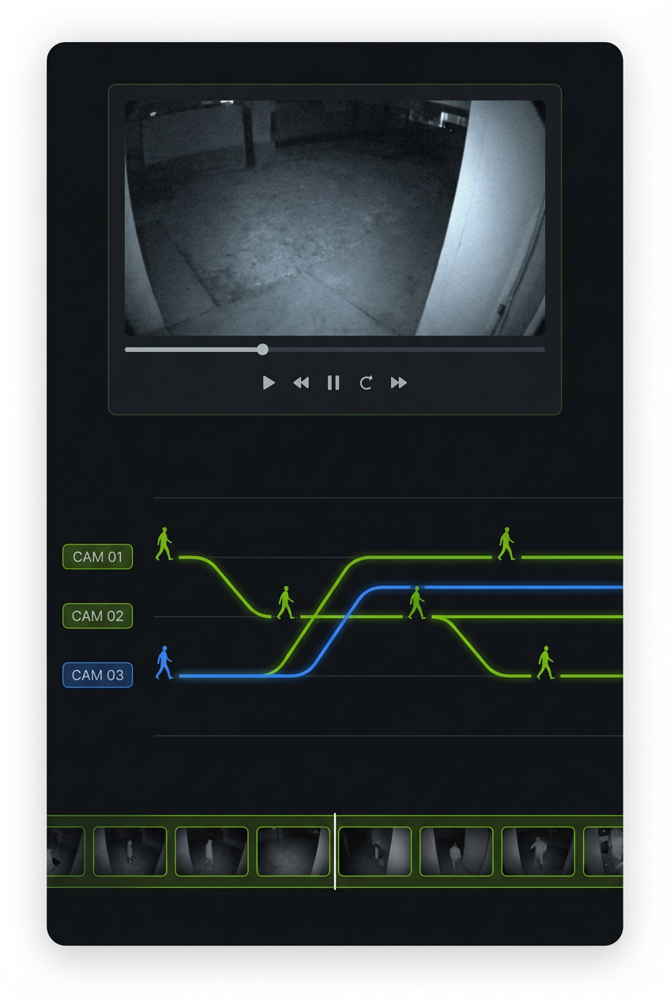
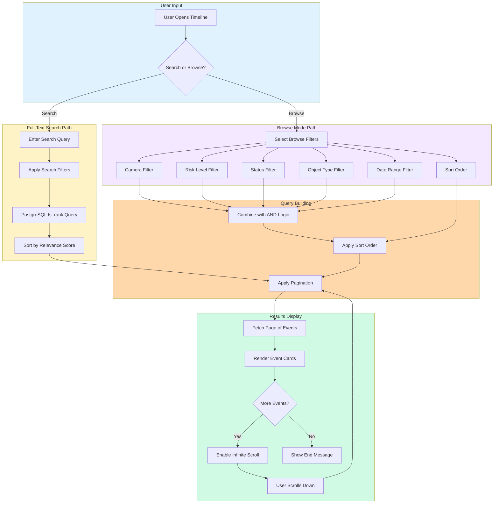
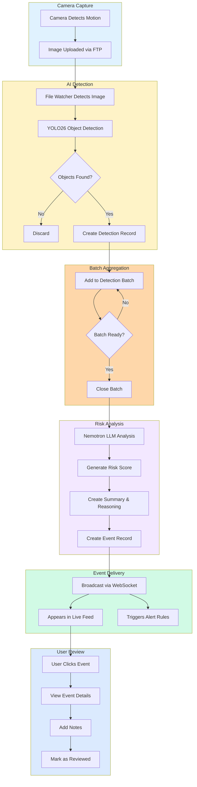

# Event Timeline



_AI-generated visualization of the event timeline showing security events with risk-level color coding._



_AI-generated visualization of the investigation interface with cross-camera entity tracking._


The chronological event viewer for reviewing, searching, and managing security detection events.

## What You're Looking At

The Event Timeline is your primary interface for reviewing security events detected by the AI system. Unlike the Dashboard which shows real-time overview status, the Timeline provides detailed access to both live incoming events and historical records with powerful filtering, searching, and bulk management capabilities.

The page is divided into two main sections:

1. **Live Activity Section** - Real-time events streaming via WebSocket with pause/resume controls
2. **Historical Events Section** - Paginated list of past events with filtering, full-text search, and bulk operations

The component is implemented in `frontend/src/components/events/EventTimeline.tsx` and is accessible via the `/timeline` route.

## Key Components

### Live Activity Section

The top section displays real-time security events as they are detected. This section uses the `LiveActivitySection` component (`frontend/src/components/events/LiveActivitySection.tsx`).

- **Connection Status Indicator** - Shows WebSocket connection state:

  - **Green "Live" badge with Wifi icon and animated pulse** - Connected and receiving events
  - **Yellow "Disconnected" badge with WifiOff icon** - Connection lost, attempting to reconnect

- **Live Activity Stats** - Quick counts of recent events by risk level (only shown on larger screens):

  - Total recent event count with Activity icon
  - Critical (red badge with count)
  - High (orange badge with count)
  - Medium (yellow badge with count)
  - Low (green badge with count)

- **Pause/Resume Button** - Toggle to freeze the live feed:

  - Useful when reviewing a specific event
  - When paused, a translucent overlay displays "Updates paused"
  - The Radio icon pulses when connected and not paused
  - Click "Resume" (with Play icon) to continue receiving events

- **Activity Feed** - Scrolling list of the 10 most recent events (configurable via `maxItems` prop) showing:

  - Timestamp (relative time like "2 minutes ago")
  - Camera name
  - Risk score badge
  - Event summary snippet
  - Click any event to open its detail modal

- **Empty State** - When no events are present:

  - Shows a Signal icon with "No Live Activity" message
  - Displays contextual message based on connection status
  - When connected: "Waiting for security events. New detections will appear here automatically."
  - When disconnected: "Connection lost. Attempting to reconnect..."

- **Footer Stats** - Shows "Showing X of Y recent events" and "Auto-refreshing" indicator

### Historical Events Section

Below the live section, separated by a "Historical Events" divider:

#### Full-Text Search Bar

Powerful search capability across all event data using PostgreSQL full-text search. Implemented in `frontend/src/components/search/SearchBar.tsx`.

- **Search Input** - Enter keywords, phrases, or boolean queries
- **Clear Button** (X icon) - Clears the current search query when text is present
- **Search Syntax Help** (HelpCircle icon) - Shows supported query formats in a tooltip:

  - `person vehicle` - Implicit AND (both terms required)
  - `"suspicious person"` - Exact phrase match
  - `person OR animal` - Either term matches
  - `person NOT cat` - Exclude term
  - `front_door` - Search by camera name
  - `person AND vehicle` - Explicit AND

- **Search Button** - Submit the search query (disabled when empty or searching)
- **Save Search** (Save icon) - Save frequently used queries with custom names (appears only when query exists)
  - Opens a modal to name and save the current search with filters
- **Saved Searches** (Bookmark icon) - Load previously saved searches
  - Shows count badge of saved searches
  - Displays saved search name, query, and filter count
  - Delete individual saved searches with trash icon
- **Filters Toggle** - Expand advanced filter options within search
  - Shows "Active" badge when filters are applied

**Search Example Queries:**

| Goal                                | Query               | Filters                   |
| ----------------------------------- | ------------------- | ------------------------- |
| Find people at front door           | `person front_door` | -                         |
| Find vehicle events this week       | `vehicle`           | Start Date: 7 days ago    |
| Find unreviewed suspicious activity | `suspicious`        | Status: Unreviewed        |
| Find high-risk events with packages | `package`           | Severity: High & Critical |
| Find nighttime activity             | `night OR dark`     | -                         |
| Find everything except cats         | `NOT cat`           | -                         |

**Relevance Scoring** - Search results are sorted by relevance:

| Score     | Color       | Meaning         |
| --------- | ----------- | --------------- |
| 80%+      | Green       | Excellent match |
| 50-79%    | Light Green | Good match      |
| 30-49%    | Yellow      | Moderate match  |
| Below 30% | Gray        | Weak match      |

#### Browse Mode Filters

When not in search mode, the filter panel provides structured filtering. Expand by clicking "Show Filters":

| Filter             | Options                                                                | Description                                                                  |
| ------------------ | ---------------------------------------------------------------------- | ---------------------------------------------------------------------------- |
| **Camera**         | Dropdown of all cameras                                                | Filter events from a specific camera                                         |
| **Risk Level**     | Low, Medium, High, Critical                                            | Filter by AI-assigned severity                                               |
| **Status**         | All Events, Unreviewed, Reviewed                                       | Filter by review status                                                      |
| **Object Type**    | Person, Vehicle, Animal, Package, Other                                | Filter by detected object class                                              |
| **Min Confidence** | All Confidence Levels, High Only (85%+), Medium+ (70%+), Any Detection | Filter by detection confidence (note: currently client-side indication only) |
| **Sort By**        | Newest First, Oldest First, Highest Risk, Lowest Risk                  | Change result ordering                                                       |
| **Start Date**     | Date picker with Calendar icon                                         | Filter events after this date                                                |
| **End Date**       | Date picker with Calendar icon                                         | Filter events before this date                                               |

- **Active badge** - Green badge shows when any filters are active
- **Clear All Filters** - Reset all filters to defaults (disabled when no filters active)

### Diagram: Filter Application Flow



**Search Mode Filters** (when in full-text search):

The search bar has its own advanced filters panel with similar options:

- Camera, Severity (includes "High & Critical" combined option), Object Type, Status
- Start Date and End Date
- Clear All button

#### Export Options

Three export methods for data analysis (all respect current filters):

1. **Quick Export** - Immediately download CSV with current filters
   - Disabled when no events match current filters
   - Shows loading spinner during export
2. **Advanced Export** - Expanded panel with:
   - Format selection (CSV, Excel/XLSX)
   - Filter refinement specific to export
   - Export preview showing estimated record count
3. **Export Modal** - Full-screen export dialog (`frontend/src/components/exports/ExportModal.tsx`) with additional options

**Note:** Export is rate-limited to 10 requests per minute to prevent abuse.

#### Results Summary

Shows current view statistics:

- Event counts: "Showing 20 of 1,234 events"
- Risk breakdown badges: Critical (5), High (12), Medium (45), Low (200)
- "Filters active" indicator when filters are applied

#### Bulk Actions

When events are loaded, bulk operations become available:

- **Select All/Deselect All** - Toggle selection for all visible events
- **Selection Counter** - Shows "X selected" when events are checked
- **Mark as Reviewed** - Bulk mark selected events as reviewed
- **Mark Not Reviewed** - Bulk unmark selected events

#### Event Cards

Each event displays as a card (`frontend/src/components/events/EventCard.tsx`) with:

- **Left Border Color** - Risk level indicator (4px border):

  - Green (`border-l-risk-low`) = Low risk (0-30)
  - Yellow (`border-l-risk-medium`) = Medium risk (31-60)
  - Orange (`border-l-risk-high`) = High risk (61-85)
  - Red (`border-l-red-500`) = Critical risk (86-100)

- **Thumbnail** - Detection image from the event (64x64 pixels)
  - Falls back to Eye icon placeholder if no image available
- **Camera Name** - Which camera captured the event (truncated with hover tooltip)
- **Timestamp** - Relative time ("5 minutes ago", "2 hours ago", "3 days ago")
  - Shows full formatted date for events older than 1 week
- **Duration** - How long the event lasted (with Timer icon)
- **Risk Badge** - Colored badge with score and level label (via `RiskBadge` component)
- **Object Type Badges** - Icons for detected objects (person, vehicle, etc.) via `ObjectTypeBadge`
- **Risk Score Progress Bar** - Visual 0-100 score representation with animated fill
- **AI Summary** - Truncated description (expandable via `TruncatedText` component)
- **Detection List** - Object labels with confidence percentages (sorted highest first):
  - Green border = High confidence (85%+)
  - Yellow border = Medium confidence (70-84%)
  - Red border = Low confidence (<70%)
  - Shows aggregate stats: Average and Maximum confidence
- **AI Reasoning** (expandable accordion) - Full explanation of risk assessment
- **Selection Checkbox** - Top-left corner for bulk operations (semi-transparent background)
- **Snooze Button** (optional) - Dropdown to snooze event for 15 min, 1 hr, 4 hr, or 8 hr
- **View Details Button** (optional) - Opens detail modal

**Card Interactions:**

- Click anywhere on card (except buttons) to open Event Detail Modal
- Keyboard accessible: Tab to focus, Enter/Space to activate
- Cards have hover state with background color change

Click any card to open the Event Detail Modal.

### Event Detail Modal

Full-screen overlay showing complete event information (`frontend/src/components/events/EventDetailModal.tsx`). Uses Headless UI's Dialog component with smooth transitions.

#### Modal Header

- Camera name (large, 2xl font)
- Full timestamp with Clock icon (formatted with month, day, year, time)
- Event duration with Timer icon (when start/end times available)
- Risk badge with score (large size)
- Close button (X icon) - top right corner

#### Tab Navigation

Three tabs with underline indicator:

- **Details** - Primary event information and media
- **AI Audit** - Detailed AI evaluation breakdown (via `EventAuditDetail` component)
- **Video Clip** - Generated video sequence (via `EventVideoPlayer` component)

#### Details Tab Content

1. **Media Display**

   - For video detections: Video player with poster thumbnail, codec info, duration, resolution
   - For image detections: `DetectionImage` component with bounding boxes overlay
   - Click image to open full-size lightbox (via `Lightbox` component)
   - Shows video metadata badge: duration, resolution, codec

2. **Detection Sequence Thumbnail Strip** (`ThumbnailStrip` component)

   - Horizontal strip of all detection thumbnails
   - Click to view specific detection in main display
   - Double-click for full-size lightbox (images only, not videos)
   - Shows loading state while fetching detections

3. **AI Summary**

   - Full summary text
   - "Re-evaluate" button with RefreshCw icon to trigger new AI analysis
   - Shows success/error feedback after re-evaluation attempt
   - Success auto-dismisses after 3 seconds

4. **AI Scene Description** (when `scene_caption` available)

   - Florence-2 generated scene caption
   - Italicized text in bordered card for distinction
   - Eye icon header

5. **AI Reasoning** (when available)

   - Detailed explanation of risk assessment factors
   - Green-tinted background card

6. **Detected Objects**

   - Full list sorted by confidence (highest first)
   - Confidence bars with color-coded fill (red/yellow/green)
   - Shows percentage and visual bar for each detection
   - Aggregate stats header: Average and Maximum confidence with TrendingUp icon

7. **AI Enrichment Analysis** (`EnrichmentPanel` component, when `enrichment_data` available)

   - License plate detection and OCR results
   - Face detection information
   - Vehicle classification and damage detection
   - Clothing analysis (FashionCLIP and SegFormer)
   - Violence detection
   - Image quality assessment
   - Pet classification

8. **Re-ID Matches** (`ReidMatchesPanel` component, when detection selected)

   - Cross-camera entity matching results
   - Shows same person/vehicle seen elsewhere
   - Entity type inferred from detection labels

9. **Entity Tracking** (`EntityTrackingPanel` component, when `entity_id` linked)

   - Cross-camera movement history
   - Timeline of entity appearances

10. **Notes Section**

    - Textarea for manual annotations (4 rows)
    - Save Notes button with Save icon
    - "Saved" indicator with CheckCircle2 icon (auto-dismisses after 3 seconds)
    - Pre-populated from event notes if existing

11. **Detection Feedback**

    - **Correct Detection** (ThumbsUp, green) - Quick feedback, no form required
    - **False Positive** (ThumbsDown, red) - Opens form for notes
    - **Wrong Severity** (AlertCircle, yellow) - Opens form for expected severity and notes
    - Shows existing feedback with submission date if previously submitted
    - Uses React Query mutation for submission

12. **Event Details Panel** (bordered card at bottom)
    - Event ID (monospace font)
    - Camera name
    - Risk score out of 100
    - Duration (when timestamps available)
    - Review status: "Reviewed" (green CheckCircle2) or "Pending Review" (yellow)
    - **Video Details** section (when video detection selected):
      - Video Duration
      - Resolution (width x height)
      - Codec (uppercase)

#### Modal Footer Actions

- **Previous/Next** buttons - Navigate between events (ArrowLeft/ArrowRight icons)
  - Keyboard: Left/Right arrow keys also work
- **Flag Event** - Mark for special attention (yellow when flagged, shows Flag icon)
- **Download Media** - Download detection images/videos (Download icon)
- **Mark as Reviewed** - Complete review workflow (green button with CheckCircle2)
  - Only shown when event is not yet reviewed

### Infinite Scroll

Historical events load automatically as you scroll:

- Shows "Loading more events..." indicator
- Displays total loaded vs. total count
- "You've seen all events" when reaching the end
- Retry button if loading fails

## Understanding Risk Scores

Risk scores are calculated by the Nemotron AI model analyzing:

- **Object type and context** - Person at night vs. delivery during day
- **Time of day** - Higher scores for unusual hours
- **Historical patterns** - Anomaly detection from learned norms
- **Detection confidence** - Lower confidence affects score
- **Camera location** - Front door vs. backyard context

Risk Levels:
| Score Range | Level | Color | Meaning |
|-------------|-------|-------|---------|
| 0-30 | Low | Green | Normal activity, routine events |
| 31-60 | Medium | Yellow | Worth monitoring, slightly unusual |
| 61-85 | High | Orange | Significant event, review promptly |
| 86-100 | Critical | Red | Potential threat, immediate attention |

## Understanding Detection Confidence

Detection confidence indicates how certain YOLO26 is about its detection:

| Confidence | Level  | Indicator | Meaning                             |
| ---------- | ------ | --------- | ----------------------------------- |
| 85%+       | High   | Green     | Very confident detection            |
| 70-84%     | Medium | Yellow    | Likely correct, verify              |
| <70%       | Low    | Red       | Less certain, may be false positive |

Aggregate metrics shown:

- **Avg** - Average confidence across all detections
- **Max** - Highest individual detection confidence

## Settings & Configuration

Timeline behavior is configured through component props and localStorage:

**Component Defaults:**

- **Events per page** - 20 events loaded per scroll (hardcoded in `useEventsInfiniteQuery`)
- **Live activity max items** - 10 events shown (configurable via `maxItems` prop)
- **Auto-scroll live feed** - Controlled by pause/resume toggle; resumes on "Resume" click
- **Default sort order** - Newest first (configurable via Sort By filter dropdown)

**localStorage Persistence:**

- Saved searches (via `useSavedSearches` hook) - Stores name, query, and filters
- Search pagination state uses URL parameters (`search_page`, `search_limit`) for deep linking

**Note:** Global timeline settings are not currently exposed in the Settings page. The mentioned options would require implementation if desired.

## Keyboard Shortcuts

| Shortcut          | Context              | Action                     |
| ----------------- | -------------------- | -------------------------- |
| `Enter`           | Search input         | Submit search query        |
| `Enter`           | Save search modal    | Save the search            |
| `Escape`          | Search input         | Clear search query         |
| `Escape`          | Event detail modal   | Close modal                |
| `Left Arrow`      | Event detail modal   | Navigate to previous event |
| `Right Arrow`     | Event detail modal   | Navigate to next event     |
| `Enter` / `Space` | Event card (focused) | Open event detail modal    |
| `Tab`             | Throughout           | Standard focus navigation  |

## URL Deep Linking

The Timeline supports URL parameters for direct navigation:

- `?camera=cam-1` - Pre-filter by camera ID
- `?risk_level=high` - Pre-filter by risk level
- `?event=123` - Open specific event detail modal
- `?search_page=2` - Navigate to search result page
- `?search_limit=50` - Set search results per page

Example: `/timeline?camera=front_door&risk_level=critical&event=456`

## Troubleshooting

### Live Activity shows "Disconnected"

1. Check your network connection
2. Look for WebSocket errors in browser console
3. Verify backend is running: `curl http://localhost:8000/api/system/health/ready`
4. The connection will automatically retry every few seconds

### Search returns no results

1. Check for typos in search query
2. Try broader search terms (remove quotes for phrase search)
3. Verify date range doesn't exclude expected events
4. Clear other filters that might conflict

### Events not loading / Infinite scroll stuck

1. Check browser console for API errors
2. Click "Retry" button if visible
3. Verify backend connectivity
4. Refresh the page to reset pagination state

### Export fails or is empty

1. Verify filters aren't excluding all events
2. Check export preview count before exporting
3. Large exports may take time - watch for progress indicator
4. Export is rate-limited to 10 requests per minute

### Event images not loading

1. Images are served from detection storage
2. Verify `/export/foscam/` mount is accessible
3. Check detection IDs exist in database
4. Thumbnails are generated from first detection

### Selection doesn't persist after scroll

This is by design - new events loaded via infinite scroll need to be explicitly selected. Bulk operations apply only to currently selected events.

---

## Event Video Clips

When you need more context than a single image can provide, video clips let you see the full sequence of events around a detection.

### What are Event Clips?

Event clips are short video sequences generated from the detection images captured during an event. They show you:

- The moments before the detection occurred
- The detection itself
- The moments after

This gives you context that static images cannot provide, helping you understand what actually happened.

### Viewing Video Clips

To view a video clip for an event:

1. Open any event by clicking its card in the Event Timeline
2. In the Event Detail Modal, click the **Video Clip** tab
3. The video player will appear if a clip is available

### Generating Clips

If no clip exists yet, you will see a message with a **Generate Clip** button:

1. Click **Generate Clip**
2. Wait for processing (a spinner shows progress)
3. Once complete, the video player appears automatically

**Tip:** Clip generation uses the detection images from the event to create a video slideshow. The process typically takes a few seconds.

### Clip Generation Details

| Setting          | Value                                     |
| ---------------- | ----------------------------------------- |
| Default Duration | Based on event length + pre/post roll     |
| Format           | MP4 (H.264 video codec)                   |
| Frame Rate       | 2 frames per second for image sequences   |
| Quality          | CRF 23 (good balance of quality and size) |
| Web Optimization | Fast-start enabled for streaming          |

### Downloading Clips

Click the **Download** button below the video player to save the clip to your device. The file will be named `event_{id}_clip.mp4`.

### Clip Storage

Clips are stored for 30 days along with other event data. After that, they are automatically cleaned up to save storage space.

---

## Entity Re-Identification

Entity re-identification helps you track the same person or vehicle as they appear across different cameras. This is especially useful for understanding movement patterns and investigating incidents.

### What is Entity Re-ID?

When a person or vehicle is detected, the system creates a unique visual fingerprint (called an embedding) using AI. This fingerprint can be compared against other detections to find matches, even across different cameras.


_Entity re-identification workflow: Detections from different cameras are converted to AI embeddings and compared to track the same person or vehicle across your property._

### How Matching Works

The system uses CLIP ViT-L, a powerful visual AI model, to analyze each detection:

| Aspect              | Description                     |
| ------------------- | ------------------------------- |
| Embedding Dimension | 768-dimensional vector          |
| Similarity Measure  | Cosine similarity (0-100%)      |
| Match Threshold     | 85% similarity (configurable)   |
| Retention Period    | 24 hours for real-time tracking |
| Entity Types        | Persons and vehicles            |

### Understanding Similarity Scores

| Score     | Meaning                                      |
| --------- | -------------------------------------------- |
| 90%+      | Very high confidence - almost certainly same |
| 85-90%    | High confidence - likely the same entity     |
| 80-85%    | Moderate confidence - possible match         |
| Below 80% | Low confidence - may be different entities   |

### Viewing Entity History

When you open an event with detected persons or vehicles, the AI Enrichment panel may show re-identification information:

1. Open an event from the Timeline
2. Look for the **AI Enrichment Analysis** section
3. Expand the **Person** or **Vehicle** accordion
4. Previous sightings appear with camera name, time, and similarity score

### Factors Affecting Matching

Re-identification accuracy depends on:

- **Image Quality:** Clear, well-lit images produce better embeddings
- **Angle:** Similar viewing angles improve matching
- **Occlusion:** Partially hidden subjects are harder to match
- **Clothing/Appearance:** Significant changes (like removing a jacket) may affect matching
- **Time Gap:** The system retains embeddings for 24 hours

### Using Entity Tracking for Investigations

When investigating an incident:

1. **Start with the primary event** - Find the event of interest
2. **Check re-ID matches** - See if this person/vehicle appeared elsewhere
3. **Build a timeline** - Follow their path across cameras
4. **Note timestamps** - Track arrival, departure, and dwell times

**Privacy Note:** Entity re-identification operates locally on your system. Embeddings are stored temporarily in Redis and automatically expire after 24 hours.

---

## AI Enrichment Details

The AI Enrichment panel provides additional context extracted by vision models:

### Vehicle Analysis

- **Type:** Car, truck, SUV, van, motorcycle
- **Color:** Primary vehicle color
- **Damage:** Visible damage indicators
- **Commercial:** Whether it appears to be a commercial vehicle

### Person Analysis

- **Clothing:** Description of visible attire
- **Action:** What the person appears to be doing
- **Carrying:** Objects being carried (packages, bags, tools)
- **Suspicious Attire:** Flagged if wearing face covering, etc.
- **Service Uniform:** Identified delivery or service worker attire

### Additional Enrichments

- **License Plate:** OCR text extraction when visible
- **Pet Identification:** Type and breed recognition
- **Weather Conditions:** Detected weather from image
- **Image Quality:** Assessment of image clarity

---

## Investigation Workflow

For a thorough investigation:

1. **Identify the event of interest** in the Timeline
2. **Open the Event Detail Modal** to see full details
3. **Review the detection sequence** using the thumbnail strip
4. **Watch the video clip** if available (or generate one)
5. **Check AI enrichments** for vehicle/person details
6. **Review entity re-ID** to see if this person/vehicle appeared elsewhere
7. **Add notes** documenting your findings
8. **Mark as reviewed** when complete

---

## Live Activity Feed

The Live Activity Feed shows security events as they happen in real-time at the top of the Timeline page.

### Understanding the Feed

Each event in the feed shows:

1. **Thumbnail** - Small image from when event occurred
2. **Camera Name** - Which camera detected activity
3. **Risk Badge** - Colored label showing risk level
4. **Summary** - Brief AI-generated description
5. **Timestamp** - When it occurred ("Just now", "5 mins ago", etc.)

### Using the Feed

- Click any event to see full details in a popup
- Events appear with newest at the bottom (the feed auto-scrolls to keep you at the latest)
- Feed shows up to 10 recent events

### Auto-Scroll Feature

The feed automatically scrolls when new events arrive:

- Click **Pause** to stop auto-scrolling (useful when reading)
- Click **Resume** to turn auto-scrolling back on

When paused, you can manually scroll through events.

---

## Event Lifecycle

How events flow through the system:

### Diagram: Event Lifecycle Flow



---

## Tips for Reviewing Events

1. **Start with unreviewed events**: Use the Status filter to show only unreviewed events
2. **Focus on high risk first**: Sort by Highest Risk to address critical issues first
3. **Use bulk actions**: Select multiple similar events and mark them reviewed together
4. **Add notes**: Document your findings for future reference
5. **Check the detection sequence**: Multiple frames may reveal important context
6. **Review AI reasoning**: Understand why the system assigned a particular risk level

---

## Technical Deep Dive

For developers wanting to understand the underlying systems.

### Architecture

- **Event Processing**: [Event Pipeline Architecture](../architecture/ai-pipeline.md)
- **AI Risk Scoring**: [AI Pipeline Documentation](../architecture/ai-pipeline.md)
- **Real-time Updates**: [Real-time Architecture](../architecture/real-time.md)
- **Data Model**: [Database Schema](../architecture/data-model.md)

### Related Code

| Component              | Path                                                     | Purpose                          |
| ---------------------- | -------------------------------------------------------- | -------------------------------- |
| EventTimeline          | `frontend/src/components/events/EventTimeline.tsx`       | Main timeline component          |
| EventCard              | `frontend/src/components/events/EventCard.tsx`           | Individual event card            |
| EventDetailModal       | `frontend/src/components/events/EventDetailModal.tsx`    | Full event detail view           |
| LiveActivitySection    | `frontend/src/components/events/LiveActivitySection.tsx` | Real-time event feed             |
| ThumbnailStrip         | `frontend/src/components/events/ThumbnailStrip.tsx`      | Detection sequence thumbnails    |
| EnrichmentPanel        | `frontend/src/components/events/EnrichmentPanel.tsx`     | AI enrichment display            |
| ReidMatchesPanel       | `frontend/src/components/events/ReidMatchesPanel.tsx`    | Re-ID matches display            |
| EntityTrackingPanel    | `frontend/src/components/events/EntityTrackingPanel.tsx` | Cross-camera tracking            |
| FeedbackForm           | `frontend/src/components/events/FeedbackForm.tsx`        | Detection feedback form          |
| EventVideoPlayer       | `frontend/src/components/events/EventVideoPlayer.tsx`    | Video clip player                |
| SearchBar              | `frontend/src/components/search/SearchBar.tsx`           | Full-text search UI              |
| SearchResultsPanel     | `frontend/src/components/search/SearchResultsPanel.tsx`  | Search results display           |
| ExportPanel            | `frontend/src/components/events/ExportPanel.tsx`         | Data export controls             |
| ExportModal            | `frontend/src/components/exports/ExportModal.tsx`        | Full export dialog               |
| useEventsInfiniteQuery | `frontend/src/hooks/useEventsQuery.ts`                   | Cursor-based event pagination    |
| useEventStream         | `frontend/src/hooks/useEventStream.ts`                   | WebSocket event streaming        |
| useInfiniteScroll      | `frontend/src/hooks/useInfiniteScroll.ts`                | Intersection Observer pagination |
| usePaginationState     | `frontend/src/hooks/usePaginationState.ts`               | URL-synced pagination            |
| useSavedSearches       | `frontend/src/hooks/useSavedSearches.ts`                 | localStorage search persistence  |
| Events API             | `backend/api/routes/events.py`                           | REST endpoints for events        |

### API Endpoints

| Endpoint                                | Method    | Purpose                                            |
| --------------------------------------- | --------- | -------------------------------------------------- |
| `/api/events`                           | GET       | List events with filters (cursor-based pagination) |
| `/api/events/search`                    | GET       | Full-text search with PostgreSQL ts_rank           |
| `/api/events/export`                    | GET       | Export events (CSV/Excel via Accept header)        |
| `/api/events/stats`                     | GET       | Event statistics (cached)                          |
| `/api/events/deleted`                   | GET       | List soft-deleted events (trash view)              |
| `/api/events/bulk`                      | POST      | Bulk create events                                 |
| `/api/events/bulk`                      | PATCH     | Bulk update events (reviewed, notes)               |
| `/api/events/bulk`                      | DELETE    | Bulk delete events (soft or hard)                  |
| `/api/events/{id}`                      | GET       | Get single event with HATEOAS links                |
| `/api/events/{id}`                      | PATCH     | Update event (reviewed, notes, snooze_until)       |
| `/api/events/{id}`                      | DELETE    | Soft-delete event (cascade optional)               |
| `/api/events/{id}/restore`              | POST      | Restore soft-deleted event                         |
| `/api/events/{id}/detections`           | GET       | Get event detections (paginated)                   |
| `/api/events/{id}/enrichments`          | GET       | Get enrichment data for detections                 |
| `/api/events/{id}/clip`                 | GET       | Get clip info (availability, URL, duration)        |
| `/api/events/{id}/clip/generate`        | POST      | Trigger video clip generation                      |
| `/api/events/analyze/{batch_id}/stream` | GET       | Stream LLM analysis (Server-Sent Events)           |
| `/ws/events`                            | WebSocket | Real-time event stream with sequence ordering      |

**Rate Limiting:**

- Export endpoint: 10 requests/minute
- Bulk operations: 10 requests/minute with burst of 2

### Hooks Reference

| Hook                     | Purpose                                                                   |
| ------------------------ | ------------------------------------------------------------------------- |
| `useEventsInfiniteQuery` | Cursor-based pagination for event list using React Query infinite queries |
| `useEventStream`         | WebSocket connection for live events with sequence validation             |
| `useInfiniteScroll`      | Intersection Observer for auto-loading more content                       |
| `usePaginationState`     | URL-synced pagination state for deep linking                              |
| `useSavedSearches`       | localStorage persistence for named searches and filters                   |
| `useWebSocket`           | Low-level WebSocket management with auto-reconnect                        |

#### useEventStream Details

The `useEventStream` hook (`frontend/src/hooks/useEventStream.ts`) provides:

```typescript
interface UseEventStreamReturn {
  events: SecurityEvent[]; // Array of received events (max 100)
  isConnected: boolean; // WebSocket connection status
  latestEvent: SecurityEvent | null; // Most recent event
  clearEvents: () => void; // Clear event buffer
  sequenceStats: SequenceStatistics; // Ordering statistics
}
```

**Features:**

- **Deduplication**: LRU cache (10,000 entries, 1-hour TTL) prevents duplicate events
- **Sequence Validation**: Handles out-of-order messages with buffering and resync
- **Memory Bounded**: Maximum 100 events kept in state, oldest evicted
- **Automatic Reconnection**: Via underlying `useWebSocket` hook

**Message Types Handled:**

- `event`: Security event data with optional sequence number
- `heartbeat`: Connection keepalive (handled internally)
- `error`: WebSocket error messages (logged)

#### useInfiniteScroll Details

The `useInfiniteScroll` hook (`frontend/src/hooks/useInfiniteScroll.ts`) provides:

```typescript
interface UseInfiniteScrollReturn {
  sentinelRef: (node: HTMLElement | null) => void; // Attach to sentinel element
  isLoadingMore: boolean; // Loading state
  error: Error | null; // Last error
  retry: () => void; // Retry failed load
  clearError: () => void; // Clear error state
}
```

**Options:**

- `onLoadMore`: Callback when sentinel becomes visible
- `hasMore`: Whether more data exists
- `isLoading`: Current loading state
- `enabled`: Toggle observation (default: true)
- `threshold`: Intersection threshold (default: 0.1)
- `rootMargin`: Pre-load margin (default: '100px')
