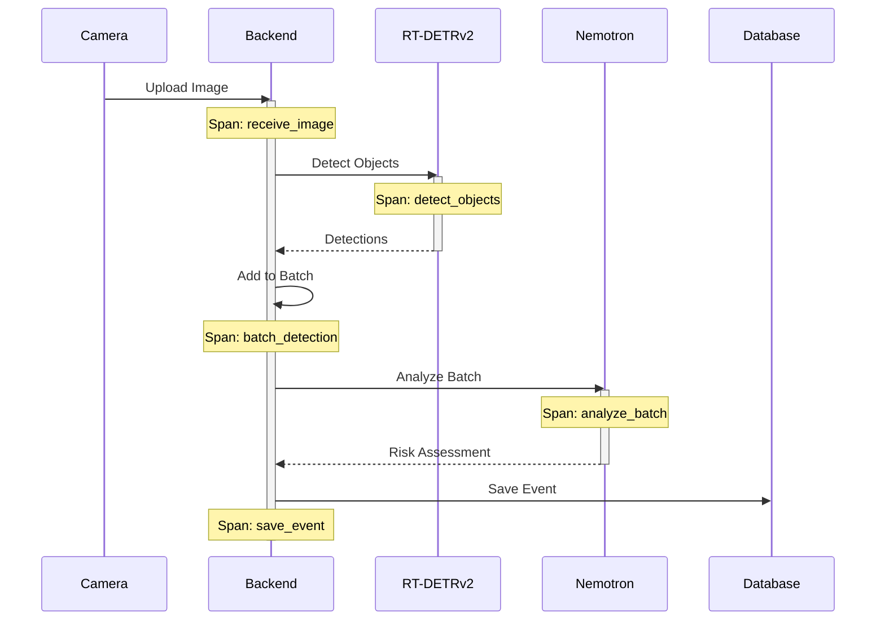
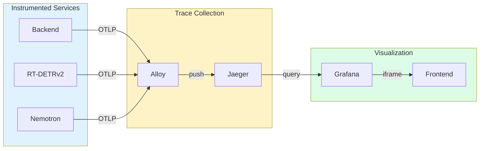

# Distributed Tracing


Distributed tracing dashboard for tracking requests through the AI pipeline.

## What You're Looking At

The Distributed Tracing page provides end-to-end visibility into how requests flow through the security monitoring pipeline. Powered by Jaeger and visualized through Grafana, this page helps you understand latency, identify bottlenecks, and debug issues across services.

### Layout Overview

```
+----------------------------------------------------------+
|  HEADER: Activity Icon | "Distributed Tracing" | Buttons  |
+----------------------------------------------------------+
|                                                          |
|  +----------------------------------------------------+  |
|  |                                                    |  |
|  |           GRAFANA DASHBOARD EMBED                  |  |
|  |                                                    |  |
|  |  +------------+ +------------+ +------------+      |  |
|  |  | Service    | | Operation  | | Time       |      |  |
|  |  | Filter     | | Filter     | | Range      |      |  |
|  |  +------------+ +------------+ +------------+      |  |
|  |                                                    |  |
|  |  +------------------------------------------+      |  |
|  |  |                                          |      |  |
|  |  |           TRACE LIST / TIMELINE          |      |  |
|  |  |                                          |      |  |
|  |  +------------------------------------------+      |  |
|  |                                                    |  |
|  |  +------------------------------------------+      |  |
|  |  |                                          |      |  |
|  |  |           TRACE DETAIL VIEW              |      |  |
|  |  |                                          |      |  |
|  |  +------------------------------------------+      |  |
|  |                                                    |  |
|  +----------------------------------------------------+  |
|                                                          |
+----------------------------------------------------------+
```

The page embeds the HSI Distributed Tracing dashboard from Grafana, which provides:

- **Service Filter** - Select which service(s) to view traces from
- **Operation Filter** - Filter by specific operations (e.g., `/api/events`, `detect`)
- **Time Range** - Select the time period to analyze
- **Trace List** - Searchable list of traces with duration and status
- **Trace Detail** - Detailed span breakdown for selected traces

## Key Components

### Header Controls

| Button | Function |
|--------|----------|
| **Open in Grafana** | Opens the full Grafana dashboard in a new tab for advanced features |
| **Open Jaeger** | Opens the native Jaeger UI at `localhost:16686` |
| **Refresh** | Reloads the embedded dashboard |

### Understanding Traces

A **trace** represents a single request as it flows through the system. Each trace contains multiple **spans**:

```
Trace: "Process Detection"
├── Span: "receive_image" (backend) - 5ms
├── Span: "detect_objects" (rtdetr) - 150ms
│   ├── Span: "preprocess" - 10ms
│   ├── Span: "inference" - 130ms
│   └── Span: "postprocess" - 10ms
├── Span: "batch_detection" (backend) - 2ms
└── Span: "analyze_batch" (nemotron) - 800ms
    ├── Span: "build_prompt" - 5ms
    ├── Span: "llm_inference" - 790ms
    └── Span: "parse_response" - 5ms
```

### Trace Timeline

The timeline view shows spans as horizontal bars:

| Element | Meaning |
|---------|---------|
| **Bar width** | Duration of the span |
| **Bar position** | When the span started relative to trace start |
| **Bar color** | Service that executed the span |
| **Nesting** | Parent-child relationships between spans |

**Timeline Patterns:**

| Pattern | Meaning |
|---------|---------|
| Sequential bars | Operations happening one after another |
| Overlapping bars | Concurrent/parallel operations |
| Long gaps | Time waiting (network, queue, etc.) |
| One very long bar | Bottleneck in that operation |

### Span Details

Click a span to see detailed information:

| Field | Description |
|-------|-------------|
| **Service** | Which service executed this span |
| **Operation** | The operation name (e.g., `detect`, `analyze`) |
| **Duration** | How long the span took |
| **Start Time** | Absolute timestamp |
| **Tags** | Key-value metadata (e.g., `camera.name`, `model.name`) |
| **Logs** | Events that occurred during the span |

### Service Identification

Traces are tagged with service names:

| Service | Description | Typical Operations |
|---------|-------------|-------------------|
| **hsi-backend** | FastAPI backend | API requests, batch processing |
| **hsi-rtdetr** | RT-DETRv2 detector | Object detection, image processing |
| **hsi-nemotron** | Nemotron LLM | Risk analysis, prompt processing |
| **hsi-frontend** | React frontend | User interactions (if instrumented) |

## Understanding the AI Pipeline

### Detection Flow

A typical detection flows through the system like this:



### Latency Breakdown

Typical latency distribution for a single detection:

| Stage | Typical Duration | Notes |
|-------|------------------|-------|
| Image Upload | 10-50ms | Network dependent |
| Object Detection | 100-200ms | GPU dependent |
| Batch Aggregation | 0-90s | Waits for batch window |
| LLM Analysis | 500-2000ms | Model dependent |
| Database Save | 5-20ms | Disk I/O |

## Finding Issues

### Slow Requests

To find slow requests:

1. Set a time range covering the issue period
2. Sort traces by duration (descending)
3. Click on the slowest traces
4. Look for spans with unusually long durations

**Common Bottlenecks:**

| Long Span | Likely Cause | Solution |
|-----------|--------------|----------|
| `llm_inference` | LLM processing | Normal for complex analyses |
| `detect_objects` | GPU saturation | Check GPU utilization |
| `db_query` | Database performance | Add indexes, optimize queries |
| `http_request` | Network latency | Check connectivity |

### Error Traces

Traces with errors are typically highlighted in red or orange:

1. Filter by `error=true` tag
2. Look at span logs for error messages
3. Check the stack trace in span details

**Common Error Patterns:**

| Error | Location | Common Cause |
|-------|----------|--------------|
| `timeout` | rtdetr spans | GPU overloaded |
| `connection_refused` | backend spans | Service down |
| `out_of_memory` | nemotron spans | Model too large for GPU |
| `validation_error` | API spans | Invalid request data |

### Missing Spans

If traces seem incomplete:

1. Check if all services are instrumented
2. Verify trace context is propagated between services
3. Check if sampling is dropping traces

## Correlation Features

### Trace to Logs

Click "View Logs" in a span to see correlated log entries:

1. Logs are filtered to the span's time range
2. Log entries include the trace ID for cross-reference
3. Use this to see detailed debug output during the span

### Trace to Profiling

Correlate traces with continuous profiling:

1. Note the time range of a slow trace
2. Open the [Profiling](pyroscope.md) page
3. Select the same time range
4. See which code paths consumed resources during that trace

### Trace to Events

Security events include trace IDs:

1. Find an event in the [Timeline](timeline.md)
2. Note the event timestamp
3. Search for traces in that time window
4. Find the trace that created that event

## Settings & Configuration

### Grafana URL

The Grafana URL is automatically configured from the backend. If the embedded dashboard fails to load:

1. Verify Grafana is running
2. Check the `grafana_url` config setting
3. Verify network connectivity

### Jaeger Configuration

Jaeger must be configured as a data source in Grafana:

```yaml
# Grafana provisioning (monitoring/grafana/provisioning/datasources/prometheus.yml)
- name: Jaeger
  type: jaeger
  url: http://jaeger:16686
  access: proxy
```

### Sampling

Trace sampling is configured per-service:

| Setting | Default | Description |
|---------|---------|-------------|
| Sample Rate | 1.0 | Percentage of traces to keep (1.0 = 100%) |
| Rate Limiting | None | Max traces per second |

For production, consider reducing sampling to 10-20% to reduce storage.

### Retention

Trace data retention is configured in Jaeger:

| Setting | Default | Description |
|---------|---------|-------------|
| Retention Period | 7 days | How long traces are kept |
| Max Traces | Unlimited | Maximum traces to store |

## Troubleshooting

### Dashboard Shows "No Data"

1. **Check Jaeger is running**: `docker ps | grep jaeger`
2. **Verify services are instrumented**: Check OpenTelemetry configuration
3. **Check time range**: Ensure the selected time range has traces
4. **Verify datasource**: Confirm Jaeger is configured in Grafana

### Traces are Missing Spans

1. **Check service connectivity**: Ensure all services can reach Jaeger
2. **Verify trace propagation**: Check that trace headers are passed between services
3. **Check sampling**: Traces might be sampled out

### High Latency in Tracing

Tracing overhead should be minimal (<1%), but if you notice impact:

1. Reduce the number of spans per trace
2. Increase sampling rate (keep fewer traces)
3. Use asynchronous span export

### "Failed to load configuration" Error

The frontend couldn't fetch the Grafana URL:

1. Verify the backend is running
2. Check network connectivity
3. The dashboard will use `/grafana` as a fallback

## Technical Deep Dive

### Architecture



### Related Code

**Frontend:**
- Tracing Page: `frontend/src/components/tracing/TracingPage.tsx`
- Grafana URL Utility: `frontend/src/utils/grafanaUrl.ts`

**Backend:**
- Tracing Configuration: `backend/core/telemetry.py`

**Infrastructure:**
- Jaeger Container: `docker-compose.prod.yml` (jaeger service)
- Grafana Dashboard: `monitoring/grafana/dashboards/tracing.json`
- Alloy Configuration: `monitoring/alloy/config.alloy`

### OpenTelemetry Integration

The system uses OpenTelemetry for distributed tracing:

```python
# Example: Creating a span in Python
from opentelemetry import trace

tracer = trace.get_tracer(__name__)

with tracer.start_as_current_span("detect_objects") as span:
    span.set_attribute("camera.name", camera_name)
    span.set_attribute("image.size", image_size)
    result = detector.detect(image)
    span.set_attribute("detection.count", len(result))
```

### Trace Context Propagation

Trace context is propagated between services using W3C Trace Context headers:

```
traceparent: 00-0af7651916cd43dd8448eb211c80319c-b7ad6b7169203331-01
tracestate: vendor=value
```

---

## Quick Reference

### When to Use Tracing

| Scenario | What to Look For |
|----------|------------------|
| Slow API response | Long spans in the trace |
| Failed request | Error tags and span logs |
| Intermittent issues | Compare fast vs slow traces |
| Service debugging | Spans from specific service |

### Common Actions

| I want to... | Do this... |
|--------------|------------|
| Find slow requests | Sort by duration, click longest |
| Find errors | Filter by `error=true` |
| See request flow | Expand trace to see all spans |
| Debug a specific event | Search by time range of event |
| Compare performance | Select two traces, use compare view |
| Get more details | Open in Jaeger for full UI |
