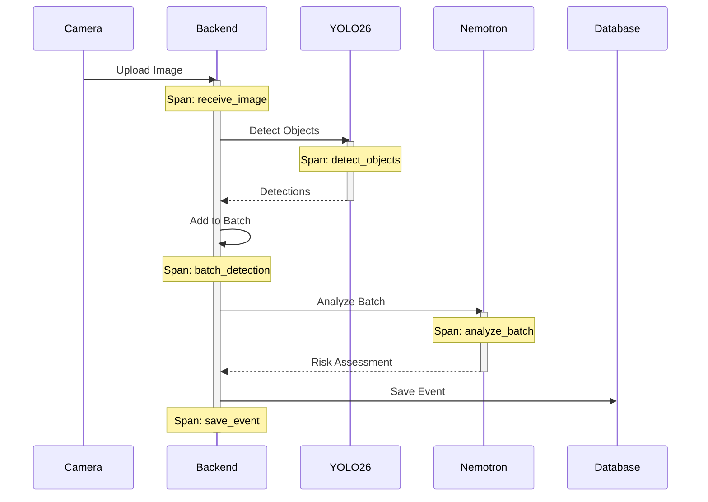
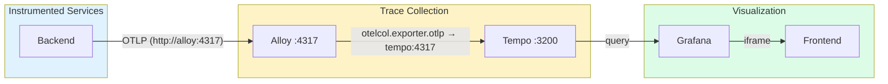

# Distributed Tracing


Distributed tracing dashboard for tracking requests through the AI pipeline.

## What You're Looking At

The Distributed Tracing page provides end-to-end visibility into how requests flow through the security monitoring pipeline. Traces are collected by Alloy, stored in **Tempo** (there is no Jaeger container in `docker-compose.prod.yml`), and visualized through an embedded Grafana dashboard. The page helps you understand latency, identify bottlenecks, and debug issues.

### Layout Overview

```
+----------------------------------------------------------+
|  HEADER: Activity Icon | "Distributed Tracing" | Buttons  |
+----------------------------------------------------------+
|                                                          |
|  +----------------------------------------------------+  |
|  |                                                    |  |
|  |           GRAFANA DASHBOARD EMBED                  |  |
|  |                                                    |  |
|  |  +------------+ +------------+ +------------+      |  |
|  |  | Service    | | Operation  | | Time       |      |  |
|  |  | Filter     | | Filter     | | Range      |      |  |
|  |  +------------+ +------------+ +------------+      |  |
|  |                                                    |  |
|  |  +------------------------------------------+      |  |
|  |  |                                          |      |  |
|  |  |           TRACE LIST / TIMELINE          |      |  |
|  |  |                                          |      |  |
|  |  +------------------------------------------+      |  |
|  |                                                    |  |
|  |  +------------------------------------------+      |  |
|  |  |                                          |      |  |
|  |  |           TRACE DETAIL VIEW              |      |  |
|  |  |                                          |      |  |
|  |  +------------------------------------------+      |  |
|  |                                                    |  |
|  +----------------------------------------------------+  |
|                                                          |
+----------------------------------------------------------+
```

The page embeds the HSI Distributed Tracing dashboard from Grafana, which provides:

- **Service Filter** - Select which service(s) to view traces from
- **Operation Filter** - Filter by specific operations (e.g., `/api/events`, `detect`)
- **Time Range** - Select the time period to analyze
- **Trace List** - Searchable list of traces with duration and status
- **Trace Detail** - Detailed span breakdown for selected traces

## Key Components

### Header Controls

| Button              | Function                                                                                                             |
| ------------------- | -------------------------------------------------------------------------------------------------------------------- |
| **Open in Grafana** | Opens the full Grafana dashboard in a new tab for advanced features                                                  |
| **Open Jaeger**     | Links to `http://localhost:16686` — dead link as shipped: no Jaeger runs in the compose stack (traces live in Tempo) |
| **Refresh**         | Reloads the embedded dashboard                                                                                       |

### Understanding Traces

A **trace** represents a single request as it flows through the system. Each trace contains multiple **spans**:

```
Trace: "Process Detection"
├── Span: "receive_image" (backend) - 5ms
├── Span: "detect_objects" (yolo26) - 150ms
│   ├── Span: "preprocess" - 10ms
│   ├── Span: "inference" - 130ms
│   └── Span: "postprocess" - 10ms
├── Span: "batch_detection" (backend) - 2ms
└── Span: "analyze_batch" (nemotron) - 800ms
    ├── Span: "build_prompt" - 5ms
    ├── Span: "llm_inference" - 790ms
    └── Span: "parse_response" - 5ms
```

### Trace Timeline

The timeline view shows spans as horizontal bars:

| Element          | Meaning                                       |
| ---------------- | --------------------------------------------- |
| **Bar width**    | Duration of the span                          |
| **Bar position** | When the span started relative to trace start |
| **Bar color**    | Service that executed the span                |
| **Nesting**      | Parent-child relationships between spans      |

**Timeline Patterns:**

| Pattern           | Meaning                                |
| ----------------- | -------------------------------------- |
| Sequential bars   | Operations happening one after another |
| Overlapping bars  | Concurrent/parallel operations         |
| Long gaps         | Time waiting (network, queue, etc.)    |
| One very long bar | Bottleneck in that operation           |

### Span Details

Click a span to see detailed information:

| Field          | Description                                            |
| -------------- | ------------------------------------------------------ |
| **Service**    | Which service executed this span                       |
| **Operation**  | The operation name (e.g., `detect`, `analyze`)         |
| **Duration**   | How long the span took                                 |
| **Start Time** | Absolute timestamp                                     |
| **Tags**       | Key-value metadata (e.g., `camera.name`, `model.name`) |
| **Logs**       | Events that occurred during the span                   |

### Service Identification

Traces carry the instrumenting service's name — today only the backend exports spans, under
`OTEL_SERVICE_NAME` (compose default `nemotron-backend`). AI services are not instrumented, so
`detect`/`analyze` steps show up as child spans or client-call spans inside the backend trace,
not as separate services:

| Service              | Description     | Typical Operations                              |
| -------------------- | --------------- | ----------------------------------------------- |
| **nemotron-backend** | FastAPI backend | API requests, batch processing, AI client calls |

## Understanding the AI Pipeline

### Detection Flow

A typical detection flows through the system like this:


```mermaid
sequenceDiagram
    participant C as Camera
    participant B as Backend
    participant R as YOLO26
    participant N as Nemotron
    participant DB as Database

    C->>B: Upload Image
    activate B
    Note over B: Span: receive_image

    B->>R: Detect Objects
    activate R
    Note over R: Span: detect_objects
    R-->>B: Detections
    deactivate R

    B->>B: Add to Batch
    Note over B: Span: batch_detection

    B->>N: Analyze Batch
    activate N
    Note over N: Span: analyze_batch
    N-->>B: Risk Assessment
    deactivate N

    B->>DB: Save Event
    Note over B: Span: save_event
    deactivate B
```

### Latency Breakdown

Typical latency distribution for a single detection:

| Stage             | Typical Duration | Notes                  |
| ----------------- | ---------------- | ---------------------- |
| Image Upload      | 10-50ms          | Network dependent      |
| Object Detection  | 100-200ms        | GPU dependent          |
| Batch Aggregation | 0-90s            | Waits for batch window |
| LLM Analysis      | 500-2000ms       | Model dependent        |
| Database Save     | 5-20ms           | Disk I/O               |

## Finding Issues

### Slow Requests

To find slow requests:

1. Set a time range covering the issue period
2. Sort traces by duration (descending)
3. Click on the slowest traces
4. Look for spans with unusually long durations

**Common Bottlenecks:**

| Long Span        | Likely Cause         | Solution                      |
| ---------------- | -------------------- | ----------------------------- |
| `llm_inference`  | LLM processing       | Normal for complex analyses   |
| `detect_objects` | GPU saturation       | Check GPU utilization         |
| `db_query`       | Database performance | Add indexes, optimize queries |
| `http_request`   | Network latency      | Check connectivity            |

### Error Traces

Traces with errors are typically highlighted in red or orange:

1. Filter by `error=true` tag
2. Look at span logs for error messages
3. Check the stack trace in span details

**Common Error Patterns:**

| Error                | Location       | Common Cause            |
| -------------------- | -------------- | ----------------------- |
| `timeout`            | yolo26 spans   | GPU overloaded          |
| `connection_refused` | backend spans  | Service down            |
| `out_of_memory`      | nemotron spans | Model too large for GPU |
| `validation_error`   | API spans      | Invalid request data    |

### Missing Spans

If traces seem incomplete:

1. Check if all services are instrumented
2. Verify trace context is propagated between services
3. Check if sampling is dropping traces

## Correlation Features

### Trace to Logs

The Tempo datasource is provisioned with `tracesToLogsV2` pointing at Loki with
`filterByTraceID: true` (`monitoring/grafana/provisioning/datasources/prometheus.yml`), so in
Grafana Explore a span links to Loki logs from the same service and time range:

1. Open the trace in Grafana Explore (use **Open in Grafana**, not the kiosk embed)
2. Select a span and use the "Logs" / "Logs for your project" link on the span
3. Loki shows entries filtered to the span's time range
4. Backend log lines carry the trace ID for manual cross-reference (`OTEL_ENABLED=true` in compose)

### Trace to Profiling

Correlate traces with continuous profiling:

1. Note the time range of a slow trace
2. Open the [Profiling](pyroscope.md) page
3. Select the same time range
4. See which code paths consumed resources during that trace

### Trace to Events

Security events include trace IDs:

1. Find an event in the [Timeline](timeline.md)
2. Note the event timestamp
3. Search for traces in that time window
4. Find the trace that created that event

## Settings & Configuration

### Grafana URL

The Grafana URL is automatically configured from the backend. If the embedded dashboard fails to load:

1. Verify Grafana is running
2. Check the `grafana_url` config setting
3. Verify network connectivity

### Tempo Configuration

Tempo is provisioned as the tracing data source in Grafana:

```yaml
# Grafana provisioning (monitoring/grafana/provisioning/datasources/prometheus.yml)
- name: Tempo
  uid: tempo
  type: tempo
  url: http://tempo:3200
  access: proxy
```

The Tempo container listens on `127.0.0.1:${TEMPO_PORT:-3200}` on the host (OTLP gRPC on
`${TEMPO_OTLP_GRPC:-4317}`).

### Sampling

Sampling is configured on the backend via environment variables (see
`backend/core/telemetry.py`; in compose the backend sets `OTEL_ENABLED=true`,
`OTEL_SERVICE_NAME=nemotron-backend`, `OTEL_EXPORTER_OTLP_ENDPOINT=http://alloy:4317`):

| Setting                  | Default | Description                               |
| ------------------------ | ------- | ----------------------------------------- |
| `OTEL_TRACE_SAMPLE_RATE` | 1.0     | Percentage of traces to keep (1.0 = 100%) |

For production, consider lowering it to 0.1-0.2 (keep 10-20% of traces) to reduce storage.

### Retention

Trace retention lives in Tempo's config, not Jaeger's (`monitoring/tempo/tempo-config.yml`):

| Setting           | Default        | Description                    |
| ----------------- | -------------- | ------------------------------ |
| `block_retention` | 720h (30 days) | How long trace blocks are kept |

## Troubleshooting

### Dashboard Shows "No Data"

1. **Check Tempo and Alloy are running**: `podman ps -a --filter name=tempo --filter name=alloy`
2. **Verify tracing is enabled**: `OTEL_ENABLED=true` on the backend (compose default)
3. **Check time range**: Ensure the selected time range has traces
4. **Verify datasource**: The `tempo` datasource is provisioned automatically in Grafana

### Traces are Missing Spans

1. **Check service connectivity**: Ensure the backend can reach Alloy (`OTEL_EXPORTER_OTLP_ENDPOINT`, compose default `http://alloy:4317`)
2. **Verify trace propagation**: Check that trace headers are passed between services
3. **Check sampling**: Traces might be sampled out

### High Latency in Tracing

Tracing overhead should be minimal (<1%), but if you notice impact:

1. Reduce the number of spans per trace
2. Increase sampling rate (keep fewer traces)
3. Use asynchronous span export

### "Failed to load configuration" Error

The frontend couldn't fetch the Grafana URL:

1. Verify the backend is running
2. Check network connectivity
3. The dashboard will use `/grafana` as a fallback

## Technical Deep Dive

### Architecture

Only the backend exports spans today (`backend/core/telemetry.py`); the AI services are not
OpenTelemetry-instrumented, so AI-side latency appears as time inside the backend's outbound
call spans.


```mermaid
flowchart LR
    subgraph Services["Instrumented Services"]
        B[Backend]
    end

    subgraph Collection["Trace Collection"]
        A[Alloy :4317]
        T[Tempo :3200]
    end

    subgraph Visualization["Visualization"]
        G[Grafana]
        F[Frontend]
    end

    B -->|"OTLP (http://alloy:4317)"| A
    A -->|"otelcol.exporter.otlp → tempo:4317"| T
    T -->|query| G
    G -->|iframe| F

    style Services fill:#e0f2fe
    style Collection fill:#fef3c7
    style Visualization fill:#dcfce7
```

### Related Code

**Frontend:**

- Tracing Page: `frontend/src/components/tracing/TracingPage.tsx`
- Grafana URL Utility: `frontend/src/utils/grafanaUrl.ts`

**Backend:**

- Tracing Configuration: `backend/core/telemetry.py`

**Infrastructure:**

- Tempo Container: `docker-compose.prod.yml` (tempo service) + `monitoring/tempo/tempo-config.yml`
- Grafana Dashboard: `monitoring/grafana/dashboards/tracing.json` (uid `hsi-tracing`)
- Alloy Configuration: `monitoring/alloy/config.alloy` (OTLP receiver → Tempo exporter)

### OpenTelemetry Integration

The system uses OpenTelemetry for distributed tracing:

```python
# Example: Creating a span in Python
from opentelemetry import trace

tracer = trace.get_tracer(__name__)

with tracer.start_as_current_span("detect_objects") as span:
    span.set_attribute("camera.name", camera_name)
    span.set_attribute("image.size", image_size)
    result = detector.detect(image)
    span.set_attribute("detection.count", len(result))
```

### Trace Context Propagation

Trace context is propagated between services using W3C Trace Context headers:

```
traceparent: 00-0af7651916cd43dd8448eb211c80319c-b7ad6b7169203331-01
tracestate: vendor=value
```

---

## Quick Reference

### When to Use Tracing

| Scenario            | What to Look For            |
| ------------------- | --------------------------- |
| Slow API response   | Long spans in the trace     |
| Failed request      | Error tags and span logs    |
| Intermittent issues | Compare fast vs slow traces |
| Service debugging   | Spans from specific service |

### Common Actions

| I want to...           | Do this...                                 |
| ---------------------- | ------------------------------------------ |
| Find slow requests     | Sort by duration, click longest            |
| Find errors            | Filter by `error=true`                     |
| See request flow       | Expand trace to see all spans              |
| Debug a specific event | Search by time range of event              |
| Compare performance    | Select two traces, use compare view        |
| Get more details       | Open in Grafana Explore (Tempo datasource) |
