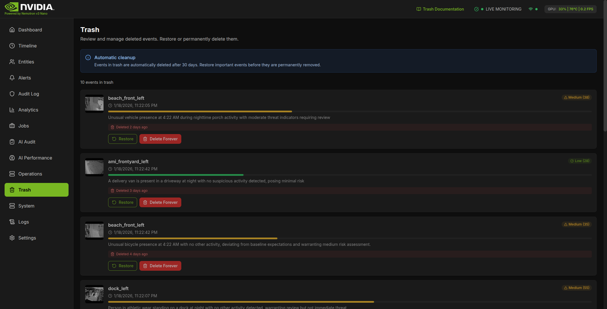

# Trash

The Trash page shows events that have been soft-deleted, giving you a safety net to review and restore accidentally deleted items before they are permanently removed.

## What You're Looking At

The Trash page serves as a temporary holding area for deleted security events. When you delete an event from the Timeline or Events page, it moves to Trash instead of being immediately destroyed. This two-stage deletion process protects against accidental data loss and gives you time to reconsider.

Key features:

- **Recoverable Events** - View all soft-deleted events with their original details
- **30-Day Retention** - Events in trash are automatically purged after 30 days (configurable via `RETENTION_DAYS`)
- **Restore Capability** - One-click restore returns events to active status
- **Permanent Deletion** - Option to immediately and irreversibly remove events
- **Events Counter** - Shows the total number of events currently in trash

## Key Components

### Page Header

The page displays a header with:

- **Title** - "Trash"
- **Subtitle** - "Review and manage deleted events. Restore or permanently delete them."

### Events Counter

Below the auto-deletion notice, a counter shows the number of events currently in trash (e.g., "5 events in trash" or "1 event in trash").

### Deleted Events List

Each deleted event card displays:

- **Thumbnail** - Grayscale version of the event thumbnail (or a placeholder eye icon if no thumbnail exists)
- **Camera Name** - Which camera captured the event
- **Event Timestamp** - When the event originally occurred (with a clock icon)
- **Risk Badge** - Original risk score and level (color-coded)
- **Risk Progress Bar** - Visual indicator of risk score (0-100)
- **Summary** - AI-generated description of the event (truncated to 2 lines)
- **Deletion Timestamp** - How long ago the event was deleted (e.g., "Just now", "2 hours ago", "3 days ago") displayed in a red badge with a trash icon

The cards appear with reduced opacity (70%) and grayscale thumbnails to visually distinguish them from active events. Hovering increases the opacity to 90%.

### Restore Button

Click "Restore" to return an event to active status:

- Event reappears in the Timeline and Events pages
- All associated detections remain intact (detections are never soft-deleted, only events are)
- Pending file deletions are cancelled if within the 5-minute grace period (files are preserved)
- Cache is automatically invalidated to reflect the change

The restore button shows a loading spinner while the operation is in progress, and is disabled while a delete operation is pending.

### Permanent Delete Button

Click "Delete Forever" for immediate, irreversible removal:

1. A confirmation dialog appears (overlaid on the card) with a warning icon, stating "This action cannot be undone. The event and all associated data will be permanently removed."
2. You can click "Cancel" to abort or "Delete Forever" to confirm
3. Upon confirmation, the event and all associated files are permanently deleted (bypasses the 5-minute file deletion queue)
4. Detection images, thumbnails, and video clips are removed from disk immediately

**Warning:** Permanent deletion cannot be reversed. Use this only when you are certain the event has no value.

### Error Display

If a restore or permanent delete operation fails, an error message is displayed at the top of the page in a red alert box showing the specific error message. This helps troubleshoot issues with the operation.

### Empty State

When the trash is empty, a placeholder message explains:

- Deleted events will appear here
- You can restore them within 30 days
- After 30 days, automatic cleanup removes them permanently

### Auto-Deletion Notice

A blue information banner at the top of the page (below the header) reminds users about the 30-day automatic cleanup policy with an info icon. The notice reads:

> **Automatic cleanup**
> Events in trash are automatically deleted after 30 days. Restore important events before they are permanently removed.

Events approaching this deadline should be reviewed promptly.

## Settings & Configuration

### Retention Period

Events in trash are retained for **30 days** before automatic cleanup. This period is controlled by the global `RETENTION_DAYS` environment variable and applies system-wide to both active events and soft-deleted events.

### File Deletion Delay

When an event is soft-deleted, associated files (images, thumbnails, clips) are scheduled for deletion with a **5-minute delay** (300 seconds). This delay supports undo operations:

- If you restore within 5 minutes, files are preserved (pending deletion jobs are cancelled via Redis)
- After 5 minutes, the background file deletion worker processes the queue and removes files
- Permanent delete bypasses this queue entirely and removes files immediately

**Technical detail:** The file deletion queue uses a Redis sorted set (`file_deletion_queue`) where each job's score is the scheduled deletion timestamp. A background worker polls this queue every 60 seconds.

### Automatic Cleanup

The `CleanupService` runs daily at **03:00 AM** (configurable via `cleanup_time` parameter) and:

1. Identifies events older than the retention period (based on `started_at`, not `deleted_at`)
2. Removes them from the database permanently
3. Deletes associated files from disk (thumbnails, detection images if configured)
4. Cleans up old GPU stats and logs
5. Logs cleanup statistics for monitoring

**Note:** The automatic cleanup applies to ALL old events (both active and soft-deleted) based on the retention period, not just those in trash.

## Troubleshooting

### Events not appearing in Trash

1. Verify you have network connectivity (check the health indicator in the header)
2. The deletion may have been a hard delete (permanent) rather than soft delete
3. If deleted more than 30 days ago, automatic cleanup has already removed them
4. Try clicking "Try Again" if an error message appears

### Restore button not working

1. Check for error messages displayed below the action buttons
2. The associated files may have already been deleted (past 5-minute window)
3. There may be a database connectivity issue - check system health
4. Verify you are not attempting to restore an event that was hard-deleted

### Permanent delete confirmation stuck

1. Refresh the page if the confirmation dialog becomes unresponsive
2. Check browser console for JavaScript errors
3. The mutation may be pending - wait for loading spinner to complete

### Deleted events count seems wrong

The count shown reflects events currently in trash. Events are automatically removed after 30 days, so the count decreases over time even without manual action.

### Files missing after restore

If files were scheduled for deletion and the 5-minute grace period passed before restore:

- The event record is restored, but image files may be gone
- Thumbnails and clips will show as unavailable
- The event summary and metadata remain accessible

---

## Technical Deep Dive

For developers wanting to understand the underlying soft-delete implementation.

### Architecture

- **Soft-Delete Pattern**: Events use a `deleted_at` timestamp column. When set, the event is considered deleted. When NULL, the event is active. The `is_deleted` property on the Event model provides a boolean helper.
- **Events Only**: Only events support soft-delete. Detections and alerts do NOT have soft-delete capability - they remain linked to the event regardless of its deletion status.
- **Cascade Operations**: File deletion is scheduled separately with a 5-minute delay via Redis sorted sets. Restoring cancels pending file deletions.
- **Data Model Reference**: [Data Model Reference](../architecture/data-model.md)

### API Endpoints

| Method | Endpoint                         | Description                                                       |
| ------ | -------------------------------- | ----------------------------------------------------------------- |
| GET    | `/api/events/deleted`            | List all soft-deleted events (ordered by `deleted_at` descending) |
| DELETE | `/api/events/{event_id}`         | Soft delete an event (sets `deleted_at` timestamp)                |
| POST   | `/api/events/{event_id}/restore` | Restore a soft-deleted event (clears `deleted_at`)                |
| DELETE | `/api/events/bulk`               | Bulk delete with `soft_delete` option (default: true)             |

**Permanent Delete (from Trash):** To permanently delete an event that's already in trash, the frontend sends `DELETE /api/events/{event_id}` with `{ soft_delete: false }` in the request body. This uses the bulk delete endpoint logic to perform a hard delete.

### Related Code

Trash-related frontend components are organized by domain (pages, events, hooks) rather than having a dedicated `components/trash/` directory.

| Component            | Location                                                                                  |
| -------------------- | ----------------------------------------------------------------------------------------- |
| Frontend Page        | `frontend/src/pages/TrashPage.tsx`                                                        |
| Event Card Component | `frontend/src/components/events/DeletedEventCard.tsx`                                     |
| Query Hooks          | `frontend/src/hooks/useTrashQuery.ts`                                                     |
| API Client Functions | `frontend/src/services/api.ts` (fetchDeletedEvents, restoreEvent, permanentlyDeleteEvent) |
| Backend Routes       | `backend/api/routes/events.py`                                                            |
| Event Service        | `backend/services/event_service.py`                                                       |
| File Service         | `backend/services/file_service.py`                                                        |
| Cleanup Service      | `backend/services/cleanup_service.py`                                                     |

### Query Hooks

The Trash page uses three TanStack Query hooks defined in `useTrashQuery.ts`:

- **`useDeletedEventsQuery`** - Fetches soft-deleted events from `/api/events/deleted`. Returns `deletedEvents`, `total`, `isEmpty`, `isLoading`, `isRefetching`, `error`, and `refetch`.
- **`useRestoreEventMutation`** - Restores events via `POST /api/events/{id}/restore`. On success, invalidates both the deleted events cache and the main events list cache.
- **`usePermanentDeleteMutation`** - Permanently deletes via `DELETE /api/events/{id}` with `soft_delete: false`. On success, invalidates the deleted events cache.

### File Deletion Queue

The `FileService` uses a Redis sorted set (`file_deletion_queue`) to manage scheduled deletions:

1. When an event is soft-deleted, files are added to the queue with a score of `current_time + 300` (5 minutes)
2. A background worker polls every 60 seconds and processes entries where `score <= current_time`
3. If the event is restored, `cancel_deletion_by_event_id()` removes all pending jobs for that event
4. Only files that actually exist on disk are queued (non-existent paths are filtered out)

### Soft Delete vs Hard Delete

| Aspect     | Soft Delete                                       | Hard Delete (Permanent)    |
| ---------- | ------------------------------------------------- | -------------------------- |
| Database   | Sets `deleted_at` timestamp                       | Removes row from database  |
| Files      | Scheduled for deletion after 5 minutes            | Deleted immediately        |
| Reversible | Yes, within 5 minutes (files) or 30 days (record) | No                         |
| Detections | Remain linked to event                            | Cascade deleted with event |
| Cache      | Invalidates events and stats caches               | Same                       |

### Database Indexes

For performance, the events table has indexes supporting soft-delete queries:

- `idx_events_deleted_at` - Efficiently filter deleted vs active events
- Combined with `started_at` descending for sorted trash listing
