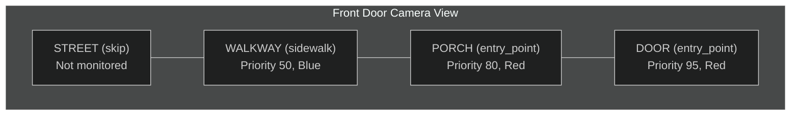
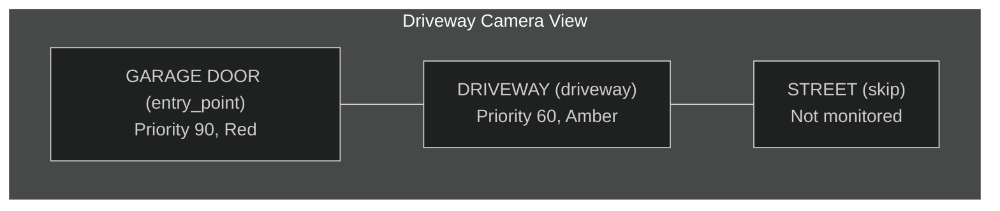
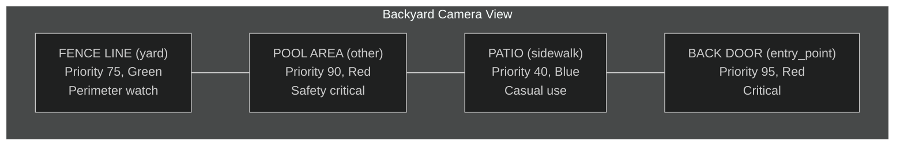
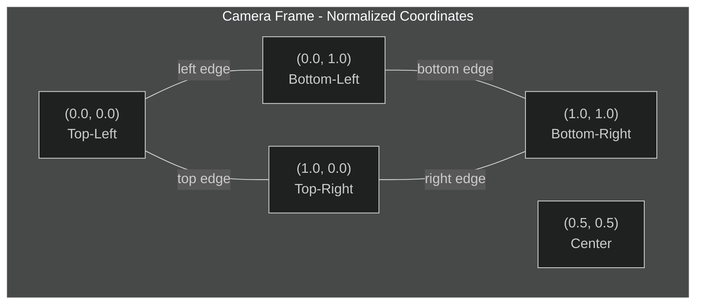

# Detection Zones

<!-- Screenshot pending: zones.png - Zone Editor interface showing detection zones on a camera view -->

Configure detection zones to focus AI analysis on specific areas within each camera view.

## What You're Looking At

Detection zones let you define specific regions within a camera's field of view for focused monitoring. Instead of analyzing the entire frame equally, the AI pays special attention to activity in designated zones like entry points, driveways, or restricted areas.

Zones are configured through the Zone Editor, accessible from the Settings > Cameras tab by clicking the map pin icon on any camera card.

## Why Use Zones?

Zones help you:

- **Reduce false positives** - Ignore motion from roads, sidewalks, or trees
- **Prioritize areas** - Get higher-priority alerts for entry points
- **Organize detections** - See which zone triggered each detection
- **Customize sensitivity** - Different zones can have different importance levels

### Without Zones vs. With Zones

| Scenario                   | Without Zones          | With Zones                         |
| -------------------------- | ---------------------- | ---------------------------------- |
| Car on street              | Medium alert           | Ignored (not in monitored zone)    |
| Person at front door       | Generic "person" alert | "Person in Entry Point zone" alert |
| Tree branches moving       | Motion detected        | Ignored (not in monitored zone)    |
| Someone in restricted area | Standard detection     | High-priority "Restricted" alert   |

---

## Zone Types

Each zone has a type that helps the AI understand its purpose:

| Type          | Color | Best For                           |
| ------------- | ----- | ---------------------------------- |
| `entry_point` | Red   | Doors, gates, garage entries       |
| `driveway`    | Amber | Driveways, parking areas           |
| `sidewalk`    | Blue  | Sidewalks, paths, patios           |
| `yard`        | Green | Private yard areas, gardens        |
| `other`       | Gray  | Any other area you want to monitor |

### Choosing the Right Zone Type

```
What is the primary activity expected in this area?

Entry/Exit activity  -->  entry_point
Vehicle movement     -->  driveway
Foot traffic         -->  sidewalk
Private property     -->  yard
None of the above    -->  other
```

---

## Key Components

### Zone Editor

The Zone Editor modal has two main sections:

| Section    | Location | Purpose                            |
| ---------- | -------- | ---------------------------------- |
| Canvas     | Left     | Camera snapshot with zone overlays |
| Zone Panel | Right    | Zone list, form, or drawing help   |

### Zone List

The right panel shows all zones for the current camera:

| Element        | Location     | Information                     |
| -------------- | ------------ | ------------------------------- |
| Color Square   | Left         | Zone color for visual reference |
| Zone Name      | Center       | Name you assigned               |
| Type Badge     | Below name   | Entry Point, Driveway, etc.     |
| Priority       | Below name   | Priority value                  |
| Disabled Badge | Next to name | Shows if zone is disabled       |
| Action Buttons | Right        | Enable/Disable, Edit, Delete    |

---

## Drawing Zones

### Rectangle Zones (Recommended)

Best for most use cases - doorways, driveways, rectangular areas.

**How to draw:**

1. Click the **Rectangle** button in the toolbar
2. The cursor changes to a crosshair
3. Click and hold at one corner of your desired area
4. Drag to the opposite corner
5. Release to complete the rectangle
6. The zone form opens automatically

### Polygon Zones (Advanced)

For irregular areas - curved driveways, property boundaries, areas avoiding obstacles.

**How to draw:**

1. Click the **Polygon** button in the toolbar
2. The cursor changes to a crosshair
3. Click to place each vertex point
4. Continue clicking to add more points
5. Double-click to close the shape
6. The zone form opens automatically

### Drawing Tips

| Tip                   | Explanation                                    |
| --------------------- | ---------------------------------------------- |
| Start with rectangles | Faster to draw, easier to adjust               |
| Leave buffer space    | Make zones slightly larger than the exact area |
| Avoid overlapping     | Overlapping zones can cause confusion          |
| Press ESC to cancel   | Cancels drawing without creating a zone        |

---

## Configuring Zone Settings

After drawing, the Zone Form appears with these settings:

### Zone Name

| Field | Requirements                 | Example      |
| ----- | ---------------------------- | ------------ |
| Name  | 1-50 characters, descriptive | "Front Door" |

**Good names:** "Front Door Entry", "Garage Driveway", "Backyard Fence Line"

**Bad names:** "Zone 1", "z", "asdfgh"

### Zone Type

Select from the dropdown:

| Type        | When to Use                                 |
| ----------- | ------------------------------------------- |
| Entry Point | Doors, gates, any access point to your home |
| Driveway    | Where vehicles park or drive                |
| Sidewalk    | Walkways, paths, outdoor seating areas      |
| Yard        | Private outdoor areas                       |
| Other       | Anything that does not fit above categories |

### Zone Color

Choose from 8 predefined colors:

| Color  | Hex Code | Suggested Use                |
| ------ | -------- | ---------------------------- |
| Blue   | #3B82F6  | Sidewalks, paths             |
| Green  | #10B981  | Yards, safe areas            |
| Amber  | #F59E0B  | Driveways, vehicle areas     |
| Red    | #EF4444  | Entry points, critical areas |
| Purple | #8B5CF6  | Custom/special zones         |
| Pink   | #EC4899  | Custom/special zones         |
| Indigo | #6366F1  | Custom/special zones         |
| Teal   | #14B8A6  | Custom/special zones         |

### Priority

A slider from 0 to 100:

| Priority | Meaning                             |
| -------- | ----------------------------------- |
| 0        | Lowest priority, informational only |
| 1-40     | Low priority, routine monitoring    |
| 41-70    | Medium priority, important areas    |
| 71-99    | High priority, critical areas       |
| 100      | Highest priority, always alert      |

**When zones overlap:** Detections are attributed to the highest-priority zone.

### Enabled Toggle

| State    | Effect                                   |
| -------- | ---------------------------------------- |
| Enabled  | Zone is active, detections are processed |
| Disabled | Zone is ignored, detections pass through |

Use disable (not delete) when you want to:

- Test if the zone is causing too many alerts
- Temporarily pause monitoring
- Compare detection accuracy with/without the zone

---

## Managing Existing Zones

### Selecting Zones

Click a zone in the list or on the canvas to select it:

- Selected zones show a green border and glow
- Zone details appear in the panel
- Use arrow keys to navigate between zones

### Editing Zones

1. Click the **Edit** button (pencil icon) on any zone
2. The Zone Form opens with current settings
3. Modify any field
4. Click **Update Zone** to save

**Note:** You cannot change the zone shape after creation. Delete and recreate if you need a different shape.

### Disabling Zones

1. Click the **Eye** icon to toggle enabled/disabled
2. Disabled zones:
   - Appear at 50% opacity in the list
   - Show dashed outline on the canvas
   - Display a "Disabled" badge

### Deleting Zones

1. Click the **Trash** icon on the zone
2. A confirmation bar appears at the bottom
3. Click **Delete** to confirm or **Cancel** to keep the zone

**Warning:** Deletion is permanent and cannot be undone.

---

## Visual Examples

### Example 1: Front Door Camera

Camera View: Front porch with door, walkway, and part of street



| Zone Name   | Type        | Priority | Color | Rationale                    |
| ----------- | ----------- | -------- | ----- | ---------------------------- |
| Front Door  | entry_point | 95       | Red   | Most critical - direct entry |
| Front Porch | entry_point | 80       | Red   | High priority approach area  |
| Front Walk  | sidewalk    | 50       | Blue  | Standard foot traffic        |
| (No zone)   | -           | -        | -     | Street traffic ignored       |

### Example 2: Driveway Camera

Camera View: Driveway, garage door, and side of house



| Zone Name   | Type        | Priority | Color | Rationale                 |
| ----------- | ----------- | -------- | ----- | ------------------------- |
| Garage Door | entry_point | 90       | Red   | Critical access point     |
| Driveway    | driveway    | 60       | Amber | Vehicle activity expected |
| (No zone)   | -           | -        | -     | Street traffic ignored    |

### Example 3: Backyard Camera

Camera View: Backyard with patio, fence, and pool



| Zone Name  | Type        | Priority | Color | Rationale                  |
| ---------- | ----------- | -------- | ----- | -------------------------- |
| Back Door  | entry_point | 95       | Red   | Critical entry point       |
| Pool Area  | other       | 90       | Red   | Safety - child/pet alert   |
| Fence Line | yard        | 75       | Green | Perimeter breach detection |
| Patio      | sidewalk    | 40       | Blue  | Known activity area        |

---

## Viewing Zone Activity

### In the Timeline

Events show which zone was involved:

```
Front Door Camera
Zone: Front Porch (entry_point)
Risk: Medium (45)
"Person approached front door and waited"
```

### In Event Details

The Event Detail Modal shows:

- Zone name and type
- Detection coordinates within the zone
- Time spent in zone (for tracked objects)

---

## Best Practices

### Do

| Practice                  | Benefit                                |
| ------------------------- | -------------------------------------- |
| Name zones clearly        | "Front Door Entry" > "Zone 1"          |
| Focus on entry points     | Doors/gates deserve dedicated zones    |
| Exclude high-motion areas | Roads, tree lines, busy sidewalks      |
| Use multiple small zones  | Better precision than one large zone   |
| Test and iterate          | Review detections, adjust boundaries   |
| Set meaningful priorities | Reserve high values for critical areas |

### Don't

| Practice                  | Problem                               |
| ------------------------- | ------------------------------------- |
| Cover entire frame        | Defeats the purpose of zones          |
| Overlap zones excessively | Makes detection attribution confusing |
| Set all zones to 100      | No way to prioritize                  |
| Forget to save            | Changes require clicking Save         |
| Delete instead of disable | Lose zone configuration permanently   |

---

## Coordinate System

Zones use **normalized coordinates** (0.0 to 1.0):



| Position     | Coordinates |
| ------------ | ----------- |
| Top-left     | (0.0, 0.0)  |
| Top-right    | (1.0, 0.0)  |
| Bottom-left  | (0.0, 1.0)  |
| Bottom-right | (1.0, 1.0)  |
| Center       | (0.5, 0.5)  |

**Why normalized?** Zones work regardless of camera resolution. A zone at (0.2, 0.3) to (0.8, 0.7) covers the same relative area on any camera.

---

## Keyboard Shortcuts

| Key   | Action                              |
| ----- | ----------------------------------- |
| ESC   | Cancel current drawing              |
| Enter | Select first zone in list           |
| Space | Select first zone in list           |
| Tab   | Navigate between zones and controls |

---

## Troubleshooting

### Zone Not Triggering

**Check:**

- Is the zone enabled? (eye icon is open)
- Is the zone large enough to cover the area?
- Is the object actually within zone boundaries?
- Is the camera online and processing?

**Fix:** Edit the zone to expand boundaries or verify enabled state.

### Too Many Alerts from Zone

**Try:**

- Shrink the zone to focus on the most critical area
- Lower the zone priority
- Check for overlapping zones
- Consider if this zone type should generate fewer alerts

### Zone Appears in Wrong Position

**Causes:**

- Camera angle changed after zone creation
- Different resolution between preview and live feed

**Fix:** Delete and re-draw the zone using the current camera feed.

### Detections Not Attributed to Zones

**Check:**

- Zone is enabled
- Zone covers the detection location
- Detection confidence meets threshold
- No higher-priority overlapping zone

### Canvas Shows "Failed to load camera snapshot"

**Check:**

- Camera is online
- Network connection is working
- Backend services are running

**Fix:** Close and reopen the Zone Editor, or check camera settings.

---

## Technical Deep Dive

For developers wanting to understand the underlying systems.

### Related Code

| Component   | Path                                           |
| ----------- | ---------------------------------------------- |
| Zone Editor | `frontend/src/components/zones/ZoneEditor.tsx` |
| Zone Canvas | `frontend/src/components/zones/ZoneCanvas.tsx` |
| Zone Form   | `frontend/src/components/zones/ZoneForm.tsx`   |
| Zone List   | `frontend/src/components/zones/ZoneList.tsx`   |
| Backend API | `backend/api/routes/zones.py`                  |

### API Endpoints

| Endpoint                  | Method | Description             |
| ------------------------- | ------ | ----------------------- |
| `/api/cameras/{id}/zones` | GET    | List zones for a camera |
| `/api/cameras/{id}/zones` | POST   | Create a new zone       |
| `/api/zones/{id}`         | PUT    | Update a zone           |
| `/api/zones/{id}`         | DELETE | Delete a zone           |
| `/api/zones/{id}/toggle`  | PATCH  | Enable/disable a zone   |

### Zone Data Model

Zones are stored with the following fields:

| Field       | Type    | Description                                  |
| ----------- | ------- | -------------------------------------------- |
| `id`        | UUID    | Unique identifier                            |
| `camera_id` | String  | Associated camera                            |
| `name`      | String  | Human-readable name (1-50 chars)             |
| `type`      | Enum    | entry_point, driveway, sidewalk, yard, other |
| `color`     | String  | Hex color code                               |
| `priority`  | Integer | 0-100 priority value                         |
| `enabled`   | Boolean | Whether zone is active                       |
| `vertices`  | Array   | Normalized coordinate pairs                  |
