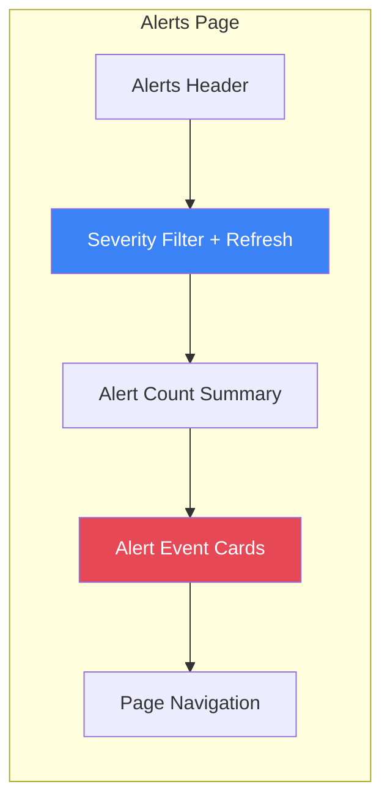
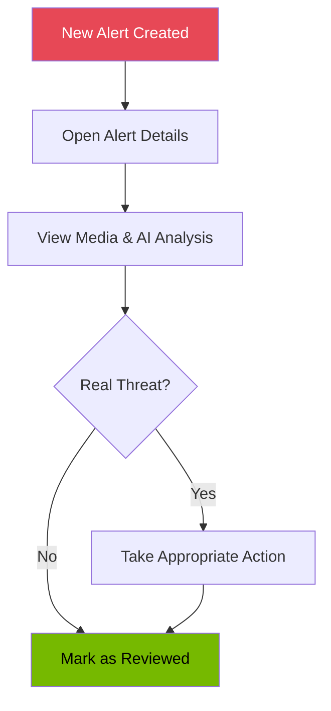

# Alerts & Notifications

The Alerts page focuses on high-priority security events that require your immediate attention. The notification system can send you alerts through email or webhooks when critical events occur.

<!-- SCREENSHOT: Alerts Page Full View
Location: Alerts page (click Alerts in sidebar)
Shows: Complete Alerts page with: page title with warning triangle icon, severity filter dropdown, refresh button, results summary showing counts of Critical and High alerts, and event cards grid with orange and red left borders
Size: 1200x800 pixels (3:2 aspect ratio)
Alt text: Alerts page showing high and critical risk events with severity filter, refresh button, and color-coded event cards
-->
<!-- Image placeholder -->

_Caption: The Alerts page shows only high-priority events that need your attention._

## Accessing Alerts

Click **Alerts** in the left sidebar to open the Alerts page. A badge may appear showing the count of unreviewed high/critical events.

## Understanding Alerts

### What Creates an Alert?

An event becomes an alert when the AI assigns it a **High** (60-84) or **Critical** (85-100) risk score. These events typically involve:

- Unknown persons in restricted areas
- Suspicious behavior patterns
- Multiple detections over extended periods
- Objects left behind (packages, bags)
- Activity at unusual hours

### Alert vs Event

| All Events          | Alerts Only               |
| ------------------- | ------------------------- |
| Every detection     | High + Critical risk only |
| Low to Critical     | 60+ risk score            |
| Full timeline       | Priority view             |
| Review at your pace | Review promptly           |

## Alerts Page Layout



## Filtering Alerts

### Severity Filter

Use the **Filter by severity** dropdown to focus on specific alert levels:

| Option        | Shows                         |
| ------------- | ----------------------------- |
| All Alerts    | Both High and Critical events |
| Critical Only | Only risk score 85-100        |
| High Only     | Only risk score 60-84         |

### Refreshing

Click the **Refresh** button to load the latest alerts. During refresh, the button shows a spinning indicator.

## Alert Cards

Each alert displays as a card with:

- **Risk badge**: Orange (High) or Red (Critical) severity indicator
- **Camera name**: Which camera detected the event
- **Timestamp**: When the event occurred
- **Duration**: How long the event lasted
- **AI Summary**: Description of what was detected
- **Detected objects**: List of objects found with confidence scores

### Critical vs High Alert Styling

| Risk Level | Badge Color | Border             | Meaning                    |
| ---------- | ----------- | ------------------ | -------------------------- |
| Critical   | Red         | Red left border    | Immediate attention needed |
| High       | Orange      | Orange left border | Prompt review recommended  |

## Viewing Alert Details

Click any alert card to open the Event Detail Modal with:

1. **Full-size media**: Image or video from the event
2. **Detection sequence**: All captured frames/clips
3. **AI reasoning**: Why the system flagged this as high risk
4. **Detected objects**: Complete list with confidence scores
5. **Notes field**: Add your observations
6. **Review button**: Mark the alert as reviewed

## Results Summary

Above the alert cards, you will see:

- **Total count**: "X alerts found"
- **Risk breakdown**: Count of Critical and High alerts

Example: "12 alerts found" with badges showing "5 Critical" and "7 High"

## Empty States

### No Alerts

When no high or critical risk events exist:

> "No Alerts at This Time - There are no high or critical risk events to review. Keep up the good work!"

This is a good sign - your security environment is currently stable.

### No Alerts After Filtering

If your filter produces no results:

> "There are no [high/critical] risk events to review."

Try changing the filter to "All Alerts" or refresh to check for new events.

## Pagination

When you have many alerts, use the pagination controls:

- **Previous**: Go back one page
- **Page X of Y**: Current position indicator
- **Next**: Go forward one page

## Alert Workflow



### Recommended Steps

1. **Check alerts regularly**: Visit the Alerts page daily or set up notifications
2. **Start with Critical**: Address red alerts before orange
3. **Review the media**: Look at images/videos to understand what happened
4. **Read AI reasoning**: Understand why the system flagged this event
5. **Take action**: If real threat, take appropriate security measures
6. **Mark as reviewed**: Clear the alert from your pending queue

## Alert Deduplication

The alert system prevents duplicate alerts using a deduplication mechanism to reduce alert fatigue.

### How Deduplication Works

When an alert rule triggers, the system checks if a similar alert was recently sent. If so, the new alert is suppressed during the cooldown period.

**Key Concepts:**

- **Dedup Key**: Each alert has a unique key based on camera, object type, and optionally zone
- **Cooldown Period**: Time window during which duplicate alerts are suppressed (default: 5 minutes)
- **Configurable**: Each alert rule can specify its own cooldown duration

### Dedup Key Format

The deduplication key combines event characteristics:

```
{camera_id}:{object_type}:{zone}
```

**Examples:**

- `front_door:person` - Person detected at front door (any zone)
- `backyard:vehicle:driveway` - Vehicle in backyard driveway zone
- `garage:person:entry` - Person in garage entry zone

### Cooldown Behavior

When an alert triggers:

1. System checks for existing alerts with the same dedup key
2. If found within cooldown window, new alert is suppressed
3. If cooldown expired or no match, new alert is sent
4. Cooldown timer resets with each new alert

**Example Timeline:**

```
10:00:00 - Alert: "Person at front door" (sent)
10:02:00 - Alert: "Person at front door" (suppressed - within 5min cooldown)
10:04:00 - Alert: "Person at front door" (suppressed - within 5min cooldown)
10:06:00 - Alert: "Person at front door" (sent - cooldown expired)
```

### Why Deduplication Matters

Without deduplication, you might receive:

- 20 alerts for the same person walking to your door
- Multiple alerts for a car slowly pulling into the driveway
- Repeated notifications while reviewing a single incident

With deduplication:

- You receive one alert per distinct security event
- Cooldown period prevents notification spam
- You can still see all underlying detections in the event details

### Configuring Cooldown

Each alert rule can set its own cooldown period:

- **Short cooldown (1-2 minutes)**: Fast-moving events, multiple cameras
- **Default cooldown (5 minutes)**: Standard security monitoring
- **Long cooldown (15-30 minutes)**: Low-priority alerts, known activity patterns

See the Alert Rules documentation for configuration details.

**Source:** [`backend/services/alert_dedup.py`](../../backend/services/alert_dedup.py)

---

## Notification System

<!-- SCREENSHOT: Notification Settings Tab
Location: Settings page > NOTIFICATIONS tab
Shows: Notifications tab showing: Email configuration section (status badge, SMTP host, port, from address, TLS status, recipients, "Send Test Email" button), Webhook configuration section (status badge, URL, timeout, "Send Test Webhook" button), and Available Channels summary at bottom
Size: 1000x600 pixels (5:3 aspect ratio)
Alt text: Notification settings showing email and webhook configuration status with test buttons and available channels summary
-->
<!-- Image placeholder -->

_Caption: The Notifications tab shows your email and webhook configuration status._

### Overview

The notification system can alert you when high-risk events occur, even when you are not watching the dashboard.

### Notification Channels

Two channels are available:

| Channel      | Best For                       | Requirements              |
| ------------ | ------------------------------ | ------------------------- |
| Email (SMTP) | Mobile alerts, records         | SMTP server configuration |
| Webhook      | Integration with other systems | Webhook URL               |

### Accessing Notification Settings

Go to **Settings** then click the **NOTIFICATIONS** tab.

### Email Notifications

When email is configured, you will see:

- **Status badge**: "Configured" (green) or "Not Configured" (gray)
- **SMTP Host**: Your email server address
- **Port**: Email server port (typically 587 or 465)
- **From Address**: Sender email address
- **TLS Status**: Whether encryption is enabled
- **Default Recipients**: Email addresses that receive alerts

#### Testing Email

Click **Send Test Email** to verify your email configuration works. You will see either:

- "Test email sent successfully" (green)
- Error message explaining what went wrong (red)

### Webhook Notifications

When webhooks are configured, you will see:

- **Status badge**: "Configured" (green) or "Not Configured" (gray)
- **Webhook URL**: Where alerts are sent
- **Timeout**: How long to wait for a response

#### Testing Webhook

Click **Send Test Webhook** to verify your webhook endpoint receives messages correctly.

### Available Channels Summary

At the bottom of the notification settings, you will see which channels are active:

- Green **EMAIL** badge: Email notifications active
- Green **WEBHOOK** badge: Webhook notifications active

If no channels are configured, you will see "No notification channels configured".

### Configuration Notes

Notification settings are configured via environment variables on the server. The settings page shows the current configuration but cannot change it. To modify notification settings:

1. Contact your system administrator
2. Update the server environment variables
3. Restart the backend service

See the system administration documentation for configuration details.

## Tips for Managing Alerts

1. **Respond promptly**: High and Critical alerts represent potential security concerns
2. **Set up notifications**: Do not rely solely on checking the dashboard
3. **Review AI reasoning**: Understand the context before dismissing alerts
4. **Adjust as needed**: If you get too many false positives, review camera placement
5. **Document findings**: Use the Notes field to record your assessment
6. **Track patterns**: Multiple alerts from one area may indicate a recurring issue
