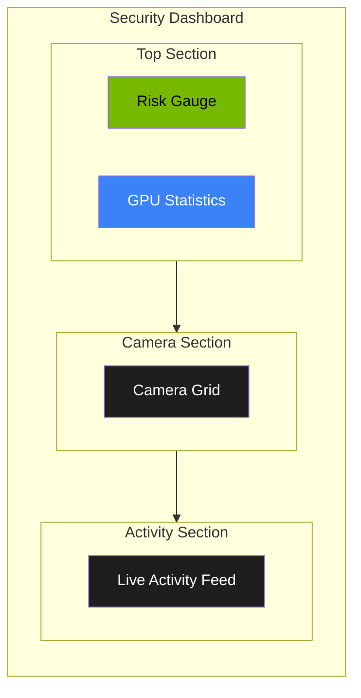

# Dashboard Overview

The Security Dashboard is your central command center for monitoring home security. It displays real-time information from all connected cameras, AI detection results, and system health in one unified view.

<!-- SCREENSHOT: Full Dashboard Overview
Location: Main dashboard page (http://localhost:5173/)
Shows: Complete dashboard with all sections visible - header with system status, sidebar navigation, quick stats row, risk gauge, GPU statistics panel, camera grid, and live activity feed
Size: 1400x900 pixels (16:9 aspect ratio)
Alt text: Complete security dashboard showing all main components including navigation, statistics, risk gauge, cameras, and activity feed
-->
<!-- Image placeholder - screenshot would go here -->

_Caption: The Security Dashboard is your central command center for home security monitoring._

## Dashboard Layout

When you open the dashboard, you will see four main sections arranged from top to bottom:

## Risk Gauge

The **Risk Gauge** appears in the top-left corner of the dashboard. It displays the current security risk level from 0 to 100.

<!-- SCREENSHOT: Risk Gauge Component
Location: Top-left of main dashboard content area
Shows: Circular risk gauge with score number in center (e.g., 23), colored arc (green for low), "Low" text label, and sparkline showing recent risk history trend
Size: 400x450 pixels (8:9 aspect ratio)
Alt text: Circular risk gauge showing current security risk level with score, colored arc, risk level label, and trend sparkline
-->
<!-- Image placeholder - screenshot would go here -->

_Caption: The Risk Gauge provides an at-a-glance view of your current security status._

### Understanding Risk Levels

> See [Risk Levels Reference](../reference/config/risk-levels.md) for the canonical definition and configuration options.

| Score Range | Level    | Color  | Meaning                                       |
| ----------- | -------- | ------ | --------------------------------------------- |
| 0-29        | Low      | Green  | Normal activity, no concerns                  |
| 30-59       | Medium   | Yellow | Unusual activity detected, review recommended |
| 60-84       | High     | Orange | Suspicious activity, prompt review needed     |
| 85-100      | Critical | Red    | Immediate attention required                  |

### Reading the Gauge

- The **circular indicator** fills based on the current risk score
- The **number in the center** shows the exact score (0-100)
- The **label below** displays the risk level in words (Low, Medium, High, Critical)
- When risk is high or critical, the gauge adds a subtle glow effect to draw attention

### Risk History Sparkline

Below the main gauge, you may see a small chart showing how risk has changed over recent events. This helps you understand if risk is increasing, decreasing, or staying stable.

## Camera Grid

The **Camera Grid** shows all your connected security cameras in a responsive grid layout.

<!-- SCREENSHOT: Camera Grid Component
Location: Middle section of dashboard, below risk gauge and GPU stats
Shows: Grid of 3-4 camera cards showing: thumbnail images, status badges (mix of Online green, Offline gray), camera names (e.g., "Front Door", "Backyard"), and last seen timestamps. One camera should be selected with green border
Size: 1000x400 pixels (2.5:1 aspect ratio)
Alt text: Camera grid showing multiple security camera cards with thumbnails, status indicators, names, and timestamps
-->
<!-- Image placeholder - screenshot would go here -->

_Caption: The Camera Grid shows all your connected cameras with their current status._

### Camera Status Indicators

Each camera card displays:

- **Thumbnail image**: The most recent snapshot from the camera
- **Status badge**: Appears in the top-right corner of each camera

| Status    | Color  | Meaning                                |
| --------- | ------ | -------------------------------------- |
| Online    | Green  | Camera is connected and sending images |
| Offline   | Gray   | Camera is not sending images           |
| Recording | Yellow | Camera is actively recording an event  |
| Error     | Red    | Camera has encountered a problem       |

### Camera Information

Below each thumbnail, you will see:

- **Camera name**: The friendly name you assigned (e.g., "Front Door")
- **Last seen time**: When the camera last sent an image

### Interacting with Cameras

- **Click a camera**: Select it to view more details
- **Selected camera**: Shows a green border and subtle glow

If no cameras are configured, you will see a message prompting you to add cameras through the Settings page.

## GPU Statistics

The **GPU Statistics** panel in the top-right shows how your AI processing hardware is performing.

<!-- SCREENSHOT: GPU Statistics Panel
Location: Top-right area of dashboard, next to risk gauge
Shows: GPU statistics card with utilization percentage bar, memory usage bar, temperature reading with color coding (green/yellow/red), power usage, and inference FPS metric
Size: 400x350 pixels (8:7 aspect ratio)
Alt text: GPU statistics panel showing utilization, memory, temperature, power, and inference performance metrics
-->
<!-- Image placeholder - screenshot would go here -->

_Caption: GPU Statistics show how your AI hardware is performing._

### Key Metrics

| Metric        | Description                  | Good Values           |
| ------------- | ---------------------------- | --------------------- |
| Utilization   | How busy the GPU is          | Varies with activity  |
| Memory        | RAM being used for AI models | Depends on model size |
| Temperature   | GPU heat level               | Below 70C (green)     |
| Power Usage   | Electricity consumption      | Below 150W (green)    |
| Inference FPS | Frames analyzed per second   | Higher is better      |

### Temperature Color Coding

- **Green**: Below 70C - normal operation
- **Yellow**: 70-80C - moderate load
- **Red**: Above 80C - high load, may throttle

### Power Color Coding

- **Green**: Below 150W - normal operation
- **Yellow**: 150-250W - moderate load
- **Red**: Above 250W - high load

### Metrics History

The GPU panel includes tabs to view historical charts:

1. **Utilization**: Shows GPU usage over time
2. **Temperature**: Shows heat levels over time
3. **Memory**: Shows RAM usage over time

Use the **Pause/Resume** button to stop or start collecting history data.

## Live Activity Feed

The **Activity Feed** at the bottom of the dashboard shows a scrolling list of recent security events as they happen.

<!-- SCREENSHOT: Live Activity Feed
Location: Bottom section of dashboard
Shows: Activity feed panel with "Live Activity" title, Pause/Resume button, and 3-4 event cards showing thumbnails, camera names, risk badges (varied colors), AI summaries, and relative timestamps ("Just now", "5 mins ago")
Size: 600x450 pixels (4:3 aspect ratio)
Alt text: Live activity feed showing recent security events with thumbnails, risk indicators, and AI-generated summaries
-->
<!-- Image placeholder - screenshot would go here -->

_Caption: The Live Activity Feed shows security events as they happen in real-time._

### Event Information

Each event in the feed shows:

- **Thumbnail**: A small image from the event
- **Camera name**: Which camera detected the event
- **Risk badge**: Color-coded severity indicator
- **Summary**: AI-generated description of what was detected
- **Timestamp**: When the event occurred (relative time like "5 mins ago")

### Auto-Scroll Feature

The activity feed automatically scrolls to show new events as they arrive.

- **Pause button**: Stops auto-scroll so you can read older events
- **Resume button**: Restarts auto-scroll

### Viewing Event Details

Click any event in the feed to open the Event Detail Modal with full information, including:

- Full-size image or video
- All detected objects
- AI reasoning
- Option to mark as reviewed

## Quick Stats Row

Above the main content, you may see a row of quick statistics:

- **Active Cameras**: Number of cameras currently online
- **Events Today**: Total security events detected today
- **Current Risk**: Your current risk score
- **System Status**: Overall health of the security system

## Connection Status

At the top of the dashboard, a status indicator shows whether you are receiving real-time updates:

- **Connected**: Everything is working normally
- **Disconnected**: Real-time updates paused; data may be stale

If disconnected, the dashboard will still show the most recent data but will not update automatically until connection is restored.

## Tips for Using the Dashboard

1. **Check regularly**: Glance at the dashboard periodically to stay aware of security status
2. **Watch the risk gauge**: If it turns yellow, orange, or red, investigate the activity feed
3. **Review events promptly**: High and critical events should be reviewed quickly
4. **Monitor GPU temperature**: High temperatures may indicate the system needs attention
5. **Use the pause button**: When investigating events, pause auto-scroll to prevent losing your place
