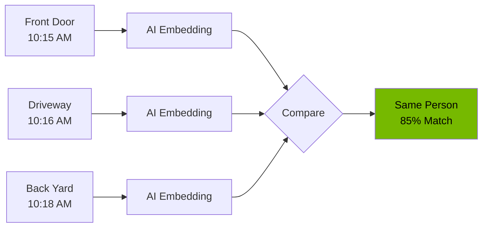

<!-- Nano Banana Pro Prompt:
"Dark mode security investigation interface showing video playback controls, entity tracking timeline with person silhouettes connected across multiple camera feeds, thumbnail filmstrip at bottom, forensic analysis aesthetic, NVIDIA dark theme #121212 background with #76B900 green accents and blue (#3B82F6) highlight for selected entity, clean modern UI, vertical 2:3 aspect ratio, no text overlays"
-->

# Event Investigation

The event investigation features help you dive deeper into security events by providing video clips, entity tracking across cameras, and detailed timeline visualization. These tools work together to give you a complete picture of what happened during an event.

## Event Video Clips

When you need more context than a single image can provide, video clips let you see the full sequence of events around a detection.

### What are Event Clips?

Event clips are short video sequences generated from the detection images captured during an event. They show you:

- The moments before the detection occurred
- The detection itself
- The moments after

This gives you context that static images cannot provide, helping you understand what actually happened.

### Viewing Video Clips

To view a video clip for an event:

1. Open any event by clicking its card in the Event Timeline
2. In the Event Detail Modal, click the **Video Clip** tab
3. The video player will appear if a clip is available

<!-- SCREENSHOT: Event Detail Modal Video Tab
Location: Event Detail Modal > Video Clip tab
Shows: Video player with playback controls, duration display, file size, download button
Size: 800x500 pixels
Alt text: Video clip tab showing video player with playback controls and download option
-->

### Generating Clips

If no clip exists yet, you will see a message with a **Generate Clip** button:

1. Click **Generate Clip**
2. Wait for processing (a spinner shows progress)
3. Once complete, the video player appears automatically

> **Tip:** Clip generation uses the detection images from the event to create a video slideshow. The process typically takes a few seconds.

### Clip Generation Details

| Setting          | Value                                     |
| ---------------- | ----------------------------------------- |
| Default Duration | Based on event length + pre/post roll     |
| Format           | MP4 (H.264 video codec)                   |
| Frame Rate       | 2 frames per second for image sequences   |
| Quality          | CRF 23 (good balance of quality and size) |
| Web Optimization | Fast-start enabled for streaming          |

### Downloading Clips

Click the **Download** button below the video player to save the clip to your device. The file will be named `event_{id}_clip.mp4`.

### Clip Storage

Clips are stored for 30 days along with other event data. After that, they are automatically cleaned up to save storage space.

## Entity Re-Identification

Entity re-identification helps you track the same person or vehicle as they appear across different cameras. This is especially useful for understanding movement patterns and investigating incidents.

### What is Entity Re-ID?

When a person or vehicle is detected, the system creates a unique visual fingerprint (called an embedding) using AI. This fingerprint can be compared against other detections to find matches, even across different cameras.

### How Matching Works

The system uses CLIP ViT-L, a powerful visual AI model, to analyze each detection:

| Aspect              | Description                     |
| ------------------- | ------------------------------- |
| Embedding Dimension | 768-dimensional vector          |
| Similarity Measure  | Cosine similarity (0-100%)      |
| Match Threshold     | 85% similarity (configurable)   |
| Retention Period    | 24 hours for real-time tracking |
| Entity Types        | Persons and vehicles            |

### Understanding Similarity Scores

| Score     | Meaning                                      |
| --------- | -------------------------------------------- |
| 90%+      | Very high confidence - almost certainly same |
| 85-90%    | High confidence - likely the same entity     |
| 80-85%    | Moderate confidence - possible match         |
| Below 80% | Low confidence - may be different entities   |

### Viewing Entity History

When you open an event with detected persons or vehicles, the AI Enrichment panel may show re-identification information:

1. Open an event from the Timeline
2. Look for the **AI Enrichment Analysis** section
3. Expand the **Person** or **Vehicle** accordion
4. Previous sightings appear with camera name, time, and similarity score

### Factors Affecting Matching

Re-identification accuracy depends on:

- **Image Quality:** Clear, well-lit images produce better embeddings
- **Angle:** Similar viewing angles improve matching
- **Occlusion:** Partially hidden subjects are harder to match
- **Clothing/Appearance:** Significant changes (like removing a jacket) may affect matching
- **Time Gap:** The system retains embeddings for 24 hours

### Using Entity Tracking for Investigations

When investigating an incident:

1. **Start with the primary event** - Find the event of interest
2. **Check re-ID matches** - See if this person/vehicle appeared elsewhere
3. **Build a timeline** - Follow their path across cameras
4. **Note timestamps** - Track arrival, departure, and dwell times

> **Privacy Note:** Entity re-identification operates locally on your system. Embeddings are stored temporarily in Redis and automatically expire after 24 hours.

## Timeline Visualization

The Event Timeline provides powerful tools for visualizing and navigating your security events over time.

### Timeline View Features

The timeline page displays events in a grid layout with:

- **Chronological ordering** - Newest events first (or customizable)
- **Risk-level color coding** - Quick visual assessment
- **Thumbnail previews** - See what was detected at a glance
- **Detection badges** - Object types (person, vehicle, animal, package)

### Detection Sequence Strip

In the Event Detail Modal, the thumbnail strip shows all captures from an event:

<!-- SCREENSHOT: Detection Thumbnail Strip
Location: Event Detail Modal > below main image
Shows: Horizontal strip of detection thumbnails with timestamps, confidence badges, video icon for video detections
Size: 800x120 pixels
Alt text: Thumbnail strip showing sequence of detections with timestamps and confidence scores
-->

**Using the Thumbnail Strip:**

| Action          | Result                                    |
| --------------- | ----------------------------------------- |
| Single Click    | Display that detection in the main viewer |
| Double Click    | Open full-size lightbox for images        |
| Film Strip Icon | Indicates a video detection               |

### Filtering and Navigation

Use filters to narrow down events:

| Filter     | Options                          | Use Case                          |
| ---------- | -------------------------------- | --------------------------------- |
| Camera     | All or specific camera           | Focus on one entry point          |
| Risk Level | Low, Medium, High, Critical      | Prioritize by severity            |
| Status     | Reviewed, Unreviewed             | Track your review progress        |
| Object     | Person, Vehicle, Animal, Package | Find specific detection types     |
| Date Range | Start and end dates              | Investigate specific time periods |
| Sort       | Newest, Oldest, Risk (High/Low)  | Change display order              |

### Event Clustering

Events from the same time window and camera are grouped together during batch processing:

| Parameter    | Default | Description                        |
| ------------ | ------- | ---------------------------------- |
| Batch Window | 90s     | Maximum time span for grouping     |
| Idle Timeout | 30s     | Close batch if no new detections   |
| Fast Path    | 0.90    | High-confidence immediate analysis |

This means related detections appear as a single event rather than many separate entries.

### Keyboard Navigation

Navigate the timeline quickly using keyboard shortcuts:

| Shortcut    | Action                    |
| ----------- | ------------------------- |
| Left Arrow  | Previous event (in modal) |
| Right Arrow | Next event (in modal)     |
| Escape      | Close modal               |
| j / k       | Navigate list (down / up) |
| Space       | Play/pause video          |
| f           | Toggle fullscreen video   |

## AI Enrichment Details

The AI Enrichment panel provides additional context extracted by vision models:

### Vehicle Analysis

- **Type:** Car, truck, SUV, van, motorcycle
- **Color:** Primary vehicle color
- **Damage:** Visible damage indicators
- **Commercial:** Whether it appears to be a commercial vehicle

### Person Analysis

- **Clothing:** Description of visible attire
- **Action:** What the person appears to be doing
- **Carrying:** Objects being carried (packages, bags, tools)
- **Suspicious Attire:** Flagged if wearing face covering, etc.
- **Service Uniform:** Identified delivery or service worker attire

### Additional Enrichments

- **License Plate:** OCR text extraction when visible
- **Pet Identification:** Type and breed recognition
- **Weather Conditions:** Detected weather from image
- **Image Quality:** Assessment of image clarity

## Investigation Workflow

For a thorough investigation:

1. **Identify the event of interest** in the Timeline
2. **Open the Event Detail Modal** to see full details
3. **Review the detection sequence** using the thumbnail strip
4. **Watch the video clip** if available (or generate one)
5. **Check AI enrichments** for vehicle/person details
6. **Review entity re-ID** to see if this person/vehicle appeared elsewhere
7. **Add notes** documenting your findings
8. **Mark as reviewed** when complete

## Related Documentation

- [Event Timeline](event-timeline.md) - Browsing and filtering events
- [Understanding Alerts](understanding-alerts.md) - Risk levels and interpretation
- [Search](search.md) - Finding specific events
- [Keyboard Shortcuts](keyboard-shortcuts.md) - Efficient navigation
