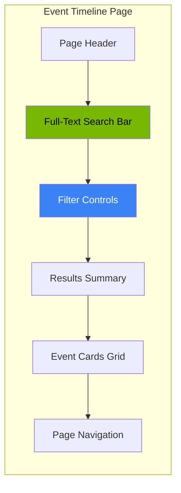

<!-- Nano Banana Pro Prompt:
"Dark mode security event timeline interface, showing chronological list of security events with risk level color coding (green low, yellow medium, orange high, red critical), thumbnail previews on left, event summaries on right, date filters at top, NVIDIA dark theme #121212 background with #76B900 green accents, clean card-based layout, vertical 2:3 aspect ratio, no text overlays"
-->

# Event Timeline

The Event Timeline page provides a complete history of all security events detected by your cameras. Use this page to browse past events, filter by various criteria, and review events that need attention.

<!-- SCREENSHOT: Event Timeline Full Page
Location: Timeline page (click Timeline in sidebar)
Shows: Complete Timeline page with: page header, full-text search bar, expanded filter controls, results summary showing event counts and risk level badges, event cards grid (2-3 columns), and pagination controls at bottom
Size: 1400x900 pixels (16:9 aspect ratio)
Alt text: Event Timeline page showing search bar, filters, results summary, and grid of event cards with pagination
-->
<!-- Image placeholder - screenshot would go here -->

_Caption: The Event Timeline page lets you browse, filter, and search all your security events._

## Accessing the Event Timeline

Click the **Timeline** link in the left sidebar to open the Event Timeline page.

## Page Layout

The Event Timeline page is organized into several sections:

## Browsing Events

### Event Cards

<!-- SCREENSHOT: Event Card Detail
Location: Any event card on Timeline page
Shows: Single event card showing: checkbox, camera name with icon, timestamp, duration, risk badge with score, colored left border, object type badges (Person, Vehicle), AI summary text, and detection list with confidence percentages
Size: 400x350 pixels (~8:7 aspect ratio)
Alt text: Single event card showing all information including risk badge, object detections, AI summary, and action checkbox
-->
<!-- Image placeholder - screenshot would go here -->

_Caption: Each event card shows key information at a glance._

Events are displayed as cards in a grid layout. Each event card shows:

- **Camera name**: Which camera detected the event
- **Timestamp**: When the event started
- **Duration**: How long the event lasted
- **Risk badge**: Color-coded severity (Low, Medium, High, Critical)
- **Risk score bar**: Visual representation of the 0-100 risk score
- **Object badges**: Types of objects detected (person, vehicle, animal, package)
- **AI Summary**: Brief description of what was detected
- **Detection list**: All detected objects with confidence percentages

### Event Card Colors

The left border of each event card is color-coded by risk level:

| Risk Level | Border Color |
| ---------- | ------------ |
| Low        | Green        |
| Medium     | Yellow       |
| High       | Orange       |
| Critical   | Red          |

### Detection Confidence

Detection confidence scores use color coding:

| Confidence | Color  | Meaning                   |
| ---------- | ------ | ------------------------- |
| 85%+       | Green  | High confidence detection |
| 70-84%     | Yellow | Medium confidence         |
| Below 70%  | Red    | Lower confidence          |

## Filtering Events

<!-- SCREENSHOT: Timeline Filters Expanded
Location: Filter panel on Timeline page (expanded state)
Shows: Expanded filter section with: Camera dropdown, Risk Level dropdown, Status dropdown (Reviewed/Unreviewed), Object Type dropdown, Min Confidence dropdown, Sort By dropdown, Start Date picker, End Date picker, and "Clear All Filters" button
Size: 1100x250 pixels (~4:1 aspect ratio)
Alt text: Expanded filter panel showing all available filter options for narrowing down event results
-->
<!-- Image placeholder - screenshot would go here -->

_Caption: Use filters to find exactly the events you are looking for._

### Show/Hide Filters

Click the **Show Filters** button to reveal filtering options. Click **Hide Filters** to collapse them.

When filters are active, the button shows an "Active" badge.

### Available Filters

| Filter         | Options                                   | Purpose                        |
| -------------- | ----------------------------------------- | ------------------------------ |
| Camera         | All cameras or specific camera            | Show events from one camera    |
| Risk Level     | All, Low, Medium, High, Critical          | Filter by severity             |
| Status         | All, Reviewed, Unreviewed                 | Filter by review status        |
| Object Type    | Person, Vehicle, Animal, Package, Other   | Filter by detected object      |
| Min Confidence | All, High Only (85%+), Medium+ (70%+)     | Filter by detection confidence |
| Sort By        | Newest, Oldest, Highest Risk, Lowest Risk | Change display order           |
| Start Date     | Date picker                               | Show events after this date    |
| End Date       | Date picker                               | Show events before this date   |

### Clearing Filters

Click the **Clear All Filters** button to reset all filters to their defaults.

## Search

### Quick Search

Type in the search box labeled "Search summaries..." to filter events by their AI-generated summary text. This searches only the visible events on the current page.

### Full-Text Search

The full-text search bar at the top of the page provides powerful search across all events in the database.

See the [Search](search.md) documentation for detailed search instructions.

## Selecting Events

### Individual Selection

Each event card has a checkbox in the top-left corner. Click the checkbox to select or deselect an event.

### Select All

Click the **Select all** button to select all events on the current page. Click it again to deselect all.

The selection count appears next to the button (e.g., "5 selected").

## Bulk Actions

When events are selected, bulk action buttons appear:

### Mark as Reviewed

Click **Mark as Reviewed** to mark all selected events as reviewed. This helps you track which events you have already examined.

### Mark Not Reviewed

Click **Mark Not Reviewed** to mark all selected events as unreviewed, in case you need to revisit them.

## Viewing Event Details

Click any event card to open the **Event Detail Modal**.

### Modal Contents

The event detail modal shows:

1. **Header**: Camera name, timestamp, duration, and risk badge
2. **Media display**: Full-size image or video from the event
3. **Detection sequence**: Thumbnail strip of all captured frames
4. **AI Summary**: Complete description of the event
5. **AI Reasoning**: Explanation of why the AI assigned this risk level (if available)
6. **Detected Objects**: List of all objects with confidence bars
7. **Notes**: Text area for your own notes about the event
8. **Event Details**: Metadata including event ID, status, and timestamps

### Navigating Between Events

Use the **Previous** and **Next** buttons at the bottom of the modal to move between events without closing the modal.

You can also use keyboard shortcuts:

- **Left Arrow**: Previous event
- **Right Arrow**: Next event
- **Escape**: Close modal

### Marking as Reviewed

Click the **Mark as Reviewed** button to mark the current event as reviewed. This button only appears for unreviewed events.

### Detection Sequence

If an event includes multiple detections (multiple frames or clips), they appear in a thumbnail strip:

- Click a thumbnail to view that specific detection
- Double-click to open a full-size lightbox view
- Videos show a film strip icon

### Saving Notes

1. Type your notes in the text area
2. Click **Save Notes** to save
3. A "Saved" confirmation appears briefly

## Exporting Events

### Quick Export

Click the **Quick Export** button to download all events (with current filters applied) as a CSV file.

### Advanced Export

Click the **Advanced Export** button to access additional export options:

- Choose specific date ranges
- Select which fields to include
- Choose export format

## Pagination

When you have more events than fit on one page, pagination controls appear at the bottom:

- **Previous**: Go to the previous page of events
- **Page X of Y**: Shows your current position
- **Next**: Go to the next page of events

## Results Summary

Above the event cards, you will see:

- **Event count**: "Showing 1-20 of 156 events"
- **Risk breakdown**: Count of events by risk level with colored badges
- **Filter status**: "Filters active" when filters are applied

## Tips for Reviewing Events

1. **Start with unreviewed events**: Use the Status filter to show only unreviewed events
2. **Focus on high risk first**: Sort by Highest Risk to address critical issues first
3. **Use bulk actions**: Select multiple similar events and mark them reviewed together
4. **Add notes**: Document your findings for future reference
5. **Check the detection sequence**: Multiple frames may reveal important context
6. **Review AI reasoning**: Understand why the system assigned a particular risk level
