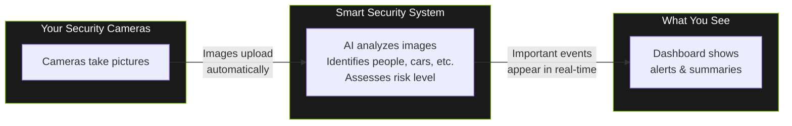

<!-- Nano Banana Pro Prompt:
"Dark mode quick start guide illustration showing 4-step setup flow (install, configure, connect cameras, view dashboard), each step as an icon in vertical sequence connected by arrows, progress indicator style, NVIDIA dark theme #121212 background with #76B900 green checkmarks for completed steps, clean onboarding visual, vertical 2:3 aspect ratio, no text overlays"
-->

# Getting Started

> Welcome to your home security system! This guide will help you understand what it does and how to use it.

## What Does This System Do?

Think of this system as a **smart security guard** that watches your cameras 24/7.

When your cameras capture images, the system:

1. **Looks at each image** to see if there's a person, vehicle, animal, or package
2. **Thinks about what it sees** - Is this normal activity? Is this concerning?
3. **Tells you what's happening** with a simple summary and a risk score (0-100)

Instead of you having to watch hours of boring footage, the system only shows you the interesting moments and explains why they might matter.

For example, instead of just saying "person detected," it might say:

> "Unknown person approaching back entrance at 2am - this is unusual activity for this time and location."

---

## How It All Works (The Simple Version)



You don't need to do anything to make this work - the cameras, AI, and dashboard all work together automatically.

---

## Opening the Dashboard

To view your security dashboard:

1. **Open your web browser** (Chrome, Safari, Firefox, or Edge all work)
2. **Go to this address:** `http://localhost:5173`

That's it! The dashboard should appear automatically.

> **Tip:** Bookmark this page for easy access. You can also create a shortcut on your desktop or phone home screen.

---

## What You'll See When You First Open It

When you open the dashboard, you'll see several sections:

<!-- SCREENSHOT: First Look at Dashboard
Location: Main dashboard page after first login
Shows: Complete dashboard view with all main sections visible - header bar with status, left sidebar navigation, quick stats row, risk gauge, camera grid, and activity feed
Size: 1400x900 pixels (16:9 aspect ratio)
Alt text: The main security dashboard showing the complete interface a new user will see when first opening the application
-->
<!-- Image placeholder - screenshot would go here -->

_Caption: This is what you will see when you first open the dashboard._

### The Main Dashboard

This is your home base. Here's what each part shows you:

| Section             | What It Shows                                                                                       |
| ------------------- | --------------------------------------------------------------------------------------------------- |
| **Stats Row**       | Quick numbers - how many cameras are on, events today, current risk level                           |
| **Risk Gauge**      | A dial showing the current risk level (0-100). Green is calm, yellow needs attention, red is urgent |
| **GPU Performance** | Technical info about how the AI is running (you can ignore this)                                    |
| **Camera Status**   | Thumbnails from each camera showing they're working                                                 |
| **Live Activity**   | A scrolling list of recent events with AI summaries                                                 |

### The Sidebar Menu

On the left side, you'll see navigation options:

| Menu Item     | What's There                                                          |
| ------------- | --------------------------------------------------------------------- |
| **Dashboard** | The main overview (where you start)                                   |
| **Timeline**  | History of all events - you can filter by camera, date, or risk level |
| **Entities**  | (Work in progress) Will show recognized people and vehicles           |
| **Alerts**    | Events that need your attention                                       |
| **Logs**      | Technical system logs (for troubleshooting)                           |
| **System**    | System health and performance                                         |
| **Settings**  | Camera configuration and preferences                                  |

---

## About the Demo Data

When you first start using the system, you might see **sample events** on the dashboard. This is normal!

**What's happening:** While the AI pipeline is being set up or if there's no recent camera activity, the system shows demonstration data so you can see how everything works.

**How to tell the difference:**

- **Demo data** - Shows generic examples like "Person detected at Front Door"
- **Real data** - Shows actual timestamps and AI-generated descriptions specific to what your cameras captured

Once your cameras are connected and active, real events will start appearing automatically. Demo data helps you learn the interface without needing to wait for actual activity.

---

## Quick Tips for Getting Started

<!-- SCREENSHOT: Risk Gauge Quick Reference
Location: Risk gauge component on main dashboard
Shows: The risk gauge in a calm (green/low) state with score around 15-20, showing "Low" label
Size: 300x300 pixels (1:1 aspect ratio)
Alt text: Risk gauge showing a low risk score with green coloring, indicating normal activity
-->
<!-- Image placeholder - screenshot would go here -->

_Caption: The Risk Gauge shows your current security status at a glance._

1. **Check the Risk Gauge first** - If it's green (0-29), everything is calm. Yellow (30-59) means take a look. Orange/Red (60-100) deserves prompt attention. See [Risk Levels Reference](../reference/config/risk-levels.md) for details.

2. **Click on events to see details** - Each event in the activity feed can be clicked to see the full AI analysis, including the original image and reasoning.

3. **Use the Timeline for history** - Need to check what happened last night? The Timeline page lets you search and filter past events.

4. **Don't worry about false alarms** - The AI learns and improves over time. Animals, delivery people, and normal activity usually get low risk scores.

---

## Next Steps

- **[Using the Dashboard](using-the-dashboard.md)** - Detailed guide to all dashboard features
- **[Understanding Alerts](understanding-alerts.md)** - What the risk levels mean and when to take action

---

## Need Help?

If the dashboard isn't loading or something looks wrong:

1. Make sure the system is running (ask whoever set it up)
2. Try refreshing the page in your browser
3. Try a different browser if one isn't working

For technical help, contact the person who installed the system.

---

## Image Generation Prompts

The following prompts can be used with AI image generators to create visuals for this documentation.

### Hero/Welcome Image

**Prompt:**

```
Create a friendly, welcoming hero image for a home security dashboard documentation page.

Style: Modern, minimalist, dark theme with NVIDIA green (#76B900) accents
Mood: Reassuring, professional, approachable - not scary or surveillance-heavy
Dimensions: 1200x400 pixels (wide banner format)

Content:
- Abstract representation of a smart home with soft glowing security elements
- Subtle icons suggesting cameras, AI analysis, and a dashboard screen
- A protective, calming atmosphere - think "guardian" not "spy"
- Include abstract data visualization elements (simple charts, status indicators)
- Dark background (#0E0E0E or #121212) with green and white accents

Avoid:
- Creepy surveillance imagery
- Realistic faces or people
- Aggressive red warning colors as the primary palette
- Complex technical diagrams
- Text (the image should work without words)

The overall feeling should be: "Your home is being watched over by friendly, intelligent technology."
```

### Cameras to AI to Alerts Concept Diagram

**Prompt:**

```
Create a simple, non-technical diagram showing how a smart security system works, suitable for users who aren't tech-savvy.

Style: Flat design, friendly iconography, dark theme background (#1A1A1A)
Mood: Simple, clear, not intimidating
Dimensions: 800x400 pixels (landscape infographic)

Content (left to right flow):
1. LEFT SECTION - "Your Cameras"
   - 2-3 simple, friendly camera icons (not surveillance-looking, more like home devices)
   - Soft glow or pulse effect suggesting they're active

2. MIDDLE SECTION - "Smart Analysis"
   - A brain or lightbulb icon with a subtle circuit pattern
   - Small icons around it showing what it detects: person silhouette, car, dog, package
   - Connecting lines with small dots flowing from cameras to the brain

3. RIGHT SECTION - "You Get Notified"
   - A simple dashboard screen or phone showing a notification
   - Green checkmark for "all clear" and a gentle alert indicator
   - A happy/calm human figure checking the notification

Visual flow:
- Gentle curved arrows or flowing lines connecting the three sections
- Progress dots or small animated-style elements showing data moving through the system
- Color coding: cameras in blue, AI in green (#76B900), notifications in white

Text labels (minimal):
- "Cameras Watch"
- "AI Analyzes"
- "You're Informed"

Avoid:
- Technical jargon
- Complex network diagrams
- Scary security imagery
- Realistic human faces
- Red warning colors dominating the image

The diagram should make someone think: "Oh, I get it - cameras see things, the computer figures out what's important, and then I see a summary."
```
