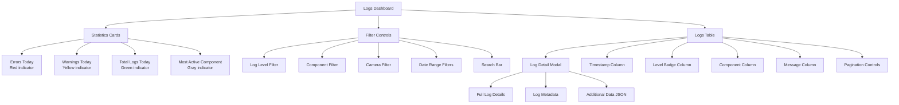

# Logs Dashboard

<!-- SCREENSHOT: Logs Dashboard Full View
Location: Logs page (click Logs in sidebar)
Shows: Complete Logs dashboard with: four statistics cards at top (Errors Today in red with count, Warnings Today in yellow, Total Today in green, Most Active Component), collapsible filter panel with dropdowns (Log Level, Component, Camera, date pickers, search box), logs table showing entries with timestamp, level badge (color-coded), component name (green monospace), and truncated message, pagination controls at bottom
Size: 1400x900 pixels (16:9 aspect ratio)
Alt text: Logs dashboard showing statistics cards, filter controls, and log entries table with color-coded severity levels
-->

<!-- TODO: Capture screenshot placeholder-logs-dashboard-full.png
     See docs/images/SCREENSHOT_GUIDE.md section 41 for capture instructions:
     - Location: Logs page
     - Size: 1400x900 pixels (16:9 aspect ratio)
     - Shows: Four statistics cards (Errors Today, Warnings Today, Total Today, Most Active Component), filter panel with dropdowns, logs table with timestamp, level badge, component, truncated message, pagination controls
-->

> **[Screenshot Pending]** Logs dashboard showing four statistics cards at top (Errors Today in red, Warnings Today in yellow, Total Today in green, Most Active Component), a collapsible filter panel with log level, component, camera, and date range dropdowns, and a paginated logs table with timestamp, color-coded level badges (DEBUG, INFO, WARNING, ERROR, CRITICAL), component names, and truncated messages.

_Caption: The Logs Dashboard provides visibility into system operations and helps troubleshoot issues._

## Overview

The Logs Dashboard provides real-time visibility into system operations, helping you monitor application health and troubleshoot issues. It aggregates logs from both backend services (API, AI pipeline, background workers) and frontend components, presenting them in a unified interface with powerful filtering and search capabilities.

This dashboard is essential for:

- Monitoring system health and identifying errors
- Debugging issues by filtering logs by component or severity
- Tracking application behavior over time
- Correlating logs with security events and detections

## Accessing the Logs Dashboard

1. From the main navigation sidebar, click on **Logs** (typically located in the System section)
2. The dashboard will load with the most recent logs displayed

The dashboard auto-refreshes statistics every 30 seconds to keep you informed of current system health.

## Dashboard Layout

The Logs Dashboard is organized into four main sections:



### 1. Statistics Cards

At the top of the dashboard, four cards display real-time statistics:

| Card                      | Description                                           | Color Coding                                      |
| ------------------------- | ----------------------------------------------------- | ------------------------------------------------- |
| **Errors Today**          | Count of ERROR and CRITICAL level logs since midnight | Red (when > 0) with "Active" badge, Gray (when 0) |
| **Warnings Today**        | Count of WARNING level logs since midnight            | Yellow (when > 0), Gray (when 0)                  |
| **Total Today**           | All logs recorded today across all levels             | NVIDIA Green (#76B900)                            |
| **Most Active Component** | Component with the most log entries today, with count | White text, gray icon                             |

### 2. Filter Controls

A collapsible filter panel allows you to narrow down logs by multiple criteria. Click **Show Filters** to expand the panel.

### 3. Logs Table

The main table displays paginated log entries with 50 logs per page. Each row shows:

- **Timestamp** - Relative time (e.g., "5m ago") or formatted date
- **Level** - Color-coded badge (DEBUG, INFO, WARNING, ERROR, CRITICAL)
- **Component** - Module or service that generated the log (displayed in NVIDIA green monospace font)
- **Message** - Log message text (truncated to 100 characters)

Click any row to open the **Log Detail Modal** for complete information.

### 4. Pagination

At the bottom of the table, pagination controls allow you to navigate through logs:

- **Previous** button - Go to previous page
- **Page X of Y** - Current page indicator
- **Next** button - Go to next page

## Features

### Log Filtering

The Logs Dashboard provides comprehensive filtering options to help you find specific logs quickly.

#### Available Filters

**Log Level Filter**
Filter by severity level:

- **DEBUG** - Detailed diagnostic information (development/troubleshooting)
- **INFO** - Normal operational messages
- **WARNING** - Potential issues that don't affect operation
- **ERROR** - Errors that need attention
- **CRITICAL** - Severe errors requiring immediate action

**Component Filter**
Filter by the system component that generated the log:

- `frontend` - React application logs
- `api` - FastAPI backend logs
- `user_event` - User interaction tracking
- `file_watcher` - Camera file monitoring service
- `detector` - RT-DETRv2 object detection
- `aggregator` - Detection batch aggregator
- `risk_analyzer` - Nemotron LLM risk analysis
- `event_broadcaster` - WebSocket event streaming
- `gpu_monitor` - GPU statistics collector
- `cleanup_service` - Data retention cleanup

**Camera Filter**
Filter logs related to a specific camera by selecting from the dropdown of configured cameras.

**Date Range Filters**

- **Start Date** - Show logs from this date onward
- **End Date** - Show logs up to this date

Use these together to view logs from a specific time period.

### Log Search

The search bar at the top right of the filter panel performs full-text search within log messages:

1. Type your search term in the **Search log messages...** field
2. Press Enter or click away from the field
3. The table updates to show only logs containing your search term
4. Click the **X** button in the search field to clear the search

**Tips:**

- Search is case-insensitive
- Searches within the message field only (not other metadata)
- Combine with filters for more precise results

### Active Filters Indicator

When any filters are applied, the **Show Filters** button displays an **Active** badge in NVIDIA green, making it easy to see when you're viewing filtered results.

### Clearing Filters

To reset all filters and view unfiltered logs:

1. Expand the filter panel (click **Show Filters**)
2. Click the **Clear All Filters** button at the bottom right
3. All filters will be removed, and the table will refresh

### Log Detail Modal

Click any log row to open a modal with complete log details:

<!-- SCREENSHOT: Log Detail Modal
Location: Modal popup after clicking any log row
Shows: Log detail modal with: header showing component name as title, full timestamp, level badge with icon, close X button. Body sections: full message text, Log Details metadata table (ID, Component, Source, Camera ID, Event ID, etc.), User Agent section (for frontend logs), and Additional Data section with JSON syntax highlighting
Size: 700x600 pixels (~7:6 aspect ratio)
Alt text: Log detail modal showing complete log information including metadata, message, and additional JSON data
-->

<!-- TODO: Capture screenshot placeholder-log-detail-modal.png
     See docs/images/SCREENSHOT_GUIDE.md section 42 for capture instructions:
     - Location: Modal after clicking log row
     - Size: 700x600 pixels (~7:6 aspect ratio)
     - Shows: Header (component name, timestamp, level badge, close X), full message text, Log Details metadata table, User Agent section, Additional Data section with JSON highlighting
-->

> **[Screenshot Pending]** Log detail modal popup showing the complete log entry with header containing component name, full timestamp, and color-coded level badge, followed by the full untruncated message, a metadata table with log ID, source, camera ID, event ID, detection ID, and request ID, and an Additional Data section displaying JSON with syntax highlighting.

_Caption: Click any log entry to see complete details including metadata and additional data._

**Header Section:**

- Component name as the title
- Timestamp in full date/time format
- Level badge with icon (color-coded by severity)
- Close button (X) in top right

**Message Section:**

- Full, untruncated log message

**Log Details Section:**
A metadata table showing:

- Log ID (unique identifier)
- Component name
- Source (backend or frontend)
- Camera ID (if applicable)
- Event ID (if log is related to a security event)
- Detection ID (if log is related to an object detection)
- Request ID (for API request tracing)
- Duration (execution time in milliseconds, if applicable)

**User Agent Section** (Frontend logs only):

- Browser and operating system information

**Additional Data Section** (if present):

- JSON-formatted extra data with syntax highlighting
- Displayed in a monospace font with NVIDIA green background tint

**Keyboard Shortcut:**

- Press **Escape** to close the modal

## Log Levels Explained

Understanding log levels helps you prioritize issues and filter effectively:

| Level        | Color      | Icon           | Description                                           | When to Investigate                          |
| ------------ | ---------- | -------------- | ----------------------------------------------------- | -------------------------------------------- |
| **DEBUG**    | Gray       | Code icon      | Verbose technical details for developers              | During development or troubleshooting        |
| **INFO**     | Blue       | Info icon      | Normal operational events                             | Generally informational only                 |
| **WARNING**  | Yellow     | Alert triangle | Unexpected situations that don't prevent operation    | Review periodically to prevent future issues |
| **ERROR**    | Red        | X circle       | Errors that need attention but don't crash the system | Investigate when count increases             |
| **CRITICAL** | Red (bold) | X circle       | Severe errors requiring immediate action              | Investigate immediately                      |

## Common Use Cases

### Troubleshooting a Specific Issue

1. Use the **Search** bar to find logs containing error messages or keywords
2. Apply **Log Level** filter to show only ERROR and CRITICAL logs
3. Apply **Date Range** filters to narrow down to when the issue occurred
4. Click on relevant log entries to view full details and metadata

### Monitoring a Specific Component

1. Click **Show Filters**
2. Select the component from the **Component** dropdown (e.g., `detector`, `risk_analyzer`)
3. Optionally set a **Start Date** to view recent activity
4. Review the log entries to understand component behavior

### Finding Logs for a Specific Camera

1. Click **Show Filters**
2. Select the camera from the **Camera** dropdown
3. The table updates to show only logs related to that camera
4. Use **Log Level** filter to focus on errors or warnings

### Investigating High Error Counts

1. Check the **Errors Today** card - if it's red with a high count, errors are occurring
2. Click **Show Filters**
3. Set **Log Level** to ERROR
4. Review recent error messages
5. Click entries to view full details and identify patterns

### Correlating Logs with Security Events

When investigating a security event:

1. Note the Event ID from the event detail page
2. Go to the Logs Dashboard
3. Use **Search** to find the Event ID
4. Review all logs associated with that event to understand processing flow

## API Integration

The Logs Dashboard communicates with the following backend API endpoints:

### GET /api/logs

Retrieves paginated logs with filtering support.

**Query Parameters:**

- `level` - Filter by log level
- `component` - Filter by component name
- `camera_id` - Filter by camera ID (e.g., "front_door")
- `source` - Filter by source (backend, frontend)
- `search` - Full-text search in message
- `start_date` - ISO format date string
- `end_date` - ISO format date string
- `limit` - Page size (default: 100, max: 1000)
- `offset` - Page offset (default: 0)

**Response:**

```json
{
  "logs": [...],
  "count": 1234,
  "limit": 100,
  "offset": 0
}
```

### GET /api/logs/stats

Retrieves dashboard statistics.

**Response:**

```json
{
  "total_today": 5432,
  "errors_today": 12,
  "warnings_today": 45,
  "by_component": {
    "detector": 1234,
    "api": 987,
    ...
  },
  "by_level": {
    "INFO": 4000,
    "WARNING": 45,
    "ERROR": 12
  },
  "top_component": "detector"
}
```

### GET /api/logs/{log_id}

Retrieves a single log entry by ID (used when reopening a bookmarked log).

### POST /api/logs/frontend

Frontend logs are automatically sent to this endpoint when errors occur in the web application.

## Best Practices

**Regular Monitoring:**

- Check the **Errors Today** card at the start of each day
- If errors are present, investigate promptly to prevent cascading issues

**Proactive Warning Review:**

- Periodically filter by WARNING level to identify potential issues before they become errors
- Look for patterns or recurring warnings that might indicate configuration problems

**Correlation with Events:**

- When reviewing security events, check logs for the same time period
- Look for errors in the `detector`, `aggregator`, or `risk_analyzer` components that might affect event quality

**Search Tips:**

- Use specific error messages or exception names when searching
- Combine search with date range filters to narrow results
- Use camera IDs or event IDs to trace specific workflows

**Log Retention:**

- Logs are retained for 30 days by default
- For long-term analysis, export logs before they are automatically deleted (export feature coming soon)

## Troubleshooting the Logs Dashboard

**Dashboard shows "Loading..." indefinitely:**

- Check that the backend API is running (`GET /api/system/health`)
- Verify database connectivity
- Check browser console for network errors

**No logs displayed:**

- Click **Clear All Filters** to ensure filters aren't hiding all logs
- Check that the date range filters aren't excluding current logs
- Verify that the backend has written logs to the database

**Statistics show 0 for all values:**

- This is normal on first startup before any logs have been recorded
- If logs exist but stats show 0, check that logs have today's date

**Search returns no results:**

- Verify search term spelling
- Try a more general search term
- Clear other filters that might be excluding results

**Modal won't open when clicking a log row:**

- Check browser console for JavaScript errors
- Try refreshing the page
- Verify the log entry has a valid ID

## Related Documentation

- [Monitoring Guide](../admin-guide/monitoring.md) - Comprehensive system monitoring strategies
- [Troubleshooting Guide](../admin-guide/troubleshooting.md) - Common issues and solutions
- [System Health Endpoints](../developer/api/system-ops.md) - API health check documentation
- [Dashboard Overview](./dashboard-overview.md) - Main dashboard features
- [Understanding Alerts](./understanding-alerts.md) - Alert system documentation
