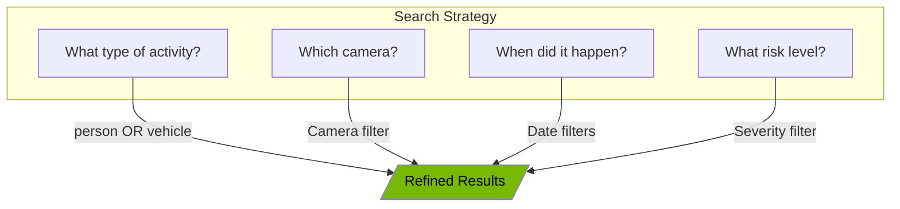

# Full-Text Search

The full-text search feature allows you to find specific security events across your entire history using natural language queries and special syntax operators.

<!-- Nano Banana Pro Prompt:
"Dark mode search interface with search bar, filter dropdowns, and search results grid showing security events, vertical crop, NVIDIA aesthetic"
-->

## Accessing Search

The search bar appears at the top of the **Event Timeline** page, in a panel labeled "Full-Text Search".

## Basic Search

### Simple Queries

Type any word or phrase to search for events containing that text:

- `person` - Find events with "person" in the summary or reasoning
- `front door` - Find events mentioning "front door"
- `suspicious` - Find events described as "suspicious"

### How Search Works

The search examines:

- AI-generated event summaries
- AI reasoning explanations
- Camera names
- Detected object types

Search is case-insensitive, so "Person", "PERSON", and "person" all return the same results.

## Search Syntax

Click the **?** (help) icon next to the search bar to see syntax hints.

### Implicit AND

Multiple words are automatically combined with AND:

```
person vehicle
```

This finds events containing BOTH "person" AND "vehicle".

### Exact Phrases

Use quotation marks for exact phrases:

```
"suspicious person"
```

This finds events with the exact phrase "suspicious person" (both words together in that order).

### OR Operator

Use OR (uppercase) to find events with either term:

```
person OR animal
```

This finds events containing "person" OR "animal" (or both).

### NOT Operator

Use NOT to exclude terms:

```
person NOT cat
```

This finds events with "person" but excludes events also containing "cat".

### Combining Operators

You can combine operators for complex queries:

```
vehicle OR person NOT delivery
```

This finds events with "vehicle" or "person" but excludes those mentioning "delivery".

### Search by Camera Name

Include camera names in your search:

```
front_door
```

This finds events from the camera named "front_door".

## Using the Search Bar

### Entering a Query

1. Click in the search bar
2. Type your search query
3. Press **Enter** or click the **Search** button

### Clearing the Search

- Click the **X** button inside the search bar to clear the query
- Press **Escape** while focused on the search bar

### Search Progress

While searching, the Search button shows a spinning indicator and changes to "Searching...".

## Advanced Filters

Click the **Filters** button to expand the advanced filters panel. These filters work together with your text search.

### Available Filters

| Filter          | Description                                                                     |
| --------------- | ------------------------------------------------------------------------------- |
| **Camera**      | Limit results to a specific camera                                              |
| **Severity**    | Filter by risk level (Low, Medium, High, Critical, or High & Critical combined) |
| **Object Type** | Filter by detected object (Person, Vehicle, Animal, Package, Other)             |
| **Status**      | Filter by review status (Reviewed, Unreviewed, All)                             |
| **Start Date**  | Show only events after this date                                                |
| **End Date**    | Show only events before this date                                               |

### Applying Filters

1. Select values from the filter dropdowns
2. Click **Search** to apply filters with your query
3. The Filters button shows "Active" when filters are set

### Clearing Filters

Click **Clear All** to reset all filters and clear the search query.

## Search Results

### Results Display

Search results appear in a grid below the search bar, showing:

- **Result count**: "Showing 1-20 of 150 results for 'person'"
- **Clear search link**: Click to exit search mode and return to browsing

### Result Cards

Each search result card displays:

1. **Relevance Score**: Shows how well the result matches your query (percentage)
2. **Risk Badge**: Color-coded severity level
3. **Summary**: The event summary with your search terms
4. **Reasoning**: AI reasoning excerpt (if available)
5. **Camera Name**: Which camera detected the event
6. **Date and Time**: When the event occurred
7. **Detection Count**: Number of objects detected
8. **Object Types**: Badges showing detected objects
9. **Reviewed Status**: Green indicator if already reviewed

### Relevance Scoring

The relevance percentage indicates match quality:

| Score     | Color       | Meaning         |
| --------- | ----------- | --------------- |
| 80%+      | Green       | Excellent match |
| 50-79%    | Light Green | Good match      |
| 30-49%    | Yellow      | Moderate match  |
| Below 30% | Gray        | Weak match      |

Results are sorted by relevance score (best matches first).

### Viewing Full Event Details

Click any search result card to open the Event Detail Modal with complete information.

## Pagination

When search returns more results than fit on one page:

- Use **Previous** and **Next** buttons to navigate
- The page indicator shows "Page X of Y"

## Returning to Browse Mode

Click **Back to browse** above the search bar to exit search mode and return to the standard event timeline view.

## Search Tips

### Finding Specific Events



### Example Queries

| Goal                                | Query               | Filters                   |
| ----------------------------------- | ------------------- | ------------------------- |
| Find people at front door           | `person front_door` | -                         |
| Find vehicle events this week       | `vehicle`           | Start Date: 7 days ago    |
| Find unreviewed suspicious activity | `suspicious`        | Status: Unreviewed        |
| Find high-risk events with packages | `package`           | Severity: High & Critical |
| Find nighttime activity             | `night OR dark`     | -                         |
| Find everything except cats         | `NOT cat`           | -                         |

### Best Practices

1. **Start broad, then narrow**: Begin with simple terms, add filters as needed
2. **Use exact phrases**: Quotes help when searching for specific descriptions
3. **Combine text and filters**: Use text search for content, filters for metadata
4. **Check relevance scores**: Low scores might indicate partial matches
5. **Try synonyms**: If your first search yields few results, try related terms

## Troubleshooting

### No Results Found

If your search returns no results:

- Check spelling
- Try broader terms
- Remove filters to widen the search
- Try synonyms or related words

### Too Many Results

If you get too many results:

- Add more specific terms
- Use exact phrase matching with quotes
- Add filters to narrow by camera, date, or severity

### Search Not Working

If the search button stays disabled:

- Ensure you have typed at least one character
- Check that you are on the Event Timeline page
- Refresh the page if problems persist
