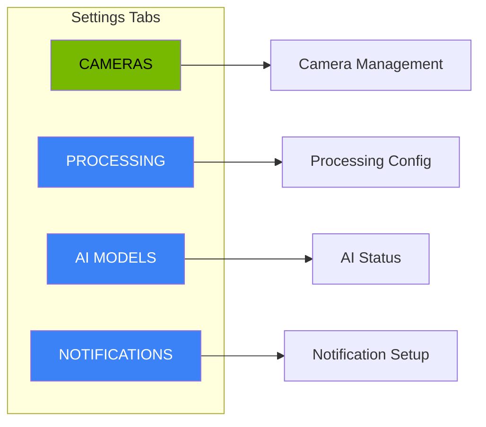
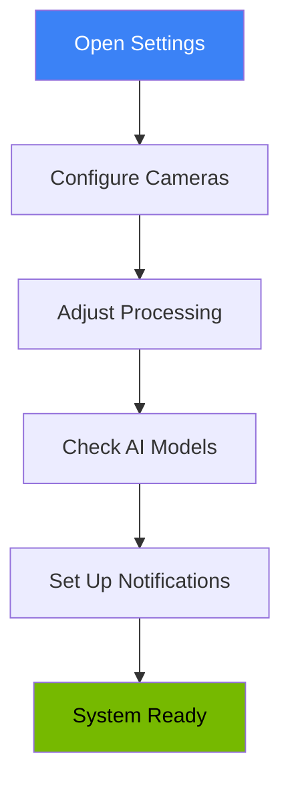

<!-- Nano Banana Pro Prompt:
"Dark mode application settings interface with tabbed navigation (Cameras, Processing, AI Models tabs), form inputs with sliders and toggles, camera list table with status indicators, NVIDIA dark theme #121212 background with #76B900 green accent on selected tab, clean administrative interface, vertical 2:3 aspect ratio, no text overlays"
-->

# Settings

The Settings page allows you to configure your security system, manage cameras, adjust processing parameters, monitor AI models, and set up notifications.

## Accessing Settings

Click **Settings** in the left sidebar to open the Settings page.

## Settings Tabs

The Settings page is organized into four tabs:

Click any tab to switch between settings sections. The active tab appears with a green background.

## Cameras Tab

The Cameras tab lets you add, edit, and remove security cameras from your system.

### Camera List

All configured cameras appear in a table showing:

| Column      | Description                                    |
| ----------- | ---------------------------------------------- |
| Name        | Friendly name for the camera                   |
| Folder Path | Where camera images are stored                 |
| Status      | Online (green), Offline (gray), or Error (red) |
| Last Seen   | When the camera last sent an image             |
| Actions     | Edit and Delete buttons                        |

### Adding a Camera

1. Click the **Add Camera** button (top right)
2. Fill in the form:
   - **Camera Name**: A friendly name (e.g., "Front Door", "Garage")
   - **Folder Path**: Where camera images are stored (e.g., `/export/foscam/front_door`)
   - **Status**: Initial status (Online, Offline, or Error)
3. Click **Add Camera** to save

#### Validation Rules

- Name must be at least 2 characters
- Folder path must be a valid path starting with `/` or `.`

### Editing a Camera

1. Click the **Edit** button (pencil icon) next to the camera
2. Modify the fields as needed
3. Click **Update** to save changes

### Deleting a Camera

1. Click the **Delete** button (trash icon) next to the camera
2. A confirmation dialog appears: "Are you sure you want to delete [camera name]?"
3. Click **Delete Camera** to confirm, or **Cancel** to keep the camera

Deleting a camera does not delete its stored events.

### Empty State

If no cameras are configured, you will see a message prompting you to add your first camera.

## Processing Tab

The Processing tab controls how the AI system processes events.

### Processing Parameters

| Setting              | Range          | Default | Description                                     |
| -------------------- | -------------- | ------- | ----------------------------------------------- |
| Batch Window         | 30-300 seconds | 90s     | How long to collect detections before analyzing |
| Idle Timeout         | 10-120 seconds | 30s     | End batch after this idle period                |
| Retention Period     | 1-90 days      | 30 days | How long to keep event data                     |
| Confidence Threshold | 0.00-1.00      | 0.50    | Minimum detection confidence to process         |

### Adjusting Settings

Each setting has a slider control:

1. Drag the slider left or right to adjust the value
2. The current value displays next to the slider
3. Click **Save Changes** to apply your adjustments
4. Click **Reset** to revert to the last saved values

### When to Adjust Settings

| Scenario                | Adjustment                                    |
| ----------------------- | --------------------------------------------- |
| Too many events         | Increase batch window or confidence threshold |
| Missing events          | Decrease confidence threshold                 |
| Running out of storage  | Decrease retention period                     |
| Events ending too early | Increase idle timeout                         |
| Events running too long | Decrease idle timeout                         |

### Storage Information

The Processing tab shows current storage usage and provides a **Clear Old Data** option to remove events older than the retention period.

### Application Info

At the bottom, you will see:

- **Application name**: NVIDIA Security Intelligence
- **Version**: Current system version

## AI Models Tab

The AI Models tab displays status information for the AI components.

### Model Cards

Two model cards show real-time status:

#### RT-DETRv2 (Object Detection)

This model detects objects in camera images.

| Metric        | Description                                     |
| ------------- | ----------------------------------------------- |
| Status        | Loaded (green), Unloaded (gray), or Error (red) |
| Memory Used   | GPU RAM used by this model                      |
| Inference FPS | Frames analyzed per second                      |

#### Nemotron (Risk Analysis)

This model analyzes detections and assigns risk scores.

| Metric          | Description                                     |
| --------------- | ----------------------------------------------- |
| Status          | Loaded (green), Unloaded (gray), or Error (red) |
| Memory Used     | GPU RAM used by this model                      |
| Inference Speed | Reasoning operations per second                 |

### Status Indicators

| Status   | Badge Color | Meaning                        |
| -------- | ----------- | ------------------------------ |
| Loaded   | Green       | Model is active and processing |
| Unloaded | Gray        | Model is not loaded            |
| Error    | Red         | Model encountered a problem    |

### GPU Memory

The bottom of the AI Models tab shows total GPU memory usage across all models.

### Understanding the Metrics

- **Memory**: Lower is better for multi-model operation
- **FPS/Speed**: Higher means faster processing
- If memory is near capacity, processing may slow down

## Notifications Tab

The Notifications tab shows your notification configuration status. See [Alerts & Notifications](alerts-notifications.md) for complete details.

### Key Information

- **Notifications Status**: Whether the notification system is enabled
- **Email Configuration**: SMTP settings and test button
- **Webhook Configuration**: Webhook URL and test button
- **Available Channels**: Which notification methods are active

## Error States

### Loading Errors

If settings fail to load, you will see:

- Red error banner with message
- **Try again** link to retry loading

### Save Errors

If saving fails:

- Red error message appears
- Your changes are preserved so you can try again

### Validation Errors

If you enter invalid data:

- Red border appears on the invalid field
- Error message explains the problem
- Fix the error and try again

## Tips for Settings Management

1. **Set up cameras first**: The system needs cameras to function
2. **Test one camera**: Before adding all cameras, verify one works correctly
3. **Monitor AI models**: Check model status if detection quality decreases
4. **Adjust processing gradually**: Make small changes and observe results
5. **Balance retention**: Longer retention uses more storage
6. **Configure notifications**: Do not miss critical events when away

## Settings Workflow

### Initial Setup Steps

1. **Add cameras**: Configure each security camera
2. **Verify detection**: Check AI models are loaded and processing
3. **Adjust thresholds**: Fine-tune confidence and batch settings
4. **Set retention**: Choose appropriate data retention period
5. **Enable notifications**: Configure email or webhook alerts
6. **Test everything**: Verify cameras detect activity and notifications arrive
