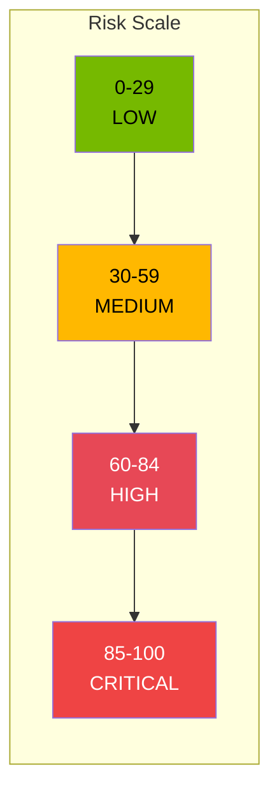
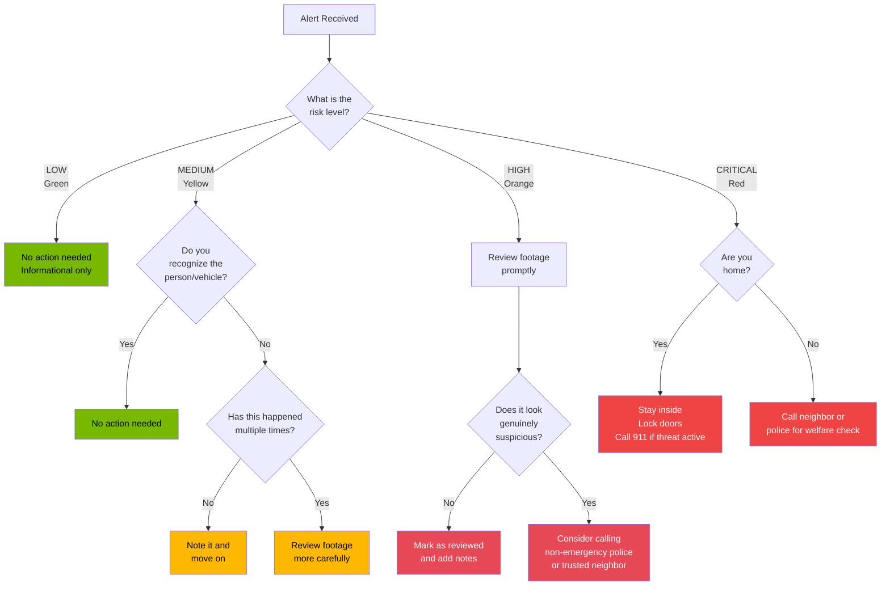

<!-- Nano Banana Pro Prompt:
"Dark mode security alert explanation diagram showing risk score gauge from 0-100 with color zones (green 0-29, yellow 30-59, orange 60-84, red 85-100), alert notification cards with severity badges, AI reasoning text panel, NVIDIA dark theme #121212 background with #76B900 green accents, educational infographic style, vertical 2:3 aspect ratio, no text overlays"
-->

# Understanding Security Alerts

This guide helps you understand what the security alerts mean and how to respond to them. The system uses artificial intelligence to analyze camera footage and assess potential risks, but it is designed to assist you -- not replace your own judgment.

<!-- SCREENSHOT: Risk Score Thermometer Visual
Location: N/A - infographic/diagram
Shows: Visual thermometer-style or horizontal bar design showing the 0-100 risk score scale. Sections colored: green (0-29 Low), yellow (30-59 Medium), orange (60-84 High), red (85-100 Critical). Include simple icons and brief action descriptions for each level
Size: 1000x300 pixels (~3:1 aspect ratio)
Alt text: Risk score scale visualization showing four risk levels from Low (green) to Critical (red) with score ranges and recommended actions
-->
<!-- Screenshot: Risk score thermometer showing 0-100 scale with Low/Medium/High/Critical color zones -->

_Caption: Risk scores range from 0 (nothing to worry about) to 100 (needs immediate attention)._

---

## How Risk Scores Work

Every time the system detects something on your cameras, it assigns a **risk score** from 0 to 100. Think of this like a thermometer for potential concern:

- **0** = Nothing to worry about
- **100** = Needs your immediate attention

The AI looks at several factors to determine this score:

- **What was detected** (person, vehicle, animal, package)
- **When it happened** (middle of the day vs. 3 AM)
- **How the subject behaved** (walking normally vs. lingering)
- **Where on your property** (sidewalk vs. trying door handles)
- **How confident the detection is** (clear image vs. blurry)

---

## Risk Levels Explained

The system groups risk scores into four levels, each with a distinct color to help you quickly assess the situation.

> **Note:** For the canonical definition of risk score ranges and thresholds, see the [Risk Levels Reference](../reference/config/risk-levels.md).

### LOW Risk (0-29) - Green

**What it means:** Normal, expected activity. No action needed.

**Example scenarios:**

- Family member arriving home from work
- Delivery driver dropping off a package at the front door
- Mail carrier on their daily route
- Your pet or a neighbor's cat in the yard
- Landscapers performing scheduled maintenance
- Friends or family you are expecting

**What to do:** Nothing. These alerts are informational and help you keep a record of normal activity at your home.

---

### MEDIUM Risk (30-59) - Yellow

**What it means:** Something unusual that may warrant a quick look, but is not immediately alarming.

**Example scenarios:**

- Unknown vehicle briefly parked in or near your driveway
- Unrecognized person approaching your door but leaving without knocking
- Motion detected at an unusual hour that could be a neighbor
- Someone walking slowly past your property, looking at houses
- A vehicle making a U-turn in your driveway

**What to do:** Take a moment to review the footage when convenient. Often these turn out to be harmless -- a lost driver checking their GPS, a neighbor retrieving something, or a utility worker. If the same medium-risk activity repeats multiple times, pay closer attention.

---

### HIGH Risk (60-84) - Orange

**What it means:** Concerning activity that deserves your prompt attention.

**Example scenarios:**

- Someone checking door handles on parked vehicles
- A person wearing concealing clothing (hood, mask) lingering near entry points
- Multiple unknown individuals approaching your property from different directions
- Someone photographing your house and security features
- A person attempting to open a gate or door latch

**What to do:** Review the footage promptly. If the behavior looks suspicious:

1. Check if doors and windows are locked
2. Turn on exterior lights if it is dark
3. Consider whether to contact a neighbor to check on your property
4. If you feel genuinely concerned, contact local police non-emergency line

---

### CRITICAL Risk (85-100) - Red

**What it means:** Potentially dangerous situation requiring immediate attention.

**Example scenarios:**

- Signs of forced entry attempt (someone trying to break in)
- Multiple unknown individuals at night with no clear legitimate purpose
- Someone attempting to disable or avoid your cameras
- Aggressive or threatening behavior captured on camera
- Someone entering areas they should not access

**What to do:** Take immediate action:

1. **If you are home:** Do NOT confront the person. Stay inside, lock doors, and call 911 if you believe there is an active threat
2. **If you are away:** Call a trusted neighbor or local police to perform a welfare check
3. Save the footage immediately (the system retains footage for 30 days, but critical events should be backed up)

---

## Reading the AI Reasoning

Each alert includes an "AI Reasoning" section that explains why the system assigned a particular risk score. Here is how to interpret it:

<!-- SCREENSHOT: AI Reasoning Section Example
Location: Event detail modal > AI Reasoning section
Shows: The AI Reasoning highlighted box (with green tint) containing example reasoning text explaining why a high risk score was assigned, such as: "High risk score assigned due to: (1) Unknown individual, (2) Extended time at door, (3) Evening hours with low light"
Size: 700x200 pixels (3.5:1 aspect ratio)
Alt text: AI Reasoning section showing the system's explanation for assigning a particular risk score to an event
-->
<!-- Screenshot: AI Reasoning section with green-tinted box explaining risk score factors -->

_Caption: The AI Reasoning section explains why the system assigned a particular risk score._

### What the Reasoning Tells You

The AI provides context about:

- **What it observed:** "Person detected near side gate at 2:47 AM"
- **Behavioral analysis:** "Subject exhibited slow, deliberate movement pattern"
- **Time context:** "Activity occurred outside normal hours for this location"
- **Confidence level:** "High confidence detection with clear visibility"
- **Risk factors:** "Multiple indicators present: unfamiliar individual, unusual hour, lingering behavior"

### Example Reasoning Breakdowns

**Low Risk Example:**

> "Activity matches expected patterns for this time of day. Subject identified as household member based on familiar clothing and behavior patterns. No indicators of suspicious intent."

**Translation:** The AI recognized normal activity from someone who belongs there.

**Medium Risk Example:**

> "While the individual's behavior is not overtly threatening, the combination of unfamiliar face, hesitant approach, and departure without interaction warrants attention. Recommend reviewing footage if activity repeats."

**Translation:** Something was a bit off, but nothing definitively concerning. Keep an eye out if it happens again.

**High Risk Example:**

> "Subject exhibited classic pre-surveillance behavior: slow approach, extended observation, photographing security features. Strong indicators of potential targeting."

**Translation:** The AI detected behavior patterns commonly associated with someone "casing" a property. Take this seriously.

---

## Decision Flowchart: What Should I Do?

Use this flowchart when you receive an alert:

---

## False Positives: Why They Happen

No AI system is perfect. Sometimes the system will flag something as concerning when it is actually harmless. Here are common causes of false positives:

### Pets and Wildlife

- Your dog or cat moving around the yard
- Deer, raccoons, or other wildlife passing through
- Birds flying close to the camera

**What the AI might say:** "Motion detected" or "Animal activity"

**What to do:** If you have pets, expect some low-level alerts. You can add notes to these events like "Family dog" to help track patterns.

### Shadows and Lighting Changes

- Tree branches moving in the wind
- Car headlights sweeping across the property
- Clouds passing over the sun causing sudden light changes

**What the AI might say:** "Movement detected" with low confidence scores

**What to do:** These typically score very low. If shadow-related alerts are frequent, consider adjusting camera angles.

### Delivery People and Service Workers

- Amazon, UPS, FedEx, and USPS drivers
- Utility meter readers
- Landscapers or maintenance workers

**What the AI might say:** "Unknown person approached property" but usually with low or medium risk

**What to do:** These are normal events. Mark them as reviewed with a note like "FedEx delivery" to build a history.

### Neighbors and Passersby

- People walking dogs on the sidewalk
- Neighbors checking their own property
- Kids playing in the area

**What the AI might say:** Depends on behavior, typically low to medium risk

**What to do:** As you use the system, you will start recognizing regular patterns. Most routine activity in your neighborhood will score low.

### Weather Conditions

- Rain, snow, or fog can confuse the detection
- Reflections off wet surfaces
- Blowing debris (leaves, trash)

**What the AI might say:** May misidentify objects or show lower confidence scores

**What to do:** During severe weather, expect some spurious detections. Review anything that seems off.

---

## What the System Cannot Do

It is important to have realistic expectations about what this security system can and cannot accomplish.

### The System IS:

- An extra set of "eyes" that watches your cameras 24/7
- A tool to help you prioritize what footage to review
- A way to get alerts about potentially concerning activity
- A record-keeping system that stores events for 30 days

### The System IS NOT:

- A replacement for common sense and your own judgment
- A guaranteed intrusion detection system (determined intruders can avoid detection)
- Connected to emergency services (you must call 911 yourself)
- Able to identify specific individuals by name or face
- Perfect -- it will have false positives and might miss some things

### Important Limitations

1. **Camera blind spots:** The AI can only analyze what the cameras can see
2. **Image quality matters:** Poor lighting or low resolution reduces accuracy
3. **Context is limited:** The AI does not know your schedule or who should be at your home
4. **No audio analysis:** The system analyzes video only, not sounds
5. **Delayed processing:** There may be a short delay (typically under 2 minutes) between an event occurring and you receiving an alert

### When to Rely on Other Methods

- **Packages:** Use delivery tracking apps for expected deliveries
- **Guests:** Communicate with expected visitors directly
- **Emergencies:** Always call 911 for emergencies, do not wait for the AI
- **Professional monitoring:** Consider a professional monitoring service if you want 24/7 human response capability

---

## Tips for Getting the Most Out of Alerts

1. **Review critical and high alerts promptly** -- even if most turn out to be nothing, the one time it matters will be worth it

2. **Add notes to events** -- when you review footage, add a note like "Delivery driver" or "Neighbor's guest." This helps you recognize patterns over time

3. **Mark events as reviewed** -- this helps you keep track of what you have already looked at

4. **Check the reasoning** -- the AI's explanation often provides useful context that the summary does not include

5. **Trust your instincts** -- if something feels wrong even though the AI scored it low, trust your gut and investigate

6. **Learn your patterns** -- after a few weeks, you will know what "normal" looks like for your property

---

## Quick Reference Card

> See [Risk Levels Reference](../reference/config/risk-levels.md) for complete details.

| Risk Level | Color  | Score Range | Action Required                    |
| ---------- | ------ | ----------- | ---------------------------------- |
| Low        | Green  | 0-29        | None - informational only          |
| Medium     | Yellow | 30-59       | Quick review when convenient       |
| High       | Orange | 60-84       | Review promptly, consider response |
| Critical   | Red    | 85-100      | Immediate attention required       |

---

## Getting Help

If you have questions about an alert or are unsure how to respond:

- **Technical issues:** Contact whoever set up and maintains your system
- **Suspicious activity:** Contact local police non-emergency line
- **Active emergency:** Call 911 immediately

Remember: This system is a tool to help you stay informed about activity at your property. Use it as one part of your overall home security approach, alongside good habits like locking doors, knowing your neighbors, and trusting your instincts.

---

## Image Generation Prompts

The following prompts can be used with AI image generation tools (such as DALL-E, Midjourney, or Stable Diffusion) to create visual aids for this guide.

### 1. Risk Level Color Scale Infographic

**Style:** Clean, modern infographic design with flat colors and clear typography. Minimalist corporate security aesthetic.

**Content:** A horizontal gradient bar divided into four distinct sections representing risk levels. From left to right: green (LOW, 0-29), yellow (MEDIUM, 30-59), orange (HIGH, 60-84), red (CRITICAL, 85-100). Each section should include:

- The risk level name in bold text
- The numeric range
- A simple icon (checkmark for low, warning triangle for medium, alert triangle for high, octagon stop sign for critical)

**Labeling:** Clear section dividers with score numbers at boundaries (0, 29, 59, 84, 100). Title at top: "Security Alert Risk Levels"

**Dimensions:** 1200 x 300 pixels (4:1 aspect ratio), suitable for horizontal web banner or print insert

**Color specifications:**

- Low: #76B900 (NVIDIA Green)
- Medium: #FFB800 (NVIDIA Yellow)
- High: #E74856 (NVIDIA Red)
- Critical: #ef4444 (Bright Red)
- Background: Dark gray #1F1F1F
- Text: White #FFFFFF

---

### 2. Example Alert Cards at Each Risk Level

**Style:** Modern dark-themed UI card design, similar to a security dashboard interface. Rounded corners, subtle shadows, professional appearance.

**Content:** Four security alert cards arranged in a 2x2 grid, each showing:

- Camera name (e.g., "Front Door Camera")
- Timestamp (e.g., "Today, 2:47 PM")
- A placeholder thumbnail image showing an appropriate scenario
- Risk score badge with color and number
- Brief AI summary text
- "View Details" button

**Scenarios for each card:**

1. **Low (Score: 18, Green):** "Delivery driver dropped off package at front door. Normal delivery activity." - Show a friendly delivery person placing a box
2. **Medium (Score: 45, Yellow):** "Unknown vehicle parked briefly in driveway. Driver appeared to check phone before leaving." - Show a car in a driveway
3. **High (Score: 72, Orange):** "Person wearing hood lingering near side gate for extended period." - Show a silhouette near a fence/gate area
4. **Critical (Score: 91, Red):** "Multiple unknown individuals approaching property at night from different directions." - Show a nighttime scene with multiple shadowy figures

**Labeling:** Each card clearly labeled with its risk level. Overall title: "Example Security Alerts"

**Dimensions:** 1200 x 900 pixels (4:3 aspect ratio), suitable for documentation or presentation slides

**Design notes:** Use the same color scheme as the main application. Cards should have a dark background (#1F1F1F) with a colored left border indicating risk level.

---

### 3. Decision Tree Visual - "What To Do When You Receive an Alert"

**Style:** Clean flowchart illustration with a friendly, approachable aesthetic. Not too technical. Use icons and simple shapes. Modern flat design with subtle gradients.

**Content:** A decision tree flowchart showing:

- Starting point: Bell/notification icon with "Alert Received!"
- First decision: "What color is the alert?" branching to four paths
- GREEN path: Leads to checkmark icon - "No action needed"
- YELLOW path: Leads to question "Do you recognize them?" with Yes/No branches
- ORANGE path: Leads to magnifying glass icon - "Review footage now" then question "Looks suspicious?"
- RED path: Leads to phone icon - splits between "Home?" paths to either "Stay safe, call if needed" or "Call neighbor/police"

**Labeling:**

- Title: "Got an Alert? Here's What to Do"
- Each box clearly labeled with action text
- Color-coded paths matching risk level colors
- Simple icons at decision points

**Dimensions:** 1000 x 1400 pixels (portrait orientation, approximately 5:7 ratio), suitable for printing as a reference card or poster

**Design notes:** Use rounded rectangles for action boxes, diamond shapes for decisions. Include simple stick-figure or icon illustrations at key points. Arrows should be thick and easy to follow. Consider adding a subtle home/shield icon in the background.

---

### 4. False Positives Reference Card

**Style:** Friendly, illustrated reference card with simple iconography. Think children's educational material but for adults - clear, not condescending.

**Content:** A grid of 6 common false positive scenarios, each with:

- A simple illustration
- A short label
- A one-line explanation

**Scenarios:**

1. **Pet/Animal:** Dog/cat icon - "Your pets may trigger motion alerts"
2. **Shadows:** Tree/sun icon - "Moving shadows from trees or passing cars"
3. **Delivery:** Package/truck icon - "Expected delivery drivers are not threats"
4. **Weather:** Rain/wind icon - "Rain, snow, and debris can cause false detections"
5. **Neighbors:** Walking person icon - "Regular foot traffic is usually normal"
6. **Vehicles:** Car icon - "Passing or parking cars may be detected"

**Labeling:** Title: "Common False Positives - Don't Worry About These!"
Each item clearly numbered or organized in an easy-to-scan format.

**Dimensions:** 800 x 600 pixels (4:3 aspect ratio), suitable for quick-reference card

**Design notes:** Use a lighter, more playful color palette while still incorporating the brand colors. Each scenario should be instantly recognizable at a glance.
