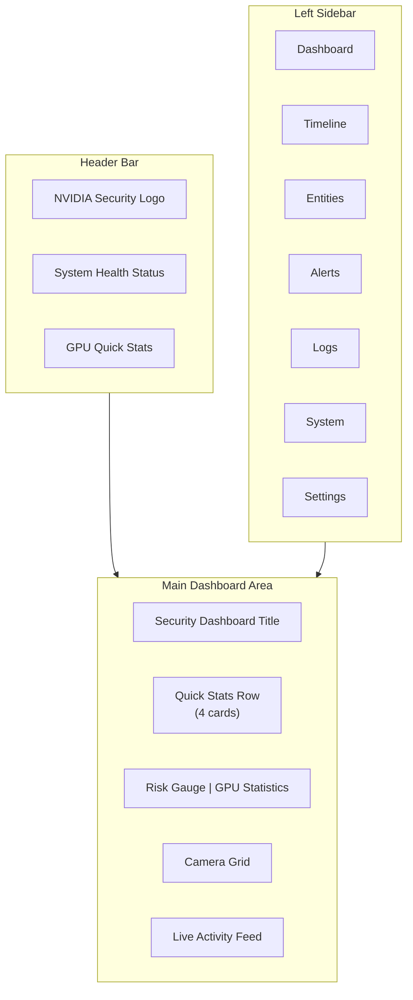
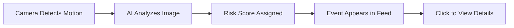

<!-- Nano Banana Pro Prompt:
"Dark mode security dashboard tutorial showing annotated UI elements with callout arrows pointing to key features (risk gauge, camera grid, activity feed, GPU stats), numbered steps overlay, NVIDIA dark theme #121212 background with #76B900 green highlights on interactive elements, instructional guide style, vertical 2:3 aspect ratio, no text overlays"
-->

# Using the Dashboard

Welcome to your Home Security Intelligence dashboard. This guide will walk you through every feature of the system so you can easily monitor your home's security.

## Table of Contents

1. [Getting Started](#getting-started)
2. [Understanding the Dashboard Layout](#understanding-the-dashboard-layout)
3. [The Risk Gauge](#the-risk-gauge)
4. [Quick Stats Row](#quick-stats-row)
5. [Camera Grid](#camera-grid)
6. [Live Activity Feed](#live-activity-feed)
7. [Event Timeline](#event-timeline)
8. [Viewing Event Details](#viewing-event-details)
9. [Alerts Page](#alerts-page)
10. [Navigation](#navigation)
11. [Settings](#settings)
12. [Understanding Risk Levels](#understanding-risk-levels)

---

## Getting Started

When you open the dashboard, you will see the main Security Dashboard page. This is your home base for monitoring everything happening around your property. The system automatically watches your cameras, detects movement, and uses artificial intelligence to assess whether the activity might be a security concern.

---

## Understanding the Dashboard Layout

The dashboard is organized into clear sections to help you quickly find what you need.



### The Header Bar

At the very top of the screen, you will see:

- **NVIDIA Security Logo** - The green logo on the left confirms you are using the AI-powered security system
- **Live Monitoring Status** - A small colored dot shows whether the system is working properly:
  - **Green pulsing dot** with "LIVE MONITORING" = Everything is working correctly
  - **Yellow dot** with "System Degraded" = Some features may be slow
  - **Red dot** with "System Offline" = Contact your administrator
- **GPU Quick Stats** - Shows the graphics card usage (this powers the AI detection)

When you hover over the system health indicator, a small popup appears showing the status of individual services like the database, AI detection, and file watcher.

### The Sidebar

On the left side of the screen, you have navigation buttons to different areas:

| Button        | What It Does                                        |
| ------------- | --------------------------------------------------- |
| **Dashboard** | Returns to the main overview (where you are now)    |
| **Timeline**  | Shows all past events in a list you can filter      |
| **Entities**  | Shows tracked people and objects (work in progress) |
| **Alerts**    | Shows only high-priority events needing attention   |
| **Logs**      | Technical logs for troubleshooting                  |
| **System**    | System monitoring and performance                   |
| **Settings**  | Camera and system configuration                     |

The currently selected page is highlighted in bright green.

---

## The Risk Gauge

The Risk Gauge is a circular dial that shows you the current security risk level at a glance.

### What the Number Means

The gauge displays a number from **0 to 100**:

> See [Risk Levels Reference](../reference/config/risk-levels.md) for the canonical definition.

| Score Range | Level               | What It Means                               |
| ----------- | ------------------- | ------------------------------------------- |
| 0-29        | **Low** (Green)     | Normal activity, nothing concerning         |
| 30-59       | **Medium** (Yellow) | Something to be aware of, but probably okay |
| 60-84       | **High** (Orange)   | Significant activity detected, check it out |
| 85-100      | **Critical** (Red)  | Immediate attention needed                  |

### Reading the Gauge

- The **large number in the center** is the current risk score
- The **colored arc** fills based on the score (more fill = higher risk)
- The **text label below** says "Low", "Medium", "High", or "Critical"
- The **sparkline chart below** (if shown) displays how the risk has changed over the last several events

### Color Coding

The gauge and its arc change color based on the risk level:

- **Green** = Low risk, everything normal
- **Yellow** = Medium risk, something detected but not alarming
- **Orange** = High risk, worth investigating
- **Red** = Critical risk, requires immediate attention

When the risk is High or Critical, the gauge will glow slightly to draw your attention.

---

## Quick Stats Row

Just below the page title, you will see four cards showing key numbers at a glance:

### Active Cameras

Shows how many of your cameras are currently online and working. A camera icon appears next to the count.

### Events Today

Shows the total number of security events detected since midnight. This helps you understand how busy your cameras have been.

### Current Risk Score

Displays the risk score from the most recent event with a shield icon. The number and label change color based on the risk level.

### System Status

Shows whether the overall system is:

- **Online** (green pulsing dot) - Working normally
- **Degraded** (yellow dot) - Some issues but still functioning
- **Offline** (red dot) - System needs attention
- **Unknown** (gray dot) - Cannot determine status

---

## Camera Grid

The Camera Grid shows all your security cameras in a visual grid layout.

### What Each Camera Card Shows

Each camera appears as a rectangular card with:

1. **Thumbnail Image** - A recent snapshot from the camera (updates periodically)
2. **Status Badge** - A small pill in the top-right corner showing:
   - **Online** (green dot) - Camera is working and sending images
   - **Recording** (yellow dot) - Camera is actively recording motion
   - **Offline** (gray dot) - Camera is not responding
   - **Error** (red dot) - Camera has a problem
3. **Camera Name** - The friendly name at the bottom (like "Front Porch" or "Backyard")
4. **Last Seen Time** - When the camera last sent an image

### Interacting with Cameras

- **Click on a camera card** to select it and see more details
- Selected cameras have a bright green border and subtle glow
- If a camera has no thumbnail available, you will see a camera icon placeholder

### Camera Layout

Cameras automatically arrange based on your screen size:

- On phones: 1 camera per row
- On tablets: 2 cameras per row
- On desktop: Up to 4 cameras per row

---

## Live Activity Feed

The Live Activity Feed shows security events as they happen in real-time.

### Understanding the Feed

Each event in the feed shows:

1. **Thumbnail** - A small image from when the event occurred (or a camera icon if no image)
2. **Camera Name** - Which camera detected the activity
3. **Risk Badge** - A colored label showing the risk level
4. **Summary** - A brief AI-generated description of what happened
5. **Timestamp** - When it occurred (shows "Just now", "5 mins ago", etc.)

### Using the Feed

- **Click on any event** to see full details in a popup window
- Events appear in order with newest at the top
- The feed shows up to 10 recent events

### Auto-Scroll Feature

The feed automatically scrolls down when new events arrive. You can control this:

- Click **Pause** to stop auto-scrolling (useful when reading)
- Click **Resume** to turn auto-scrolling back on

When paused, you can manually scroll through events at your own pace.

### Event Lifecycle



---

## Event Timeline

The Event Timeline page shows a complete history of all security events with powerful filtering options.

### Accessing the Timeline

Click **Timeline** in the left sidebar to open this page.

### Filtering Events

Click **Show Filters** to reveal filtering options:

| Filter          | What It Does                                                   |
| --------------- | -------------------------------------------------------------- |
| **Camera**      | Show events from only one specific camera                      |
| **Risk Level**  | Show only Low, Medium, High, or Critical events                |
| **Status**      | Show only Reviewed or Unreviewed events                        |
| **Object Type** | Filter by what was detected (Person, Vehicle, Animal, Package) |
| **Start Date**  | Show events from this date forward                             |
| **End Date**    | Show events up to this date                                    |

You can combine multiple filters. For example, show only "High risk events from the Front Porch camera this week."

### Searching Events

Use the search box to find events by keywords in the AI summary. For example, search for "delivery" to find all package deliveries.

### Results Summary

Above the event list, you will see:

- Total count of matching events
- Colored badges showing how many events are at each risk level
- A note when filters are active

### Working with Events

**Selecting Multiple Events:**

1. Click the checkbox on any event to select it
2. Use "Select all" to select all visible events
3. Selected events can be marked as reviewed or not reviewed in bulk

**Exporting Events:**
Click **Export CSV** to download the filtered events as a spreadsheet file.

### Pagination

Events are shown 20 at a time. Use the **Previous** and **Next** buttons at the bottom to navigate through pages.

---

## Viewing Event Details

When you click on any event (in the feed, timeline, or alerts), a detailed popup window appears.

### Event Detail Modal Contents

The popup is divided into several sections:

#### Header Section

- **Camera Name** - Large title showing which camera
- **Timestamp** - Exact date and time
- **Duration** - How long the event lasted
- **Risk Badge** - Large colored badge with score
- **Close Button** (X) - Click to close the popup

#### Detection Image

A full-size image from the event. If the AI detected objects, they may be highlighted with colored boxes and labels showing what was detected (like "Person 95%").

#### Detection Sequence

If multiple images were captured during the event, you will see a strip of thumbnails. Click any thumbnail to view that specific moment.

#### AI Summary

A paragraph explaining what the AI observed, written in plain language.

#### AI Reasoning

A highlighted box explaining WHY the AI assigned this particular risk score. This helps you understand the AI's thinking.

#### Detected Objects

A list of everything the AI identified in the image:

- Object type (Person, Vehicle, Animal, etc.)
- Confidence percentage (how sure the AI is)

#### Notes Section

A text box where you can add your own notes about the event. Click **Save Notes** to store them.

#### Event Details

Technical information including:

- Event ID number
- Camera name
- Risk score out of 100
- Duration
- Review status

### Navigation Within Events

- Use **Previous** and **Next** buttons to move between events without closing the popup
- Press the **left** or **right arrow keys** on your keyboard for quick navigation
- Press **Escape** to close the popup

### Actions You Can Take

- **Mark as Reviewed** - Click the green button to mark that you have seen and acknowledged this event
- **Flag Event** - Mark an event for later follow-up
- **Download Media** - Save the images to your computer

---

## Alerts Page

The Alerts page focuses only on events that need your attention - those rated High or Critical risk.

### Accessing Alerts

Click **Alerts** in the left sidebar. A warning triangle icon appears next to the title.

### What You See

The Alerts page shows the same event cards as the Timeline, but automatically filtered to show only:

- **High risk** events (score 60-84)
- **Critical risk** events (score 85-100)

### Filtering Alerts

Use the dropdown to narrow down further:

- **All Alerts** - Shows both high and critical
- **Critical Only** - Shows only the most urgent events
- **High Only** - Shows only high-risk events (not critical)

### Refreshing

Click the **Refresh** button to check for new alerts. The button spins while refreshing.

### When There Are No Alerts

If no high-risk events exist, you will see a friendly message: "No Alerts at This Time" with an explanation that your system is secure.

---

## Navigation

### Moving Between Pages

Use the sidebar on the left to switch between different areas of the dashboard:

1. **Dashboard** - Main overview with live status
2. **Timeline** - Full event history with filtering
3. **Entities** - Tracked people and objects (coming soon)
4. **Alerts** - High-priority events only
5. **Logs** - System logs for troubleshooting
6. **System** - Performance monitoring
7. **Settings** - Configuration options

### Keyboard Shortcuts

When viewing event details:

- **Left Arrow** - Go to previous event
- **Right Arrow** - Go to next event
- **Escape** - Close the popup

---

## Settings

Click **Settings** in the sidebar to configure your system.

### Settings Tabs

The settings page has three tabs:

#### Cameras Tab

- View all connected cameras
- See camera status and configuration
- Manage camera settings

#### Processing Tab

- Configure how events are processed
- Set detection sensitivity
- Manage retention settings

#### AI Models Tab

- View AI model status
- See which detection models are loaded
- Monitor AI performance

---

## Understanding Risk Levels

The AI system assigns a risk score to every event. Here is what each level means:

> See [Risk Levels Reference](../reference/config/risk-levels.md) for the canonical definition and configuration options.

```mermaid
graph LR
    subgraph Low["LOW (0-29)"]
        L1["Normal activity"]
        L2["Known patterns"]
        L3["Expected visitors"]
    end

    subgraph Medium["MEDIUM (30-59)"]
        M1["Unusual timing"]
        M2["Unknown person"]
        M3["Extended loitering"]
    end

    subgraph High["HIGH (60-84)"]
        H1["Suspicious behavior"]
        H2["Multiple unknowns"]
        H3["Night activity"]
    end

    subgraph Critical["CRITICAL (85-100)"]
        C1["Clear threat"]
        C2["Attempted entry"]
        C3["Known problem"]
    end

    Low --> Medium --> High --> Critical
```



### Low Risk (Green, 0-29)

- Regular household activity
- Family members coming and going
- Expected deliveries
- Animals and wildlife
- Normal neighborhood traffic

### Medium Risk (Yellow, 30-59)

- Unfamiliar people near property
- Activity at unusual hours
- Longer-than-normal presence
- Vehicles stopping briefly

### High Risk (Orange, 60-84)

- Unknown individuals approaching doors/windows
- Activity late at night
- Multiple people acting together
- Repeated visits by same unknown person

### Critical Risk (Red, 85-100)

- Attempted unauthorized entry
- Suspicious behavior near entry points
- Known threat indicators
- Emergency situations

---

## Quick Reference

### Color Guide

| Color  | Meaning               | Action            |
| ------ | --------------------- | ----------------- |
| Green  | Normal / Low Risk     | No action needed  |
| Yellow | Caution / Medium Risk | Worth monitoring  |
| Orange | Warning / High Risk   | Check soon        |
| Red    | Critical / Urgent     | Check immediately |

### Status Indicators

| Indicator     | Meaning                      |
| ------------- | ---------------------------- |
| Pulsing dot   | System active and working    |
| Solid dot     | Status indicator (see color) |
| Spinning icon | Loading or refreshing        |

### Common Actions

| I want to...               | Do this...                                     |
| -------------------------- | ---------------------------------------------- |
| See what just happened     | Look at the Live Activity feed                 |
| Find old events            | Go to Timeline and use filters                 |
| See urgent items only      | Go to Alerts page                              |
| Mark something as reviewed | Click event, then "Mark as Reviewed"           |
| Add notes to an event      | Click event, type in Notes section, click Save |

---

## Image Generation Prompts

The following prompts can be used with an AI image generator to create annotated mockups and visual aids for this documentation.

### Prompt 1: Full Dashboard Overview

**Purpose:** Annotated screenshot of the complete main dashboard

**Prompt:**

```
Create a clean, modern dark-themed security dashboard screenshot mockup. Dimensions: 1400x900 pixels.

Visual style: Dark background (#121212), cards with slightly lighter backgrounds (#1A1A1A), NVIDIA green accent color (#76B900), professional and minimal design, sans-serif fonts.

Layout (top to bottom):
1. Header bar across top with: green logo/icon on left, "NVIDIA SECURITY" title, "POWERED BY NEMOTRON" subtitle, right side shows green pulsing dot with "LIVE MONITORING" text and "GPU: 45% | 62°C" badge
2. Left sidebar (width ~250px) with navigation items: Dashboard (highlighted in green), Timeline, Entities, Alerts, Logs, System, Settings - each with an icon
3. Main content area titled "Security Dashboard" with subtitle "Real-time AI-powered home security monitoring"
4. Stats row with 4 cards: "4 Active Cameras", "23 Events Today", "Risk Score 18 Low", "System Online"
5. Two-column row: Left shows circular Risk Gauge at 18 with "Low" label, Right shows GPU Statistics card with utilization bars
6. Camera Grid section with 4 camera thumbnails in a row, each showing status badge
7. Live Activity section with event cards

Add numbered callout annotations (1-7) pointing to each major section with labels:
1 - "Header: System status and quick GPU stats"
2 - "Sidebar: Navigate between pages"
3 - "Quick Stats: Key numbers at a glance"
4 - "Risk Gauge: Current security level"
5 - "GPU Stats: AI processing power"
6 - "Camera Grid: All your cameras"
7 - "Activity Feed: Recent events"
```

---

### Prompt 2: Risk Gauge Detail

**Purpose:** Close-up explanation of the risk gauge component

**Prompt:**

```
Create a detailed component diagram showing a circular risk gauge. Dimensions: 600x500 pixels.

Visual style: Dark background (#1A1A1A), clean and modern, technical illustration style.

Show a large circular gauge (200px diameter) with:
- Gray circular track as background
- Green arc filling approximately 20% of the circle (representing score of 18)
- Large "18" number in white in the center
- "Low" text below the number in green
- Small sparkline chart below showing recent history

Add 4 smaller example gauges in a row below showing different states:
- Score 15 with green arc, "Low" label
- Score 42 with yellow arc, "Medium" label
- Score 68 with orange arc, "High" label
- Score 89 with red arc, "Critical" label (with glow effect)

Include callout annotations:
- Arrow to arc: "Color-coded arc shows risk level"
- Arrow to center number: "Current risk score (0-100)"
- Arrow to text label: "Risk level name"
- Arrow to sparkline: "Recent risk history trend"
- Arrows to small gauges: "Low: 0-29", "Medium: 30-59", "High: 60-84", "Critical: 85-100"
```

---

### Prompt 3: Camera Grid Component

**Purpose:** Annotated view of camera grid with status indicators

**Prompt:**

```
Create a detailed view of a camera monitoring grid. Dimensions: 800x450 pixels.

Visual style: Dark theme (#121212 background), card style with borders (#1A1A1A cards with gray-800 borders).

Show 4 camera cards in a 2x2 grid:

Card 1 - "Front Porch":
- Thumbnail showing a porch view
- Green status badge "Online" in top-right
- Camera name at bottom
- Selected state with green border and subtle glow

Card 2 - "Driveway":
- Thumbnail showing driveway
- Yellow status badge "Recording"
- Camera name at bottom

Card 3 - "Backyard":
- Gray placeholder with camera icon (no thumbnail)
- Gray status badge "Offline"
- Camera name at bottom

Card 4 - "Side Gate":
- Thumbnail showing gate area
- Green status badge "Online"
- Camera name and timestamp "2:45 PM"

Add callout annotations:
- To status badge: "Status indicator: Online (green), Recording (yellow), Offline (gray), Error (red)"
- To thumbnail: "Live camera preview"
- To camera name: "Camera friendly name"
- To selected card border: "Selected camera has green highlight"
- To placeholder: "Placeholder shown when no image available"
```

---

### Prompt 4: Live Activity Feed

**Purpose:** Detailed view of the activity feed with event cards

**Prompt:**

```
Create a detailed view of a live activity feed panel. Dimensions: 500x700 pixels.

Visual style: Dark theme, card-based design, modern and clean.

Show a vertical panel with:
1. Header row with "Live Activity" title and "Pause" button with pause icon
2. Scrollable list of 4 event items

Event Item 1 (newest):
- Small thumbnail (80x80) on left
- "Front Porch" camera name with camera icon
- Yellow "Medium (35)" risk badge
- Summary text: "Person approached front door and rang doorbell"
- "Just now" timestamp with clock icon

Event Item 2:
- Thumbnail showing delivery
- "Driveway" camera name
- Green "Low (12)" badge
- "Delivery driver dropped off package at front steps"
- "5 mins ago"

Event Item 3:
- Thumbnail showing car
- "Side Gate" camera name
- Green "Low (8)" badge
- "Vehicle passed by on street"
- "23 mins ago"

Event Item 4:
- Thumbnail showing cat
- "Backyard" camera name
- Green "Low (5)" badge
- "Cat detected moving across lawn"
- "1 hour ago"

Footer: "Showing 4 of 23 events"

Add callout annotations:
- To pause button: "Toggle auto-scroll on/off"
- To thumbnail: "Event thumbnail"
- To risk badge: "Risk level and score"
- To summary: "AI-generated description"
- To timestamp: "When event occurred"
- To event card: "Click to view full details"
```

---

### Prompt 5: Event Detail Modal

**Purpose:** Comprehensive view of event details popup

**Prompt:**

```
Create a detailed event detail modal/popup view. Dimensions: 900x800 pixels.

Visual style: Dark modal (#1A1A1A) with darker overlay behind, professional security interface aesthetic.

Modal contents (top to bottom):

Header:
- "Front Porch" title
- Timestamp "December 28, 2024, 3:45:23 PM"
- Duration "Duration: 45 seconds"
- Large orange "High (67)" risk badge on right
- X close button in corner

Large image area:
- Security camera image showing person at door
- Bounding box around person with "Person 94%" label

Thumbnail strip:
- Row of 5 small thumbnails showing detection sequence
- One thumbnail highlighted as selected

AI Summary section:
- Label "AI SUMMARY"
- Text: "Person approached front door and appeared to examine the lock for approximately 30 seconds before leaving the property."

AI Reasoning section (highlighted box with green tint):
- Label "AI REASONING"
- Text: "High risk score assigned due to: (1) Unknown individual, (2) Extended time at door without knocking, (3) Apparent examination of door lock, (4) Evening hours with low light."

Detected Objects section:
- Label "Detected Objects (2)"
- "Person" with "94%" badge
- "Backpack" with "87%" badge

Notes section:
- Empty text area with placeholder "Add notes about this event..."
- "Save Notes" green button

Footer:
- Previous/Next navigation buttons on left
- "Flag Event" and "Mark as Reviewed" buttons on right

Add callout annotations pointing to key areas:
- "Full-size detection image with AI annotations"
- "Detection sequence - click to view different moments"
- "AI explains what it observed"
- "AI reasoning explains the risk score"
- "Objects detected with confidence %"
- "Add your own notes"
- "Navigate between events"
- "Mark as reviewed when done"
```

---

### Prompt 6: Event Timeline with Filters

**Purpose:** Timeline page showing filter options and event list

**Prompt:**

```
Create a timeline page view with expanded filters. Dimensions: 1200x800 pixels.

Visual style: Dark theme, clean data-focused interface.

Layout:
1. Page header: "Event Timeline" title with subtitle "View and filter all security events from your cameras"

2. Filter bar (expanded state):
- "Hide Filters" button with green "Active" badge
- Search box with magnifying glass icon and "Search summaries..." placeholder
- "Export CSV" button with download icon
- Grid of filter dropdowns:
  - Camera: "All Cameras" dropdown
  - Risk Level: "High" selected (highlighted)
  - Status: "Unreviewed" selected
  - Object Type: "Person" selected
  - Start Date: date picker showing "12/01/2024"
  - End Date: date picker showing "12/28/2024"
- "Clear All Filters" button

3. Results summary:
- "Showing 1-20 of 47 events"
- Risk badges: "Critical 3" (red), "High 44" (orange)
- "Filters active" in green

4. Bulk actions bar:
- Checkbox "12 selected"
- "Mark as Reviewed" green button
- "Mark Not Reviewed" gray button

5. Event grid (3 columns):
- 6 event cards visible (2 rows of 3)
- Each card shows checkbox, thumbnail, camera name, risk badge, summary, timestamp
- Some checkboxes checked

6. Pagination footer:
- "Previous" button (disabled)
- "Page 1 of 3"
- "Next" button

Add callout annotations:
- "Click to show/hide filter options"
- "Combine multiple filters"
- "Search by keywords"
- "Export filtered results"
- "Select multiple events"
- "Bulk actions for selected events"
- "Navigate between pages"
```

---

### Prompt 7: Navigation Sidebar

**Purpose:** Close-up of sidebar navigation with states

**Prompt:**

```
Create a detailed sidebar navigation component. Dimensions: 350x600 pixels.

Visual style: Dark theme (#1A1A1A background), NVIDIA green accent (#76B900).

Show sidebar with navigation items in vertical list:

1. Dashboard - Home icon, SELECTED STATE (green background, black text, bold)
2. Timeline - Clock icon, normal state (gray text, hover shows lighter bg)
3. Entities - Users icon, with yellow "WIP" badge, normal state
4. Alerts - Bell icon, normal state
5. Logs - Scroll icon, normal state
6. System - Server icon, normal state
7. Settings - Gear icon, normal state

Show 3 state examples to the right:
- "Normal" state (gray text on dark bg)
- "Hover" state (white text, slightly lighter bg)
- "Selected" state (black text on green bg)

Add callout annotations:
- "Current page highlighted in green"
- "Badge indicates feature status"
- "Click to navigate"
- "Hover effect shows interactivity"
```

---

### Prompt 8: System Health Indicator

**Purpose:** Header health indicator with tooltip expanded

**Prompt:**

```
Create a header component showing system health with expanded tooltip. Dimensions: 500x300 pixels.

Visual style: Dark theme, minimal design, tooltip style overlay.

Main header section:
- Green pulsing dot
- "LIVE MONITORING" text
- GPU stats badge: "GPU: 52% | 58°C"

Tooltip popup (appearing below health indicator):
- Dark card with border
- Title: "Service Status"
- List of services with status dots:
  - "database" - green dot - "healthy" (green text)
  - "redis" - green dot - "healthy" (green text)
  - "detector" - green dot - "healthy" (green text)
  - "file_watcher" - yellow dot - "degraded" (yellow text)
  - "nemotron" - green dot - "healthy" (green text)

Show 3 example health states to the right:
- Green pulsing dot with "LIVE MONITORING"
- Yellow dot with "System Degraded"
- Red dot with "System Offline"

Add callout annotations:
- "Hover to see service details"
- "Green = All systems working"
- "Yellow = Some issues"
- "Red = System needs attention"
- "Individual service status"
```

---

### Prompt 9: Risk Level Color Guide

**Purpose:** Visual reference for risk level colors and meanings

**Prompt:**

```
Create an infographic showing risk levels and their meanings. Dimensions: 800x400 pixels.

Visual style: Clean dark theme, educational diagram style.

Show 4 horizontal sections, one for each risk level:

LOW (0-29):
- Large green (#76B900) filled bar
- "LOW" label in green
- "0-29" score range
- Examples: "Regular activity", "Family members", "Expected deliveries"
- Checkmark icon

MEDIUM (30-59):
- Large yellow (#FFB800) filled bar
- "MEDIUM" label in yellow
- "30-59" score range
- Examples: "Unknown visitor", "Unusual timing", "Extended presence"
- Warning triangle icon

HIGH (60-84):
- Large orange (#E74856) filled bar
- "HIGH" label in orange
- "60-84" score range
- Examples: "Suspicious behavior", "Night activity", "Multiple unknowns"
- Alert icon

CRITICAL (85-100):
- Large red (#ef4444) filled bar with pulsing glow effect
- "CRITICAL" label in red
- "85-100" score range
- Examples: "Clear threat", "Attempted entry", "Emergency"
- Octagon alert icon

Add header: "Understanding Risk Levels"
Add footer: "The AI assigns scores based on what it detects, time of day, behavior patterns, and more."
```

---

### Prompt 10: Quick Actions Reference Card

**Purpose:** Reference card showing common user actions

**Prompt:**

```
Create a quick reference card for common actions. Dimensions: 700x500 pixels.

Visual style: Dark theme, card-based layout, easy to scan.

Title: "Quick Actions Reference"

Grid of 6 action cards (2x3):

Card 1 - "Check Current Status":
- Eye icon
- "Look at the main Dashboard"
- "See Risk Gauge, cameras, and recent activity"

Card 2 - "Find Past Events":
- Clock icon
- "Go to Timeline page"
- "Use filters to narrow down what you're looking for"

Card 3 - "See Urgent Items":
- Bell icon
- "Go to Alerts page"
- "Shows only High and Critical risk events"

Card 4 - "Mark Event Reviewed":
- Checkmark icon
- "Click event, then 'Mark as Reviewed'"
- "Helps track what you've already seen"

Card 5 - "Add Notes":
- Pencil icon
- "Click event, type in Notes box, Save"
- "Record your observations about events"

Card 6 - "Export Data":
- Download icon
- "Go to Timeline, click Export CSV"
- "Download events as spreadsheet"

Footer with keyboard shortcuts:
- "Arrow Keys: Navigate events | Escape: Close popup"
```
