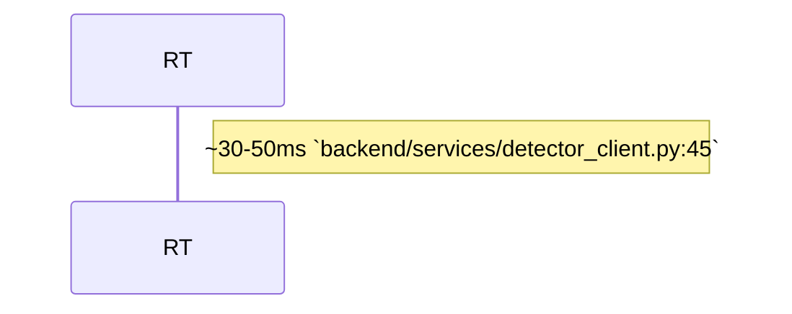

# Documentation Validation Tool

## Purpose

The `scripts/validate_docs/` directory contains a multi-level documentation validation tool that checks code citations (file:line references) in documentation against the actual codebase. It ensures architecture docs, AGENTS.md files, and other technical documentation stay synchronized with the code they reference.

## Validation Levels

| Level | Name             | Description                                      |
| ----- | ---------------- | ------------------------------------------------ |
| 1     | File Exists      | Verify cited files exist in the repository       |
| 1     | Line Bounds      | Verify cited line numbers are within file bounds |
| 2     | AST Verification | tree-sitter based symbol verification            |
| 3     | Code Block Match | Fenced code block content matching               |
| 4     | Cross-Reference  | Cross-document consistency checking              |
| 5     | Staleness        | Git-based staleness detection                    |

## Directory Structure

```
scripts/validate_docs/
├── AGENTS.md           # This file
├── __init__.py         # Package docstring and version
├── __main__.py         # Module entry point
├── cli.py              # CLI interface with argparse
├── config.py           # Configuration, patterns, and data classes
├── parsers/            # Citation extraction from different formats
│   ├── code_blocks.py  # Extract from fenced code blocks
│   ├── markdown.py     # Extract from markdown prose and frontmatter
│   └── mermaid.py      # Extract from mermaid diagrams
├── reports/            # Output formatting
│   ├── console.py      # Rich terminal output with colors
│   └── json_report.py  # JSON output for CI integration
└── validators/         # Validation implementations
    ├── file_exists.py  # Level 1: File existence
    ├── line_bounds.py  # Level 1: Line number validation
    ├── ast_python.py   # Level 2: Python AST verification
    ├── ast_typescript.py # Level 2: TypeScript/JS AST verification
    ├── code_match.py   # Level 3: Code block content matching
    ├── cross_reference.py # Level 4: Cross-document consistency
    └── staleness.py    # Level 5: Git staleness detection
```

## Usage

```bash
# Validate all docs in a directory
python -m scripts.validate_docs docs/architecture/

# Validate a single file
python -m scripts.validate_docs docs/architecture/ai-pipeline.md

# Output as JSON for CI
python -m scripts.validate_docs docs/architecture/ --format json

# Show only errors and warnings
python -m scripts.validate_docs docs/architecture/ --errors-only

# Disable specific validation levels
python -m scripts.validate_docs docs/architecture/ --no-ast
python -m scripts.validate_docs docs/architecture/ --no-staleness
```

## CLI Options

| Option            | Description                                |
| ----------------- | ------------------------------------------ |
| `path`            | Path to documentation file or directory    |
| `--format`        | Output format: `console` or `json`         |
| `--output`        | Output file for JSON format                |
| `--errors-only`   | Only show errors and warnings              |
| `--verbose`       | Show additional details                    |
| `--no-ast`        | Disable AST verification (Level 2)         |
| `--no-code-match` | Disable code block matching (Level 3)      |
| `--no-cross-ref`  | Disable cross-reference checking (Level 4) |
| `--no-staleness`  | Disable staleness detection (Level 5)      |
| `--project-root`  | Project root directory (auto-detected)     |

## Key Files

### `config.py`

Defines core data classes and patterns:

- **`Citation`** - Parsed citation from documentation (file_path, start_line, end_line, symbol_name)
- **`ValidationResult`** - Result of validating a citation (status, level, message, details)
- **`DocumentReport`** - Validation report for a single document
- **`ValidationConfig`** - Configuration for validation (project_root, enable flags, thresholds)
- **Citation patterns** - Regex patterns for inline citations, frontmatter, code blocks, mermaid

### `cli.py`

Main orchestration:

1. Collects documents from path
2. Extracts citations using all parsers
3. Builds cross-reference index
4. Validates each citation at enabled levels
5. Reports results via console or JSON

## Citation Formats Supported

### Inline Citations

```markdown
The `backend/services/file_watcher.py:67` function handles...
Lines `backend/services/file_watcher.py:67-89` implement...
```

### YAML Frontmatter

```yaml
---
source_refs:
  - backend/services/file_watcher.py:FileWatcher:34
  - backend/services/file_watcher.py:is_image_file
---
```

### Code Blocks with Source Comments

````markdown
```python
# Source: backend/services/file_watcher.py:67-89
def is_image_file(file_path: str) -> bool:
    ...
```
````

### Mermaid Diagrams

````markdown

````

```

## Exit Codes

| Code | Meaning               |
| ---- | --------------------- |
| 0    | All citations valid   |
| 1    | Errors found          |

## Dependencies

**Required:**
- Python 3.10+

**Optional (for enhanced features):**
- `tree-sitter`, `tree-sitter-python`, `tree-sitter-typescript` - AST verification
- `rich` - Colorful console output

## Related Documentation

- `parsers/AGENTS.md` - Citation extraction details
- `reports/AGENTS.md` - Output formatting details
- `validators/AGENTS.md` - Validation implementation details
- `/docs/development/testing.md` - Testing guide
```
